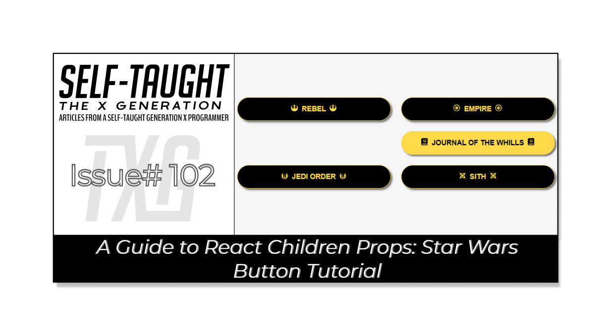
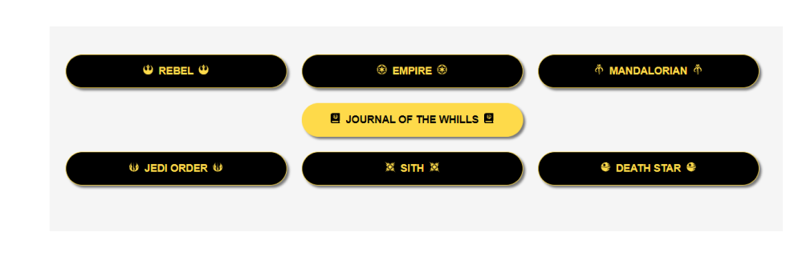

#### In this article, discover React children props through a Star Wars button tutorial, including icons! Learn about component composition and create reusable, modular components for your unique projects!

---



---

***Note:*** *We will be focusing on learning React code, not CSS. However, feel free to clone the project or copy the CSS code.*

---

### React component composition

To better understand what React children props are, let's first take a look at what a React component composition is. Component composition in React is essential because it allows you to create reusable and modular components by nesting and combining them. This enhances the flexibility of your application's structure, promotes better code maintainability, and simplifies the development process.

---

### React children

React children are a special property in React components that allow you to pass components or elements as children to a parent component. This feature plays a crucial role in composition, as it enables you to create reusable and modular components by nesting and combining them. React children enhance the flexibility of your application's structure and promote better code maintainability.

**Using children props in the example below allows you to pass the Font Awesome icons and text as children to the ButtonStarWars component, making it more flexible and reusable for different button content.**

```javascript
<ButtonStarWars>
  <FaRebel />
    Rebel
  <FaRebel />
</ButtonStarWars>
```

---

### The ButtonStarWars component

I created a **ButtonStarWars** component that accepts props as an argument. It returns a button element with a class name "sw-button" and renders the content passed through the children prop inside the button.

**Utilizing the children props makes it easy to pass in Font Awesome icons and text in between them as shown in the React children code block above.**

The component is then exported for use in other parts of the application.

*To learn about adding Font Awesome icons to your React project, be sure to check out my* [*How to Integrate Font Awesome Icons into React Applications*](https://selftaughttxg.com/2023/10-23/how-to-integrate-font-awesome-icons-into-react-applications/) *article.*

```javascript
import React from "react";

function ButtonStarWars(props) {
    return(
        <button className="sw-button ">{props.children}</button>
    )
}

export default ButtonStarWars;
```

---

### Exploring the App Component

Now that we created the **ButtonStarWars** component we can render multiple buttons which include icons from the React Icons library.

The `App` function component returns a JSX structure containing a header and main section. Within the main section, several `ButtonStarWars` components are used, with each instance featuring unique icon and text combinations. These icons and text are passed as children to the `ButtonStarWars` component, showcasing the flexibility and reusability of React children props in action!

```javascript
import './App.css';
import ButtonStarWars from './components/ButtonStarWars';
import { FaEmpire, FaRebel, FaMandalorian, FaJournalWhills, FaJediOrder, FaSith } from 'react-icons/fa';
import { GiDeathStar } from 'react-icons/gi';

function App() {
  return (
    <>
      <header>
        <h1>Creating Reusable React Buttons with Props.Children</h1>
      </header>
      <main>
        <div>
          <ButtonStarWars>
            <FaRebel />
              Rebel
            <FaRebel />
          </ButtonStarWars>
          <ButtonStarWars>
            <FaEmpire />
              Empire
            <FaEmpire />
          </ButtonStarWars>      
          <ButtonStarWars>
            <FaMandalorian />
              Mandalorian
            <FaMandalorian />
          </ButtonStarWars>
        </div>  
        <div>
          <ButtonStarWars>
            <FaJournalWhills />
              Journal of the Whills
            <FaJournalWhills />
          </ButtonStarWars>
        </div>
        <div>  
          <ButtonStarWars>
            <FaJediOrder />
              Jedi Order
            <FaJediOrder />
          </ButtonStarWars>
          <ButtonStarWars>
            <FaSith />
              Sith
            <FaSith />
          </ButtonStarWars>     
          <ButtonStarWars>
            <GiDeathStar />
              Death Star
            <GiDeathStar />
          </ButtonStarWars>  
        </div>          
      </main>
    </>
  )
}

export default App
```

---

### **The finished project**

**Here are the links to the finished project:**

* [GitHub repo](https://github.com/MichaelLarocca/txg-react-buttons-star-wars)
    
* [Netlify deployed project](https://txg-react-buttons-star-wars.netlify.app/)
    

---



---

### **My other related articles**

* [How to Integrate Font Awesome Icons into React Applications](https://selftaughttxg.com/2023/10-23/how-to-integrate-font-awesome-icons-into-react-applications/)
    
* [How to Make a Countdown App with React and date-fns](https://selftaughttxg.com/2023/06-23/how-to-make-a-countdown-app-with-react-and-date-fns/)
    
* [Learn Local Storage in React: Create a Light and Dark Theme Switcher Application](https://selftaughttxg.com/2023/05-23/learn-local-storage-in-react-create-a-light-and-dark-theme-switcher-application/)
    
* [Creating a True/False Toggle in React with useState Hook for Beginners](https://selftaughttxg.com/2023/04-23/creating-a-true-false-toggle-in-react-with-usestate-hook-for-beginners/)
    

---

### Advance your career with a 20% discount on Scrimba Pro using this [affiliate link](https://scrimba.com/?via=MichaelLarocca)!

Become a hireable developer with Scrimba Pro! Discover a world of coding knowledge with full access to all courses, hands-on projects, and a vibrant community. You can [read my article](https://selftaughttxg.com/2021/06-21/06-07-21/) to learn more about my exceptional experiences with Scrimba and how it helps many become confident, well-prepared web developers!

###### ***Important:*** *This discount is for new accounts only. If a higher discount is currently available, it will be applied automatically.*

**How to Claim Your Discount:**
1. Click [the link](https://scrimba.com/?via=MichaelLarocca) to explore the new Scrimba 2.0.
2. Create a new account.
3. Upgrade to Pro; the 20% discount will automatically apply.

##### ***Disclosure:*** *This article contains affiliate links. I will earn a commission from any purchases made through these links at no extra cost to you. Your support helps me continue creating valuable content. Thank you!*

---

### **Conclusion**

Mastering React children props and component composition empowers you to create reusable, modular components for versatile projects. By harnessing the flexibility of children props, you enhance your application's structure, streamline development, and boost code maintainability. Embrace this powerful feature to elevate your React skills and develop more dynamic, adaptable applications!

---

**Let's connect! I'm active on** [**LinkedIn**](https://www.linkedin.com/in/michaeljudelarocca/) **and** [**Twitter**](https://twitter.com/MikeJudeLarocca)**.**

---

###### ***Are you now proficient in using React children props and component composition? Have you started creating versatile, reusable components for your projects? Please share the article and comment!***

---
