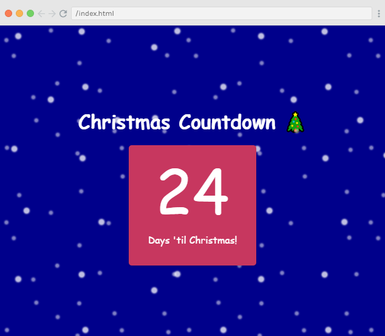
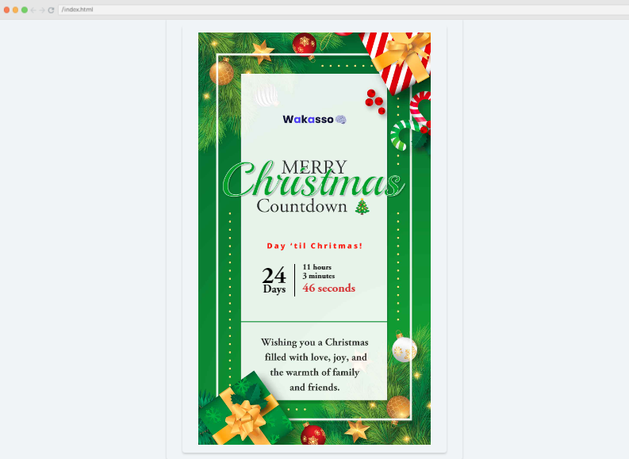
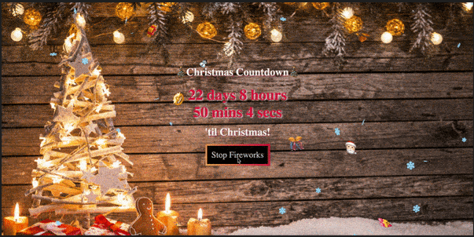
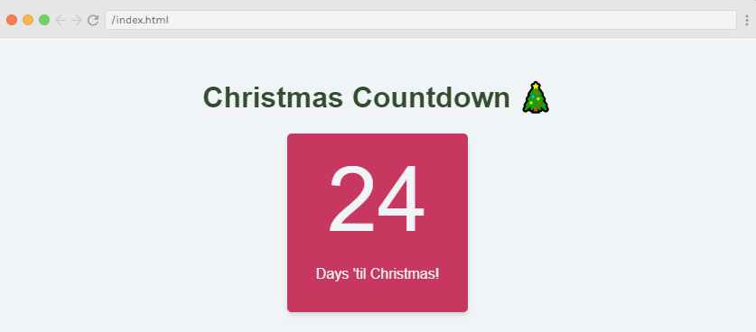
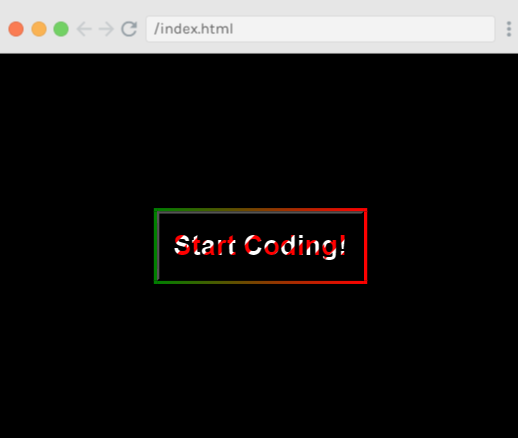

#### Tis the season! JavaScriptmas is here again! JavaScriptmas is a FREE annual festive coding event hosted by the online coding school Scrimba, consisting of 24 daily coding challenges, prizes, and more!

---


---

### JavaScriptmas 2023

#### **What is JavaScriptmas?**

JavaScriptmas is a **FREE** annual event comprising 24 coding challenges hosted by the online coding school [Scrimba](https://scrimba.com/). Most of the coding challenges are JavaScript, but this year, there will be a few CSS challenges, and some using AI tools! 🎄

#### **What level of coder do you need to be to participate?**

Even if you are starting to learn JavaScript, you can participate. For hints, you can tap into the community, and of course, you can always use Google to help you get to your solution. There will also be Discord channels for the challenges, as well as for FAQs. You can also check out the topic in [Scrimba's forum](https://forum.scrimba.com/). 💻

#### **JavaScriptmas prize rules**

Each day, you can complete the challenge by midnight UTC, and share your VALID/working solution on Twitter/X for a chance to win a prize! (You can easily post your submission via the share solution button on your Scrim). The prizes consist of 24 Annual Scrimba Pro subscriptions worth $200 and 1 grand prize winner awarded a Mackbook Air M2 worth $1,100! All winners will be announced during the JavaScriptmas YouTube Livestream event on December 24th. 🎁

In addition to prizes, be on the lookout for savings with discount prices on their paid courses! If you're interested in taking a paid course from Scrimba, be sure to use the discount code provided: [https://scrimba.com/pricing?coupon=Michael-Larocca-Discount-2023#join](https://scrimba.com/pricing?coupon=Michael-Larocca-Discount-2023#join). (Valid for an additional 10% off semester and annual plans. Expires on July 31st, 2024) 💸

###### ***Note:*** *Prizes are limited to one per person*

#### **Community highlights**

In the spirit of the festive holiday season, I enjoy featuring others' works in the community highlights section of my JavaScriptmas articles! I will be searching X/Twitter, LinkedIn, and the Scrimba Discord channel for "outstanding" submissions by fellow participants to feature! 🎉

#### **My solutions**

Throughout the JavaScriptmas event, I will participate in all 24 coding challenges and document my detailed solutions! 💻

---

### **Community highlights ⬇**

---

#### **Thea ([@highflyer910](https://twitter.com/highflyer910?lang=en))**



Thea solved the day 1 challenge Countdown to Christmas challenge in style! She included a festive font and an animated snowing background! With the included Christmas tree emoji, the overall effect reminds me of the famous Charlie Brown Christmas special! Well done, Thea!

[***🔗 Link to the scrim***](https://scrimba.com/scrim/co19f4b00bef2185ecae47e7e)

---

#### **Wakasso ([@SaniWakasso](https://twitter.com/saniwakasso))**



Wakasso created a beautifully illustrated Christmas card with a live countdown to Christmas, including hours, minutes, and seconds! If you are an aspiring developer who wants to "stand out from the crowd," definitely take a look at ALL of his code and see how he accomplished this remarkable feat! Keep up the outstanding work, Wakasso! 

[***🔗 Link to the scrim***](https://scrimba.com/scrim/co277450faf42c7530062dd24)

---

#### **Mehmet Temizkan ([@MehmetTemi86729](https://twitter.com/MehmetTemi86729))**



Mehmet creatively combined the first and second challenges! He first created a count to Chrismas, including the stretch goals of adding the days, hours, minutes, and seconds. He then solved the second challenge of creating a button with a gradient border with color flipping sides when the button is clicked. He concludes by adding an animated confetti snow with a beautiful Christmas background! Well done, Mehmet!

[***🔗 Link to the GitHub repo***](https://github.com/mehmettemizkan/JavaScriptmas-2023)

---

### **My coding solutions ⬇**

---

### **Day 1 :** Countdown to Christmas

**Task:**

* Get today's date (you only need the day).
    
* Calculate remaining days.
    
* Display remaining days in countdownDisplay.
    



***🔗*** [***My solution for day 1***](https://scrimba.com/scrim/co4f3415294358402a867b1e2)

**The** `renderCountdown` **function I wrote calculates the number of days left until Christmas and displays the result in an HTML element with the ID "countdown-display."**

**Steps:**

1. Create a `today` variable, which is the current date and time.
    
2. Extract the current year from `today` and store it in the `currentYear` variable.
    
3. Create a `christmasDay` variable, which is a new Date object representing Christmas Day (December 25) of the current year.
    
4. Calculate the difference between `christmasDay` and `today` in milliseconds, then divide the result by the number of milliseconds in a day (1000 \* 60 \* 60 \* 24) to get the number of days left. The result is rounded up using `Math.ceil()` to ensure it's a whole number.
    
5. Select the HTML element with the ID "countdown-display" and update its innerHTML to display the `daysLeft` value.
    

*The goal is to get the difference between Christmas Day and today in milliseconds, convert it to days, and round up to get a whole number of days left until Christmas.*

```javascript
const countdownDisplay = document.getElementById("countdown-display")

function renderCountdown(){
    const today = new Date();
    const currentYear = today.getFullYear();
    const christmasDay = new Date(currentYear, 11, 25);
    const daysLeft = Math.ceil((christmasDay - today) / (1000 * 60 * 60 * 24));
    
    const countdownDisplay = document.getElementById("countdown-display");
    countdownDisplay.innerHTML = daysLeft;
}
 
renderCountdown()
```

---

### **Day 2: Style a Colorful Button**

**Task:**

* Add a gradient border

* Hover state flips the gradient color/button size grows

* The text changes from gray to white




***🔗*** [***My solution for day 2***](https://scrimba.com/scrim/co7714d9d9a8d9f9953b6d5df)

**I took some creative liberty with this challenge and created a Christmas gradient color border that flips on hover/focus, and I also included a "candy cane" style gradient for the text!**

**Steps:**

1. Create the `.button-border` class to style the button border with a 3px solid border and a linear gradient from red to green.
    
2. Define the `.button` class to set the button's height, width, text color, font size, and font weight.
    
3. Add the `:hover` and `:focus` pseudo-classes for the `.button` class to remove the default outline when the button is hovered or focused.
    
4. Apply the `:hover` and `:focus` pseudo-classes for the `.button-border` class to scale the button border by 1.1 and change the border-image gradient from green to red when the button is hovered or focused.
    
5. Define the `.text-candy-cane` class to create a candy cane-like background image gradient for the text, set the text color to transparent, and apply the background-clip property to clip the background to the text. Set the background-size to 1em for proper scaling.

```css
.button-border {
    border: 3px solid;
    border-image: linear-gradient(to right, red, green) 1;
}

.button {
    height: 50px;
    width: 150px;
    color: var(--btn-color);
    font-size: 20px;
    font-weight: bolder;
}

.button:hover,
.button:focus {
    outline: none; 
}

.button-border:hover,
.button-border:focus {
    transform: scale(1.1);
    border-image: linear-gradient(to right, green, red) 1;
}


.text-candy-cane {
    background-image: linear-gradient(-45deg, red 12.5%, white 12.5%, white 25%, red 25%, red 37.5%, white 37.5%, white 50%, red 50%, red 62.5%, white 62.5%, white 75%, red 75%, red 87.5%, white 87.5%);
    color: transparent;
    -webkit-background-clip: text;
    background-clip: text;
    background-size: 1em;
}
```

---

### **Day 3 Challenge**

**Task:**

Some children have got some pieces of candy. They want to eat as much candy as they can but each child must eat exactly the same amount. Determine how many pieces of candy can be eaten altogether. A piece of candy can not be split.

***🔗*** [***My solution for day 3***](https://scrimba.com/scrim/co1a24ada97190f280b81c332)

**This challenge is solved with a simple math equation. Dividing the amount of candy by the number of children using Math.floor provides us with an even amount of candy distribution. We then multiply the calculated candy distribution number by the number of children to solve the challenge.**

```javascript
function calcTotalCandies(children, candy) {
 return Math.floor(candy / children) * children;
}

calcTotalCandies(3, 10) // expected output: 9
calcTotalCandies(4, 20) // expected output: 20
calcTotalCandies(6, 25) // expected output: 24
```

---

#### ***If you would like to learn more about my journey with Scrimba and how learning with them may help you, you can read my article:*** [***How Scrimba is helping me and many others to become confident, well-prepared web developers***](https://selftaughttxg.com/2021/06-21/06-07-21/)

---

#### **Scrimba has once again impressed and inspired me! You can read my full** [**Scrimba review**](https://selftaughttxg.com/2020/12-20/Review-Scrimba/) **on my 12/13/2020 post.**


#### ***"That's one of the best Scrimba reviews I've ever read,*** [***@MikeJudeLarocca***](https://twitter.com/MikeJudeLarocca?ref_src=twsrc%5Etfw)***. Thank you! 🙏 "***

###### **— Per Harald Borgen, CEO of Scrimba** [**December 14, 2020**](https://twitter.com/perborgen/status/1338462544143540227?ref_src=twsrc%5Etfw)

---

### **10% Scrimba Discount!**

#### **If you're interested in taking a paid course from Scrimba, be sure to use the discount code provided:** [**https://scrimba.com/pricing?coupon=Michael-Larocca-Discount-2023#join**](https://scrimba.com/pricing?coupon=Michael-Larocca-Discount-2023#join)

###### ***Valid for an additional 10% off semester and annual plans. Expires on July 31st, 2024***

---

### **Conclusion**

Scrimba's annual JavaScriptmas event is a fun, festive way to commit to coding daily. Whether you are a new coder or a seasoned one, you have an opportunity to share your work with the community, make new friends, and even get a chance to win prizes!

If you're interested in continuing learning with Scrimba after the FREE event, be sure to check out their many FREE courses! If you are ready to commit to becoming a hireable front-end web developer, be on the lookout for discounted course rates!

Don't miss out on this exciting coding event! Participate in Scrimba's JavaScriptmas today, share your solutions, connect with fellow developers, and improve your skills while having fun! Merry JavaScriptmas! 🎄

---

**Let's connect! I'm active on** [**LinkedIn**](https://www.linkedin.com/in/michaeljudelarocca/) **and** [**Twitter**](https://twitter.com/MikeJudeLarocca)**.**

---

###### ***Are you now interested in participating in this year's Scrimba's JavaScriptmas? Have you already participated in last year's Scrimba's JavaScriptmas? Please share the article and comment!***