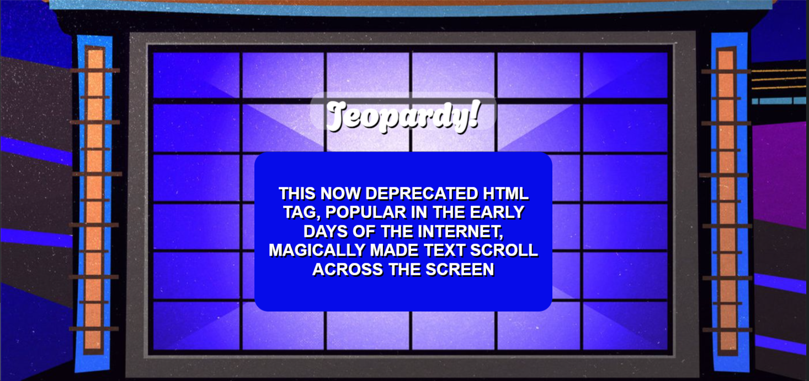
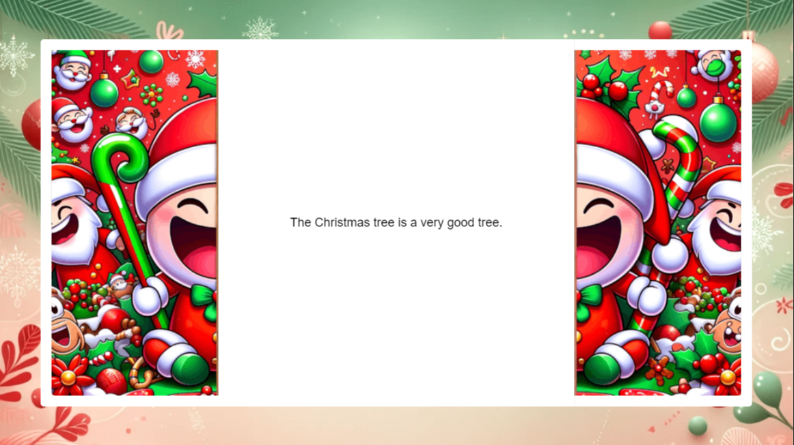
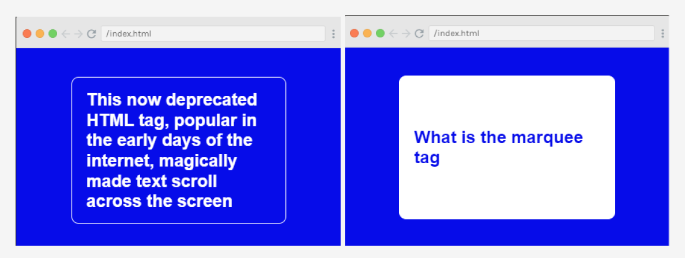
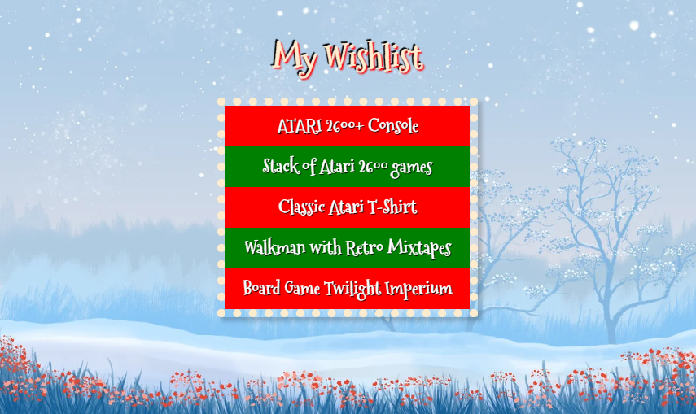
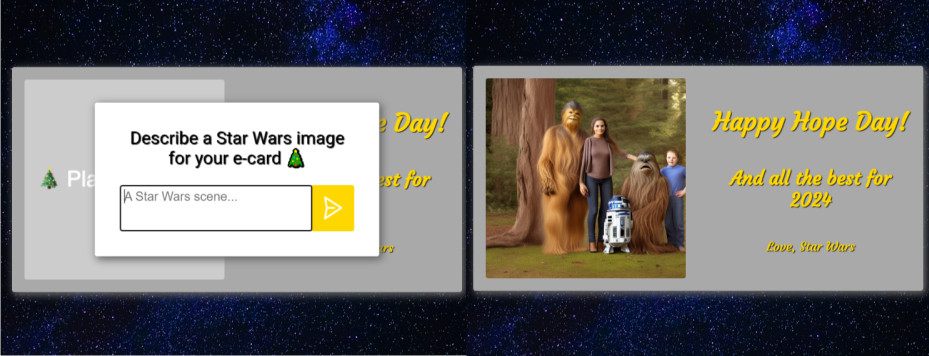

#### Tis the season! JavaScriptmas is here again! JavaScriptmas is a FREE annual festive coding event hosted by the online coding school Scrimba, consisting of 24 daily coding challenges, prizes, and more!

---


---

### JavaScriptmas 2023

#### **What is JavaScriptmas?**

JavaScriptmas is a **FREE** annual event comprising 24 coding challenges hosted by the online coding school [Scrimba](https://scrimba.com/). Most of the coding challenges are JavaScript, but this year, there will be a few CSS challenges, and some using AI tools! 🎄

#### **What level of coder do you need to be to participate?**

Even if you are starting to learn JavaScript, you can participate. For hints, you can tap into the community, and of course, you can always use Google to help you get to your solution. There will also be Discord channels for the challenges, as well as for FAQs. You can also check out the topic in [Scrimba's forum](https://forum.scrimba.com/). 💻

#### **JavaScriptmas prize rules**

1. Each day, you can complete the challenge by midnight UTC, and share your VALID/working solution on Twitter/X for a chance to win a prize! (You can easily post your submission via the share solution button on your Scrim).
    
2. Take part in Santa's Code Review Workshop by picking a JavaScriptmas entry on X/Twitter, doing a code review, and sharing it as a reply post.
    
3. Attend the JavaScriptmas YouTube Livestream on Dec 24 for a chance to win a Mackbook Air M2
    

#### **JavaScriptmas prizes**

The prizes consist of 24 Annual Scrimba Pro subscriptions worth $200, 5 $100 winners for giving a code review of another participant's entry, and a grand prize winner awarded a Mackbook Air M2 worth $1,100! All winners will be announced during the JavaScriptmas YouTube Livestream event on December 24th. 🎁

#### **JavaScriptmas savings**

In addition to prizes, be on the lookout for savings with discount prices on their paid courses! If you're interested in taking a paid course from Scrimba, be sure to use the discount code provided: [https://scrimba.com/pricing?coupon=Michael-Larocca-Discount-2023#join](https://scrimba.com/pricing?coupon=Michael-Larocca-Discount-2023#join). (Valid for an additional 10% off semester and annual plans. Expires on July 31st, 2024) 💸

###### ***Note:*** *Prizes are limited to one per person*

#### **❄Community highlights❄**

In the spirit of the festive holiday season, I enjoy featuring others' works in the community highlights section of my JavaScriptmas articles! I will be searching X/Twitter, LinkedIn, and the Scrimba Discord channel for "outstanding" submissions by fellow participants to feature! 🎉

#### **My solutions**

Throughout the JavaScriptmas event, I will participate in all 24 coding challenges and document my detailed solutions! 💻

---

### **❄Community highlights❄ ⬇**

---

#### Alina (@disc0night)



Alina tackled the Jeopardy Card Flip challenge with flair, designing it to resemble the actual Jeopardy game board! This creative touch greatly enhanced the flipping card effect, making the project feel like you're watching or even participating in a real game of Jeopardy! Excellent work, Alina!

[***🔗 Link to the scrim***](https://scrimba.com/scrim/co2b74458938a9b02534b9d8b)

---

#### (HOLD )


WRITE ARTICLE SECTION

[***🔗 Link to the scrim***](HOLD )

---

#### (HOLD )


WRITE ARTICLE SECTION

[***🔗 Link to the scrim***](HOLD )

---

### **My coding solutions ⬇**

---

### **Day 4:** AI Christmas E-card Generator

**Task:**

* Use AI to generate a Christmas joke.
    
* Display the joke in the DOM.
    


***🔗*** [***My solution for day 4***](https://scrimba.com/scrim/co35c4cf1816e0f50380029e1)

This code uses the Hugging Face Inference API to generate a Christmas joke and display it in the document.

The `HfInference` class from the `@huggingface/inference` package is imported at the beginning. An instance of `HfInference` is created with the API key stored in the environment variable `process.env.HUGGING_FACE_API_KEY`.

A reference to the HTML element with the class name 'joke-display' is stored in the `displayEl` variable.

An event listener is added to the HTML element with the id 'window-container'. When this element is clicked, the following actions are performed:

1. The text content of the 'joke-display' element is set to 'Loading...'.
    
2. The styles of the 'left-door' and 'right-door' elements are updated to trigger CSS animations that open the doors.
    
3. The style of the 'joke-display' element is updated to trigger a CSS animation that displays the joke.
    
4. The `textGeneration` method of the `HfInference` instance is called. This method generates a text based on the provided model and inputs. The inputs are set to a string that prompts the model to generate a Christmas joke. The `temperature` option is set to `0.7`, which controls the randomness of the output. A lower temperature results in more focused and consistent output, while a higher temperature results in more diverse and surprising output.
    
5. The `use_cache` option is set to `false` to ensure that the generated text is not cached and is different each time the function is called.
    
6. The generated text is set as the text content of the 'joke-display' element.
    

**This script provides a fun and interactive way to generate Christmas jokes using AI. (However, I don't quite get the joke! "**The Christmas tree is a very good tree**" 😂)**

```javascript
import { HfInference } from '@huggingface/inference';
const hf = new HfInference(process.env.HUGGING_FACE_API_KEY);
const displayEl = document.querySelector('.joke-display');

document.getElementById('window-container').addEventListener('click', async function () {
    displayEl.innerText = 'Loading...';

    document.querySelector('.left-door').style = "animation: left-open 0.3s forwards";
    document.querySelector('.right-door').style = "animation: right-open 0.3s forwards";
    document.querySelector('.joke-display').style = "animation: display-joke 0.3s forwards";

    const response = await hf.textGeneration({
        model: 'google/flan-t5-xxl',
        inputs: `Q: Give me a Christmas joke.`,
        temperature: 0.7,
    }, {
        use_cache: false
    });

    displayEl.innerText = response.generated_text;
});
```

---

### **Day 5: Jeopardy Card Flip**

**Task:**

* The card has two sides and flips front to back on hover
    
* Match styles as closely as possible
    
* CSS only
    


***🔗*** [***My solution for day 5***](https://scrimba.com/scrim/co7f04288a92ab1c880cb9a97)

This CSS code is used to create a flipping card effect on a webpage. It uses several CSS properties to achieve this effect.

The `body` and `html` styles are used to center the card on the page, set the background color, and specify the font color and type.

The `:root` selector is used to define CSS variables which can be used throughout the document. In this case, it sets the colors for the card and font.

The `.card` class sets the size and position of the card. The `perspective` property gives the card a 3D effect when it flips.

The `.card-front` and `.card-back` classes are used to style the front and back of the card. The `backface-visibility` property hides the back of the card when it's not flipped. The `transform-style` property is used to preserve the 3D position of the card when it flips. The `transition` property creates the flipping animation.

The `transform` property in `.card-back` class initially rotates the back of the card by 180 degrees, hiding it from view.

When the card is hovered over, the `.card:hover .card-front` and `.card:hover .card-back` styles rotate the card to show the back of the card and hide the front, creating the flipping card effect.

```css
body, html { 
  margin: 0;
  padding: 0;
  display: flex;
  justify-content: center;
  align-items: center;
  height: 100vh;
  background-color: var(--jeopardy-blue);
  color: var(--font-color-main);
  font-family: Arial, sans-serif;
}

:root {
  --jeopardy-blue: #060CE9;
  --font-color-main: #fff;
}

.card {
  position: relative;
  width: 300px;
  height: 200px;
  perspective: 1000px;
}

.card-front, .card-back {
  position: absolute;
  width: 100%;
  height: 100%;
  backface-visibility: hidden;
  display: flex;
  justify-content: center;
  align-items: center;
  padding: 20px;
  box-sizing: border-box;
  border: 1px solid var(--font-color-main);
  border-radius: 10px;
  transition: transform 0.8s;
  transform-style: preserve-3d;
}

.card-front {
  background-color: var(--jeopardy-blue);
}

.card-back {
  background-color: var(--font-color-main);
  color: var(--jeopardy-blue);
  transform: rotateY(180deg);
}

.card:hover .card-front {
  transform: rotateY(180deg);
}

.card:hover .card-back {
  transform: rotateY(360deg);
}
```

---

### **Day 6: Secret Santa**

**Task:**

Write a function to randomly assign each person in an array a "Secret Santa," who is someone else in the array. No one should be assigned to themselves as their own Secret Santa.

```javascript
{Bob: "Carly", Carly: "Alice", Alice: "Dan", Dan: "Ed", Ed: "Ferdinand", Ferdinand: "Ginny", Ginny: "Bob"}
```

***🔗*** [***My solution for day 6***](https://scrimba.com/scrim/co78740dba6c48d8bca525027)

This function, `generateSecretSantaPairs`, is designed to organize a Secret Santa gift exchange. It accepts an array of people's names.

1. First, it shuffles the array of names. This is done by swapping each name with another randomly selected name from the array. This ensures that the assignment of Secret Santas is random.
    
2. Then, it creates an empty object, `pairs`, where we will store the final pairs of people and their Secret Santas.
    
3. Next, it loops through the shuffled array of names. For each name, it assigns the next name in the array as their Secret Santa and stores this pair in the `pairs` object. For example, the first person gets the second person as their Secret Santa, the second person gets the third, and so on.
    
4. When it reaches the last person in the array, it assigns them the first person as their Secret Santa. This is what we call "circular assignment".
    
5. Finally, it outputs the `pairs` object which contains the pairs of people and their Secret Santas.
    

**This function ensures that everyone gets a unique Secret Santa and no one is left without a gift. It's a fun and fair way to organize a Secret Santa gift exchange!**

```javascript
const people = ["Alice", "Bob", "Carly", "Dan", "Ed", "Ferdinand", "Ginny"]

function generateSecretSantaPairs(arr) {
    // Shuffle array
    for (let i = arr.length - 1; i > 0; i--) {
        let j = Math.floor(Math.random() * (i + 1));
        [arr[i], arr[j]] = [arr[j], arr[i]];
    }

    let pairs = {};

    // Circular assignment
    for(let i = 0; i < arr.length; i++) {
        if(i === arr.length - 1) {
            pairs[arr[i]] = arr[0];
        } else {
            pairs[arr[i]] = arr[i + 1];
        }
    }

    console.log(pairs);
    return pairs;
}    

generateSecretSantaPairs(people)
```

---

### **Day 7: Christmas Present Wishlist**

**Task:**

* Iterate over the wishlist array.
    
* Dynamically render your wishlist from the array.
    
* Style the wishlist with CSS.



***🔗*** [***My solution for day 7***](https://scrimba.com/scrim/coeb8439398690ca6ab2362a8)

This JavaScript code is used to dynamically generate a wishlist on a webpage. It consists of an array of wishlist items and a JavaScript function that creates and appends these items to the webpage.

The `wishlist` array contains five items that you wish for. These items are strings and represent the names of the gifts you want.

The `wishlistItems` constant is a collection of all HTML elements with the class name "wishlist".

The `wishlist.forEach` loop goes through each item in the wishlist array. For each item, it does the following:

1. Creates a new `li` element using `document.createElement("li")`.
    
2. Sets the text content of this `li` element to the current item in the array.
    
3. Adds the class "wishlist-item" to the `li` element.
    
4. Appends this `li` element to the first element in the `wishlistItems` collection.
    

**By the end of the loop, each item in the wishlist array is transformed into an li element and added to the webpage.**

```javascript
const wishlist = [
  "ATARI 2600+ Console",
  "Stack of Atari 2600 games",
  "Classic Atari T-Shirt",
  "Walkman with Retro Mixtapes",
  "Board Game Twilight Imperium",
];

const wishlistItems = document.getElementsByClassName("wishlist");

wishlist.forEach((item)=>{
  const listItem = document.createElement("li");
  listItem.textContent = item;
  listItem.classList = "wishlist-item";
  wishlistItems[0].appendChild(listItem);
})
```

**The following CSS code block styles a webpage with a wishlist.**

The `body` selector styles the entire webpage. It sets the body to fill the entire height of the viewport (`100vh`). The `display: flex`, `justify-content: center`, and `align-items: center` properties center the content both vertically and horizontally. The `background` property sets a background image that covers the entire body.

The `.wishlist` selector styles a block element. It sets the width to `300px`, adds a dotted border, and a box shadow for a 3D effect.

The `.wishlist-item` selector styles each item in the wishlist. It sets the color to white, centers the text, and makes the text bold. It also uses flexbox to center the content within each list item.

The `.wishlist-item:nth-child(odd)` and `.wishlist-item:nth-child(even)` selectors add a red and green background color to odd and even-numbered list items, respectively.

```css
body {
    margin: 0;
    padding: 0;
    height: 100vh;
    display: flex;
    flex-direction: column;
    justify-content: center;
    align-items: center;
    font-family: 'Mountains of Christmas', serif;
    font-size: 20px;
    text-shadow: 2px 2px 2px red, -2px -2px 1px black;
    color: blanchedalmond;
    background: url("https://cdn.pixabay.com/photo/2021/11/09/15/32/christmas-6781762_1280.jpg") no-repeat center center;
    background-size: cover;
}

.wishlist {
    width: 300px;
    border: 10px dotted blanchedalmond;
    box-shadow: 5px 5px 5px rgba(0,0,0,0.2);
}   

.wishlist-item {
    color: white;
    text-align: center;
    text-shadow: 1px 1px 1px black;
    font-weight: bolder;
    font-size: 22px;
    list-style-type: square;
    height: 50px;
    display: flex;
    justify-content: center;
    align-items: center;
}

.wishlist-item:nth-child(odd) {
    background-color: red
}

.wishlist-item:nth-child(even) {
    background-color: green;
}
```

---

### **Day 8: Animated Progress Bar**

**Task:**

* Build a CSS animation of a progress bar filling to 100%. The animation should run continuously, with a small pause when the bar is filled 100%.
    
* The progress begins red, turns blue, at 50%, and green when complete.
    
* CSS only!
    
    

***🔗*** [***My solution for day 8***](https://scrimba.com/scrim/co8bc4cc199bc9a4febe1dc8e)

This code creates an animated progress bar that changes color from red to blue to green as it fills up with a candy cane background!

The `:root` section defines color variables for the progress bar. The `body` section styles the webpage, including setting a Christmas-themed background image and aligning content in the center.

The `h1` section styles the title with a large font size, white color, and a shadow effect. The `.container` section styles the container of the progress bar.

The `.progress-bar` section styles the progress bar itself, giving it a width, height, and a striped background. The `.progress-status` section is where the animation is applied to create a filling effect.

The `@keyframes progress` section defines the animation, dictating that the progress bar should start at a width of 0% (empty), then increase to a width of 50% (half full), and finally reach a width of 100% (fully filled). The bar's color changes at each stage, going from red to blue to green.

```css
:root {
    --progressbar-bg: lightgrey;
    --start: red;
    --middle: blue;
    --finish: green;
}

body {
    margin: 0;
    padding: 0;
    display: flex;
    flex-direction: column;
    justify-content: center;
    align-items: center;
    height: 100vh;
    background-image: url("https://cdn.pixabay.com/photo/2018/12/19/22/00/christmas-3884891_1280.jpg");
    background-size: cover;
    background-position: center;
    font-family: 'Mountains of Christmas'; 
}

h1 {
    font-size: 50px;
    color: white;
    text-shadow: 2px 2px 2px black, -2px -2px 2px red;
}

.container {
    border: 5px solid black;
    border-radius: 25px;
    box-shadow: 3px 3px 3px rgba(0,0,0,0.5);
    width: 300px;
    margin: 50px auto;
}

.progress-bar {
    width: 100%;
    height: 30px;
    background: repeating-linear-gradient(
        45deg,
        white,
        white 10px,
        red 10px,
        red 20px
    );
    border-radius: 15px;
    overflow: hidden;
}

.progress-status {
    height: 100%;
    width: 0;
    background: var(--start);
    animation: progress 3s infinite;
}

@keyframes progress {
    0% {
        width: 0;
        background: var(--start);
    }
    50% {
        width: 50%;
        background: var(--middle);
    }
    100% {
        width: 100%;
        background: var(--finish);
    }
}
```

---

### **Day 9:** AI Christmas E-card Generator

**Task:**

* Use AI to generate an image for a Christmas e-card
    
* Render the image to the DOM


    
***🔗*** [***My solution for day 9***](https://scrimba.com/scrim/co19843139fc60c047c09cc9c)

**I thought it would be entertaining to modify the provided code, transforming it into a Star Wars-themed card! I used the Hugging Face API, and I utilized Scrimba's method of storing environment variables.**

**My prompt:**  
*"Create a festive image that captures the spirit of the Star Wars universe's "Hope Day". The scene should be set on the lush, forested home planet of Chewbacca, Kashyyyk. Specifically, it should depict Chewbacca and his family, including his wife Malla, his son Lumpy, and his father Itchy, celebrating Hope Day together. They should be on a balcony of their towering treehouse, as seen in the Star Wars Christmas Special and the movie Revenge of the Sith. The family should be joyously engaged in typical holiday activities, such as exchanging gifts or sharing a meal. The background should feature the dense, towering Wroshyr trees of Kashyyyk, bathed in the warm, golden light of sunset. To add a festive touch, the treehouse and surrounding trees could be decorated with glowing lanterns or strands of lights. The card should embody the warmth, joy, and hope that characterizes both the holiday season and the spirit of Star Wars' "Hope Day"."*

**This script utilizes the Hugging Face Inference API to generate an image based on user input.**

First, it imports the `HfInference` class from the `@huggingface/inference` package. This class provides methods to interact with the Hugging Face Inference API.

Then, it gets references to several HTML elements: a dialog modal, an image container, an input form, and a user input field.

The `generateImage` function is an asynchronous function that creates an instance of `HfInference` with a provided API key. It then calls the `textToImage` method on this instance, passing in an object that specifies the model to use, the inputs to provide to the model, and any additional parameters. This method returns a Blob representing the generated image. The function then converts this Blob to a data URL and returns it.

`blobToDataURL` is a helper function that converts a Blob to a data URL. It creates a new `FileReader`, sets up event listeners to resolve or reject the Promise when the read operation is complete, and starts reading the Blob as a data URL.

The event listener for the 'submit' event on the input form prevents the default form submission behavior, closes the dialog modal, and sets the inner HTML of the image container to a loading spinner. It then calls `generateImage`, waits for it to complete, and sets the `src` attribute of an `img` element in the image container to the returned data URL. Finally, it clears the user input field.

The `show` method is called on the dialog modal to display it when the script runs.

```javascript
import { HfInference } from '@huggingface/inference'

const dialogModal = document.getElementById('dialog-modal')
const imageContainer = document.getElementById('image-container')
const inputForm = document.getElementById('input-form');
const userInput = document.getElementById('user-input');

async function generateImage() {
    const inference = new HfInference(process.env.HUGGING_FACE_API_KEY);
    const blob = await inference.textToImage({
        model: "stabilityai/stable-diffusion-2",
        inputs: userInput.value,
        parameters: {
            negative_prompt: "blurry",
        }
    });

    return await blobToDataURL(blob);
}

function blobToDataURL(blob) {
    return new Promise((resolve, reject) => {
        const reader = new FileReader();
        reader.onloadend = () => resolve(reader.result);
        reader.onerror = reject;
        reader.readAsDataURL(blob);
    });
}

inputForm.addEventListener('submit', async (e) => {
    e.preventDefault();
    dialogModal.close();
    imageContainer.innerHTML = '<div class="spinner"></div>';
    imageContainer.innerHTML = ``; 
    userInput.value = '';
});

dialogModal.show();
```

---

### **Day 10:**

**Task:**


***🔗*** [***My solution for day 10***](HOLD)

---

#### ***If you would like to learn more about my journey with Scrimba and how learning with them may help you, you can read my article:*** [***How Scrimba is helping me and many others to become confident, well-prepared web developers***](https://selftaughttxg.com/2021/06-21/06-07-21/)

---

#### **Scrimba has once again impressed and inspired me! You can read my full** [**Scrimba review**](https://selftaughttxg.com/2020/12-20/Review-Scrimba/) **on my 12/13/2020 post.**


#### ***"That's one of the best Scrimba reviews I've ever read,*** [***@MikeJudeLarocca***](https://twitter.com/MikeJudeLarocca?ref_src=twsrc%5Etfw)***. Thank you! 🙏 "***

###### **— Per Harald Borgen, CEO of Scrimba** [**December 14, 2020**](https://twitter.com/perborgen/status/1338462544143540227?ref_src=twsrc%5Etfw)

---

### **10% Scrimba Discount!**

#### **If you're interested in taking a paid course from Scrimba, be sure to use the discount code provided:** [**https://scrimba.com/pricing?coupon=Michael-Larocca-Discount-2023#join**](https://scrimba.com/pricing?coupon=Michael-Larocca-Discount-2023#join)

###### ***Valid for an additional 10% off semester and annual plans. Expires on July 31st, 2024***

---

### **Conclusion**

Scrimba's annual JavaScriptmas event is a fun, festive way to commit to coding daily. Whether you are a new coder or a seasoned one, you have an opportunity to share your work with the community, make new friends, and even get a chance to win prizes!

If you're interested in continuing learning with Scrimba after the FREE event, be sure to check out their many FREE courses! If you are ready to commit to becoming a hireable front-end web developer, be on the lookout for discounted course rates!

Don't miss out on this exciting coding event! Participate in Scrimba's JavaScriptmas today, share your solutions, connect with fellow developers, and improve your skills while having fun! Merry JavaScriptmas! 🎄

---

**Let's connect! I'm active on** [**LinkedIn**](https://www.linkedin.com/in/michaeljudelarocca/) **and** [**Twitter**](https://twitter.com/MikeJudeLarocca)**.**

---

###### ***Are you now interested in participating in this year's Scrimba's JavaScriptmas? Have you already participated in last year's Scrimba's JavaScriptmas? Please share the article and comment!***