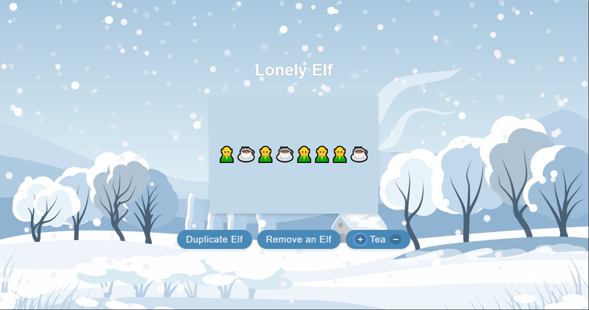
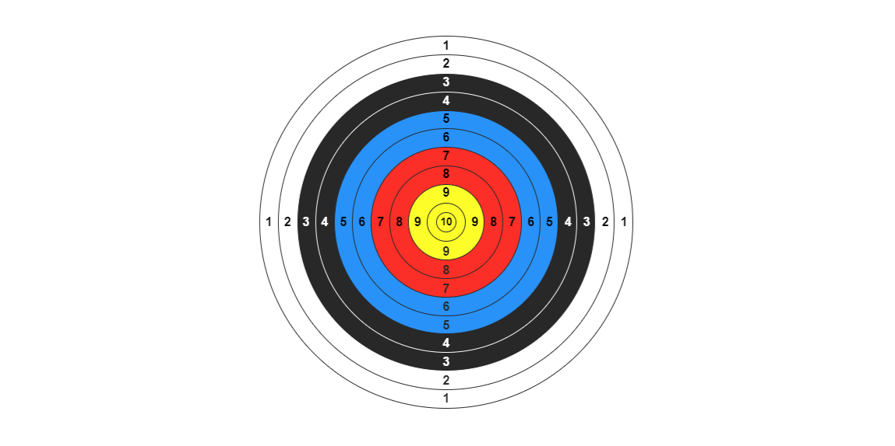
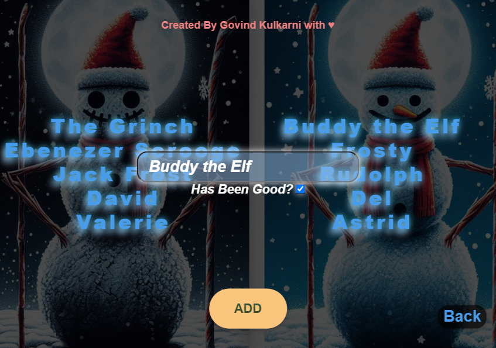
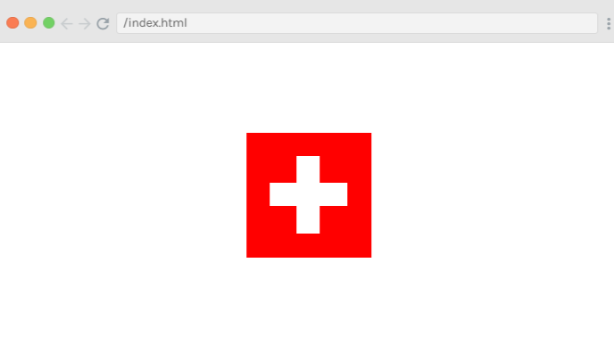
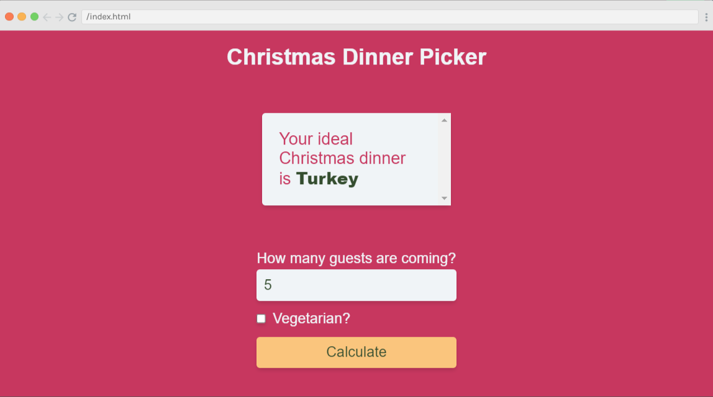
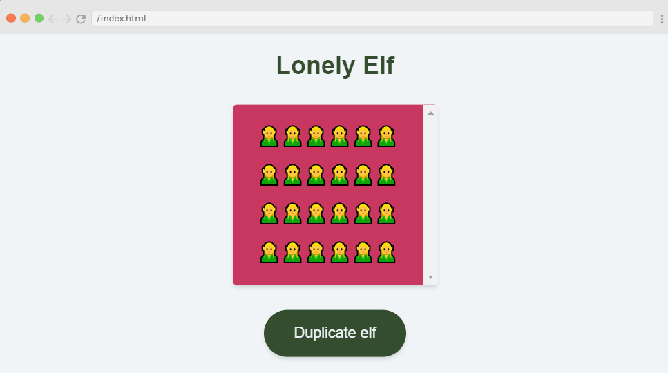
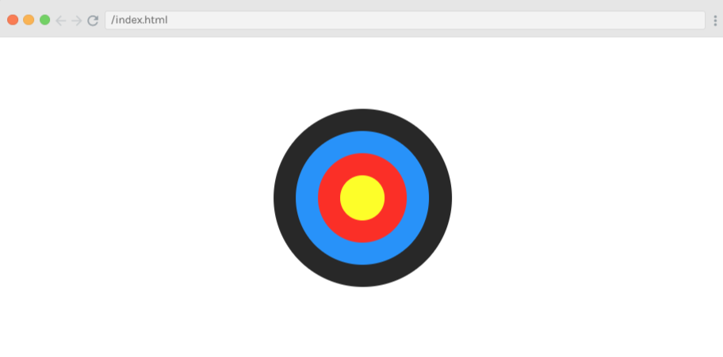
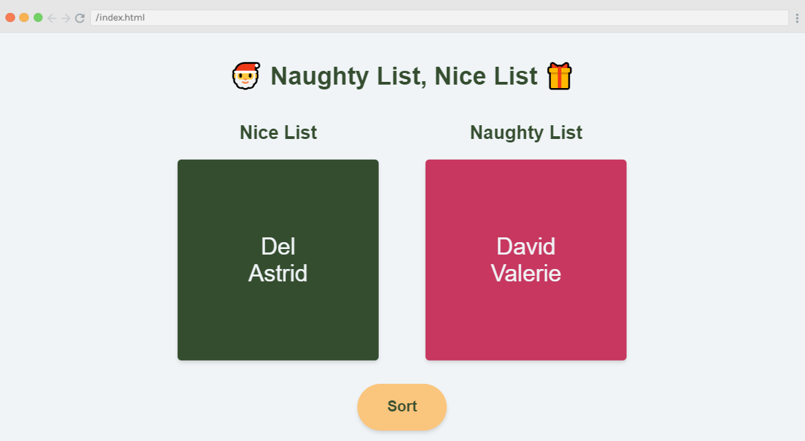

#### Tis the season! JavaScriptmas is here again! JavaScriptmas is a FREE annual festive coding event hosted by the online coding school Scrimba, consisting of 24 daily coding challenges, prizes, and more!

---


---

### JavaScriptmas 2023

#### **What is JavaScriptmas?**

JavaScriptmas is a **FREE** annual event comprising 24 coding challenges hosted by the online coding school [Scrimba](https://scrimba.com/). Most of the coding challenges are JavaScript, but this year, there will be a few CSS challenges, and some using AI tools! 🎄

#### **What level of coder do you need to be to participate?**

Even if you are starting to learn JavaScript, you can participate. For hints, you can tap into the community, and of course, you can always use Google to help you get to your solution. There will also be Discord channels for the challenges, as well as for FAQs. You can also check out the topic in [Scrimba's forum](https://forum.scrimba.com/). 💻

#### **JavaScriptmas prize rules**

1. Each day, you can complete the challenge by midnight UTC, and share your VALID/working solution on Twitter/X for a chance to win a prize! (You can easily post your submission via the share solution button on your Scrim).
    
2. Take part in Santa's Code Review Workshop by picking a JavaScriptmas entry on X/Twitter, doing a code review, and sharing it as a reply post.
    
3. Attend the JavaScriptmas YouTube Livestream on Dec 24 for a chance to win a Mackbook Air M2
    

#### **JavaScriptmas prizes**

The prizes consist of 24 Annual Scrimba Pro subscriptions worth $200, 5 $100 winners for giving a code review of another participant's entry, and a grand prize winner awarded a Mackbook Air M2 worth $1,100! All winners will be announced during the JavaScriptmas YouTube Livestream event on December 24th. 🎁

#### **JavaScriptmas savings**

In addition to prizes, be on the lookout for savings with discount prices on their paid courses! If you're interested in taking a paid course from Scrimba, be sure to use the discount code provided: [https://scrimba.com/pricing?coupon=Michael-Larocca-Discount-2023#join](https://scrimba.com/pricing?coupon=Michael-Larocca-Discount-2023#join). (Valid for an additional 10% off semester and annual plans. Expires on July 31st, 2024) 💸

###### ***Note:*** *Prizes are limited to one per person*

#### **❄Community highlights❄**

In the spirit of the festive holiday season, I enjoy featuring others' works in the community highlights section of my JavaScriptmas articles! I will be searching X/Twitter, LinkedIn, and the Scrimba Discord channel for "outstanding" submissions by fellow participants to feature! 🎉

#### **My solutions**

Throughout the JavaScriptmas event, I will participate in all 24 coding challenges and document my detailed solutions! 💻

---

### **❄Community highlights❄ ⬇**

---

#### Oyelola (yourgirlria)



Oyelola not only solved the Lonely Elf challenge but also completed all of the stretch goals! Upon loading the project, you're greeted with a beautiful winter landscape featuring falling snow. Use the "Duplicate Elf" button to add elf friends and the "Remove Elf" button to remove them. However, please don't remove all of the elf friends, as the original elf will become lonely again, and this message will appear: "The Elf is lonely again😔🥺"

If an elf would like a nice hot refreshment to warm up, you can add a cup of tea! When they are finished with their delicious drink, you can remove it.

What a wonderful project! Outstanding work, Oyelola!

[***🔗 Link to the scrim***](https://scrimba.com/learn/javascriptmas/-day-14-lonely-elf-victorias-solution-co42440f1ae614560683d9701)

---

#### Justin (dream_geto)



When tackling the "Build an Archery Target" challenge, Justin hit the bullseye! Choosing a more challenging CSS target design, Justin crafted a dartboard complete with multiple scoring numbers for each circular ring!

Upon examining the code to see how Justin achieved this remarkable result, I noticed he successfully utilized CSS calc functions (I struggled with using calc functions and chose a simpler solution 😅).

The final product is a visually stunning representation of a target board, ready for action! Congratulations Justin, you've hit the mark with your coding skills and creativity, truly making your code as impressive as a perfect bullseye!

[***🔗 Link to the scrim***](https://scrimba.com/scrim/co0fb4b01a352d7d63742d208)

---

#### Govind Kulkarni (Govind02338279 )



Govind solved the "Naughty List, Nice List" challenge with flair, even accomplishing a stretch goal! In addition to displaying the provided naughty and nice list names, Govind created an impressive animated menu that slides into view when you click on the "Add" button. You can then toggle whether the names you add are for the nice list.

As you add each name, they are properly sorted: the nice names appear on the right side with the cute snowman, while the naughty names are on the left side with the spooky snowman!

I hope I make it onto the nice list! Excellent work, Govind!

[***🔗 Link to the scrim***](https://scrimba.com/scrim/co36f4fdaaeac49c423097184)

---

### **My coding solutions ⬇**

---

### **Day 11: Flag Challenge**

**Task:**

Create the Switzerland flag in CSS.



***🔗*** [***My solution for day 11***](HOLD)

I created a grid of 25 divs for this challenge on my first attempt. Each div was 25px, and I added red and white color classes accordingly. Then, when I took a closer look at the hint diagram, I realized that each square was not exactly equal. So, even though it looked correct, it wasn't.

I then read the hint: "If the cross is two rectangles sitting one on top of the other, the horizontal rectangle would be 3/16 the height of the flag and 5/8 the width of the flag."

To solve this challenge in accordance with the provided hint, First, in the HTML structure, we create a `div` to represent the flag and two additional `divs` within it for the horizontal and vertical parts of the cross.

```xml
<!doctype html>
<html>
    <head>
        <title></title>
        <link rel="stylesheet" href="index.css">
    </head>
    <body>
        <div class="flag">
            <div class="cross horizontal"></div>
            <div class="cross vertical"></div>
        </div>
    </body>
</html>
```

The CSS part is where we style the flag and the cross. We make the flag a 125px by 125px red square. Then, we style the cross to be white and position it relative to the flag. To center the flag in the middle of the page, we use flexbox on the body of the document. This approach allows us to align the flag perfectly in the center, both horizontally and vertically.

The cross consists of two rectangles, one horizontal and one vertical. The horizontal rectangle is approximately 3/16 the height of the flag and about 5/8 the width of the flag. The vertical rectangle follows the same measurements but rotated 90 degrees. The positioning ensures that the cross is centered on the flag. This way, we've created a simple, yet accurate representation of the Switzerland flag.

```css
body {
    margin: 0;
    padding: 0;
    display: flex;
    justify-content: center;
    align-items: center;
    height: 100vh;
}

.flag {
    height: 125px;
    width: 125px;
    background-color: #ff0000;
    position: relative;
}

.cross {
    background-color: #ffffff;
    position: absolute;
}

.cross.horizontal {
    height: 23px;
    width: 78px;
    left: 23px;
    top: 50px;
}

.cross.vertical {
    height: 78px;
    width: 23px;
    left: 50px;
    top: 23px;
}
```

---

### **Day 12: Santa's Gift Sorter**

**Task:**

Help Santa by sorting the gifts array into alphabetical order AND reverse alphabetical order.

```bash
Ascending order: ,["bear 🧸", "games console 🎮 ", "guitar 🎸", "jewellery 💍", "kite 🪁", "laptop 💻", "magnet 🧲", "skates ⛸️"]
Descending order: ,["skates ⛸️", "magnet 🧲", "laptop 💻", "kite 🪁", "jewellery 💍", "guitar 🎸", "games console 🎮 ", "bear 🧸"]
```

***🔗*** [***My solution for day 12***](HOLD)

In this challenge, I had an array of strings, each containing a word and an emoji. My first approach was to simply use the `sort()` function on the array. However, this didn't provide the correct order because the emojis were interfering with the sort operation.

I then tried sorting by the first character of each string, but this also didn't work because it didn't consider the entire gift name.

Realizing my mistake, I decided to focus on the words only. I split each string into an array of words using the `split(' ')` function. Then, I compared only the first word of each string to sort the array.

**Here's how I sorted the array in ascending and descending order:**

```javascript
const sortedAZ = xmasGifts.sort((a,b)=>{
    const aGift = a.split(' ')[0];
    const bGift = b.split(' ')[0];
    
    if(aGift < bGift) return -1;
    if(aGift > bGift) return 1;
});

const sortedZA = xmasGifts.sort((a,b)=>{
    const aGift = a.split(' ')[0];
    const bGift = b.split(' ')[0];
    
    if(aGift < bGift) return 1;
    if(aGift > bGift) return -1;
});
```

**This approach successfully sorted the array based on the words, ignoring the emojis.**

---

### **Day 13: Christmas Dinner Picker**

**Task:**

* Write the code to help a user choose the perfect Christmas dinner idea based on the number of people attending.
    
* Include a checkbox for the user to specify the meal should be vegetarian-friendly.
    
* Dinner suggestions (or choose your own!):
    
    Vegetarian: Winter Squash Risotto
    
    4 people or less: Ham
    
    5+ people: Turkey
    



***🔗*** [***My solution for day 13***](HOLD)

First, I added the min and max attributes to the number input field in the HTML to ensure the user input was valid. This way, I prevented the users from entering negative values or unrealistically high values for the number of guests ( 12 guests max).

I initially ran into an issue while coding to solve this JavaScript challenge. I was trying to display a message when the number of guests was zero. However, my comparison operation wasn't working as expected. I was comparing the value of `guests`, which was retrieved from an input field, with 0 using the strict equality operator `===`. Little did I realize that the value I was getting from the input field was a string, not a number.

**Here's the initial code snippet that was causing me trouble:**

```javascript
if(guests === 0) {
  food.textContent = "Please choose the number of guests.";
}
```

Thankfully, after some research, I realized my mistake. To correct it, I converted `guests` to a number using the `Number()` function before performing the comparison. This change ensured that I was comparing two numbers, which fixed the issue.

**Here's the corrected code:**

```javascript
const guests = Number(document.getElementById("num-input").value);
...
if(guests === 0) {
  food.textContent = "Please choose the number of guests.";
}
```

With that hurdle crossed, I proceeded to code the rest of the function. I used conditional statements to determine the dinner suggestion based on the number of guests and whether they preferred a vegetarian meal. My final code looked like this:

```javascript
const food = document.getElementById("food");

document.getElementById("btn").addEventListener("click", function() {
    const guests = Number(document.getElementById("num-input").value);
    const isVegetarian = document.getElementById("vegetarian-input").checked;
      
    if(guests === 0) {
      food.textContent = "Please choose the number of guests.";
    } else if(isVegetarian) {
      food.textContent = "Winter Squash Risotto";
    } else if (!isVegetarian && guests <= 4 ) {
      food.textContent = "Ham";
    } else {
      food.textContent = "Turkey";
    }
});
```

And there you have it! Through a bit of trial and error, I successfully coded a function to help choose the perfect Christmas dinner based on the number of guests and their preferences.

---

### **Day 14: Lonely Elf**

**Task:**

* Write a function to duplicate the elf when the button is clicked.
    
* Limit the number of elves to 6 per row.
    
* Make sure that the elves stay in the elf hangout zone,
    
    no matter how many there are.
    
* (Stretch goal: Limit the elves to 100)
    



***🔗*** [***My solution for day 14***](HOLD)

To restrict the number of elves to six per row, I am styling elements with the 'elf' class in my CSS. I set the font size of the text within these elements to 25 pixels with `font-size: 25px;`. Then, I use `flex: 0 0 calc(100% / 6);` to determine the size and flexibility of the 'elf' elements within a flex container. By setting `flex-grow` and `flex-shrink` to 0, I ensure that these elements neither grow nor shrink beyond their original size. For `flex-basis`, I use `calc(100% / 6)`, which makes the base size of these elements about 16.67% of the total width of the flex container. This way, I can fit six items in one row if the container's `flex-wrap` property is set to wrap.

```css
.elf {
    font-size: 25px;
    flex: 0 0 calc(100% / 6)
}
```

**I also added flex-wrap to the elf hangout zone (in addition to the rest of the provided code).**

```css
.elf-hangout-zone {
    flex-wrap: wrap;
}
```

In my JavaScript code, I'm first grabbing the HTML elements with the IDs "elf" and "btn", and storing them in the variables `elf` and `btn`. I'm also grabbing the first HTML element with the class "elf-hangout-zone" and storing it in the variable `ctn`. I then set a counter variable `counterElf` to 0, which I will use to limit the number of elves that can be created.

Next, I add an event listener to `btn` that listens for a 'click' event. When `btn` is clicked, it triggers the `duplicateElf` function.

Inside the `duplicateElf` function, I first check if `counterElf` is less than 100. If it is, I increment `counterElf` by 1, create a new `div` element with the class 'elf' and the text content '🧝', and append it to `ctn`. This way, every time `btn` is clicked, a new elf is created and added to the elf hangout zone, up to a maximum of 100 elves.

```javascript
const elf = document.getElementById("elf");
const btn = document.getElementById("btn");
const ctn = document.querySelector(".elf-hangout-zone");
let counterElf = 0;

btn.addEventListener("click", duplicateElf);

function duplicateElf(){
  if(counterElf < 100) {
        counterElf += 1;
        const elfDiv = document.createElement('div');
        elfDiv.className = 'elf';
        elfDiv.textContent = '🧝';
        ctn.appendChild(elfDiv);
  } 
}
```

---

### **Day 15: Build an Archery Target**

**Task:**

* Match the example
    
* Center on the page
    



***🔗*** [***My solution for day 15***](HOLD)

I initially attempted to center the nested divs using the CSS calc() function in the beginning stages of the Archery Target challenge. This powerful function allows you to perform calculations right within your CSS, which seemed like the perfect solution. However, I soon encountered an unexpected issue. The center bulls-eye, the innermost div, was rendered minuscule in size, which was not the outcome I was aiming for.

To maintain proportional sizing for each box, I needed to ensure that each ring of the target was appropriately sized in relation to the others. I started with the smallest ring in the middle, the bulls-eye, which I made 50 pixels big. Then, for each ring around the bulls-eye, I added 50 more pixels to its size. So, the ring around the bulls-eye was 100 pixels, the next one was 150 pixels, and so on. This made each ring look just right compared to the others. After doing this, the target looked exactly how I wanted it to.

Now, I utilized flexbox and the position property to get the rings to align perfectly in the center. I assigned a flex display to each ring and used the justify-content and align-items properties with the center value. This ensured that each ring was centered within its parent ring. I set the border radius to 50% to make all of the divs into circles.

**Here's a snippet of the CSS code I used:**

```css
.ring {
    display: flex;
    justify-content: center;
    align-items: center;
    border-radius: 50%;
    position: relative;
}
```

The position property set to relative allowed me to position each ring relative to its normal position. Combined with the flexbox properties, this helped center each ring perfectly within the one that enclosed it.

Finally, I applied a similar flexbox layout to the parent container of all the rings to center the entire target on the screen. This ensured that the entire target was centered within the viewport, achieving the desired result.

Here is the complete CSS code:

```javascript
:root {
    --black: #282828; 
    --blue: #2892f9; 
    --red: #fb2f27;
    --yellow: #fdfe29;
}

body {
    display: flex;
    justify-content: center;
    align-items: center;
    height: 100vh;
    margin: 0;
    padding: 0;
    box-sizing: border-box;
}

.rings {
    display: flex;
    justify-content: center;
    align-items: center;
    position: relative;
    width: 200px;
    height: 200px;
}

.ring {
    border-radius: 50%;
    display: flex;
    justify-content: center;
    align-items: center;
}

.ring-1 {
    width: 200px;
    height: 200px;
    background-color: var(--black);   
    position: absolute;     
}

.ring-2 {
    width: 150px;
    height: 150px;
    background-color: var(--blue);     
    position: absolute;    
}

.ring-3 {
    width: 100px;
    height: 100px;
    background-color: var(--red);   
    position: absolute;  
}

.bullseye {
    width: 50px;
    height: 50px;
    background-color: var(--yellow);
    position: absolute; 
}
```

---

### **Day 16: Naughty List, Nice List**

**Task:**

* Write the JavaScript to sort the people in sorteesArr into the naughty and nice lists, according to whether they have been good or not. Then display the names in the relevant place in the DOM.
    



***🔗*** [***My solution for day 16***](HOLD)

In this challenge, my first step was to use the `filter` method on the array of children. This allowed me to separate the children into two groups: those who had been good and those who hadn't. However, I quickly realized that I couldn't directly place this filtered list into my HTML. I needed to convert each child into an HTML list item first.

I used the `map` method to convert each child into an HTML list item. This method allowed me to transform each child in my filtered list into an HTML list item. I was then able to insert these list items into my HTML, creating a visual list of all the children who had been good or bad.

However, I noticed a small issue. There were commas appearing between each of my list items. After a bit of research, I found out that this was because when an array is converted into a string, the default behavior is to separate each item with a comma. To fix this, I used the `join` method on my array of list items. By using `join('')`, I was able to remove the commas and create a clean, comma-free list of children.

Finally, I realized there was a "Sort" button! I concluded this challenge by moving my code inside an anonymous function triggered by an onclick event.

```javascript
const niceList = document.getElementById("nice-list")
const naughtyList = document.getElementById("naughty-list")
const btn = document.getElementById("btn")

const sorteesArr = [
    {
        name: "David",
        hasBeenGood: false
    },
    {
        name: "Del",
        hasBeenGood: true
    },
    {
        name: "Valerie",
        hasBeenGood: false
    },
    {
        name: "Astrid",
        hasBeenGood: true
    }
]

btn.addEventListener("click", ()=>{  
    const niceChild = sorteesArr.filter(child => {
        return child.hasBeenGood === true;
    }).map(child =>{
        return `<li>${child.name}</li>`
    }).join('');

    const naughtyChild = sorteesArr.filter(child => {
        return child.hasBeenGood === false;
    }).map(child => {
        return `<li>${child.name}</li>`
    }).join('');

    niceList.innerHTML = niceChild;
    naughtyList.innerHTML = naughtyChild;
});
```

---

### **Day 17:**

**Task:**


***🔗*** [***My solution for day 17***](HOLD)

---

#### ***If you would like to learn more about my journey with Scrimba and how learning with them may help you, you can read my article:*** [***How Scrimba is helping me and many others to become confident, well-prepared web developers***](https://selftaughttxg.com/2021/06-21/06-07-21/)

---

#### **Scrimba has once again impressed and inspired me! You can read my full** [**Scrimba review**](https://selftaughttxg.com/2020/12-20/Review-Scrimba/) **on my 12/13/2020 post.**


#### ***"That's one of the best Scrimba reviews I've ever read,*** [***@MikeJudeLarocca***](https://twitter.com/MikeJudeLarocca?ref_src=twsrc%5Etfw)***. Thank you! 🙏 "***

###### **— Per Harald Borgen, CEO of Scrimba** [**December 14, 2020**](https://twitter.com/perborgen/status/1338462544143540227?ref_src=twsrc%5Etfw)

---

### **10% Scrimba Discount!**

#### **If you're interested in taking a paid course from Scrimba, be sure to use the discount code provided:** [**https://scrimba.com/pricing?coupon=Michael-Larocca-Discount-2023#join**](https://scrimba.com/pricing?coupon=Michael-Larocca-Discount-2023#join)

###### ***Valid for an additional 10% off semester and annual plans. Expires on July 31st, 2024***

---

### **Conclusion**

Scrimba's annual JavaScriptmas event is a fun, festive way to commit to coding daily. Whether you are a new coder or a seasoned one, you have an opportunity to share your work with the community, make new friends, and even get a chance to win prizes!

If you're interested in continuing learning with Scrimba after the FREE event, be sure to check out their many FREE courses! If you are ready to commit to becoming a hireable front-end web developer, be on the lookout for discounted course rates!

Don't miss out on this exciting coding event! Participate in Scrimba's JavaScriptmas today, share your solutions, connect with fellow developers, and improve your skills while having fun! Merry JavaScriptmas! 🎄

---

**Let's connect! I'm active on** [**LinkedIn**](https://www.linkedin.com/in/michaeljudelarocca/) **and** [**Twitter**](https://twitter.com/MikeJudeLarocca)**.**

---

###### ***Are you now interested in participating in this year's Scrimba's JavaScriptmas? Have you already participated in last year's Scrimba's JavaScriptmas? Please share the article and comment!***