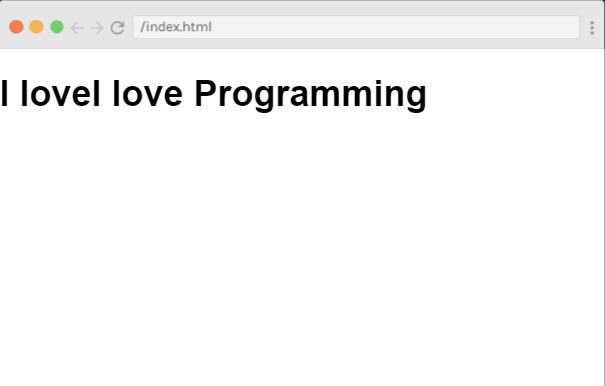
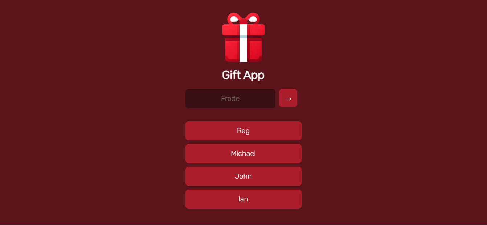

#### JavaScriptmas 2023 has come to an end! In this article, I'll wrap up the event by completing the remaining daily challenges and showcasing more work from others in the community highlights section!

---


---

### JavaScriptmas 2023

#### **What is JavaScriptmas?**

JavaScriptmas is a **FREE** annual event comprising 24 coding challenges hosted by the online coding school [Scrimba](https://scrimba.com/). Most of the coding challenges are JavaScript, but this year, there will be a few CSS challenges, and some using AI tools! 🎄

#### **What level of coder do you need to be to participate?**

Even if you are starting to learn JavaScript, you can participate. For hints, you can tap into the community, and of course, you can always use Google to help you get to your solution. There will also be Discord channels for the challenges, as well as for FAQs. You can also check out the topic in [Scrimba's forum](https://forum.scrimba.com/). 💻

#### **JavaScriptmas prize rules**

1. Each day, you can complete the challenge by midnight UTC, and share your VALID/working solution on Twitter/X for a chance to win a prize! (You can easily post your submission via the share solution button on your Scrim).
    
2. Take part in Santa's Code Review Workshop by picking a JavaScriptmas entry on X/Twitter, doing a code review, and sharing it as a reply post.
    
3. Attend the JavaScriptmas YouTube Livestream on Dec 24 for a chance to win a Mackbook Air M2
    

#### **JavaScriptmas prizes**

The prizes consist of 24 Annual Scrimba Pro subscriptions worth $200, 5 $100 winners for giving a code review of another participant's entry, and a grand prize winner awarded a Mackbook Air M2 worth $1,100! All winners will be announced during the JavaScriptmas YouTube Livestream event on December 24th. 🎁

#### **JavaScriptmas savings**

In addition to prizes, be on the lookout for savings with discount prices on their paid courses! If you're interested in taking a paid course from Scrimba, be sure to use the discount code provided: [https://scrimba.com/pricing?coupon=Michael-Larocca-Discount-2023#join](https://scrimba.com/pricing?coupon=Michael-Larocca-Discount-2023#join). (Valid for an additional 10% off semester and annual plans. Expires on July 31st, 2024) 💸

###### ***Note:*** *Prizes are limited to one per person*

#### **❄Community highlights❄**

In the spirit of the festive holiday season, I enjoy featuring others' works in the community highlights section of my JavaScriptmas articles! I will be searching X/Twitter, LinkedIn, and the Scrimba Discord channel for "outstanding" submissions by fellow participants to feature! 🎉

#### **My solutions**

Throughout the JavaScriptmas event, I will participate in all 24 coding challenges and document my detailed solutions! 💻

---

### **❄Community highlights❄ ⬇**

---

#### Palak Goyal (Palaktwts )


In the Save Santa challenge, we are tasked with navigating a labyrinth-like nested array, banishing all lions, tigers, bears, and other malevolent creatures to ultimately rescue all Santa icons and save Christmas!

But Palak Goyal, like Neo in "The Matrix", bends the reality of this challenge. Palak crafts a sophisticated program with a sleek user interface that makes users feel like they've been plugged into the Matrix, with the power to manipulate the array at will. It's not just about saving Santa anymore; it's about mastering the Matrix and retrieving any element from the depths of the array!

With Palak's program, once you've locked onto an element, you can either erase the element or purge the other elements, architecting your own solution array.

The Matrix has you, but with Palak's program, you have the Matrix! Congratulations to Palak Goyal for this extraordinary creation; remember, there's no spoon!

[***🔗 Link to the scrim***](https://scrimba.com/scrim/cof7a4b059a6ed3592f83157b)

---

#### Naitik Yadav (n4itik)


Naitik Yadav rose to the occasion for the Gift App challenge. Not only did he solve it as a [Scrimba scrim](https://scrimba.com/scrim/co2fb45f2a5ba20e6e9b30bd0), but he also created and deployed a fully functional app aptly named "Giftly" on Netlify! He also achieved the stretch goal of successfully integrating Firebase for data storage, a feat that particularly stood out to me as I'm yet to learn Firebase. This approach ensures that the names added to the app are stored in a database, allowing all users to access the same data, unlike browser-stored data that is unique to each user.

But wait, there's more! Naitik didn't stop there! He tackled the additional stretch goal challenge by humorously styling the app, incorporating an animated gif meme from the popular TV show "The Office." Each time a user removes a name from the list, they are greeted with a mischievous meme featuring the iconic Dwight Schrute wearing an elf hat, giving a thumbs-up to signify the successful removal of the name from the list! This inventive twist adds a dose of amusement and serves as a special nod to fans of the show. Applause to Naitik Yadav for both of his remarkable and entertaining solutions!

[🔗 Link to the app](https://giftly.netlify.app/)

---

#### Amelia Dutta (AmeliaDutta)


Amelia Dutta has turned the "Toggle Switch" challenge into a heartwarming spectacle akin to a beautifully illustrated children's book. Her creation features two adorable animals dressed in Santa outfits, evoking the charm and playfulness of the beloved "Hello Kitty" franchise.

The toggle switch itself is a masterpiece! It transitions seamlessly between day and night, capturing the changing moods of a day. During the day, the button is a bright sunset against a backdrop of a blue sky dotted with fluffy white clouds. Upon clicking the toggle, night falls, and the button transforms into a radiant moon set against a star-studded night sky!

The precision and detail in Amelia's work are truly commendable. The effort and care she put into this project are clearly visible, making it not just a solution to a coding challenge but a delightful piece of art. A big round of applause goes to Amelia Dutta, who has put a lot of heart into her project, creating a truly delightful spectacle to behold!

[***🔗 Link to the scrim***](https://scrimba.com/scrim/co31d491cb8caebdc40831879)

---

### ❄ Community highlights list ❄

| Highlight | Name | Scrim |
| --- | --- | --- |
| 1 | [Thea - @highflyer910](https://twitter.com/highflyer910) | [Countdown to Christmas](https://scrimba.com/scrim/co19f4b00bef2185ecae47e7e) |
| 2 | [Wakasso - @SaniWakasso](https://twitter.com/saniwakasso) | [Countdown to Christmas](https://scrimba.com/scrim/co277450faf42c7530062dd24) |
| 3 | [Mehmet Temizkan - @MehmetTemi86729](https://twitter.com/MehmetTemi86729) | [Countdown to Christmas & Style a Button](https://github.com/mehmettemizkan/JavaScriptmas-2023) |
| 4 | [Alina - @disc0night](x.com/disc0night) | [Jeopardy Card Flip](https://scrimba.com/scrim/co2b74458938a9b02534b9d8b) |
| 5 | [Wojciech Kasprzak - @kawojtek94](x.com/kawojtek94) | [Rockin' Around](https://scrimba.com/scrim/crkDmKSP) |
| 6 | [Austin Edmondson](https://www.linkedin.com/in/austin-edmondson-90a426159) | [Divide Candy](https://www.linkedin.com/posts/austin-edmondson-90a426159_scrimba-javascriptmas-activity-7137173519783628800-m2IZ?utm_source=share&utm_medium=member_ios) |
| 7 | [Oyelola - @yourgirlria](x.com/yourgirlria) | [Lonely Elf](https://scrimba.com/learn/javascriptmas/-day-14-lonely-elf-victorias-solution-co42440f1ae614560683d9701) |
| 8 | [Justin - @dream\_geto](x.com/dream_geto) | [Archery Target](https://scrimba.com/scrim/co0fb4b01a352d7d63742d208) |
| 9 | [Govind Kulkarni - @Govind02338279](x.com/Govind02338279) | [Naughty List, Nice List](https://scrimba.com/scrim/co36f4fdaaeac49c423097184) |
| 10 | [Palak Goyal - @Palaktwts](x.com/Palaktwts) | [Save Santa](https://scrimba.com/scrim/cof7a4b059a6ed3592f83157b) |
| 11 | [Naitik Yadav](x.com/n4itik) | [Gift App](https://giftly.netlify.app/) |
| 12 | [Amelia Dutta](x.com/AmeliaDutta) | [Toggle Switch](https://scrimba.com/scrim/co31d491cb8caebdc40831879) |

---

### **My coding solutions ⬇**

---

### **Day 17: Word Carousel**

**Task:**

* Match styles
    
* Personalize - display 4 things you love
    
* Words should rotate in an infinite loop
    
* No JavaScript!
    



***🔗*** [***My solution for day 17***](HOLD)

(***Note:*** *I completed the Day 18 challenge AI alt text generator in the* [*last article*](https://selftaughttxg.com/2023/12-23/javascriptmas-2023-week-3/) 📝)

As I embarked on this coding challenge, my aim was to create a carousel effect that would display four sentences about my love for different aspects of coding, each changing every five seconds.

**The sentences were:**

* "I love JavaScript"
    
* "I love CSS"
    
* "I love HTML"
    
* "I love Programming"
    

I started by setting up my HTML file with a div container, and inside it, an h1 tag with the id "carousel". This is where the magic would happen.

In my CSS file, I defined a keyframes animation named "wordChange". This animation would change the content of the h1 tag at four different points: at 0%, 25%, 50%, and 75% of the animation's duration. I assigned each point a different sentence.

I then applied this animation to the "carousel" id using the ::after pseudo-element. I set the animation to last 5 seconds and repeat infinitely.

**However, when I ran my code, I noticed a problem. The first sentence, "I love JavaScript", wasn't showing up immediately when the page loaded. Instead, there was a delay before the sentences started to cycle.**

After some troubleshooting, I realized that the ::after pseudo-element was initially empty, and the animation was starting from an empty state. To fix this, I added "I love JavaScript" to the content property in the #carousel::after rule. This ensured that the first sentence was displayed immediately, and the animation then took over, cycling through all four sentences smoothly.

**And there you have it! My carousel effect worked as expected after including the first sentence in the pseudo content.**

```css
html, body {
    margin: 0;
    padding: 0;
}

:root {
    --bg-word: #5134ff;
}

@keyframes wordChange {
  0%    { content: "I love JavaScript"; }
  25%   { content: "I love CSS"; }
  50%   { content: "I love HTML"; }
  75%   { content: "I love Programming"; }
}

#carousel::after {
  content: "I love JavaScript";
  animation: wordChange 5s infinite;
}
```

---

### **Day 19: Debug Jingle Words**

**Task:**

* There are loads of problems in theJS. Find them, and fix them!
    


***🔗*** [***My solution for day 19***](HOLD)

During my journey through this coding challenge, I encountered a perplexing error: "!TypeError: Cannot read properties of null (reading 'id')". This error suggested that I was trying to access an HTML element before it was fully loaded on the page.

To solve this, I moved the script tag linking my JavaScript file from the head of the document to the end of the body. This change ensured that the entire HTML document loads before the JavaScript file runs, effectively solving the null error issue.

But the challenge was far from over. I ran the program again for testing and encountered another problem. The issue was with the code line responsible for clearing the input field after processing a guess. The line `input.value = ''` was causing a TypeError.

I realized that I was trying to clear the input field using a string variable. The correct approach was to directly manipulate the value of the input element using its id. So, I replaced `input.value = ''` with `document.getElementById('user-input').value = '';`. This correction ensured that the input field was cleared correctly after each guess, allowing the program to run smoothly.

Next, I noticed a problem with my forEach loop. The loop was supposed to iterate over each letter in my word array, but it wasn't working as expected. The error message was "TypeError: wordArr.foreach is not a function". After a closer look, I spotted a typo - I had written "foreach" instead of "forEach". Correcting this typo fixed the issue.

I then faced an issue with the split() method. I was trying to split my guess into an array of individual letters, but it wasn't working. I was only getting the first letter of my guess. After some debugging, I realized that I was using the split method incorrectly. I was using a space as the separator, but my guess didn't contain any spaces. So I changed `guess.split(' ')` to `guess.split('')` to correctly split the guess into individual letters.

Finally, I had to step outside of the designated bug area to fully solve the challenge. This was a reminder that sometimes, the solution lies outside of the expected zone. Through this process, I learned valuable lessons about debugging, JavaScript's case-sensitivity, and the importance of understanding how different methods work.

Overall, this challenge was a great learning experience. It tested my problem-solving skills and deepened my understanding of JavaScript. And most importantly, it reinforced the importance of persistence and patience in coding.

---

### **Day 20: Save Santa**

**Task:**

* Save Santa by removing the lions, tigers, bears, and other nefarious creatures from the deeply-nested array.
    
* Easy mode: you're allowed to flatter the array
    


***🔗*** [***My solution for day 20***](HOLD)

During the last JavaScriptmas, fellow participant [Daniel Nagaoka](https://www.linkedin.com/in/daninagaoka/) impressively solved a similar nested array challenge by creating a recursive function! Not only did I feature him in the [Community Highlights section](https://selftaughttxg.com/2022/12-22/JavaScriptmas-2022-Issue_3/), I also invited him to collaborate on my "[How to Write a Recursive Function in JavaScript for Beginners](https://selftaughttxg.com/2023/01-23/how-to-write-a-recursive-function-in-javascript-for-beginners/)" article!

I decided to solve this challenge in a similar manner by taking what I learned about recursion from Daniel. Only this time, I incorporate a true/false parameter in addition to passing in the nested array! With this feature, we can return one of two new arrays: one that returns Santa and one that returns the nefarious creatures. Santa is safe either way and can still deliver presents to all the good children and JavaScriptmas participants like YOU!

The function `saveSanta` takes in two parameters: `arr`, the nested array filled with Santas and creatures, and `returnSanta`, a Boolean value that determines which array to return.

The `reduce` method is used on `arr` to flatten it. For each element in `arr`, if it is another array (indicating a deeper level of nesting), `saveSanta` is called recursively. If it isn't an array, it is either a Santa or a creature, so it is added to a new array `consolidated`.

After the array is flattened, I use the `filter` method to separate the Santas from the creatures. The `filter` method is applied on the `consolidated` array, and the results are stored in `santa` and `nefariousCreatures` variables. If `returnSanta` is true, an array of Santas is returned; otherwise, an array of creatures is returned.

To display the results, I created a function called `displayResults`. It checks the status of the 'returnSanta' checkbox, calls `saveSanta` with the appropriate parameters, and displays the results.

Lastly, I set up an event listener for the 'Submit' button. When the button is clicked, it triggers the `displayResults` function. This enables me to determine whether I had successfully rescued Santa or captured all the malicious creatures, ultimately saving Christmas! 🎄

```javascript
const dangerArray = [
    ["🎅", "👺"],
    [
        ["🎅", "🦁"],
        ["👹", "🎅"]
    ],
    [
        [
            ["🎅", "🐻"],
            ["👽", "🎅"]
        ],
        [
            ["🐯", "🎅"],
            ["🎅", "😈"]
        ]
    ]
];

function saveSanta(arr, returnSanta) {
    const consolidated = arr.reduce((acc, child) => {
        if (Array.isArray(child)) {
            acc.push(...saveSanta(child, returnSanta));
        } else {
            acc.push(child);
        }
        return acc;
    }, []);

    const santa = consolidated.filter(santa => santa === "🎅");
    const nefariousCreatures = consolidated.filter(santa => santa !== "🎅");

    return returnSanta ? santa : nefariousCreatures;
}

function displayResults() {
    const returnSanta = document.getElementById('returnSanta').checked;
    const results = saveSanta(dangerArray, returnSanta);
    document.getElementById('results').innerHTML = results.join(' ');
}  

document.getElementById('submitButton').addEventListener('click', displayResults);
  
console.log(`returnSanta: ${saveSanta(dangerArray, true)}`);
console.log(`nefariousCreatures: ${saveSanta(dangerArray, false)}`);
```

```bash
returnSanta: 🎅,🎅,🎅,🎅,🎅,🎅,🎅
nefariousCreatures: 👺,🦁,👹,🐻,👽,🐯,😈
```

---

### **Day 21: Expanding Search Bar**

**Task:**

**Search input:**

* Takes up 1/3 of the width of its container
    

**When the user clicks into the search bar:**

* Input grows to the entire width of its parent container with a smooth transition
    
* Shrinks back to its original size when the user clicks away
    
* Blue border
    
* **Bonus:** placeholder text is not visible when the user clicks inside the search bar
    

**Accessibility:**

* For accessibility, form inputs should always have a label. Create a label with a valid **for** attribute.
    
* Look up some CSS rules that hide the search input's label visually but keep it accessible to screen readers.
    


***🔗*** [***My solution for day 21***](HOLD)

To solve this challenge, we are styling a search bar and its container in the CSS code. Let's break it down:

The `:root` selector is defining two CSS variables. `--search-border` is set to a light gray color, and `--search-focus-border` is set to a medium blue color. These variables can be used throughout the rest of the CSS code.

The `.container` class is being styled to take up 100% of the width of its parent element, and its top margin is set to 25 pixels. This positions the container on the page.

The `.search-bar` class is where the search bar itself is styled. Its width is set to 33.3% of its container's width, and its border is set to a 1px solid blue line. The `transition` property is used to animate changes to the search bar. In this case, it will smoothly transition the width of the search bar over 0.5 seconds whenever the width changes.

The `.search-bar:focus` selector is used to change the styles of the search bar when it is in focus, i.e., when it's clicked on. Here, the width of the search bar is set to 100% when it's in focus.

The `.search-bar:focus::placeholder` selector targets the placeholder text of the search bar when it's in focus. The color of the placeholder text is set to transparent, making it disappear when the search bar is in focus.

Finally, the `.sr-only` class is used for accessibility purposes. Elements with this class will be hidden visually but will still be read by screen readers. This is achieved by moving the element off-screen using a combination of absolute positioning and other properties.

```css
:root {
    --search-border: #bbb;
    --search-focus-border: #3a71ca;
}

.container {
  width: 100%;
  margin-top: 25px;
}

.search-bar {
  width: 33.3%;
  border: 1px solid blue;
  transition: width 0.5s ease-in-out;
}

.search-bar:focus {
  width: 100%;
}

.search-bar:focus::placeholder {
  color: transparent;
}

.sr-only {
  position: absolute;
  width: 1px;
  height: 1px;
  padding: 0;
  margin: -1px;
  overflow: hidden;
  clip: rect(0,0,0,0);
  border: 0;
}
```

To solve the HTML part of this challenge, in the HTML file, we have a `label` element that is associated with an input field (not shown in this snippet) for search functionality.

The `for` attribute in the `label` tag specifies which form element a label is bound to. In this case, it is bound to an element with the id "search-field". When a user clicks on this label, the browser will automatically focus on the form element with the id "search-field".

The `class="sr-only"` attribute is used to hide the label from sighted users while still making it accessible to screen readers. This is often done to improve the visual appearance of the form while still providing an accessible experience for users who rely on screen readers. The class name "sr-only" stands for "screen reader only".

The text "Search" inside the `label` tag is the text that will be read by screen readers when they encounter this label. It gives context to the user about what the associated input field is for. In this case, it indicates that the input field is for performing a search.

```xml
<label for="search-field" class="sr-only">Search</label>
```

---

### **Day 22: Gift App**

**Task:**

* Make it so that the data doesn't disappear on reload.
    
* Use local storage.
    



***🔗*** [***My solution for day 22***](HOLD)

We were asked to modify an existing, functional project to utilize local storage for the Gift App challenge. To solve it, I first fetched any existing data from local storage when the page loaded and populated the 'people' array with this data:

```javascript
const data = JSON.parse(localStorage.getItem('myKey')) || [];
if (data.length > 0) {
    people = [...data];
}
```

Then, I updated the local storage every time a new name was added to the 'people' array:

```javascript
addButtonEl.addEventListener("click", function() {
    let inputValue = inputFieldEl.value
    
    if (inputValue) {
        people.push(inputValue)
        localStorage.setItem('myKey', JSON.stringify(people));
        clearInputFieldEl()
        renderList(people)
    }
})
```

In addition to the existing functionality of removing a name from the list by double-clicking, I enhanced this feature by updating the local storage each time a name was removed. This ensured the updated list was re-rendered:

```javascript
function appendPersonToPeopleListEl(person) {
    let newEl = document.createElement("li")
    
    newEl.textContent = person
    
    newEl.addEventListener("dblclick", function() {
        let index = people.indexOf(person)

        people.splice(index, 1)
        localStorage.setItem('myKey', JSON.stringify(people));
        renderList(people)
    })
    
    peopleListEl.append(newEl)
}
```

Utilizing local storage ensured a consistent state for the 'people' array across different browsing sessions. This means that the data in the 'people' array wasn't lost even if I refreshed or reloaded the webpage. Instead, it was retrieved from local storage and repopulated into the array. This allowed me to maintain a consistent list of names that remained accessible regardless of page reloads.

---

### **Day 23: Toggle Switch**

**Task:**

* On click, the toggle switch moves from one side to another
    
* The cursor becomes a pointer
    
* Match styles
    
* No JavaScript!
    


***🔗*** [***My solution for day 23***](HOLD)

For this challenge, all of the HTML is provided. So, the challenge is solved by coding CSS ( not JavaScript )!

In the CSS code, the ".toggle-wrap" class is used to center the toggle switch on the page. This is achieved by setting its display to flex and using justify-content and align-items to center the contents.

The ".toggle-input" class is used to hide the actual checkbox input, as this will be replaced visually by the custom toggle switch.

The ".toggle-switch" class styles the background of the custom toggle switch. It's given a specific width, height, and a border-radius to resemble a rounded rectangular shape. The cursor property is set to pointer, indicating it's clickable.

The ".toggle-switch::before" pseudo-element creates the toggle knob, the circular element that moves when you click the switch. It's positioned absolutely within the ".toggle-switch", and initially set to the left side.

Finally, the ":checked" pseudo-class changes the styles when the checkbox is checked. When the checkbox is checked, the background color of the ".toggle-switch" changes to light green, and the toggle knob moves to the right side of the switch. This provides a clear visual indication of the toggle switch's state.

```css
html, body {
    margin: 0;
    padding: 0;
}

:root {
    --toggle-switch-bg: #232428;
    --toggle-border: #232428;
    --toggle-bg: #fff;
}

.toggle-wrap {
    display: flex;
    justify-content: center;
    align-items: center;
    height: 100vh;
    background-color: lightgray;
}

.toggle-input {
    display: none;
}

.toggle-switch {
    border: 3px solid black;
    width: 60px;
    height: 30px;
    background-color: var(--toggle-bg);
    border-radius: 30px;
    position: relative;
    cursor: pointer;
    transition: background-color 0.2s;
}

.toggle-input:checked + .toggle-switch {
    background-color: lightgreen;
}

.toggle-switch::before {
    content: "";
    position: absolute;
    width: 26px;
    height: 26px;
    background-color: var(--toggle-bg);
    border-radius: 50%;
    top: 2px;
    left: 2px;
    transition: left 0.2s;
    background-color: var(--toggle-switch-bg);
}

.toggle-input:checked + .toggle-switch::before {
    left: 32px;
}
```

---

### **Day 24: Christmas Tree Lights**

**Task:**

Make my Christmas tree lights flash on and off every 800 milliseconds on a permanent loop.


***🔗*** [***My solution for day 24***](HOLD)

The task for this challenge is to make the Christmas tree lights flash on and off every 800 milliseconds in a continuous loop. Additionally, I decided to take on a stretch goal: to make the red and blue lights toggle on and off alternately.

First, I selected all the red and blue lights on the Christmas tree using the `querySelectorAll` method. This method returns a list of all elements in the document that match a specified group of selectors. In this case, I used it to select all elements with the class 'lights' and the classes 'red' or 'blue'.

```css
const redLights = document.querySelectorAll('.lights.red');
const blueLights = document.querySelectorAll('.lights.blue');
```

Next, I created two separate functions, `toggleRedLights` and `toggleBlueLights`, to control each set of lights. Each function uses the `forEach` method to iterate over every light in the respective list and then toggle the 'lights-on' class on or off using the `toggle` method.

```css
function toggleRedLights() {
    redLights.forEach(light => light.classList.toggle('lights-on'));
}

function toggleBlueLights() {
    blueLights.forEach(light => light.classList.toggle('lights-on'));
}
```

The `setInterval` function was then used to call these functions repeatedly at a specified interval. For the red lights, I set this interval to 800 milliseconds, causing the red lights to flash on and off every 800 milliseconds.

```css
setInterval(toggleRedLights, 800);
```

For the blue lights, I wanted them to toggle on and off alternately with the red lights. To achieve this, I used the `setTimeout` function to delay the start of the blue lights flashing by 400 milliseconds, half of the interval set for the red lights. This delay and the same 800-millisecond interval result in an alternating flashing pattern.

```css
setTimeout(() => setInterval(toggleBlueLights, 800), 400);
```

---


###### ***Pixabay: Illustration by Mohamed Hassan***

---

### ❄ My JavaScriptmas submissions ❄

| Date | Scrim |
| --- | --- |
| 12/01/2023 | [Countdown to Christmas](https://scrimba.com/scrim/co4f3415294358402a867b1e2) |
| 12/02/2023 | [Style a Colorful Button](https://scrimba.com/scrim/co7714d9d9a8d9f9953b6d5df) |
| 12/03/2023 | [Divide Candy](https://scrimba.com/scrim/co1a24ada97190f280b81c332) |
| 12/04/2023 | [AI Christmas E-card Generator](https://scrimba.com/scrim/co35c4cf1816e0f50380029e1) |
| 12/05/2023 | [Jeopardy Card Flip](https://scrimba.com/scrim/co7f04288a92ab1c880cb9a97) |
| 12/06/2023 | [Secret Santa](https://scrimba.com/scrim/co78740dba6c48d8bca525027) |
| 12/07/2023 | [Christmas Present Wishlist](https://scrimba.com/scrim/coeb8439398690ca6ab2362a8) |
| 12/08/2023 | [Animated Progress Bar](https://scrimba.com/scrim/co8bc4cc199bc9a4febe1dc8e) |
| 12/09/2023 | [AI Christmas E-card Generator](https://scrimba.com/scrim/co19843139fc60c047c09cc9c) |
| 12/10/2023 | [Rockin' Around](HOLD) |
| 12/11/2023 | [Flag Challenge](https://scrimba.com/scrim/coc734ebd8b2913fbac7d8031) |
| 12/12/2023 | [Santa's Gift Sorter](https://scrimba.com/scrim/co5664dee8bda22c841c73d58) |
| 12/13/2023 | [Christmas Dinner Picker](https://scrimba.com/scrim/coc5247ce85291b7c455e9065) |
| 12/14/2023 | [Lonely Elf](https://scrimba.com/scrim/co1ec49b8be855048f5e3c82b) |
| 12/15/2023 | [Build an Archery Target](https://scrimba.com/scrim/codd14d23989c98b92bb55218) |
| 12/16/2023 | [Naughty List, Nice List](https://scrimba.com/scrim/co84c450fa893e66fe113837d) |
| 12/17/2023 | [HOLD](HOLD) |
| 12/18/2023 | [AI alt text generator](https://scrimba.com/scrim/coe3f477f99a7a105d13f6004) |
| 12/19/2023 | [HOLD](HOLD) |
| 12/20/2023 | [HOLD](HOLD) |
| 12/21/2023 | [HOLD](HOLD) |
| 12/22/2023 | [HOLD](HOLD) |
| 12/23/2023 | [HOLD](HOLD) |
| 12/24/2023 | [HOLD](HOLD) |

---

# **JavaScriptmas PrizeFest**

<iframe width="866" height="487" src="https://www.youtube.com/embed/Y0tc4DTS0e8"></iframe>

### Huge congratulations to all of the winners! 🎉

---

#### ***If you would like to learn more about my journey with Scrimba and how learning with them may help you, you can read my article:*** [***How Scrimba is helping me and many others to become confident, well-prepared web developers***](https://selftaughttxg.com/2021/06-21/06-07-21/)

---

#### **Scrimba has once again impressed and inspired me! You can read my full** [**Scrimba review**](https://selftaughttxg.com/2020/12-20/Review-Scrimba/) **on my 12/13/2020 post.**


#### ***"That's one of the best Scrimba reviews I've ever read,*** [***@MikeJudeLarocca***](https://twitter.com/MikeJudeLarocca?ref_src=twsrc%5Etfw)***. Thank you! 🙏 "***

###### **— Per Harald Borgen, CEO of Scrimba** [**December 14, 2020**](https://twitter.com/perborgen/status/1338462544143540227?ref_src=twsrc%5Etfw)

---

### **10% Scrimba Discount!**

#### **If you're interested in taking a paid course from Scrimba, be sure to use the discount code provided:** [**https://scrimba.com/pricing?coupon=Michael-Larocca-Discount-2023#join**](https://scrimba.com/pricing?coupon=Michael-Larocca-Discount-2023#join)

###### ***Valid for an additional 10% off semester and annual plans. Expires on July 31st, 2024***

---

### **Conclusion**

As we wrap up the 2023 edition of Scrimba's annual JavaScriptmas event, we reflect on its fun and festive journey. This event has provided an opportunity for new and seasoned coders to commit to daily coding, share their work with the community, make new friends, and even compete for amazing prizes!

With the event now over, the learning doesn't have to stop. Scrimba offers a wide range of FREE courses to continue your learning journey. If you're ready to take your skills to the next level and become a hireable front-end web developer, keep an eye out for discounted course rates!

While we bid farewell to JavaScriptmas 2023, the excitement doesn't end here. Get ready to join us again next year for another round of coding challenges, community connection, and festive fun! Until then, keep coding, keep sharing, and keep improving your skills. Merry JavaScriptmas! See you in 2024! 🎄

---

**Let's connect! I'm active on** [**LinkedIn**](https://www.linkedin.com/in/michaeljudelarocca/) **and** [**Twitter**](https://twitter.com/MikeJudeLarocca)**.**

---

###### ***Does the conclusion of Scrimba's JavaScriptmas this year pique your interest in joining next year? Or have you already experienced the thrill of participating in a previous year's event? Please share the article and comment!***