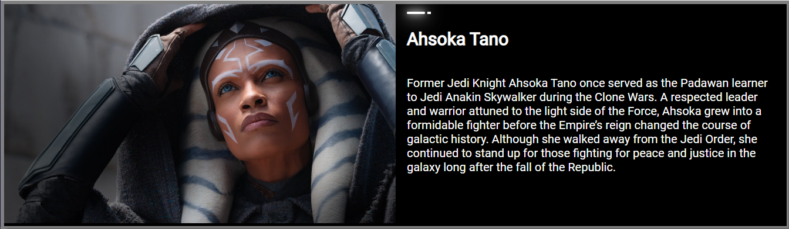
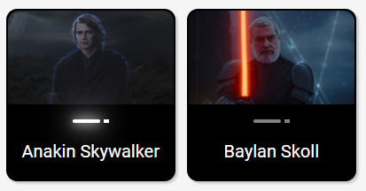
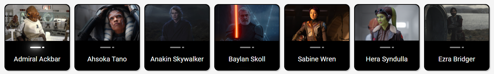
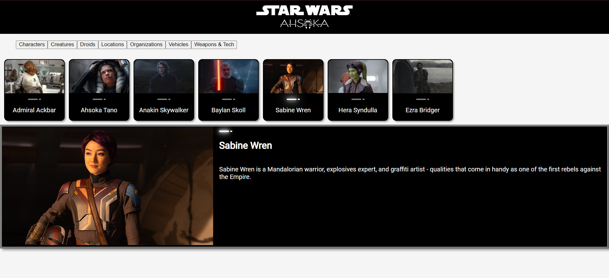

#### This article covers the essential file separation concept in React projects by effectively structuring code in separate files, enhancing your project's organization, readability, and maintainability!

---


---

### Introduction

In this article, I will continue to cover React concepts I am learning by pair programming with AI to create a Star Wars Ahsoka website.

**This article will focus on the "file separation" concept, which helps to keep our code clean by following best coding practices. For this project, I created separate files for data, a mapping function, and several components.**

Initially, I wrote my mapping function in the main App file, and it specifically accepted props for the character's data. I also had to import the images directly into the main App file with this structure. So, as you can imagine, this approach would end up creating a pretty large and cluttered App file!

With the help of my AI assistant Rix, I restructured the Vite React project by creating a data file that contains all the category object arrays, including their corresponding images imported at the top. I also added a "**utils**" folder and created a separate file for the map function.

*With the React project restructured, I can render all of my Star Wars component cards in my main App with just one line of code!*

```javascript
{mapItems(selectedCategory, StarWarsCard, setSelectedItem, selectedItem, SmallCardContent)}
```

**To understand how the** `mapItems` **function works, I need to explain the following components of my project:**

1. **The data file:** This provides the data that the `mapItems` function uses to create the Star Wars cards.
    
2. **The** `StarWarsCard` **component:** This is the component that the `mapItems` function uses to create each individual card.
    
3. **The** `SmallCardContent` **and** `LargeCardContent` **components:** These components are used in the `StarWarsCard` component, and they also receive props from the `mapItems` function.
    
4. **The** `App` **component:** This is where the `mapItems` function is used.
    
5. **The** `Lightsaber` **component:** This component is used in the cards created by the `mapItems` function.
    

---

### The Data file

I created a separate file to store all of the data that is used to display Star Wars cards in the main App file. The data is stored in object arrays containing data from different categories, such as characters, locations, vehicles, and more.

**Based on my experience working with React projects created with Vite, importing images and setting them to variables is best (URLs may cause errors). So, I created an image folder and respective category folders inside of it.**

```javascript
// Vehicles
import the_eye_of_sion from './images/vehicles/the-eye-of-sion.jpeg';
import the_ghost from './images/vehicles/the-ghost.jpeg';
import vesper from './images/vehicles/vesper.jpeg';

const vehicles = [
    {
        name: 'THE EYE OF SION',
        image: the_eye_of_sion,
        about: 'Morgan Elsbeth commands the Eye of Sion, a unique starship powered by three distinct clusters of hyperdrive engines installed along a circular chassis. Capable of traveling across vast distances, the hyperspace ring can even move beyond the known galaxy.'
    },
    {
        name: 'THE GHOST',
        image: the_ghost,
        about: 'Named for its ability to travel past Imperial sensors without detection, the Ghost has served Captain and pilot Hera Syndulla and her droid, Chopper, for more than a decade. A customized VCX-100 light freighter, the Ghost boasts a number of systems designed to elude foes, including a 360-degree dorsal laser cannon turret, two forward laser cannons, and two rear laser cannons. During the time of the Empire, the starship also served as a mobile base for Syndulla’s small band of rebels working to aid the people of Lothal and other planets in need. After the Galactic Civil War that brought about the New Republic, Hera still prefers flying the Ghost to other ships, using it as a homebase for herself, her droid, and her son, Jacen. Although the original detachable shuttle, the Phantom, was lost in combat with the Empire, the Ghost now operates with the assistance of the Phantom II, a repurposed Neimoidian Sheathipede-class shuttle.'
    },
    {
        name: 'VESPER',
        image: vesper,
        about: 'Built after the fall of the Empire, the Vesper is a shining example of the New Republic fleet, a sleek and sophisticated vessel built for diplomacy and exploration, not war. With a crew led by Captain Hayle, a veteran of the Galactic Civil War who fought on the side of the Rebel Alliance, the Vesper was tasked with transporting political prisoner Morgan Elsbeth for trial before it came under attack by two mercenaries, posing as Jedi and looking to free the captive.'
    },  
]
```

**Each category array is exported at the bottom of the file so that it can be imported to the main App file for use.**

```javascript
export { characters, creatures, droids, locations, organizations, vehicles, weapons_and_tech };
```

---

### Star Wars Card Component

My [last article](https://selftaughttxg.com/2024/01-24/learn-to-use-component-identifiers-as-props-for-rendering-various-html-elements-dynamically/) focused on the React concept of **passing a component identifier as a prop**. So, to make learning this topic interesting, I decided to create a Star Wars-themed component, which led to the creation of an entire Ahshoka website.

The Star Wars Card component serves as a reusable structure for rendering card elements in the application. It's designed to be flexible and adaptable, accepting a variety of props that dictate its content, appearance, and behavior.

**The component accepts the following props:**

* **type:** This prop determines the type of HTML element that will be used as the container for the card. This is useful for maintaining semantic HTML structure and accessibility.
    
* **contentType:** This prop accepts a component that will be rendered within the container. This provides flexibility in what content can be displayed within the card.
    
* **contentProps:** This prop is an object containing the properties that will be passed to the `contentType` component. This allows us to dynamically pass different sets of props to the content component depending on the data we want to display.
    
* **layout, theme, interaction:** These props are used to apply different CSS classes to the container, allowing us to control the card's appearance and behavior through CSS. `layout` controls the card's layout, `theme` applies a color scheme and `interaction` determines how the card responds to user interaction.
    
* **onClick:** This is a function that is invoked when the card is clicked. This can be used to handle user interactions with the card, such as selecting an item.
    

In the component's render method, we create a `Container` element using the `type` prop and apply the CSS classes from `layout`, `theme`, and `interaction` to it. The `onClick` prop is also passed to the `Container`.

Next, we render the `Content` component within the `Container`, passing it the `contentProps`.

By structuring the Star Wars Card component in this way, we can easily create cards with different content, appearances, and behaviors, all while keeping our code DRY (Don't Repeat Yourself). This component is a key piece of this application's architecture and plays a crucial role in rendering our Star Wars data.

```javascript
function StarWarsCard({ type, contentType, contentProps, layout, theme, interaction, onClick }) {
    const Content = contentType;
    const Container = type;
    const Layout = layout;
    const Theme = theme;
    const Interaction = interaction;
  
    return (
      <Container className={`${Layout} ${Theme} ${Interaction}`} onClick={onClick}>
      <Content {...contentProps} />
      </Container>
    );
  }

  export default StarWarsCard;
```

---

### Small Card Content Component

As I am referencing the real Star Wars website for the inspiration for this Ahsoka React app, I'm closely mimicking the site's structure. When you navigate to the [Databank Ahsoka section](https://www.starwars.com/databank/ahsoka-all), you will see a list of category links, characters, creatures, droids, and more. You will also find a variety of clickable small cards on the page, each featuring a name, image, and lightsaber icon. When you click on a small card, you are directed to a new page featuring a similar, larger card that now includes a paragraph of information about the selected item.

So, for my project, I created a "**small card content**" component that closely resembles the small cards as seen on the Star Wars website, and when clicked on, a corresponding large card renders to the webpage. The `SmallCardContent` component is designed to display a small card for each Star Wars selected category item ( the default category is characters). It takes in several props that determine its content and behavior.

**The component accepts the following props:**

* **name**: This prop is the name of the Star Wars item. It's used as the alternative text for the image and is also displayed on the card.
    
* **image**: This prop is the source URL for the image of the Star Wars item. It's used to display the image on the card.
    
* **isSelected**: This boolean prop indicates whether the Star Wars item is currently selected. If `isSelected` is true, the 'selected' CSS class is applied to the card, and the `Lightsaber` component is activated.
    
* **onClick**: This is a function that is invoked when the card is clicked. It can be used to handle user interactions, such as selecting this item.
    

In the render method of the component, a `div` element with the class 'small-card' is created. If `isSelected` is true, the 'selected' class is added to the `div`. The `onClick` prop is also passed to the `div`.

Inside this `div`, an `img` element is rendered with the `src` set to the `image` prop and the `alt` set to the `name` prop. This displays the image of the Star Wars item on the card.

Next, the `Lightsaber` component is rendered with the `isActive` prop set to `isSelected`. This activates the lightsaber if the card is selected.

Finally, a `p` element is rendered with the `name` prop. This displays the name of the Star Wars item on the card.

```javascript
import Lightsaber from './Lightsaber';

function SmallCardContent({name, image, isSelected, onClick}) {
    return (
        <div className={`small-card ${isSelected ? 'selected' : ''}`} onClick={onClick}>
            </img>
            <Lightsaber isActive={isSelected} />
            <p>{name}</p>
        </div>
    )
}

export default SmallCardContent;
```


---

### Large Card Content Component

Unlike the official Star Wars website, which directs you to a new webpage when a small card is clicked, my "**small card content**" component operates differently. When one of these cards is clicked, a corresponding large card is rendered on the same main app webpage. The `LargeCardContent` component takes in several props that determine its content.

**The component accepts the following props:**

* **name:** This prop is the name of the Star Wars item. It's used as the alternative text for the image and is also displayed on the card.
    
* **image:** This prop is the source URL for the image of the Star Wars item. It's used to display the image on the card.
    
* **about:** This prop contains the description of the Star Wars item. It's displayed as a paragraph on the card.
    
* **isSelected:** This boolean prop indicates whether the Star Wars item is currently selected. While not directly used in this component, it could be utilized for conditional rendering or styling.
    

In the render method of the component, a `div` element with the class 'large-card' is created. Inside this `div`, two more `div` elements are rendered.

The first `div` contains an `img` element, which displays the image of the Star Wars item. The `src` attribute is set to the `image` prop and the `alt` attribute is set to the `name` prop.

The second `div` has the class 'about' and contains the `Lightsaber` component, a `h1` element, and a `p` element. The `Lightsaber` component is always activated in the large card, hence `isActive` is set to true. The `h1` element displays the `name` of the Star Wars item, and the `p` element displays the `about` information, providing a description of the item.

```javascript
import Lightsaber from './Lightsaber';

function LargeCardContent({name, image, about, isSelected }) {
    return (
        <div className="large-card">
            <div>
                </img>
            </div>
            <div className="about">
                <Lightsaber isActive={true} />
                <h1>{name}</h1>
                <p>{about}</p>
            </div>
        </div>    
    )
}

export default LargeCardContent;
```



---

### Lightsaber component

**Taking some creative liberty, I made my own version of a Lightsaber component similar to the one seen on the Star Wars website. This is used as an accent, serving as a unique and thematic visual element that enhances the Star Wars aesthetic of the cards.**



The `Lightsaber` function is a React component that takes one prop, `isActive`. It returns a `div` element with the class "lightsaber", which contains two other `div` elements representing the lightsaber's blade ("lightsaber-saber") and hilt ("lightsaber-saber-hilt").

The `isActive` prop determines whether the lightsaber is activated or not. If `isActive` is true, the 'glow lightsaber-saber-active' classes are applied to the blade, and the 'lightsaber-saber-hilt-active' class is applied to the hilt. These classes control the visual appearance of an active lightsaber by adding a glowing effect to the blade.

If `isActive` is false or not provided, these classes are not applied, and the lightsaber is rendered as deactivated, similar to how it looks on the actual Star Wars website. The `Lightsaber` component is then exported for use in other parts of the application (for the LargeCardContent component ).

```javascript
function Lightsaber({ isActive }) {
    return (
        <div className="lightsaber">
            <div className={`lightsaber-saber ${isActive ? 'glow lightsaber-saber-active' : ''}`}></div>
            <div className={`lightsaber-saber-hilt ${isActive ? 'lightsaber-saber-hilt-active' : ''}`}></div>
        </div>
    )
}

export default Lightsaber;
```

**CSS for the Lightsaber component:**

```css
.lightsaber {
  display: flex;
  justify-content: center;
  align-items: center;
  margin-top: 10px;
}

.lightsaber-saber {
  background-color: grey;
  width: 25px;
  height: 3px;
  position: relative;
  border-radius: 50px;
}

.lightsaber-saber-hilt {
  background-color: grey;
  width: 5px;
  height: 3px;
  border-radius: 5%;
  margin-left: 3px;
}

.lightsaber-saber-active {
  background-color: white;
  width: 25px;
  height: 3px;
  position: relative;
  border-radius: 50px;
}

.lightsaber-saber-hilt-active {
  background-color: white;
  width: 5px;
  height: 3px;
  border-radius: 5%;
  margin-left: 3px;
}

.lightsaber-saber.glow {
  box-shadow: 0 0 2px white, 0 0 4px white, 0 0 6px white, 0 0 8px white;
  animation: glow .01s infinite;
}


@keyframes glow {
  0% {
    box-shadow: 0 0 5px white, 0 0 10px white, 0 0 15px white, 0 0 20px white;
  }
  50% {
    box-shadow: 0 0 10px white, 0 0 20px white, 0 0 30px white, 0 0 40px white;
  }
  100% {
    box-shadow: 0 0 5px white, 0 0 10px white, 0 0 15px white, 0 0 20px white;
  }
}
```

---

### Map items function

Originally, I was going to write a mapping function for each category. I did not know if each category would have the same key-value pairs and if there would be the same number of them (consequently, all of them did ).

So, I conversed with my AI assistant Rix, and sure enough, best coding practices deemed it necessary to have one generic mapping function that can be used for all of the categories, which can accommodate varying amounts of key-value pairs. So that is why you will notice that the prop names are nondescriptive.

**In simple terms, the** `mapItems` **function works like a factory for creating Star Wars cards. It takes in a list of Star Wars items (like characters, locations, or vehicles), and for each item, it creates a card that displays information about that item. It also allows you to interact with the card by clicking on it, which then updates the currently selected item.**

The `mapItems` function takes in five parameters - `items`, `Component`, `setSelectedItem`, `selectedItem`, and `contentType`.

* `items` is an array of data.
    
* `Component` is the React component that will be used for each item in the array.
    
* `setSelectedItem` is a function that updates the state of the currently selected item.
    
* `selectedItem` is the current selected item.
    
* `contentType` is a component that will be rendered within the `Component`.
    

**The function uses the** `map` **method to iterate over each item in the** `items` **array. For each item, it returns a** `Component`**.**

The `Component` is rendered with several props:

* `key`: A unique identifier for each element in the list, here it's the index from the `map` function.
    
* `type`: Here it's set to "div".
    
* `contentType`: The component to be rendered within the `Component`, passed in as an argument to the `mapItems` function.
    
* `contentProps`: An object that contains all the properties of the current item (`...item` is using the spread operator to copy all properties of the item). It also includes an `isSelected` property, which is true if the current item is the selected item or if it's the first item in the array (when no item is selected yet).
    
* `layout`: Here it's set to "small-card".
    
* `theme`: Here it's set to "dark-theme".
    
* `interaction`: Here it's set to "clickable".
    
* `onClick`: A function that updates the `selectedItem` state to the current item when the `Component` is clicked.
    

**The result of this function is an array of** `Component` **elements, each rendered with specific props based on the item it represents.**



```javascript
export function mapItems(items, Component, setSelectedItem, selectedItem, contentType) {
    return items.map((item, index) => {
        return (
            <Component 
                key={index} 
                type="div" 
                contentType={contentType} 
                contentProps={{
                    ...item,
                    isSelected: selectedItem ? selectedItem === item : index === 0
                }} 
                layout="small-card" 
                theme="dark-theme" 
                interaction="clickable" 
                onClick={() => setSelectedItem(item)} 
            />
        )
    });
}
```

---

### App Component

**Here in the main app is where it all comes together! As mentioned earlier, my main focus for this article is the "file separation" React concept, which keeps this file clean and results in me being able to render all of the small Star Wars card components with just one line of code.**

```javascript
{mapItems(selectedCategory, StarWarsCard, setSelectedItem, selectedItem, SmallCardContent)}
```

In addition, there is a lot happening in this app file. I use React's `useState` and `useEffect` hooks to manage the state and side effects of the application.

The state variables include `selectedItem`, `items`, and `selectedCategory`. The initial value of `selectedItem` is set to `null`, `items` is set to the `characters` array, and `selectedCategory` is set to the `characters` array as well.

The **selected** category variable and set the default to **characters**. There are a total of seven categories stored in object arrays, along with their imported images, in the data file.

```javascript
 const [selectedCategory, setSelectedCategory] = useState(characters);
```

The `useEffect` hook is used to set the `selectedItem` to the first item of the `selectedCategory` array whenever the `selectedCategory` changes. This ensures that there is always a `selectedItem` even when switching between categories.

```javascript
  useEffect(()=>{
    setSelectedItem(selectedCategory[0]);
  },[selectedCategory])
```

I created a simple, bare-bones Nav bar component that, for now, only includes Star Wars image logos.

**Now, here is where things start to get tricky. To allow the user to change categories, I added buttons with an anonymous arrow function that changes the current category. It works great! But when I tried to recreate the whole menu as a separate component, like I easily did with the nav bar, the app broke! So, I will be addressing that issue in the next article.**

For now, in the main app, each button sets the `selectedCategory` to a different category, when clicked. This changes the data that is being rendered in the application.

```javascript
    <menu>
      <button onClick={()=>{setSelectedCategory(characters)}}>Characters</button>
      <button onClick={()=>{setSelectedCategory(creatures)}}>Creatures</button>
      <button onClick={()=>{setSelectedCategory(droids)}}>Droids</button>
      <button onClick={()=>{setSelectedCategory(locations)}}>Locations</button>
      <button onClick={()=>{setSelectedCategory(organizations)}}>Organizations</button>
      <button onClick={()=>{setSelectedCategory(vehicles)}}>Vehicles</button>
      <button onClick={()=>{setSelectedCategory(weapons_and_tech)}}>Weapons & Tech</button>
    </menu>
```

Then the `mapItems` function maps over the `selectedCategory` and renders a `StarWarsCard` for each item. It passes several arguments to the `mapItems` function, including the `selectedCategory`, the `StarWarsCard` component, the `setSelectedItem` function, the `selectedItem`, and the `SmallCardContent` component. This results in a series of small cards being rendered based on the `selectedCategory`.

Finally, a large `StarWarsCard` is rendered to display detailed information about the `selectedItem`. If `selectedItem` is `null`, it defaults to the first item in the `items` array. The card includes the name, image, and information about the `selectedItem`.

**Here is the completed app file:**

```javascript
import { useState, useEffect } from 'react';
import { mapItems } from './utils/mapFunctions';
import { characters, creatures, droids, locations, organizations, vehicles, weapons_and_tech } from './data';
import Navbar from './components/Navbar';
import StarWarsCard from './components/StarWarsCard';
import SmallCardContent from './components/SmallCardContent';
import LargeCardContent from './components/LargeCardContent';
import './App.css';

function App() {
  const [selectedItem, setSelectedItem] = useState(null);
  const [items, setItems] = useState(characters); 
  const [selectedCategory, setSelectedCategory] = useState(characters);

  useEffect(()=>{
    setSelectedItem(selectedCategory[0]);
  },[selectedCategory])
      
  return (
    <>
    <Navbar />
    <menu>
      <button onClick={()=>{setSelectedCategory(characters)}}>Characters</button>
      <button onClick={()=>{setSelectedCategory(creatures)}}>Creatures</button>
      <button onClick={()=>{setSelectedCategory(droids)}}>Droids</button>
      <button onClick={()=>{setSelectedCategory(locations)}}>Locations</button>
      <button onClick={()=>{setSelectedCategory(organizations)}}>Organizations</button>
      <button onClick={()=>{setSelectedCategory(vehicles)}}>Vehicles</button>
      <button onClick={()=>{setSelectedCategory(weapons_and_tech)}}>Weapons & Tech</button>
    </menu>  
    <section className="small-card-container">
      {mapItems(selectedCategory, StarWarsCard, setSelectedItem, selectedItem, SmallCardContent)}
    </section>
        <StarWarsCard 
            type="article" 
            contentType={LargeCardContent} 
            contentProps={{
              name: selectedItem ? selectedItem.name : items[0].name, 
              image: selectedItem ? selectedItem.image : items[0].image, 
              about: selectedItem ? selectedItem.about : items[0].about
            }} 
            layout="large-card" 
            theme="dark-theme" 
            interaction="hoverable" />
    </>
  )
}

export default App
```

---

### The Importance of File Separation

With the help of my AI assistant Rix, I was able to refactor the code in my main app, greatly reducing the lines of code and better organizing the project!

File separation in React is a fundamental concept that promotes code organization, readability, and maintainability. When working on large-scale applications, keeping **components**, **data**, and **utility functions** in separate files helps structure your code more manageable. It allows for easy navigation and understanding of the codebase, as each file serves a specific purpose.

Also, it encourages the reuse of components and functions, as they are isolated and can be imported wherever needed (as long as you can get the code in the components working 😅). This approach aligns with the modular design principle, making the codebase scalable and easy to debug, which improves the overall development experience.

---

### **The project so far**

**Here are the links to the project:**

* [GitHub repo](https://github.com/MichaelLarocca/react-dynamic-elements-starwars-cards)
    
* [Netlify deployed project](https://react-dynamic-elements-starwars-cards.netlify.app/)
    



---

### **My other related articles**

* [Learn to Use Component Identifiers as Props for Rendering Various HTML Elements Dynamically](https://selftaughttxg.com/2024/01-24/learn-to-use-component-identifiers-as-props-for-rendering-various-html-elements-dynamically/)
    
* [A Guide to React Children Props: Star Wars Button Tutorial](https://selftaughttxg.com/2023/11-23/a-guide-to-react-children-props-star-wars-button-tutorial/)
    
* [How to Integrate Font Awesome Icons into React Applications](https://selftaughttxg.com/2023/10-23/how-to-integrate-font-awesome-icons-into-react-applications/)
    
* [How to Make a Countdown App with React and date-fns](https://selftaughttxg.com/2023/06-23/how-to-make-a-countdown-app-with-react-and-date-fns/)
    
* [Learn Local Storage in React: Create a Light and Dark Theme Switcher Application](https://selftaughttxg.com/2023/05-23/learn-local-storage-in-react-create-a-light-and-dark-theme-switcher-application/)
    
* [Creating a True/False Toggle in React with useState Hook for Beginners](https://selftaughttxg.com/2023/04-23/creating-a-true-false-toggle-in-react-with-usestate-hook-for-beginners/)
    

---

### Conclusion

Implementing the "file separation" concept in React will allow you to better organize your project, reduce the number of lines in your code, and adhere to best coding practices.

In this project, I was able to successfully refactor the code in the main React app by creating a separate file for my mapping function (in a utils folder), a data file for the object arrays (in the src folder), and of course, separate files for each of the components (in a components folder). I also created an image folder to store the images that are imported for use in the data file (in my experience, to avoid errors, it's best to set images to variables instead of relying on URLs).

However, I did run into a problem when I tried to move my menu buttons, which rely on a React useEffect hook and anonymous arrow functions, into a separate component; It did not work. I plan to tackle that issue in my next article. For now, the menu buttons and hook remain in the main app file and are working as expected.

By pair programming with AI in this project, I've created a Star Wars Card component for rendering card elements, which is further broken down into the SmallCardContent and LargeCardContent components. With my data and function in separate files, I was able to import them into the main app, where I can now render all of the SmallCardContent card components with just one line of code! I also created a Lightsaber component that adds a unique visual element to the cards, similar to what is seen on the actual Star Wars website.

Remember, the best way to learn how to code is by coding! Try to refactor your project into separate files so that you can gain the advantages of file separation, which will enhance your project through better organization, readability, and maintainability!

---

**Let's connect! I'm active on** [**LinkedIn**](https://www.linkedin.com/in/michaeljudelarocca/) **and** [**Twitter**](https://twitter.com/MikeJudeLarocca)**.**

---

###### ***Are you now confident in implementing the "file separation" concept in React? Have you started refactoring your own projects to improve code organization, readability, and maintainability? Please share the article and comment!***

---