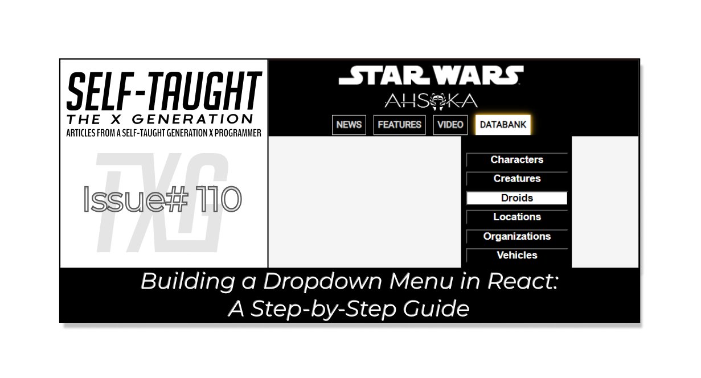

#### Join me as I continue building a React website with the help of my AI assistant! This installment focuses on a dropdown menu, following best practices like component segregation and mapping functions.

---



---

### Introduction

In this article, I will continue to cover React concepts I am learning by pair programming with AI to create a Star Wars Ahsoka website.

**This article will focus on creating a "dropdown menu. " In continuing with best coding practices, I am creating a Menu and Navbar components for the dropdown menu to work. In addition, to keep the code as clean as possible, I will also use additional custom components and a mapping function.**

Initially, all of the Star Wars category buttons which are needed for the dropdown menu were coded to work directly in the main App jsx file. So, when I first tried to create a separate Menu component, my App broke!

*With the help of my AI assistant Rix, I have successfully created a working Menu component with a dropdown feature housed within a navigation bar component!*

---

### **Prerequisites**

Building on the series of articles about creating a "Star Wars Ahsoka React website", understanding the creation of a "dropdown" menu requires familiarity with certain concepts. Please refer to my previous articles to understand the custom components and functions used.

**The prerequisites for creating the dropdown menu include:**

1. Familiarity with the **StarWarsCard, SmallCardContent**, and **LargeCardContent** components.
    
2. Understanding of the **mapItems** function used for generating multiple components.
    

#### Article series:

* [A Guide to Better Code Organization in React through File Separation](https://selftaughttxg.com/2024/01-24/a-guide-to-better-code-organization-in-react-through-file-separation/)
    
* [Learn to Use Component Identifiers as Props for Rendering Various HTML Elements Dynamically](https://selftaughttxg.com/2024/01-24/learn-to-use-component-identifiers-as-props-for-rendering-various-html-elements-dynamically/)
    

---

### Creating the Menu component

**My first attempt at creating a Menu component failed. ❌**

The menu containing all of the categories buttons worked as expected in the main app. However, the code seemed cumbersome, and I knew creating it as a separate component would be better.

#### How the category buttons work

**when a user clicks on a menu category button:**

1. New small Star Wars card components of the chosen category are rendered.
    
2. The first item in the chosen category is set as the selected item.
    
3. A large Star Wars card component renders with the corresponding selected item.
    

The tricky parts of the menu buttons are the **anonymous arrow functions**, **useState variables**, and a **useEffect hook**, which are all required for them to work as expected. So, I had a feeling it was going to be difficult to refactor. 😅

**The problem: The menu buttons directly manipulate the state of the main App component. So, when I attempted to move them to a separate component, they lost access to the necessary state variables and state-updating functions.**

*So, my first refactor worked when I properly passed all of the necessary values as props! But guess what? It turned out to be the same line count amount of cumbersome code! I was also importing the characters in both the main App and Menu components for it to work as expected. So it was time to refactor the code further.*

**Following best coding practices, here are the refactoring steps taken to create the Menu component properly. ✔**

#### useState variables

For the menu buttons to work as expected in a separate component, the **useState variables** must be declared in the **main App** and then **passed as props** to the proposed **Menu component**.

#### Created a variable for all categories

I imported all the data from the data file into the **main App**. The data consists of object arrays for each category containing a **name**, **image**, and **about**. To easily pass this data as a prop, I assigned the object arrays to a variable aptly named **categories**.

```javascript
const [selectedCategory, setSelectedCategory] = useState(characters);  
const categories = { characters, creatures, droids, locations, organizations, vehicles, weapons_and_tech };
```

**With this refactored code, we just need to pass two props to the Menu component.**

```javascript
<Menu 
   setSelectedCategory={setSelectedCategory} 
   categories={categories}
/>
```

#### Here is a sample of what the data file contains:

```javascript
// Droids
import hk_87_assassin_droid from './images/droids/hk-87-assassin-droid.jpeg';
import star_navigator_droid from './images/droids/star-navigator-droid.jpeg';

const droids = [
    {
        name: 'HK-87 ASSASSIN DROID',
        image: hk_87_assassin_droid,
        about: 'Assassins by design, the HK-87 droids loyal to Morgan Elsbeth have serve her as tireless bodyguards and enforcers.',
    }, 
    {
        name: 'STAR NAVIGATOR DROID',
        image: star_navigator_droid,
        about: 'With programmed navigation skills and efficiency, the Star Navigator droids carry out the orders of Morgan Elsbeth as she brings her plans to fruition.',
    }                   
]
```

💡 \*\*TIP:\*\**Assigning images to variables helps prevent pesky build or transpilation errors!*

---

### The useEffect hook

**For the Menu component to remain working as expected, the useEffect hook must remain in the main App.**

The hook monitors changes in the `selectedCategory` state variable. Whenever `selectedCategory` changes, the hook triggers a function that sets `selectedItem` to the first item in the new category. Without this hook in the main App, the `selectedItem` wouldn't update when the category changes and the Menu component wouldn't function correctly.

```javascript
  useEffect(()=>{
    setSelectedItem(selectedCategory[0]);
  },[selectedCategory])
```

---

### The Menu component

**With the help of my AI assistant Rix, here is the new and improved Menu component!**

```javascript
export default function Menu({ setSelectedCategory, categories }) {
    return (
        <menu>
            {Object.keys(categories).map(category => (
                <button key={category} onClick={() => setSelectedCategory(categories[category])}>
                    {category.charAt(0).toUpperCase() + category.slice(1)}
                </button>
            ))}            
        </menu>
    )
}
```

Now, there are a lot of coding concepts here, so let's take some time to unpack it! (it even took me time to comprehend it! 😅)

#### The Menu function

Let's start with the first line of our Menu component: `export default function Menu({ setSelectedCategory, categories })`. This line defines a functional component in React named `Menu`. The `export default` part means that this `Menu` component is being exported for use in other files. It accepts two props - `setSelectedCategory`, a function, and `categories`, an object, which are passed down from the **main App**.

#### Object.keys

To understand how the Menu component works, we need to first understand how **Object.keys** works.

**Object.keys** is a method in JavaScript that returns an array of a given object's own enumerable property names. It essentially provides a way to get an array of keys from an object. This is useful when you want to iterate over the keys of an object or when you want to create a new array based on the keys of an object.

*Here is the missing piece of information I needed to comprehend how****Object.keys****work in this component: understanding shorthand syntax! (I was confused because my object array did not contain key-value pairs.*) 🤔

The `categories` object I defined is using a shorthand property name syntax in JavaScript. This is a feature of ES6 where you can directly use variables as properties of an object. When you define an object like this:

```javascript
const categories = { characters, creatures, droids, locations, organizations, vehicles, weapons_and_tech };
```

**It's equivalent to this:**

```javascript
const categories = { 
    characters: characters, 
    creatures: creatures, 
    droids: droids, 
    locations: locations, 
    organizations: organizations, 
    vehicles: vehicles, 
    weapons_and_tech: weapons_and_tech 
};
```

In this case, the variables `characters`, `creatures`, `droids`, `locations`, `organizations`, `vehicles`, `weapons_and_tech` are the keys of the `categories` object, and their corresponding values are the values of these variables.

#### .map(category)

We then use the `map` method to iterate over this array. For each element in the array (which is a category name), we create a `button` element. The `key` prop of the button is set to the category name and the `onClick` prop is set to a function that updates the `selectedCategory` state in the parent component with the corresponding category from the `categories` object.

```javascript
<button key={category} onClick={() => setSelectedCategory(categories[category])}>
```

#### Button names

Now, let's discuss the line `{category.charAt(0).toUpperCase() + category.slice(1)}`. This line of code is responsible for the naming of the buttons. It takes the category name, capitalizes the first letter, and leaves the rest of the string as is.

```javascript
 {category.charAt(0).toUpperCase() + category.slice(1)}
```

***The final version of this Menu component is a streamlined, reusable function that effortlessly allows for the addition or removal of categories to generate corresponding buttons!***

---


###### *Image credit: Lucasfilm Ltd., Star Wars: Episode III – Revenge of the Sith.*

---

### Creating a dropdown menu

Now that we have created a fully functional Menu component, it's time to have fun and work on the dropdown menu!

***Here is the finished dropdown menu:***


***As mentioned earlier, all of the Star Wars category buttons were initially coded and rendered directly in the main App jsx file:***


---

### The Navbar component

Now that we have a working Menu component, it is time to create a Navbar component that utilizes it!

**The Navbar component will contain two Star Wars logos and several menu buttons. For now, we will just focus on one menu button named "DATABANK," which contains all of the Star Wars categories for our dropdown menu.**

#### Importing Dependencies and Components

For the Navbar component, we import React's **useState**, two Star Wars image files, and the newly created Menu component.

```javascript
import { useState } from 'react';
import star_wars_logo from '../images/miscellaneous/star-wars-logo.png';
import ahsoka_logo from '../images/miscellaneous/ahsoka-logo.png';
import Menu from './Menu';
```

#### The Navbar Function

The Navbar function accepts two props: `categories` and `setSelectedCategory`. The `categories` prop is an object that contains all the different categories of Star Wars data. The `setSelectedCategory` prop is a function that updates the state of the selected Star Wars category in the parent component. *(We will be writing all of the code inside of this function.)*

```javascript
function Navbar ({ categories, setSelectedCategory }) {

}
```

#### State variable declaration

In the Navbar function, **useState** is used to declare a state variable called `isDatabankVisible`. This state variable is initially set to `false`, indicating that the dropdown menu is not visible. The useState hook returns two values: the current state (`isDatabankVisible`) and a function to update it (`setIsDatabankVisible`). This state variable is used to control the visibility of the dropdown menu. When `isDatabankVisible` is `true`, the dropdown menu is shown; when it's `false`, the dropdown menu is hidden.

```javascript
const [isDatabankVisible, setDatabankVisible] = useState(false);
```

#### The Navbar Function

The Navbar function returns a block of JSX, which forms the structure of the navigation bar. It includes two image elements and a div that houses the "DATABANK" button and the dropdown menu. *(I use Flexbox to style the Navbar contents.)*

```javascript
    return (
        <nav>
            <div className='flex-col'>
            
            <div className='flex ctn-navbar'>
                {/* buttons and the dropdown menu go here*/}
            </div>
            </div>
        </nav>
    )
```

#### The Navbar buttons

I've set up a **container div** that will hold all of the **navigation buttons** and applied a flexbox layout to it for easy arrangement. I've created four individual divs inside this container, each representing a button on the navigation bar. These buttons are labeled 'NEWS,' 'FEATURES,' 'VIDEO,' and 'DATABANK.' The text within each div is what you'll see on each button.

```javascript
<div className='flex ctn-navbar'>
     <div className="navbar-buttons">NEWS</div>
     <div className="navbar-buttons">FEATURES</div>
     <div className="navbar-buttons">VIDEO</div>
     <div className="navbar-buttons">DATABANK</div>
</div>
```

#### The DATABANK button:

The DATABANK button will include all the Star Wars categories for our dropdown menu. This button has two event handlers associated with it: **onMouseEnter** and **onMouseLeave**. These events are triggered when the mouse pointer enters or leaves the button's area, respectively.

**OnMouseEnter** is linked to a function that sets the `isDatabankVisible` state to **true**. This action makes the dropdown menu visible by updating the state. Conversely, **onMouseLeave** is linked to a function that sets `isDatabankVisible` to **false**, hiding the dropdown menu once the mouse pointer leaves the button's area.

```javascript
<div className="navbar-buttons" onMouseEnter={() => setDatabankVisible(true)} onMouseLeave={() => setDatabankVisible(false)}>
    DATABANK
    {isDatabankVisible && (
        <div className="dropdown-menu">
            <Menu setSelectedCategory={setSelectedCategory} categories={categories}/>
        </div>
    )}
</div>
```

#### The dropdown menu

The Dropdown Menu is conditionally rendered based on the value of the `isDatabankVisible` state. If `isDatabankVisible` is true, the Menu component is rendered; if it's false, the Menu component isn't rendered, effectively hiding the dropdown menu.

This conditional rendering occurs within the JSX code of the Navbar component, specifically within the div for the DATABANK button. When the **Menu component** is rendered, it's passed two props: `categories` and `setSelectedCategory`. These props allow the Menu component to display category buttons and update the selected category when a button is clicked.

*so, since all of the "heavy lifting" was done in the creation of the Menu component, all we need to do is use it to display the fully functional dropdown menu.* 👍🏻

---

### CSS dropdown menu

**Here's the CSS code that pertains to the dropdown menu discussed in the article:**

```css
nav {
  background-color: black;
  color: white;
  height: 100px;
  display: flex;
  justify-content: center;
  align-items: center;
  font-size: 25px;
  font-weight: bolder;
}

button {
  margin: 3px;
  padding: 0;
  width: 100%;
  background-color: black;
  color: white;
  font-weight: bold;
}

button:hover,
button:focus {
  background-color: white;
  color: black;
}

.navbar-buttons {
  border: 1px solid lightgray;
  position: relative;
  padding: 5px;
  font-size: 12px;
  font-weight: bold;
  color: lightgray;
  margin: 0 5px;
}

.navbar-buttons:hover,
.navbar-buttons:focus {
  border: 1px solid white;
  color: black;
  background: white;
  cursor: pointer;
  box-shadow: 0 0 10px goldenrod, 0 0 5px goldenrod, 0 0 3px goldenrod, 0 0 1px goldenrod;
}

.dropdown-menu {
  position: absolute;
  margin-top: 6px;
  margin-left: -25px;
  padding: 8px;
  color: white;
  background-color: black;
  width: 130px;
  z-index: 1;
  flex-direction: column;
  align-items: flex-end;
  display: flex;
}
```

*This code block covers the styling of the dropdown button and the dropdown menu itself. It includes styles for the button's normal state as well as its hover and focus states. The dropdown menu's position, dimension, color, and other layout properties are also defined here.*

---

### **The project so far**

**Here are the links to the project:**

* [GitHub repo](https://github.com/MichaelLarocca/react-dynamic-elements-starwars-cards)
    
* [Netlify deployed project](https://react-dynamic-elements-starwars-cards.netlify.app/)
    
    
    
    ---
    
    ### **My other articles in this series**
    
    1. [Learn to Use Component Identifiers as Props for Rendering Various HTML Elements Dynamically](https://selftaughttxg.com/2024/01-24/learn-to-use-component-identifiers-as-props-for-rendering-various-html-elements-dynamically/)
        
    2. [A Guide to Better Code Organization in React through File Separation](https://selftaughttxg.com/2024/01-24/a-guide-to-better-code-organization-in-react-through-file-separation/)
        

---

### **Conclusion**

In this installment of a series covering the creation of a Star Wars Ahsoka React website with the assistance of an AI assistant, I successfully developed a dropdown menu, an important coding skill relevant to the development of websites.

However, creating a dropdown menu presented numerous challenges. To comply with best coding practices, I created Menu and Navbar components, which added complexity to the process. 

Initially, my attempt to move the necessary category buttons for the dropdown menu into a separate component failed. However, after understanding and correctly implementing the use of props to pass the necessary state variables and functions and where the required useEffect hook belonged, I managed to create a functional separate Menu component.

But the journey didn't stop there. I took it a step further by creating a Navbar component that houses the Menu component, ultimately creating the desired dropdown menu feature while keeping the code clean! This process also involved understanding and implementing conditional rendering based on state variables and a better understanding of how mapping functions work. 

With the help of my AI assistant, Rix, I was able to refactor the code through the project and create a single variable for all categories, which simplified the process of passing props to the Menu component, leading to a cleaner and more streamlined codebase.

This experience has taught me that while building complex features may seem daunting at first, any coding challenge can be overcome with persistence, the right strategies, and a willingness to refactor and improve. Most importantly, understanding how the code works and the coding principles behind it is paramount!

As I continue my journey in learning and implementing best coding practices, I invite you to join me. Remember, the best way to learn is by doing. So, don't be afraid to experiment, refactor, and even break the code in your projects. It is all part of the learning process!

---

**Let's connect! I'm active on** [**LinkedIn**](https://www.linkedin.com/in/michaeljudelarocca/) **and** [**Twitter**](https://twitter.com/MikeJudeLarocca)**.**

---

###### ***Are you now confident in building a dropdown menu in React? Have you started to incorporate the Menu component in your own projects? Please share the article and comment!***

---