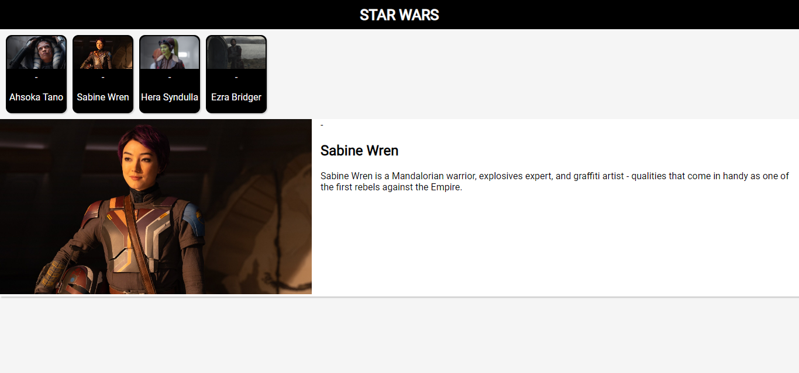

#### In this article, I delve into a crucial concept in React: passing a component identifier as a prop to dynamically render different HTML elements. To demonstrate, I created a Star Wars card component!

---


---

### Introduction

In this article, I cover a new React concept I learned, passing a component identifier as a prop to dynamically render different HTML elements.

I first saw this concept demonstrated during a React course I am currently working through taught by Maximilian Schwarzmüller, which, by the way, I can highly recommend because I am learning a lot by taking it: [React - The Complete Guide 2024 (incl. React Router & Redux)](https://www.udemy.com/share/101Wby3@eLkWc2ljW2ztZpvjUu1Yan2VdiS-x_uubp3S_dGOkD8sjTAx8MMyNa3tz1QF4UVf/)

**In this course, we are learning how to dynamically set a wrapper/container for a group of buttons. We achieve this by passing a component identifier as a value for a prop and then using this identifier inside of a component to dynamically render different HTML elements. We are told that this is another crucial React concept we should be aware of.**

But of course, this concept is best understood by being seen. Let's take a look. In the example below, instead of manually creating an HTML element as a container, we are passing in a prop called container so that we can dynamically create the container. So now we can pass in whatever HTML we want to render as a prop, such as a **section**, **article**, **div**, or, in this course's case, a **menu**.

```javascript
<Tabs container="menu" buttons={} />
```

```javascript
export default function Tabs({children, buttons, container}) {
    const Container = container;
    
    return (
        <>
            <Container>{buttons}</Container>
            {children}
        </>
    )
}
```

**So now, whatever string value you assign to the container variable gets rendered into an HTML element!**

---

### Pair programming with AI

*As a side note to fill you in, I am pushing my current knowledge boundaries by pair programming with the AI assistance of Hashnode's Rix. This seems fitting as a Generation X-born learning how to code in the year 2024 (the future is now)!*

So, what is Rix? Rix is an AI assistant provided by Hashnode to its Pro members. It is optimized to assist with various tasks such as pair programming, helping users push their knowledge boundaries, and aiding in learning how to code. Rix can also help with text editing tasks such as rephrasing and optimizing text and can engage in back-and-forth conversations.

By pair programming with Rix on this project, I'm also learning about best coding practices by writing dry code ( do not repeat yourself ) and structuring projects by creating separate files for functions and data. I will be covering what I am learning in upcoming articles.

---

### My Star Wars Card Component

Since I was impressed with the concept of dynamically rendering HTML elements as a container, I decided to get my hands dirty with some side project practice. So I thought, what better way to have some fun than by creating a Star Wars project?

So I started this Star Wars project with the intention of simply explaining how to dynamically render HTML elements through the means of passing props... and then down the rabbit hole, I went. Instead of a simple one-article React concept coverage article, this will now be a limited project article series! The article series will cover what I am learning by building a simple one-page Star Wars React website, which, so far, is a lot of React concepts!

**But first, for this first article, we will focus on the "dynamically rendering HTML elements by passing props" React concept.**

Below is my current Star Wars Card component, which I created by pair-programing with my AI assistant Rix*.* The component takes in a "**type**" value that will determine what HTML element to render as a container. So far, I am using this variable to create an HTML **article** element or a **div** element. I also intend to use this variable to create an HTML **header** element.

```javascript
function StarWarsCard({ type, contentType, contentProps, layout, theme, interaction }) {
    const Content = contentType;
    const Container = type;
    const Layout = layout;
    const Theme = theme;
    const Interaction = interaction;
  
    return (
      <Container className={`${Layout} ${Theme} ${Interaction}`}>
        <Content {...contentProps} />
      </Container>
    );
  }

  export default StarWarsCard;
```

#### Small card content

The **SmallCardContent** component is used to create an HTML **div element** container that contains a character card that displays an image and name. This component is passed into the main **StarWarsCard** component along with the props needed for the **SmallCardContent**.

```javascript
function SmallCardContent({name, image}){

    return (
        <div className="small-card">
            </img>
            <div>-</div>
            <p>{name}</p>
        </div>
    )
}

export default SmallCardContent;
```

**Initially, This process was a little confusing since I am accustomed to surrounding the components with each other, not passing them as values.**

*Additionally, I did run into an error when I tried to pass it as a component using component syntax as follows:*

```javascript
<StarWarsCard 
    type="div" 
    contentType={<SmallCardContent />} 
    contentProps={{name: character.name, image: character.image}} 
/> 
{/* This code creatd an error *
 "Element type is invalid: expected a string (for built-in components) or a class/function (for composite components) but got: object."
/}
```

In React, when you want to pass a component to another component, you need to pass the component *reference*, not an *instance* of the component. So, instead of passing `<SmallCardContent />`, you should pass `SmallCardContent`. The former creates an instance of the component, while the latter is a reference to the component function or class itself. The parent component can use this reference to create instances with different props.

The correct way to pass the **SmallCardContent** component is as follows:

```javascript
 <StarWarsCard 
     type="div" 
     contentType={SmallCardContent}
     contentProps={{name: character.name, image: character.image}} 
 />
```

#### Large card content

Once I got the small card component working, it was time to create the large card component. This component is similar to the small one, with the addition of a paragraph that includes information about the character.

**The overall goal of this project is to display the corresponding large card content when a user clicks on the small card character.**

Here is the code for the **LargeCardContent** component:

```javascript
function LargeCardContent({name, image, about}) {
    return (
        <div className="large-card">
            <div>
                </img>
            </div>
            <div className="about">
                <div>-</div>
                <h1>{name}</h1>
                <p>{about}</p>
            </div>
        </div>    
    )
}

export default LargeCardContent;
```

---

### React dynamic elements Star Wars cards

Here is my React website "[dynamic elements Star Wars cards](https://react-dynamic-elements-starwars-cards.netlify.app/)" project so far.

My goal for this project is to create a single-page Star Wars Ahsoka website containing small cards for *characters*, *vehicles*, *weapons*, and more. When a small card is clicked, the corresponding large card will display containing additional information.

*At the time of this article's release, there is no "onclick" functionality. However, as I continue to code out this project, it will be updated along with coverage articles.*



---

### Passing a Component Identifier as a Prop

To recap the main idea of this project, we're exploring how to dynamically determine the type of HTML element we want to use in our component. We achieve this by passing the name of the HTML element as a string prop.

While the technique we're discussing involves passing a component identifier as a prop to dynamically render different HTML elements, it's important to note that we're not creating new HTML elements from scratch. Instead, we're dynamically determining which existing HTML tag (like a div, section, or article) to use in a specific part of our component. By passing the name of the HTML element as a string prop, we can increase the flexibility and reusability of our components.

In React, this is a powerful way to increase the flexibility and reusability of our components. Instead of hardcoding the type of HTML element we want to use, we can pass it as a prop and let the component decide what to render based on that prop.

**Here's a simple example to illustrate this concept:**

```jsx
function DynamicElement({ elementType, children }) {
  const Element = elementType;

  return <Element>{children}</Element>;
}

// Usage
<DynamicElement elementType="div">This is a div</DynamicElement>
<DynamicElement elementType="section">This is a section</DynamicElement>
```

In this example, the `DynamicElement` component accepts an `elementType` prop, which is a string representing the type of HTML element we want to create. Inside the component, we assign this prop to a variable `Element`, and then use `Element` as a component in our JSX. This allows us to dynamically render different HTML elements based on the `elementType` prop.

This technique is very powerful and can drastically increase the flexibility of your components. It allows you to change the structure of your HTML without having to rewrite your components.

---

### Advance your career with a 20% discount on Scrimba Pro using this [affiliate link](https://scrimba.com/?via=MichaelLarocca)!

Become a hireable developer with Scrimba Pro! Discover a world of coding knowledge with full access to all courses, hands-on projects, and a vibrant community. You can [read my article](https://selftaughttxg.com/2021/06-21/06-07-21/) to learn more about my exceptional experiences with Scrimba and how it helps many become confident, well-prepared web developers!

###### ***Important:*** *This discount is for new accounts only. If a higher discount is currently available, it will be applied automatically.*

**How to Claim Your Discount:**
1. Click [the link](https://scrimba.com/?via=MichaelLarocca) to explore the new Scrimba 2.0.
2. Create a new account.
3. Upgrade to Pro; the 20% discount will automatically apply.

##### ***Disclosure:*** *This article contains affiliate links. I will earn a commission from any purchases made through these links at no extra cost to you. Your support helps me continue creating valuable content. Thank you!*

---

### Conclusion

This project has shed light on the powerful technique of dynamically rendering HTML elements in React by passing component identifiers as props. This method not only increases the flexibility of our components but also enhances their reusability.

By passing the name of the HTML element as a string prop, we can dynamically determine which existing HTML tag to use in a specific part of our component, be it a **div**, **section**, or **article**. This approach allows us to modify our HTML structure without having to rewrite our components.

Although we've covered this advanced React concept, this Star Wars project and article series is just getting started! While pair-programming with Hashnode's AI assistant Rix, I have also learned how to structure React projects by creating separate files for functions and data and refining my code to adhere to the best coding practices. I hope you will follow along with me on my React code learning journey in my upcoming article series!

---

**Let's connect! I'm active on** [**LinkedIn**](https://www.linkedin.com/in/michaeljudelarocca/) **and** [**Twitter**](https://twitter.com/MikeJudeLarocca)**.**

---

###### ***Are you now more familiar with the concept of dynamically rendering HTML elements in React by passing component identifiers as props? Are you ready to apply this technique in your own React projects for enhanced flexibility and reusability? Please share the article and comment!***
