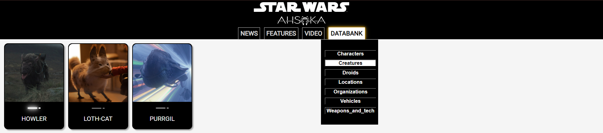
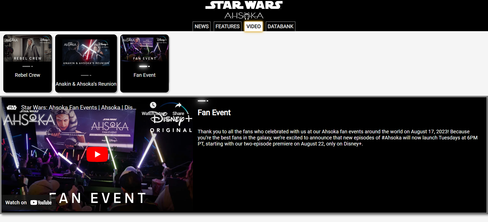

#### In this article, I continue building a React website with the help of my AI assistant! Learn how to add YouTube videos to your projects with the React YouTube library. It is easier than you'd think!

---


---

### **Introduction**

In this article, I will continue to cover React concepts I am learning by pair programming with AI to create a Star Wars Ahsoka website.

**This article will focus on adding YouTube videos to a React project. In addition, I covered adding a helper JavaScript file, including a "handleVideoClick**" **function. I also cover how I implemented the YouTube videos into my project, how I conditionally rendered the YouTube components, and some issues I ran into while incorporating it.**

---

#### *If you just need to know how to add a YouTube video to your React project, it's as easy as just installing the React YouTube library, and adding the YouTube component to your project passing in the video ID as a prop.*

```bash
npm install react-youtube
```

```javascript
<YouTube videoId={youtubeId} />
```

*If you've been following along with this article series or would like a more in-depth explanation of how to incorporate YouTube videos in React projects, feel free to continue reading this article!*

---

### Prerequisites

Building on the series of articles about creating a "Star Wars Ahsoka React website," understanding the implementation of **YouTube** videos requires familiarity with certain concepts. Please refer to my previous articles to understand the custom components and functions used.

**The prerequisites for creating the dropdown menu include:**

1. Familiarity with the **Menu** and **Navbar** components.
    
2. Familiarity with the **StarWarsCard, SmallCardContent**, and **LargeCardContent** components.
    
3. Understanding of the **mapItems** function used for generating multiple components.
    
4. Familiarity with the **Hamburger** menu component.
    

#### **Article series:**

* [Developing a Dynamic Hamburger Menu in React: A Step-by-Step Guide](https://selftaughttxg.com/2024/02-24/developing-a-dynamic-hamburger-menu-in-react-a-step-by-step-guide/)
    
* [Building a Dropdown Menu in React: A Step-by-Step Guide](https://selftaughttxg.com/2024/01-24/learn-to-use-component-identifiers-as-props-for-rendering-various-html-elements-dynamically/)
    
* [A Guide to Better Code Organiz](https://selftaughttxg.com/2024/01-24/learn-to-use-component-identifiers-as-props-for-rendering-various-html-elements-dynamically/)[ation in React through File Separation](https://selftaughttxg.com/2024/01-24/a-guide-to-better-code-organization-in-react-through-file-separation/)
    
* [Learn to Use Component Identifiers as Props for Rendering Vari](https://selftaughttxg.com/2024/01-24/a-guide-to-better-code-organization-in-react-through-file-separation/)[ous HTML Elements Dynamically](https://selftaughttxg.com/2024/01-24/learn-to-use-component-identifiers-as-props-for-rendering-various-html-elements-dynamically/)
    

---

### What is the React YouTube Library?

The [React YouTube library](https://www.npmjs.com/package/react-youtube) is a tool that makes adding YouTube videos to your React applications easy. It works like a bridge between the YouTube video platform and your React project, allowing you to use a component to embed and control YouTube videos directly on your web pages. With this library, all I need to do is install it, drop a YouTube component into your project, and tell it which video you want to show by giving it the video's ID.

*To further enhance the functionality and appearance of the embedded YouTube videos in your React application, the React YouTube Library offers the*`opts`*object. This feature provides a wide range of customizable options that adhere to the YouTube IFrame Player API specifications, allowing for a tailored viewing experience.*

**The**`opts`**object in the**`react-youtube`**component allows you to customize the YouTube player with various options. These options are derived from the YouTube IFrame Player API and can include:**

* `height`: The height of the player.
    
* `width`: The width of the player.
    
* `playerVars`: An object containing player parameters such as:
    
    * `autoplay`: Automatically start playback of the video. Values: 0 or 1.
        
    * `cc_load_policy`: Force closed captions to appear. Values: 1.
        
    * `color`: Change the video player's color. Values: 'red' or 'white'.
        
    * `controls`: Determine whether video controls are displayed. Values: 0, 1, or 2.
        
    * `disablekb`: Disable the keyboard controls. Values: 0 or 1.
        
    * `enablejsapi`: Enable the player to be controlled via IFrame or JavaScript Player API calls. Values: 0 or 1.
        
    * `end`: Specify the time, measured in seconds from the start of the video, when the player should stop playing the video.
        
    * `fs`: Display the fullscreen button. Values: 0 or 1.
        
    * `iv_load_policy`: Show or hide video annotations. Values: 1 or 3.
        
    * `loop`: Loop the video. Values: 0 or 1.
        
    * `modestbranding`: Prevent the YouTube logo from displaying in the control bar. Note: A small YouTube text label will still display in the upper-right corner of a paused video when the user's mouse pointer hovers over the player.
        
    * `origin`: This provides extra security for IFrame API. It should be set to your domain.
        
    * `playlist`: Additional videos to play after the first specified by `videoId`.
        
    * `playsinline`: Play the video inline on iOS. Values: 0 or 1.
        
    * `rel`: Show related videos at the end of the video. Values: 0 or 1.
        
    * `showinfo`: Show video info (deprecated).
        
    * `start`: Specify the time, measured in seconds from the start of the video, to start playing.
        

Please note that YouTube may update or change these parameters, so it's a good idea to refer to the [official YouTube IFrame Player API documentation](https://developers.google.com/youtube/iframe_api_reference) for the most current information and additional parameters.

---

### Adding YouTube to my data file

I added a YouTube object array consisting of **name**, **image**, **about**, and **youtubeId** keys to implement YouTube videos to my Star Wars Ahsoka React project. With this method, I can use my previously created mapping function to render the YouTube videos in conjunction with my **SmallCardContent** and **LargeCardContent** card components.

**Note:** I also had to add the **youtube** object array to the export.

```javascript
// YouTube
import RebelCrewFeaturette from './images/youtube/RebelCrewFeaturette.jpg';
import AnakinAndAhsokasReunion from './images/youtube/AnakinAndAhsokasReunion.jpg';
import Fan_Event_Ahsoka from './images/youtube/Fan_Event_Ahsoka.jpeg';

const youtube = [
    {
        name: 'Ahsoka Tano',
        image: RebelCrewFeaturette,
        about: `“This is provocative, exciting, and fun. I can’t wait for people to watch it.” - Rosario Dawson. Stream the first two episodes of #Ahsoka, a Star Wars Original series, now only on Disney+.`,
        youtubeId: 'NvnNl9s9aCk'
    },
    {
        name: 'Anakin & Ahsoka’s Reunion',
        image: AnakinAndAhsokasReunion,
        about: `Join Rosario Dawson and Hayden Christensen as they go behind the scenes of Ahsoka and Anakin's reunion. Episode 5 of #Ahsoka is now streaming on Disney+ with new episodes on Tuesdays at 6PM PT.`,
        youtubeId: 'U5yRu7UKwfc'
    },
    {
        name: 'Fan Event',
        image: Fan_Event_Ahsoka,
        about: `Thank you to all the fans who celebrated with us at our Ahsoka fan events around the world on August 17, 2023! Because you’re the best fans in the galaxy, we’re excited to announce that new episodes of #Ahsoka will now launch Tuesdays at 6PM PT, starting with our two-episode premiere on August 22, only on Disney+.`,
        youtubeId: 'kjL_KhKuXBg'
    }
]

export { characters, creatures, droids, locations, organizations, vehicles, weapons_and_tech, youtube };
```

💡 **Tip:** *To get the YouTube "****video thumbnails****," I copied the name of each YouTube video and used a Google image search. I then saved the YouTube thumbnail images to my images folder and imported them into my data file.*

---

### Rendering the YouTube component

Incorporating the YouTube component into my project involves utilizing the **LargeCardContent** component. By adding a **youtubeId** prop and implementing conditional logic, I ensure the **YouTube component** is displayed only when a valid **youtubeId** is provided.

Given that the **LargeCardContent** component is also utilized for content unrelated to videos, I've implemented conditional logic to add or remove a '**ctn-youtube**' class. This ensures the layout remains consistent, regardless of whether the content includes a YouTube video or not.

```javascript
import YouTube from 'react-youtube';
import Lightsaber from './Lightsaber';

function LargeCardContent({name, image, about, isSelected, youtubeId}) {
    return (
        <div className="large-card">
            <div className={youtubeId ? "ctn-youtube": null}>
                {!youtubeId && </img>}
                {youtubeId && <YouTube videoId={youtubeId} className='youtube'/>}
            </div>
            <div className="about">
                <Lightsaber isActive={true} />
                <h1>{name}</h1>
                <p>{about}</p>
            </div>
        </div>    
    )
}

export default LargeCardContent;
```

---

### Excluding YouTube from the Menu component

My **Menu component** renders **HTML buttons** for each category in my data file. Since I added the YouTube category, it was initially rendered unintentionally.



**To exclude the newly added YouTube category from my Menu component, I added a filter as follows:**

```javascript
export default function Menu({ setSelectedCategory, categories }) {
    return (
        <menu>
            {Object.keys(categories).filter(category => category !== 'youtube').map(category => (
                <button key={category} onClick={() => setSelectedCategory(categories[category])}>
                    {category.charAt(0).toUpperCase() + category.slice(1)}
                </button>
            ))}               
        </menu>
    )
}
```

---

### The handleVideoClick function

The "**handleVideoClick**" function is designed to update the application's state to reflect the selected YouTube video category. When a user clicks on the "**VIDEO**" button, this function is triggered, setting the `selectedCategory` state to the YouTube category from your `categories` object. This action causes the app to re-render and display YouTube video content based on the newly selected category, allowing users to interact with and view the YouTube videos associated with that category.

```javascript
export default function handleVideoClick({categories, setSelectedCategory}) {
    setSelectedCategory(categories.youtube);
}
```

*Initially, I wrote this function twice, once in the Navbar component and once in the Hamburger menu component. So, thinking about clean code practices, I consulted my AI assistant Rix to see if I could create a separate file for this function, including what to name it, where to put it, and what kind of file it should be. And I must say, refactoring it was not as easy as I thought, and it created more questions!*

**Refactoring questions:**

* Why create a **helper.js** file instead of a **helper.jsx** file?
    
* If I'm passing props as a value, why does it work in JavaScript?
    
* If I'm moving the **handleVideoClick** function into the **helper.js file**, why not also the **handleClick** function?
    
* Why use an **anonymous function** with the **handleVideoClick** function and not the **handleClick**?
    

#### JavaScript file?

In refactoring my code to follow best coding practices, my AI assistant told me to create a JavaScript file named **helper.js** and move my **handleVideoClick** function there. But why a JavaScript file and not a JSX file? Although the JavaScript file seems out of place in a React project to me, my AI assistant explains that it is common. So, at this point, I will just take the AI's word for it.

#### Are they props or parameters?

So now I have a JavaScript file with a function named **handleVideoClick** that takes two parameters, **categories** and **setSelectedCategory**. But aren't these **parameters** actually **props** in my React project?

**So, when I asked my AI assistant if categories and setSelectedCategory are parameters or props, here is the explanation I received:**

*"In the context of your project,*`categories`*and*`setSelectedCategory`*serve dual roles as both props and parameters, depending on where and how they are used. When passed into your components (*`Navbar`*,*`HamburgerMenu`*) through their props, they are indeed considered props. These props are objects that your components receive from their parent components in the React tree."*

*"When you use*`categories`*and*`setSelectedCategory`*inside the*`handleVideoClick`*function, they are parameters of that function. This function is defined to accept an object that destructures into*`categories`*and*`setSelectedCategory`*. So, in this specific context within the*`handleVideoClick`*function, they are parameters."*

***"The distinction comes from their usage: in the components, they are props because they are passed into the components by their parents. In the***`handleVideoClick`***function, they are parameters because they are inputs to the function when it is called***\*."\*

#### Why can't I put the handleClick function in my helper.js file?

So now that I created a helper.js file for my functions, why can't I move my **handleClick** function into it? In this case, this is a boolean function that directly manipulates the state of my component. Here is the AI's detailed explanation:

*"The*`handleClick`*function directly manipulates the state of the*`HamburgerMenu`*component by toggling the*`isActive`*state. Since this state is internal to the*`HamburgerMenu`*component and directly influences its behavior and presentation (such as showing or hiding the dropdown menu), it's essential for*`handleClick`*to remain within the component. Moving it to a separate utility file like*`helper.js`*would abstract away the direct manipulation of the component's state, making the component's logic less clear and potentially complicating the state management. Furthermore, React's useState hook, which provides the*`isActive`*state and its setter function*`setIsActive`*, is designed to be used within the body of a functional component, not outside in separate utility files."*

#### Why use an anonymous function with my handleVideoClick function?

To open up my hamburger menu, I have an **onclick** event that triggers my **handleClick** boolean function. As you can see in the code block below, I directly assign **handleClick** for it to work.

```javascript
<div className="hamburger-menu" onClick={handleClick}>
```

But to get my **handleVideoClick** function to work as expected, I can not directly assign it; it needs an anonymous function to assign it.

```javascript
<div className="navbar-buttons" onClick={() => handleVideoClick({ categories, setSelectedCategory })}>VIDEO</div>
```

***So once again, so that I can better understand why and how this works, I conversed with my AI assistant as follows:***

**My Question:** It looks like I'm using an anonymous function to call an imported function. Can I remove the anonymous function and just use the imported function like this: onClick={handleVideoClick({ categories, setSelectedCategory })}

**AI Answer:** No, you should not directly invoke the handleVideoClick function like that in the onClick attribute because it will be executed immediately when the component renders, not when the button is clicked. Keeping the anonymous function to wrap the call to handleVideoClick ensures that the function is called only in response to the click event.

**My Question:** But they are both using onClick events. So I'm still confused.

**AI Answer:** The key difference lies in how the functions are defined and used. In the case of handleClick, it is a function directly defined within the same component, so passing it as onClick={handleClick} sets it up to be called when the event occurs. This is a direct reference to the function.

For handleVideoClick, you are attempting to pass it arguments ({ categories, setSelectedCategory }). If you were to write onClick={handleVideoClick({ categories, setSelectedCategory })}, it would call handleVideoClick immediately upon rendering, not upon the click event. By wrapping it in an anonymous function () =&gt; handleVideoClick({ categories, setSelectedCategory }), you ensure that handleVideoClick is called with the specified arguments only when the click event occurs, not at the time of rendering.

---

### **The project so far**

**Here are the links to the project:**

* [GitHub repo](https://github.com/MichaelLarocca/react-dynamic-elements-starwars-cards)
    
* [Netlify deployed project](https://react-dynamic-elements-starwars-cards.netlify.app/)
    



---

### **My other articles in this series**

1. [Learn to Use Component Identifiers as Props for Rendering Various HTML Elements Dynamically](https://selftaughttxg.com/2024/01-24/learn-to-use-component-identifiers-as-props-for-rendering-various-html-elements-dynamically/)
    
2. [A Guide to Better Code Organization in React through File Separation](https://selftaughttxg.com/2024/01-24/a-guide-to-better-code-organization-in-react-through-file-separation/)
    
3. [Building a Dropdown Menuin React: A Step-by-Step Guide](https://selftaughttxg.com/2024/01-24/building-a-dropdown-menu-in-react-a-step-by-step-guide/)
    
4. [Developing a Dynamic Hamburger Menu in React: A Step-by-Step Guide](https://selftaughttxg.com/2024/02-24/developing-a-dynamic-hamburger-menu-in-react-a-step-by-step-guide/)
    
---

### **Conclusion**

Adding YouTube videos to your React projects is easy with the React YouTube library. Simply install the library, add the YouTube component along with the YouTube ID to the video you want, and you're done!

If you want to use more robust features, the React YouTube Library enhances the functionality and appearance of embedded YouTube videos in React applications with the `opts` object. This feature offers a wide range of customizable options following the YouTube IFrame Player API specifications for a tailored viewing experience.

For my Star Wars React Ahsoka project, incorporating YouTube videos presented challenges, such as ensuring the YouTube category was excluded from the Menu component and effectively utilizing the `handleVideoClick` function. These issues were resolved by applying a filter to exclude the YouTube category from rendering in the Menu and by refactoring the `handleVideoClick` function into a separate JavaScript file for cleaner code and better reusability across components. Additionally, understanding the distinction between props and parameters and the use of anonymous functions for event handling was key to integrating the React YouTube library effectively.

The React YouTube library is a great option for adding YouTube videos to your React projects. Plus, if you need assistance integrating it, consulting AI can provide the coding help you need and explain why and how the code works, ultimately making you a better React developer!

---