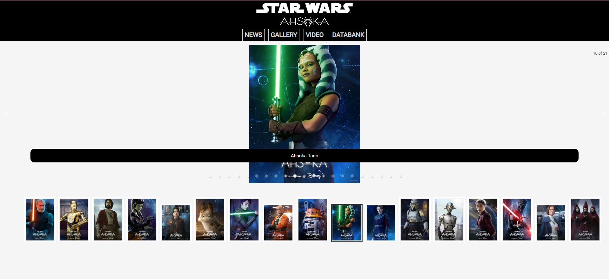
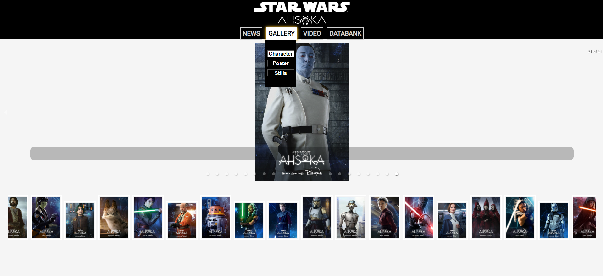

#### In this article, I continue building a React website with the help of my AI assistant! Learn how to add a Carousel to your projects with the React Responsive Carousel library. Easier than anticipated!

---


---

### **Introduction**

In this article, I will continue covering React concepts I am learning through pair programming with AI to create a Star Wars Ahsoka website.

**This article will focus on adding an image carousel to a React project.**

I will also discuss how I implemented the React image carousel in my project, how I conditionally rendered it, and some challenges I faced while integrating it.

---

***If you just need to know how to add an Image carousel to your React project, it's as easy as just installing the React Responsive Carousel and adding the Carousel component to your project, adding the source to the images you want to add.***

To add a Carousel component to your React project using the React Responsive Carousel library, follow these simple steps:

1. **Install the React Responsive Carousel library by running:**
    
```bash
npm install react-responsive-carousel
```

2. **Import the Carousel component and its styles in your React file:**
    
```javascript
import { Carousel } from 'react-responsive-carousel';
import 'react-responsive-carousel/lib/styles/carousel.min.css'; // requires a loader
```

3. **Add the Carousel component to your project and pass in the desired props:**
  
```javascript
<Carousel>
    <div>
        
        <p className="legend">Image 1</p>
    </div>
    <div>
        
        <p className="legend">Image 2</p>
    </div>
    <div>
        
        <p className="legend">Image 3</p>
    </div>
</Carousel>
```

**This setup will include a basic carousel in your project with three slides. Adjust the**`src`**attributes to the paths of your images and modify the content as needed.**

*If you've been following along with this article series or would like a more in-depth explanation of how to incorporate an image Carousel in React projects, feel free to continue reading this article!*

---



---

### **Prerequisites**

Building on the series of articles about creating a "Star Wars Ahsoka React website," understanding the implementation of an image **carousel** requires familiarity with certain concepts. Please refer to my previous articles to understand the custom components and functions used.

**The prerequisites for creating the carousel include:**

1. Familiarity with the custom **Menu** and **Navbar** components.

2. Familiarity with the **Hamburger** menu component.

#### **Article series:**

* [How to Integrate YouTube Videos into React Applications](https://selftaughttxg.com/2024/03-24/how-to-integrate-youtube-videos-into-react-applications/)

* [Developing a Dynamic Hamburger Menu in React: A Step-by-Step Guide](https://selftaughttxg.com/2024/02-24/developing-a-dynamic-hamburger-menu-in-react-a-step-by-step-guide/)

* [Building a Dropdown Menu in React: A Step-by-Step Guide](https://selftaughttxg.com/2024/01-24/learn-to-use-component-identifiers-as-props-for-rendering-various-html-elements-dynamically/)

* [A Guide to Better Code Organiz](https://selftaughttxg.com/2024/01-24/learn-to-use-component-identifiers-as-props-for-rendering-various-html-elements-dynamically/)[ation in React through File Separation](https://selftaughttxg.com/2024/01-24/a-guide-to-better-code-organization-in-react-through-file-separation/)

* [Learn to Use Component Identifiers as Props for Rendering Vari](https://selftaughttxg.com/2024/01-24/a-guide-to-better-code-organization-in-react-through-file-separation/)[ous HTML Elements Dynamically](https://selftaughttxg.com/2024/01-24/learn-to-use-component-identifiers-as-props-for-rendering-various-html-elements-dynamically/)

---

### What is the React Responsive Carousel Library?

The React Responsive Carousel library is a component that simplifies the integration of carousels into React applications. It acts as a seamless bridge between your React project and dynamic carousel functionalities, allowing you to easily embed and manage image slideshows or content carousels directly within your web pages. With this library, you only need to install it, insert a Carousel component into your project, and configure it with the images or content you wish to display.

The React Responsive Carousel Library offers numerous customizable options that enhance the functionality and appearance of your carousels in React applications. These options allow you to create a personalized, interactive experience.

**The Carousel component in the React Responsive Carousel library allows you to customize the carousel with various properties. These properties include:**

* **showArrows**: Whether to display navigation arrows. Values: true or false.
  
* **showStatus**: Show the current status of the slides. Values: true or false.

* **showIndicators**: Whether to display navigation indicators. Values: true or false.

* **infiniteLoop**: Enable infinite looping of slides. Values: true or false.

* **useKeyboardArrows**: Use keyboard arrows to navigate between slides. Values: true or false.

* **autoPlay**: Automatically cycle through slides. Values: true or false.

* **stopOnHover**: Stop cycling slides when the mouse hovers over the carousel. Values: true or false.

* **interval**: The interval at which the slides should switch in milliseconds.

* **transitionTime**: The duration of the transition between slides in milliseconds.

* **swipeable**: Allow swiping gestures to navigate slides on touch-enabled devices. Values: true or false.

* **dynamicHeight**: Adjust the carousel's height to the current slide's height. Values: true or false.

* **emulateTouch**: Enable swipe on non-touch devices. Values: true or false.

**Note:** The creator no longer maintains this library. Be sure to read the documentation to learn more about the [react-responsive-carousel](https://www.npmjs.com/package/react-responsive-carousel).

---

### Why did I choose this carousel library?

I consulted my Hashnode AI assistant and inquired about options for adding a carousel to my React project. Although the React Responsive Carousel is no longer maintained by its creator, it was a "user-friendly" carousel that can be easily implemented.

Since I knew it was going to take some effort to implement an image carousel into my project with the functionality I wanted, controlling it from the Navbar and Hamburger menu components, I opted for an easy one to work with.

---

### My Carousel Menu component

At first, to follow best coding practices, I tried using my premade Menu component to render the image category options: character, poster, and stills. Since I already had to add a filter to remove the "video" category that accesses YouTube videos, I realized I would now also have to filter out the three image categories.

So, I once again consulted my AI assistant to determine whether I needed to modify my Menu component or create a new one for the carousel. Indeed, it was time to create a new component.

*Something I noticed when learning React: Even though I know how to write working code, it is still difficult to determine when to modify a component for multiple uses and when to write a separate component.*

Pair programming with my AI assistant, I provided the context of my previously created Menu component to help create similar functionality for the Carousel Menu component.

#### Carousel Menu component

```javascript
import { carousel_character, carousel_poster, carousel_stills } from "../data.js";

export default function CarouselMenu({ setSelectedCategory, setShowCarousel }) {
    const categoriesMap = {
        character: carousel_character,
        poster: carousel_poster,
        stills: carousel_stills
    };

    const handleCategoryChange = (category) => {
        setSelectedCategory(categoriesMap[category] || categoriesMap['character']);
        setShowCarousel(true);
    };

    return (
        <menu>
            {Object.keys(categoriesMap).map((category) => (
                <button className="button-sw"
                    key={category}
                    onClick={() => handleCategoryChange(category)}
                >
                    {category.charAt(0).toUpperCase() + category.slice(1)}
                </button>
            ))}
        </menu>
    );
}
```

### Understanding the CarouselMenu Component

The `CarouselMenu` component is designed to allow users to switch between different categories of images, such as characters, posters, and stills. Here’s a breakdown of how this component works, making it easier for users to navigate and control what content they wish to view.

#### Importing Data

Firstly, the component imports specific datasets from a `data.js` file. These datasets are named `carousel_character`, `carousel_poster`, and `carousel_stills`, each representing a different category of images.

#### Component Setup

The `CarouselMenu` is a functional component that receives two functions as props: `setSelectedCategory` and `setShowCarousel`. These functions are used to update the state in the parent component, controlling which category of images is displayed and whether the Carousel should be shown.

#### Category Mapping

Inside the component, a `categoriesMap` object is created. This object maps string keys ('character', 'poster', 'stills') to the corresponding datasets imported earlier. This mapping facilitates easy access to the data based on user selection.

#### Handling Category Changes

The `handleCategoryChange` function is crucial for interactivity. When a user clicks on one of the buttons in the menu, this function is triggered. It takes the `category` as an argument, which corresponds to the button clicked by the user. The function then does two things:

* It calls `setSelectedCategory` with the data associated with the selected category, updating the state in the parent component to reflect the new category of images to display.

* It sets `setShowCarousel` to `true`, ensuring that the Carousel is visible whenever a category is selected.

#### Rendering the Menu

The component returns a `<menu>` element containing buttons for each category. These buttons are dynamically generated using `Object.keys(categoriesMap).map(...)`, which creates an array of keys from `categoriesMap` and maps over it to create a button for each category. Each button has an `onClick` event that triggers `handleCategoryChange` with the category as its parameter. The button labels are formatted to capitalize the first letter of each category name for better readability.

*This setup enhances the user experience by providing straightforward navigation and keeping the interface clean and focused, allowing for seamless interaction with different data segments within the Carousel.*

---

### The Navbar Component

The Navbar component handles all of the App's functionality, including displaying selections from the categories menu, YouTube videos, and now images from the React Carousel.

**To focus on the React Carousel, here is a consolidated version of my Navbar component for better observation:**

```javascript
import { useState } from "react";
import CarouselMenu from "./CarouselMenu";

function Navbar({ setSelectedCategory, setShowCarousel, carousel }) {
    const [isGalleryVisible, setGalleryVisible] = useState(false);

    return (
        <nav>
            <div className="flex-col">
                <div className="flex ctn-navbar">
                    <div
                        className="navbar-buttons desktop-menu"
                        onMouseEnter={() => setGalleryVisible(true)}
                        onMouseLeave={() => setGalleryVisible(false)}
                    >
                        GALLERY
                        {isGalleryVisible && (
                            <div className="dropdown-menu dropdown-menu-carousel">
                                <CarouselMenu
                                    setSelectedCategory={setSelectedCategory}
                                    setShowCarousel={setShowCarousel}
                                    carousel={carousel}
                                />
                            </div>
                        )}
                    </div>
                </div>
            </div>
        </nav>
    );
}

export default Navbar;
```

### Key Points:

* **Dynamic Visibility:** The `isGalleryVisible` state controls the visibility of the carousel menu. It is toggled by mouse events (`onMouseEnter`, `onMouseLeave`) on the "GALLERY" button. This approach provides a user-friendly way to display the carousel only when needed, reducing clutter and enhancing UI responsiveness.

* **Carousel Menu Integration:** When the "GALLERY" section is active (i.e., `isGalleryVisible` is true), the `CarouselMenu` component is rendered. This component is crucial for handling the selection of different image categories to be displayed in the carousel.

* **Interaction Handlers:** The `CarouselMenu` is passed `setSelectedCategory` and `setShowCarousel` functions as props. These functions are used within `CarouselMenu` to update the application's state based on user interactions, such as selecting a specific category from the carousel menu.

This setup ensures that the Navbar component effectively integrates with the carousel functionality, providing a seamless and interactive user experience.

---

### The Hamburger Menu Component

This section will explore, in a similar consolidated manner, how the Carousel is integrated and functions within the Hamburger Menu component.

#### Component Structure and State Management

The Hamburger Menu uses several state variables to control the visibility of its contents:

* `isActive`: Determines if the hamburger menu is active.

* `isCarouselVisible`: Controls the visibility of the Carousel options within the menu.

```javascript
const [isActive, setIsActive] = useState(false);
const [isCarouselVisible, setCarouselVisible] = useState(false);
```

#### Effects for Dynamic UI Adjustments

The component utilizes React's `useEffect` to handle dynamic changes in the UI based on the `isActive` state. When the hamburger menu is activated, it ensures that other interactive elements like the Databank and Carousel menus are reset to their default hidden state.

```javascript
useEffect(() => {
    if (isActive) {
        setDatabankVisible(false);
        setCarouselVisible(false); // Closes the Carousel menu when the hamburger is toggled
    }
}, [isActive]);
```

#### Carousel Visibility Toggle

The Hamburger Menu includes an interactive section specifically for the "GALLERY" which, upon interaction, toggles the visibility of the `CarouselMenu`. This is managed by mouse events (`onMouseEnter` and `onMouseLeave`) that set the `isCarouselVisible` state. This approach provides a user-friendly way to access the carousel only when needed, enhancing the application's usability and interface cleanliness.

```javascript
<div
    className="navbar-buttons"
    onMouseEnter={() => setCarouselVisible(true)}
    onMouseLeave={() => setCarouselVisible(false)}
>
    GALLERY
    {isCarouselVisible && (
        <CarouselMenu
            setSelectedCategory={setSelectedCategory}
            setShowCarousel={setShowCarousel}
        />
    )}
</div>
```

#### Functionality and User Interaction

The `handleClick` function toggles the `isActive` state of the hamburger menu, which in turn controls the overall visibility of the dropdown menu items. Additionally, the `toggleCarousel` function provides a method to explicitly toggle the carousel's visibility, further enhancing the interactive capability of the menu.

```javascript
function handleClick() {
    setIsActive(!isActive);
}
```

*This setup in the Hamburger Menu ensures that the Carousel functionality is seamlessly integrated, providing a compact yet effective user interface for navigating various sections of the application.*

---

### The Menu Component

Here's a focused version of the code regarding how the React carousel is managed within the Menu component. Essentially, the React carousel is hidden when a user selects a category that is not in the carousel:

```javascript
function Menu({ setSelectedCategory, setShowCarousel, categories }) {
    return (
        <menu>
            {Object.keys(categories)
                .filter((category) => category !== "youtube")
                .map((category) => (
                    <button className="button-sw"
                        key={category}
                        onClick={() => {
                            setSelectedCategory(categories[category]);
                            setShowCarousel(false);
                        }}
                    >
                        {category.charAt(0).toUpperCase() + category.slice(1)}
                    </button>
                ))}
        </menu>
    );
}
```

### Key Functionality:

* **Filtering Categories**: The Menu filters out specific categories (e.g., 'youtube') to tailor the buttons displayed. This ensures that only relevant categories are included for user interaction.

* **Button Dynamics**: Each button is dynamically created based on the categories available, excluding those filtered out. The button text is capitalized for better readability and aesthetic appeal.

* **State Management**: When a button is clicked, two critical functions are invoked:

    * `setSelectedCategory(categories[category])`: This function updates the state to reflect the selected category, which determines the data or images displayed in the carousel or other components.

    * `setShowCarousel(false)`: This function controls the visibility of the carousel, allowing the application to hide the carousel when it is not needed or when categories unrelated to images are selected.

*This setup enhances the application's interactivity and ensures that the user interface remains clean, focused, and responsive to user inputs.*

---

### Implementing the React Carousel in the Main App Component

In the main `App` component of the React application, the integration of the React Responsive Carousel plays a significant role in enhancing the dynamic presentation of content. Here's an overview of how the carousel is implemented and functions within this component:

#### State Management for Carousel Visibility

The `App` component manages several state variables, but key to the carousel's functionality are `showCarousel` and `selectedCategory`. The `showCarousel` state determines whether the carousel should be displayed, while `selectedCategory` holds the data for the items to be shown in the carousel.

```javascript
const [showCarousel, setShowCarousel] = useState(false);
const [selectedCategory, setSelectedCategory] = useState(characters);
```

#### Conditional Rendering of the Carousel

The carousel is conditionally rendered based on the `showCarousel` state. If `showCarousel` is `true`, the carousel is displayed; otherwise, other components like `StarWarsCard` are shown. This approach allows for a flexible and user-driven display, toggling between the carousel and other content views.

```javascript
{showCarousel && (
    <Carousel className="ctn-carousel">
        {selectedCategory && selectedCategory.map((item) => (
            <div key={item.name}>
                
                <p className="legend">{item.name}</p>
            </div>
        ))}
    </Carousel>
)}
```

#### Carousel Content Dynamics

The content of the carousel is dynamically generated from the `selectedCategory`. Each item in the selected category is mapped to a slide in the carousel, displaying an image and a caption (`name`). This dynamic mapping ensures that the carousel is always up-to-date with the selected category's content.

#### Interaction with Navbar

The `Navbar` component interacts with the `App` component by setting the `selectedCategory` and toggling the `showCarousel` state. This setup illustrates a clear separation of concerns where the `Navbar` serves as a control panel, influencing how and what content is displayed in the main view.

```javascript
<Navbar
    categories={categories}
    setSelectedCategory={setSelectedCategory}
    setShowCarousel={setShowCarousel}
/>
```

*This design pattern in the*`App`*component ensures that the carousel not only enhances the visual appeal of the application but also provides a seamless and interactive user experience.*

---

### Problems I Ran Into

Initially, I wanted to rearrange the carousel thumbnails to display above the images. Through multiple attempts, I was unsuccessful. I first tried to go into the React Carousel component itself, but to my confirmed suspicion, my AI assistant informed me my code changes would be overwritten if I updated the React Carousel library in my project!

My CSS file was my second attempt to rearrange the carousel thumbnails to display above the images. However, even with AI assistance, I could not rearrange the structure of the React Carousel component. So, I decided to leave well enough alone.

Another issue I ran into was with the styling of the React Carousel component. Since this was my first time working with a pre-made carousel, I did not think too much of it at first; it just seemed a little clunky. Not only did the "sliding" feature not work too well, but I noticed that both left and right carousel buttons were centered in the middle; both left and right carousel buttons should be on the sides of the displayed image.

Sure enough, my suspicions were once again correct. This time, my own CSS code was interfering with the React Carousel. I was able to troubleshoot the problem by first remarking my CSS file so only the React Carousel library's CSS was active. With my CSS file removed, I was able to clearly see the intended appearance and functionality of the React Carousel component.

**My CSS mistake was targeting the HTML Button Element itself, which unintentionally broke the React Carousel component. I resolved the problem by creating and targeting a new class instead of the HTML Button Element itself.**

#### The CSS code was initially:

```css
button {
	margin: 3px;
	padding: 0;
	width: 100%;
	background-color: black;
	color: white;
	font-weight: bold;
	font-size: xx-large;
}
```

#### I updated the code to:

```css
.button-sw {
	margin: 3px;
	padding: 0;
	width: 100%;
	background-color: black;
	color: white;
	font-weight: bold;
	font-size: xx-large;
}
```

I also struggled with resizing the images displayed in the React Carousel component. It appears that the default size matches the largest image you provide. In my case, the largest image set the Carousel's height to nearly the full size of the screen!

**I was able to adjust the height of the React Carousel component correctly and the images within it without distortion by applying the CSS rules to ".carousel .slide img," setting max-height to the desired value, and using object-fit: contain to ensure the scale of the image properly within their containers.**

```css
.carousel .slide img {
	max-height: 350px;
	object-fit: contain; 
}
```

The final issue I ran into was my dropdown menus breaking due to expanding on top of the React Carousel component. You could no longer select new categories from the menus because they conflicted with the carousel; user clicks were now only recognized by the carousel component.

**I resolved the conflict between the dropdown menu and the carousel component by setting the menu's z-index to 1 and the carousel component's z-index to 0.**

---

### **The project so far**

**Here are the links to the project:**

* [GitHub repo](https://github.com/MichaelLarocca/react-dynamic-elements-starwars-cards)
    
* [Netlify deployed project](https://react-dynamic-elements-starwars-cards.netlify.app/)
    


---

### My other articles in this series

1. [Learn to Use Component Identifiers as Props for Rendering Various HTML Elements Dynamically](https://selftaughttxg.com/2024/01-24/learn-to-use-component-identifiers-as-props-for-rendering-various-html-elements-dynamically/)

2. [A Guide to Better Code Organization in React through File Separation](https://selftaughttxg.com/2024/01-24/a-guide-to-better-code-organization-in-react-through-file-separation/)

3. [Building a Dropdown Menu in React: A Step-by-Step Guide](https://selftaughttxg.com/2024/01-24/building-a-dropdown-menu-in-react-a-step-by-step-guide/)

4. [Developing a Dynamic Hamburger Menu in React: A Step-by-Step Guide](https://selftaughttxg.com/2024/02-24/developing-a-dynamic-hamburger-menu-in-react-a-step-by-step-guide/)

5. [How to Integrate YouTube Videos into React Applications](https://selftaughttxg.com/2024/03-24/how-to-integrate-youtube-videos-into-react-applications/)

---

### Conclusion

Adding an image carousel to your projects can visually enhance them, and the React Responsive carousel library makes it simple to implement! Just install it, add the Carousel component to your project, and pass in your images along with any other optional parameters.

Although its creator no longer maintains this library, it's a great first-time choice when building beginner projects.

Now, implementing the carousel in my project was somewhat challenging because I chose to control it using my custom dropdown menus. These difficulties stemmed from my design layout rather than the React carousel component itself.

Through trial and error, along with help from my AI assistant, I resolved all of the issues and successfully implemented the React carousel so that it worked as expected.

What I learned is that you are not supposed to change or add code directly in React components you install because your alterations will be overwritten! Instead, in the case of the React Carousel component, all fine-tuning modifications were successful by writing CSS code. However, keep in mind that the React Carousel comes with its own CSS file, and you can avoid code conflicts by adding class names and avoiding targeting HTML elements directly, as I initially did!

---

###### *Are you now equipped to integrate a carousel into your React projects using the React Responsive Carousel library? Have you encountered similar challenges in your projects? Please share the article and comment!*
