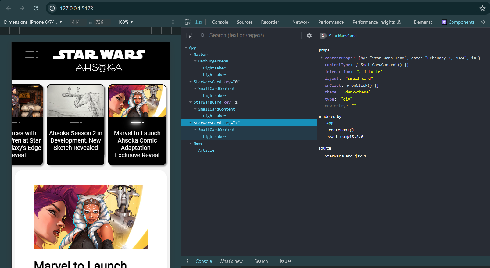
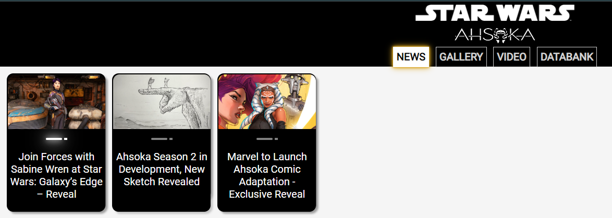
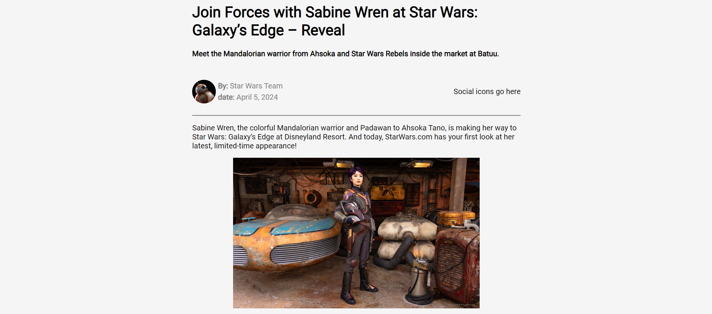

---

#### Join me as I continue building a React website with the help of my AI assistant! This installment focuses on developing a dynamic News component that renders varying HTML layouts based on object data.

---


---

### **Introduction**

In this article, I will continue covering React concepts I am learning through pair programming with AI to create a Star Wars Ahsoka website, focusing on building a flexible React component for dynamic HTML layouts.

**I will explain how I created and used a News component to display articles with varying HTML paragraphs and images based on conditions.**

I'll also cover the conditional rendering process and the challenges I faced during integration.

---

### Article Concept Overview

#### The problem:

Hardcoded HTML structures in React components are inflexible and cannot accommodate varying content layouts, such as different combinations of paragraphs and images.

#### The solution:

Create a dynamic React component that renders HTML elements based on object data, allowing flexible and adaptable content layouts.

---

### **Hardcoded Components**

Until now, the HTML structure inside the React components I create has been hardcoded. Components such as website headers and footers have a pretty solid and stationary HTML structure, so I had no issues in creating them.

But when I tried to design a "News" component inspired by articles displayed on the Star Wars website, I realized that each article's body structure varies! For example, one article's body might have three paragraphs, an image, and a fourth paragraph, while another might have one paragraph, an image, and then five more paragraphs.

A hardcoded HTML structure in a React component won't work if the content varies. The solution is a component that dynamically renders HTML elements.

**Examine the two news article examples below with different paragraph structures:**

* **Left:** 2 paragraph tags &lt;p&gt;, 1 image tag &lt;img&gt;
    
* **Right:** 5 paragraph tags &lt;p&gt;, 1 image tag &lt;img&gt;
    


***These examples clearly illustrate the need for a dynamic approach to rendering HTML elements in React components.***

---

### **Dynamically Rendered Component**

My solution for handling varying HTML content layouts is to create an Article component within the News component. The Article component maps over an array of content objects and conditionally renders paragraphs and images, ensuring flexibility and adaptability in the layout. The Article component is then rendered inside the News component as follows:

```javascript
<Article content={articleContent} />
```

*In React, it's common to create components inside other components, called Nested Components, to keep specific functionality separate and reuse code. This method follows best practices by breaking down the UI into smaller, manageable parts, making the code more modular and easier to maintain.*

---

### **The Article Sub-Component**

**This section covers my pain point: creating a component that dynamically renders HTML tags.** To be more specific, how do I render `<p>` and `` tags that vary in number and layout? The solution is to write a small program that maps over the data object holding each article. Each object contains the `<p>` and `` tags in the correct order, and the program pushes them into an `articleContent` array in that order.

**Notice how the**`<p>`**(paragraph\_1:) and**``**(image\_1:) tags vary in number and layout in the news object array:**

```javascript
const news = [
	{
		story: 0,
		image: story_0_image_title,
		name: 'Join Forces with Sabine Wren at Star Wars: Galaxy’s Edge – Reveal',
		sub_title: 'Meet the Mandalorian warrior from Ahsoka and Star Wars Rebels inside the market at Batuu.',
		by: 'Star Wars Team',
		date: 'April 5, 2024',
		paragraph_1: 'Sabine Wren, the colorful Mandalorian warrior and Padawan to Ahsoka Tano, is making her way to Star Wars: Galaxy’s Edge at Disneyland Resort. And today, StarWars.com has your first look at her latest, limited-time appearance!',
		image_1: story_0_image_1,
		paragraph_2: 'With her short-cropped purple hair, unique beskar armor including stunning red and purple helmet, and her lightsaber at her hip, the artist and Rebel has officially arrived on Batuu. Sharp-eyed visitors may spot her exploring the districts near Black Spire Outpost.',
		paragraph_3: `We’re ready.`,
		paragraph_4: `Visit Star Wars: Galaxy’s Edge at Disneyland Resort and experience Season of the Force April 5 - June 2!`,
	},
	{
		story: 1,
		image: story_1_image_title,
		name: 'Ahsoka Season 2 in Development, New Sketch Revealed',
		sub_title: 'See a new sketch from Dave Filoni teasing the follow up to the hit Disney+ series.',
		by: 'Star Wars Team',
		date: 'January 11, 2024',
		paragraph_1: `The story continues…`,
		paragraph_2: `Following the news that Ahsoka Season 2 is in development (mentioned in the announcement of the upcoming The Mandalorian & Grogu film) for Disney+, Lucasfilm revealed today a new sketch from series creator Dave Filoni.`,
		image_1: story_1_image_1,
		paragraph_3: `The image depicts Ahsoka Tano and her apprentice, Sabine Wren, atop one of the ancient statues seen on Peridea in Season 1, with the words “The story continues” in the sky.`,
		paragraph_4: `For more on Ahsoka, check out StarWars.com’s Season 1 Episode Guides, see behind-the-scenes images shared by the cast, or take our quiz and see how well you know Ahsoka Tano.`,
	},
]
```

**We are creating the Article sub-component to handle the dynamic rendering of paragraphs and images within the News component. This will make it easier to manage varying content layouts and keep the code modular and maintainable.**

**Here's the code, including a step-by-step explanation:**

1. The `Article` component receives a `content` prop, which is an array of objects.
    
2. It returns a `<div>` element.
    
3. Inside the `<div>`, it maps over the `content` array.
    
4. For each item in the array, it checks the `type` property.
    
5. If the `type` is 'paragraph', it returns a `<p>` element with the text from `item.text`, assigning a unique `key` using `index`.
    
6. If the `type` is 'image', it returns an `` element with the source from `item.src` and alternative text from `item.alt`, also assigning a unique `key` using `index`.
    
7. If the `type` is neither 'paragraph' nor 'image', it returns `null`.
    
8. The mapped elements are then rendered inside the `<div>`.
    

```javascript
const Article = ({ content }) => {
  return (
    <div>
      {content.map((item, index) => {
        if (item.type === 'paragraph') {
          return <p key={index}>{item.text}</p>;
        } else if (item.type === 'image') {
          return ;
        }
        return null;
      })}
    </div>
  );
};
```

**⚠ Note:***The****Article****component is created outside of the main News component.*

---

### The Main News Component

**First, we need to pass two props to the**`News`**component:**`news`**and**`storyNumber`**.**

* **news**: This prop contains all the news articles' data. It allows the component to access the necessary details for rendering the selected article.
    
* **storyNumber**: This prop identifies which specific news story to display, enabling dynamic rendering based on the selected story.
    

**Here is the function for the**`News`**component:**

```javascript
function News({ news, storyNumber }) {
  // Component logic and return statement
}
```

Passing these props ensures the `News` component can dynamically fetch and display the appropriate news article.

**Now that the**`News`**function is created, the next step is to prepare the article content dynamically based on the data. This is handled inside the main**`News`**component.**

We achieve this by iterating over the keys in the `news` object for the selected story. For each key, we check if it starts with 'paragraph' or 'image'. If it starts with 'paragraph', we push an object with type 'paragraph' and the corresponding text into the `articleContent` array. If it starts with 'image' and does not include 'title', we push an object with type 'image', the source URL, and an alt text into the `articleContent` array.

*To prevent the title image from rendering in the news section unintentionally, I had to add an extra condition: If it starts with 'image' and does not include 'title', we push an object with type 'image', the source URL, and an alt text into the*`articleContent`*array.*

**Here's the code, including a step-by-step explanation:**

1. Initialize an empty array called `articleContent`.
    
2. Use a `for...in` loop to iterate over each key in the selected `news` object, identified by `storyNumber`.
    
3. Check if the key starts with 'paragraph':
    
    * If true, push an object with `type: 'paragraph'` and the corresponding text from the `news` object into the `articleContent` array.
        
4. If the key starts with 'image' and does not include 'title':
    
    * Push an object with `type: 'image'`, the source URL from the `news` object, and an alt text (using the key) into the `articleContent` array.
        

```javascript
const articleContent = [];

for (let key in news[storyNumber]) {
  if (key.startsWith('paragraph')) {
    articleContent.push({ type: 'paragraph', text: news[storyNumber][key] });
  } else if (key.startsWith('image') && !news[storyNumber][key].includes('title')) {
    articleContent.push({ type: 'image', src: news[storyNumber][key], alt: key });
  }
}
```

### The Return Statement

Now, let's dive into the return statement of the `News` component. This part of the component is responsible for rendering the HTML structure of the news article, including the main image, title, author details, social icons, article content, and footer. Each section is dynamically populated with data from the `news` object, ensuring that the component can display different articles based on the provided props.

1. **Main Container (**`<div className="ctn-news">`):
    
    * This is the main wrapper for the entire news article. The class `ctn-news` is used for styling.
        
2. **Main Image (**``):
    
    * Displays the main image of the news article.
        
    * The `src` attribute dynamically fetches the image URL from the `news` object using `storyNumber`.
        
    * The `alt` attribute provides alternative text for accessibility.
        
    * The class `news__image-main` is used for styling.
        
3. **Title Section (**`<div className="news__title">`):
    
    * Contains the title and subtitle of the news article.
        
    * The `h1` element displays the main title from `news[storyNumber].name`.
        
    * The `h4` element displays the subtitle from `news[storyNumber].sub_title`.
        
4. **About Section (**`<div className="news__about">`):
    
    * Includes author details and social icons.
        
    * **Header Div (**`<div className="ctn-news-header">`):
        
        * Contains the author's avatar and details.
            
        * The `img` element displays the author's avatar (BB8 image).
            
        * The `p` elements display the author's name and the date of the article from `news[storyNumber].by` and `news[storyNumber].date`.
            
    * **Social Icons Div (**`<div className="news__social-icons">`):
        
        * Placeholder for social media icons (for an upcoming article 📝).
            
5. **Content Section (**`<div className="news__content ctn-news-article">`):
    
    * Contains the main content of the article.
        
    * The `Article` component is used to render the content dynamically based on the `articleContent` array.
        
6. **Footer Section (**`<div className="news__footer">`):
    
    * Contains the footer of the news article.
        
    * The `footer` element displays a static message: "[StarWars.com](http://StarWars.com). All Star Wars, all the time."
        

**This return statement structures the**`News`**component to display a complete news article with various sections, each styled and populated with dynamic data.**

### The Completed News Component

```javascript
import { news } from "../data.js";
import BB8 from "../images/news/BB8.jpeg";

const Article = ({ content }) => {
  return (
    <div>
      {content.map((item, index) => {
        if (item.type === 'paragraph') {
          return <p key={index}>{item.text}</p>;
        } else if (item.type === 'image') {
          return ;
        }
        return null;
      })}
    </div>
  );
};

function News({ news, storyNumber }) {
  const articleContent = [];

  for (let key in news[storyNumber]) {
    if (key.startsWith('paragraph')) {
      articleContent.push({ type: 'paragraph', text: news[storyNumber][key] });
    } else if (key.startsWith('image') && !news[storyNumber][key].includes('title')) {
      articleContent.push({ type: 'image', src: news[storyNumber][key], alt: key });
    }
  }

  return (
    <div className="ctn-news">
      
      <div className="news__title">
        <h1>{news[storyNumber].name}</h1>
        <h4>{news[storyNumber].sub_title}</h4>
      </div>
      <div className="news__about">
        <div className="ctn-news-header">
          
          <div>
            <p className="ctn-news-author gray"><strong>By:</strong> {news[storyNumber].by}</p>
            <p className="ctn-news-date gray"><strong>Date:</strong> {news[storyNumber].date}</p>
          </div>
        </div>
        <div className="news__social-icons">
          <div>Social icons go here</div>
        </div>
      </div>
      <div className="news__content ctn-news-article">
        <Article content={articleContent} />
      </div>
      <div className="news__footer">
        <footer><strong>StarWars.com. All Star Wars, all the time.</strong></footer>
      </div>
    </div>
  );
}

export default News;
```

---

### React Developer Tools

The [React Developer Tools](https://chromewebstore.google.com/detail/fmkadmapgofadopljbjfkapdkoienihi) Chrome extension really helped me out with this project. This tool enabled me to see the selected React component, the details of the props, and more.

Utilizing this tool led me in the right direction: using the selected key value to display the selected news article story.

I highly recommend using the React Developer Tools Chrome extension for your projects!



---

### Building Flexible React Components

**✔ Mission accomplished! We've covered in detail how to build a React component that renders flexible HTML layouts based on the data objects passed into it. You should now have enough insight on how to build similar flexible customized React components for your projects.**

*For those following my series on building an Ahsoka Star Wars React website, feel free to keep reading to see how I added the News component to my project and the challenges I encountered during the integration.*

---

### **Prerequisites**

Building on the series of articles about creating a "Star Wars Ahsoka React website," understanding the implementation of the dynamically rendered "News" component requires familiarity with certain concepts. Please refer to my previous articles to understand the custom components and functions used.

**The prerequisites for creating the carousel include:**

* Familiarity with the **Navbar** component.
    
* Familiarity with the **Hamburger** menu component.
    
* Familiarity with the **SmallCardContent** component.
    
* Familiarity with the **mapItems** function
    

#### **Article Series:**

1. [Learn to Use Component Identifiers as Props for Rendering Various HTML Elements Dynamically](https://selftaughttxg.com/2024/01-24/learn-to-use-component-identifiers-as-props-for-rendering-various-html-elements-dynamically/)
    
2. [A Guide to Better Code Organization in React through File Separation](https://selftaughttxg.com/2024/01-24/a-guide-to-better-code-organization-in-react-through-file-separation/)
    
3. [Building a Dropdown Menu in React: A Step-by-Step Guide](https://selftaughttxg.com/2024/01-24/building-a-dropdown-menu-in-react-a-step-by-step-guide/)
    
4. [Developing a Dynamic Hamburger Menu in React: A Step-by-Step Guide](https://selftaughttxg.com/2024/02-24/developing-a-dynamic-hamburger-menu-in-react-a-step-by-step-guide/)
    
5. [How to Integrate YouTube Videos into React Applications](https://selftaughttxg.com/2024/03-24/how-to-integrate-youtube-videos-into-react-applications/)
    
6. [How to Integrate a Carousel into React Applications](https://selftaughttxg.com/2024/05-24/how-to-integrate-a-carousel-into-react-applications/)
    

---

### Creating a Helper Function

I used the same method to render the news component as the YouTube component; small Star Wars card components are rendered to represent each news article when a user clicks on the "**NEWS**" button on the **Navbar**.



The **handleNewsClick** function takes an object with two properties as its parameter:

* `categories`: An object that contains various categories, including a `news` category.
    
* `setSelectedCategory`: A function used to update the state of the selected category.
    

```javascript
export default function handleNewsClick({categories, setSelectedCategory}) {
    setSelectedCategory(categories.news);
}
```

Although the **handleNewsClick** function works as expected, I had difficulty adding it to my **helpers.js** file.

Notice how I am using "**export default**" in the codebook above. When I tried to add the **handleNewsClick** function to the **helpers.js** file, I now had two functions in the file, so I had to remove the **export default**. Once I removed the **export default,** I kept running into a React error that was telling me that an **export default** was expected.

Reluctantly, I opted to break best coding practices and create a new file, **handleNewsClick.js,** just for the **handleNewsClick** function, which resolved the React **export default** error.

---

### Selected Story useState Variable

Now that the small Star Wars card components are rendered to represent each news article, the corresponding story is displayed when a user clicks on a card. By default, the first story is selected and rendered. This functionality is managed using a React `useState` variable and a `useEffect` hook.

```javascript
const [selectedStory, setSelectedStory] = useState(0);
```

### Explaining How the Selected Story Works

In the `App` component, the `selectedStory` state is used to manage which news story is currently displayed. Here's a detailed explanation of how it works:

#### State Initialization

`selectedStory` is initialized to `0` using the `useState` hook. This state will hold the index of the currently selected news story.

#### Categories Object

The `categories` object contains various categories, including `news`, which holds the news articles.

#### Effect Hook for Initial Item Selection

The first `useEffect` hook runs whenever `selectedCategory` changes. If `selectedCategory` is not empty, it sets the first item of the selected category as the `selectedItem`.

#### Effect Hook for Setting Selected Story

The second `useEffect` hook runs whenever `selectedItem` changes. If the `selectedCategory` is `news` and `selectedItem` is not `null`, it updates the `selectedStory` state to the `story` property of the `selectedItem`.

#### Rendering the News Component

In the return statement, the `News` component is conditionally rendered when `selectedCategory` is `news`. The `News` component receives the `news` data and the `selectedStory` index as props.

### Code Explanation

```jsx
useEffect(() => {
	if (selectedCategory && selectedCategory.length > 0) {
		setSelectedItem(selectedCategory[0]);
	}
}, [selectedCategory]);

useEffect(() => {
	if (selectedCategory === news && selectedItem !== null) {
		setSelectedStory(selectedItem.story);
	}
}, [selectedItem]);
```

* The first `useEffect` ensures that when a new category is selected, the first item in that category is set as the `selectedItem`.
    
* The second `useEffect` checks if the selected category is `news` and if there is a `selectedItem`. If both conditions are met, it updates the `selectedStory` state with the `story` property of the `selectedItem`.
    

### Rendering Logic

```jsx
{selectedCategory === news && <News news={news} storyNumber={selectedStory} />}
```

This line ensures that the `News` component is rendered only when the `selectedCategory` is `news`. The `News` component is passed the `news` data and the `selectedStory` index, allowing it to display the appropriate news article dynamically.

By managing the `selectedStory` state and using effect hooks, the `App` component ensures that the correct news story is displayed based on user interactions.

---

### **Key Takeaways:**

1. **Dynamic Rendering**: Creating components that render HTML elements based on object data allows for flexible and adaptable content layouts.
    
2. **State Management**: Effective use of React's `useState` and `useEffect` hooks is crucial for managing state and side effects in dynamic components.
    
3. **Component Modularity**: Breaking down the UI into smaller, manageable parts makes the code more modular and easier to maintain.
    
4. **Practical Tools**: Utilizing tools like React Developer Tools can significantly aid in debugging and understanding component behavior.
    
---

### **The Project So Far**

**Here are the links to the project:**

* [GitHub repo](https://github.com/MichaelLarocca/react-dynamic-elements-starwars-cards)
    
* [Netlify deployed project](https://react-dynamic-elements-starwars-cards.netlify.app/)
    



---

### Conclusion

In your React coding journey, you'll eventually encounter a situation where a hard-coded HTML return structure won't meet your project's needs. I realized this when I tried to build a React component to render news articles. The component needed to be flexible enough to handle varying HTML structures for the body section while keeping the header and footer sections hard-coded.

The solution was to write a sub-program inside the main component responsible for rendering the news article. This scenario introduced me to the React coding concept of composing components, which is the practice of building complex UIs by combining simpler, reusable components. I resolved the varying HTML structure conundrum by writing an Article component that dynamically renders paragraphs and images based on the data provided, ensuring flexibility and adaptability in the layout.

Although I have gained a better understanding of creating complex React components, integrating the completed News component into my project presented its own challenges. The combination of using AI to pair program and spending too much time away from my project left me revisiting the code repeatedly, trying to understand how all the code works. Regaining an understanding of the code, I was able to incorporate the News component to work as expected. However, I still need to learn how to properly structure file separation, as I currently have two helper function JavaScript files when I believe I should have only one.

To help troubleshoot, I used the React Developer Tools Chrome extension to debug and understand the component hierarchy and props. This tool helped me see the selected React component and its props, guiding me in displaying the correct news story. I highly recommend using this extension for your projects!

Building projects on your own will reveal new React concepts that push the boundaries of your current knowledge, ultimately helping you grow and become a better developer. As I am learning by building a Star Wars React website, I encourage you to push past your current level of coding by creating projects that interest and inspire you!

---

###### *Are you now confident in building flexible React components for dynamic HTML layouts? Have you tried creating your own dynamic components? Please share the article and comment!*
