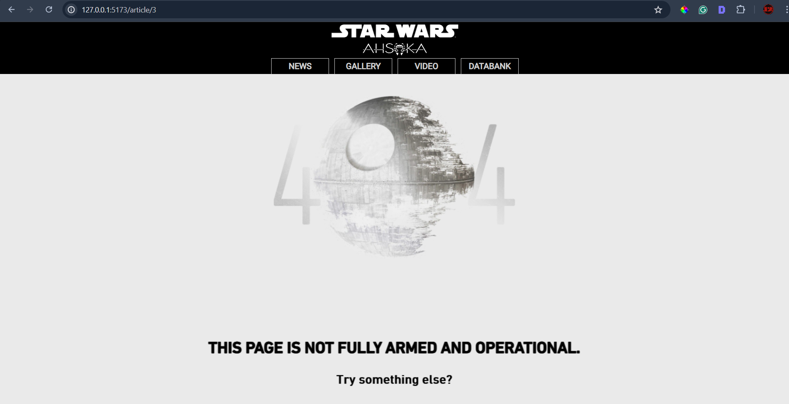

---

#### Join me as I continue building a React website with the help of my Hashnode AI assistant! This article covers React Router, exploring dynamic routing, setting up routes, and navigating between pages!

---


---

### Article Concept Overview

#### The problem:

React projects are single-page applications with a single URL. However, libraries like [react-share](https://www.npmjs.com/package/react-share) require unique URLs for each page you want to share within your project.

#### The solution:

Incorporate React Router to create separate URL paths in your single-page React project.

---

### React Router Concepts Covered

**In this article, we will cover the following React Router concepts:**

* **useParams**: A hook that extracts parameters from the URL, allowing you to access dynamic segments of the URL.
    
* **useNavigate**: A hook that provides a function to programmatically navigate between routes.
    
* **Link**: A component that creates navigable links, allowing users to navigate without refreshing the page.
    
* **useLocation**: A hook that provides access to the current location object, which contains information about the current URL.
    
* **BrowserRouter as Router, Route, Routes**: Components used to define and manage routes in a React application. `BrowserRouter` wraps the entire application, while `Route` and `Routes` define individual routes and their corresponding components.
    

---

### Introduction to React Router

React Router is a library for routing in React applications, enabling single-page applications with navigation without refreshing the page. Unlike traditional websites that send URL requests to the server to load new pages, React Router creates URL paths that correspond to different components within your React application. This means it dynamically renders React components based on the current URL path, rather than loading separate web pages.

By using React Router, you can create a more seamless and efficient user experience. When a user navigates to a different section of your application, React Router updates the URL and renders the appropriate component without making a new server request. This approach improves performance and provides a smoother, more responsive user interface.

***To properly incorporate the react-share library into my project, integrating React Router first was the solution!***

---

**Note:** *In my project and article, we use React Router v6. This version introduces several new features and improvements, such as the* `Routes` *and* `Route` *components, as well as the* `useNavigate` *hook for programmatic navigation.*

---

### Integrating React Router for use with React Share Library

#### For this article, I will cover how I integrated React Router in my Star Wars Ahsoka project for the specific use case of using the [react-share](https://www.npmjs.com/package/react-share) library.

**So, what is the React Share library? The React Share library is a React component library that provides social media share buttons. It allows you to easily add buttons to share content on various social media platforms like Facebook, Twitter, LinkedIn, and more.**

---

### **Prerequisites**

Building on the series of articles about creating a "Star Wars Ahsoka React website," understanding the implementation of React Router requires familiarity with certain concepts. Please refer to my previous articles to understand the custom components and functions used.

**The prerequisites include familiarity with the:**

* **Navbar** component
    
* **Hamburger** menu component
    
* **SmallCardContent** component
    
* **mapItems** function
    
* **NewsArticle** component
    

#### **Article Series:**

1. [Learn to Use Component Identifiers as Props for Rendering Various HTML Elements Dynamically](https://selftaughttxg.com/2024/01-24/learn-to-use-component-identifiers-as-props-for-rendering-various-html-elements-dynamically/)
    
2. [A Guide to Better Code Organization in React through File Separation](https://selftaughttxg.com/2024/01-24/a-guide-to-better-code-organization-in-react-through-file-separation/)
    
3. [Building a Dropdown Menu in React: A Step-by-Step Guide](https://selftaughttxg.com/2024/01-24/building-a-dropdown-menu-in-react-a-step-by-step-guide/)
    
4. [Developing a Dynamic Hamburger Menu in React: A Step-by-Step Guide](https://selftaughttxg.com/2024/02-24/developing-a-dynamic-hamburger-menu-in-react-a-step-by-step-guide/)
    
5. [How to Integrate YouTube Videos into React Applications](https://selftaughttxg.com/2024/03-24/how-to-integrate-youtube-videos-into-react-applications/)
    
6. [How to Integrate a Carouse into React Applications](https://selftaughttxg.com/2024/01-24/learn-to-use-component-identifiers-as-props-for-rendering-various-html-elements-dynamically/)
    
7. [Building Flexible React Components for Dynamic HTML Layouts](https://selftaughttxg.com/2024/06-24/building-flexible-react-components-for-dynamic-html-layouts/)
    

---

### **Installation**

First, you need to install React Router. You can do this using npm or yarn. I used npm.

```bash
npm install react-router-dom
# or
yarn add react-router-dom
```

---

### Sharing Articles With the React Share Library

You will see the Twitter/X and LinkedIn icons from the React Share library at the bottom right side of the image below.


When you click on a social share icon from the React Share library, it typically opens a new window or tab that directs you to the selected social media platform's sharing interface. This interface is pre-filled with the URL and other relevant information (like the title or description) of the content you want to share. You can then customize the post further if needed and proceed to share it on your social media profile.

#### The problem:

**Although my Star Wars React project properly rendered each article, the React Share library used my base URL for every article. This resulted in Twitter/X and LinkedIn posts that always led back to my main page, regardless of the current state of my React app, when I clicked the social share icon.**

#### The solution:

I had to incorporate React Router, which created unique URL paths for each Star Wars news article I wanted to share.

---

### The Route Component

Unlike traditional websites that consist of separate web pages, React Router uses route components. Each URL path is mapped to a specific React component, which is dynamically rendered without making a new server request.

A route component in React Router is rendered when the URL path matches a specified route. Defined within a `Route` element, it enables seamless navigation by dynamically rendering the appropriate component without refreshing the page.

**This example code sets up a route that renders the MainPage component when the user visits the root URL of the application:**

* `<Route>`: This is a React Router component used to define a route.
    
* `path="/"`: This specifies the URL path for the route. In this case, it is the root path ("/"), which means this route will match the main URL of the application.
    
* `element={<MainPage />}`: This specifies the React component to be rendered when the URL path matches the specified path. In this case, when the user navigates to the root URL ("/"), the `MainPage` component will be rendered.
    
```javascript
<Route path="/" element={<MainPage />} />
```
    

---

### The Routes Component

**All of the individual** `<Route>` **components go inside of the** `<Routes>` **component.**

The `<Routes>` component is a container for all the `<Route>` components. It ensures that only the first matching route is rendered.

```javascript
<Routes>
  <Route path="/" element={<MainPage />} />
  <Route path="/news" element={<NewsList />} />
  <Route path="/article/:storyNumber" element={<NewsArticle />} />
  <Route path="*" element={<NotFound />} />
</Routes>
```

The `<Routes>` component contains multiple `<Route>` components, each defining a different path and the corresponding component to render.

---

### The Router Component

The `<Router>` component (specifically `BrowserRouter` in this case) is used to wrap the entire application. It provides the routing context to the rest of the app.

```javascript
import { BrowserRouter as Router } from 'react-router-dom';

function App() {
  return (
    <Router>
      <Routes>
        <Route path="/" element={<MainPage />} />
        <Route path="/news" element={<NewsList />} />
        <Route path="/article/:storyNumber" element={<NewsArticle />} />
        <Route path="*" element={<NotFound />} />
      </Routes>
    </Router>
  );
}
```

The `<Router>` component wraps the entire application. This setup ensures that the routing context is available throughout the app, enabling seamless navigation between different components and pages.

---

### My Navbar Component

Now, it's time to refactor the code in my project. After integrating React Router into my existing project, I needed to update the code to ensure the Navbar appears at the top of every page. This entailed removing my Navbar component from all of the other components that rendered it.

**To properly render the Navbar component using React Router, it needs to be placed within the** `<Router>` **component, above the** `<Routes>` **component:**

```javascript
<Navbar />
```

```javascript
function App() {
  return (
    <Router>
      <Navbar />
      <Routes>
        <Route path="/" element={<MainPage />} />
        <Route path="/news" element={<NewsList />} />
        <Route path="/article/:storyNumber" element={<NewsArticle />} />
        <Route path="*" element={<NotFound />} />
      </Routes>
    </Router>
  );
}
```

---

### Organizing My Routes

Since most of my Star Wars React project is rendered from the root URL (the main page), I created additional routes only for the **news** and **article** pages and added a route for a 404 page.

---

### The News Path

In my React application, the `"/news"` path displays a list of news articles. When users navigate to this path, the `NewsList` component is rendered. This component uses the `mapItems` function to generate clickable links for each news article.

#### How It Works

1. **Route Definition**: In the `App` component, I define a route for the `"/news"` path that renders the `NewsList` component.
    
```javascript
<Route path="/news" element={<NewsList />} />
```
    
2. **Navigating to Individual Articles**: When users click on an article link, they are navigated to the corresponding article page. React Router dynamically renders the specific article component without refreshing the entire application.
    

**Here is the news URL path that renders the article links:**

[https://react-dynamic-elements-starwars-cards.netlify.app/news](https://react-dynamic-elements-starwars-cards.netlify.app/news)


---

### **NewsList Component**

#### The News URL

In the `NewsList` component, we use the `mapItems` function to generate a list of news articles. Each article is wrapped in a `Link` component, which creates a clickable link for the user. The `"/article"` path is used as the base URL for these links.

When a user clicks on an article, they are navigated to a unique URL that includes the article's identifier. For example, if an article has an identifier of `1`, the URL will be `"/article/1"`. This allows React Router to dynamically render the specific article page without refreshing the entire application.

**Here's a brief look at the relevant part of the** `NewsList` **component:**

```javascript
<section className="small-card-container">
  {mapItems(
    selectedCategory,
    StarWarsCard,
    setSelectedItem,
    selectedItem,
    SmallCardContent,
    "/article"
  )}
</section>
```

---

### Using useLocation in the mapItems Function

The `mapItems` function generates a list of items, each wrapped in a `Link` component for navigation. It uses the `useLocation` hook from React Router to access the current URL path and conditionally render components based on the path.

#### How It Works

1. **Accessing the Current Location**: Inside the `mapItems` function, `useLocation` is called to get the current location object.
    
```javascript
const location = useLocation();
```
    
2. **Generating Items**: The function iterates over the `items` array and generates a component for each item. It checks if the current path is not `"/news"` and sets the `isSelected` property accordingly.
    
```javascript
return items.map((item, index) => {
    const isSelected = location.pathname !== '/news' && (selectedItem ? selectedItem === item : index === 0);
    const contentProps = {
        ...item,
        isSelected
    };

    const card = (
        <Component 
            key={index} 
            type="div" 
            contentType={contentType} 
            contentProps={contentProps} 
            layout="small-card" 
            theme="dark-theme" 
            interaction="clickable" 
            onClick={() => setSelectedItem(item)} 
        />
    );

    if (linkPath) {
        return (
            <Link to={`${linkPath}/${item.story}`} key={item.story}>
                {card}
            </Link>
        );
    }

    return card;
});
```
    
3. **Creating Links**: If a `linkPath` is provided, each item is wrapped in a `Link` component, creating a clickable link that navigates to the specified path with the item's identifier.
    

The use of `useLocation` ensures that the current path is considered when rendering the items, providing context-aware navigation.

---

### **NewsArticle Component**

#### **The Articles URLs**

The `NewsArticle` component is designed to display individual news articles based on the URL path. Here's how it works with React Router and the `NewsList` component:

* **Extracting the URL Parameter**: The `useParams` hook is used to extract the `storyNumber` from the URL.
    
* **Fetching the Article**: The `storyNumber` is used to fetch the corresponding article from the `news` data.
    
* **Handling Non-Existent Articles**: If the `storyNumber` does not match any article, the `NotFound` component is rendered.
    
* **Rendering the Article Content**: If the article exists, its content is rendered, including the name and subtitle.
    

```javascript
function NewsArticle() {
  const { storyNumber } = useParams();
  const article = news[storyNumber];

  if (!article) {
    return <NotFound />;
  }

  return (
    <div>
      <h1>{article.name}</h1>
      <h4>{article.sub_title}</h4>
      {/* Render article content */}
    </div>
  );
}
```

#### **Displaying the Article Content**

The article content is dynamically generated based on the data structure. Paragraphs and images are rendered accordingly.

```javascript
const articleContent = [];
for (let key in news[storyNumber]) {
  if (key.startsWith('paragraph')) {
    articleContent.push({ type: 'paragraph', text: news[storyNumber][key] });
  } else if (key.startsWith('image') && !news[storyNumber][key].includes('title')) {
    articleContent.push({ type: 'image', src: news[storyNumber][key], alt: key });
  }
}
```

#### **Integration with NewsList**

The `NewsList` component uses the `mapItems` function to generate links for each article. When a user clicks on an article link, they are navigated to the `NewsArticle` component with the appropriate `storyNumber` in the URL.

This setup allows for seamless navigation between the list of news articles and individual article pages, enhancing the user experience without page reloads.

```javascript
<section className="small-card-container">
  {mapItems(
    news,
    StarWarsCard,
    setSelectedItem,
    selectedItem,
    SmallCardContent,
    "/article"
  )}
</section>
```

**Here is the news URL path that renders the first article:**

[**https://react-dynamic-elements-starwars-cards.netlify.app/article/0**](https://react-dynamic-elements-starwars-cards.netlify.app/article/0)


### The Finished NewsArticle Component

**Note:** *I covered the creation of these dynamically rendered &lt;p&gt; and &lt;img&gt; tags in my previous article, and I will be covering the react-share portions of this component in my next article.*

```javascript
import { TwitterShareButton, TwitterIcon, LinkedinShareButton, LinkedinIcon } from 'react-share';
import BB8 from "../images/news/BB8.jpeg";
import React, { useState, useEffect } from "react";
import { useParams } from "react-router-dom";
import { news } from "../data.js";
import StarWarsCard from "../components/StarWarsCard";
import SmallCardContent from "../components/SmallCardContent";
import { mapItems } from "../utils/mapFunctions.jsx";
import NotFound from './NotFound.jsx'; // Ensure this import is added
import "../App.css";

const Article = ({ content }) => {
  return (
    <div>
      {content.map((item, index) => {
        if (item.type === 'paragraph') {
          return <p key={index}>{item.text}</p>;
        } else if (item.type === 'image') {
          return ;
        }
        return null;
      })}
    </div>
  );
};

function NewsArticle() {
  const { storyNumber } = useParams();
  const [selectedItem, setSelectedItem] = useState(news[storyNumber] || null);

  const articleContent = [];
  const [shareUrl, setShareUrl] = useState(window.location.href);
  const [title, setTitle] = useState(news[storyNumber]?.name || '');
  const [hashtags, setHashtags] = useState(['StarWars', 'News']);

  // State for Twitter icon
  const [twitterBgColor, setTwitterBgColor] = useState('black');
  const [twitterIconColor, setTwitterIconColor] = useState('white');

  // State for LinkedIn icon
  const [linkedinBgColor, setLinkedinBgColor] = useState('black');
  const [linkedinIconColor, setLinkedinIconColor] = useState('white');

  // Event handlers for Twitter icon
  const handleMouseEnterTwitter = () => {
    setTwitterBgColor('lightgray');
    setTwitterIconColor('black');
  };

  const handleMouseLeaveTwitter = () => {
    setTwitterBgColor('black');
    setTwitterIconColor('white');
  };

  // Event handlers for LinkedIn icon
  const handleMouseEnterLinkedin = () => {
    setLinkedinBgColor('lightgray');
    setLinkedinIconColor('black');
  };

  const handleMouseLeaveLinkedin = () => {
    setLinkedinBgColor('black');
    setLinkedinIconColor('white');
  };

  useEffect(() => {
    if (!news[storyNumber]) {
      setSelectedItem(null);
    } else {
      setSelectedItem(news[storyNumber]);
      setShareUrl(window.location.href);
      setTitle(news[storyNumber].name);
      setHashtags(['StarWars', 'News']);
    }
  }, [storyNumber]);

  if (!news[storyNumber]) {
    return <NotFound />;
  }

  for (let key in news[storyNumber]) {
    if (key.startsWith('paragraph')) {
      articleContent.push({ type: 'paragraph', text: news[storyNumber][key] });
    } else if (key.startsWith('image') && !news[storyNumber][key].includes('title')) {
      articleContent.push({ type: 'image', src: news[storyNumber][key], alt: key });
    }
  }

  return (
    <>
    <section className="small-card-container">
      {mapItems(
        news,
        StarWarsCard,
        setSelectedItem,
        selectedItem,
        SmallCardContent,
        "/article"
      )}
    </section>
    <div className="ctn-news">
      
      <div className="news__title">
        <h1>{news[storyNumber].name}</h1>
        <h4>{news[storyNumber].sub_title}</h4>
      </div>
      <div className="news__about">
        <div className="ctn-news-header">
          
          <div>
            <p className="ctn-news-author gray"><strong>By:</strong> {news[storyNumber].by}</p>
            <p className="ctn-news-date gray"><strong>date:</strong> {news[storyNumber].date}</p>
          </div>
        </div>
        <div className="news__social-icons">
          <div>
            <TwitterShareButton url={shareUrl} title={title} hashtags={hashtags}>
              <TwitterIcon size={32} round bgStyle={{ fill: twitterBgColor }} iconFillColor={twitterIconColor} onMouseEnter={handleMouseEnterTwitter} onMouseLeave={handleMouseLeaveTwitter} className="social-icons"/>
            </TwitterShareButton>
            <LinkedinShareButton url={shareUrl} title={title}>
              <LinkedinIcon size={32} round bgStyle={{ fill: linkedinBgColor }} iconFillColor={linkedinIconColor} onMouseEnter={handleMouseEnterLinkedin} onMouseLeave={handleMouseLeaveLinkedin} className="social-icons" />
            </LinkedinShareButton>
          </div>
        </div>
      </div>
      <div className="news__content ctn-news-article">
        <Article content={articleContent} />
      </div>
      <div className="news__footer">
        <footer><strong>StarWars.com. All Star Wars, all the time.</strong></footer>
      </div>
    </div>
    </>
  );
}

export default NewsArticle;
```

---

### Handling 404 Pages

To handle non-existent routes in my React application, I use a catch-all route that renders the `NotFound` component. This ensures that users are presented with a friendly error page when they navigate to a URL that doesn't match any defined routes.

#### How It Works

In the `App` component, I define a route with the path `"*"` which acts as a wildcard. This route will match any URL that doesn't correspond to the other defined routes. When such a URL is accessed, the `NotFound` component is rendered.

```javascript
<Route path="*" element={<NotFound />} />
```

**The 404 page renders when trying to go to an article number that does not exist:**



---

### My Handle Navigation Function

#### How I solved a routing issue

I had a strange routing issue that was causing errors; If I was on the "/news" URL and then used my dropdown menu to choose a new category, it would render items in the "/news" URL when it needed to render in the root URL "/." This routing issue also led to navigating to pages that did not exist.

I resolved the issue by writing a `handleNavigation` function that first navigates back to the root URL `"/"` and then navigates to the desired path. This ensures that the application resets to the root URL before navigating to the new path, preventing any incorrect rendering.

**Here's the** `handleNavigation` **function:**

```javascript
export const handleNavigation = (navigate, path, setTimeout) => {
    navigate('/');
    setTimeout(() => {
      navigate(path);
    }, 0);
  };
```

---

### The Completed App

```javascript
import { useState, useEffect } from 'react';
import { BrowserRouter as Router, Route, Routes } from 'react-router-dom';
import Navbar from './components/Navbar';
import MainPage from './components/MainPage';
import NewsList from './components/NewsList';
import Article from './components/Article';
import NewsArticle from './components/News';
import NotFound from './components/NotFound.jsx';
import {
  characters,
  creatures,
  droids,
  locations,
  organizations,
  vehicles,
  weapons_and_tech,
  youtube,
  mainpage,
  news,
} from './data.js';

function App() {
  const [selectedItem, setSelectedItem] = useState(null);
  const [selectedCategory, setSelectedCategory] = useState(mainpage);
  const [showCarousel, setShowCarousel] = useState(false);

  const categories = {
    characters,
    creatures,
    droids,
    locations,
    organizations,
    vehicles,
    weapons_and_tech,
    youtube,
    mainpage,
    news,
  };

  useEffect(() => {
    if (selectedCategory && selectedCategory.length > 0) {
      setSelectedItem(selectedCategory[0]);
    }
  }, [selectedCategory]);

  return (
    <Router>
      <Navbar
        categories={categories}
        setSelectedCategory={setSelectedCategory}
        setShowCarousel={setShowCarousel}
      />
      <Routes>
        <Route
          path="/"
          element={
            <MainPage
              selectedCategory={selectedCategory}
              setSelectedCategory={setSelectedCategory}
              selectedItem={selectedItem}
              setSelectedItem={setSelectedItem}
              showCarousel={showCarousel}
              setShowCarousel={setShowCarousel}
            />
          }
        />
        <Route
          path="/news"
          element={
            <NewsList
              selectedCategory={selectedCategory}
              setSelectedCategory={setSelectedCategory}
              selectedItem={selectedItem}
              setSelectedItem={setSelectedItem}
              showCarousel={showCarousel}
              setShowCarousel={setShowCarousel}
            />
          }
        />
        <Route path="/article/:storyNumber" element={<NewsArticle />} />
        <Route path="*" element={<NotFound />} />
      </Routes>
    </Router>
  );
}

export default App;
```

---

### **The Project So Far**

**Here are the links to the project:**

* [GitHub repo](https://github.com/MichaelLarocca/react-dynamic-elements-starwars-cards)
    
* [Netlify deployed project](https://react-dynamic-elements-starwars-cards.netlify.app/)
    


---

### Key Takeaways

1. **Dynamic Routing with React Router**: React Router allows you to create dynamic routes in your React applications, enabling seamless navigation without page reloads. This enhances the user experience by providing a more responsive and efficient interface.
    
2. **Essential Hooks and Components**: Understanding and utilizing key React Router hooks and components such as `useParams`, `useNavigate`, `Link`, `useLocation`, `BrowserRouter`, `Route`, and `Routes` is crucial for effective routing in your applications.
    
3. **Integration with Other Libraries**: The integration of React Router with the React Share library showcases how dynamic routing can be used to create unique URLs for sharing content on social media platforms, solving the issue of static URLs in single-page applications.
    
4. **Handling 404 Pages**: Implementing a catch-all route to handle 404 pages ensures that users are presented with a friendly error page when they navigate to a non-existent route, improving the overall user experience.

---

### Advance your career with a 20% discount on Scrimba Pro using this [affiliate link](https://scrimba.com/?via=MichaelLarocca)!

Become a hireable developer with Scrimba Pro! Discover a world of coding knowledge with full access to all courses, hands-on projects, and a vibrant community. You can [read my article](https://selftaughttxg.com/2021/06-21/06-07-21/) to learn more about my exceptional experiences with Scrimba and how it helps many become confident, well-prepared web developers!

###### ***Important:*** *This discount is for new accounts only. If a higher discount is currently available, it will be applied automatically.*

**How to Claim Your Discount:**
1. Click [the link](https://scrimba.com/?via=MichaelLarocca) to explore the new Scrimba 2.0.
2. Create a new account.
3. Upgrade to Pro; the 20% discount will automatically apply.

##### ***Disclosure:*** *This article contains affiliate links. I will earn a commission from any purchases made through these links at no extra cost to you. Your support helps me continue creating valuable content. Thank you!*

---

### Conclusion

When learning React, it's easy to forget you are dealing with a single URL app. In my case, I realized this when trying to implement the react-share library to share news articles on my site via Twitter/X and LinkedIn icons. Despite the currently rendered state of my app, when displaying the article I wanted to share, the react-share library always created a link to the root URL of my website.

To get the react-share library to work in my project, I realized that I would first have to learn React Router, which creates unique URLs. Since I had not structured my app with React Router in mind and had not learned how to use it yet, I knew my work was cut out for me.

By pairing programming with Hashnode's AI, I was able to implement React Router into my project without too many issues. The refactored code in the main app to use React Router makes logical sense when analyzing the Router, Routes, and Route components. However, I ran into a few syntax and implementation issues.

React Router's syntax varies depending on the version you are using. I realized this through trial and error, as my AI assistant kept providing various versions of code. I ultimately used React Router v6 for this project. I also had dynamic URL creation issues while navigating my website using dropdown menus. I resolved this issue by creating a function that first goes to the root directory before navigating to the new path chosen by the user.

With React Router implemented correctly in my project, the react-share library works as expected! Now, when a user chooses an article, a unique URL is created for that specific article, allowing it to be shared accurately on social media platforms.

Consider integrating React Router to improve your React projects with dynamic routing. It creates unique URLs for your content, enhancing your project's functionality, and it may be necessary for certain React libraries!

---

###### *Do you now feel confident in using React Router in your projects? Have you already implemented dynamic routing in your React applications? Please share the article and comment!*

---
