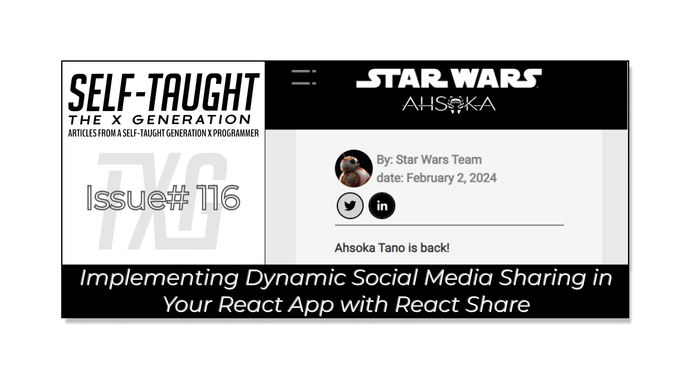
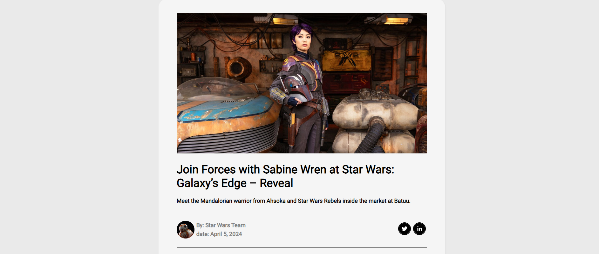
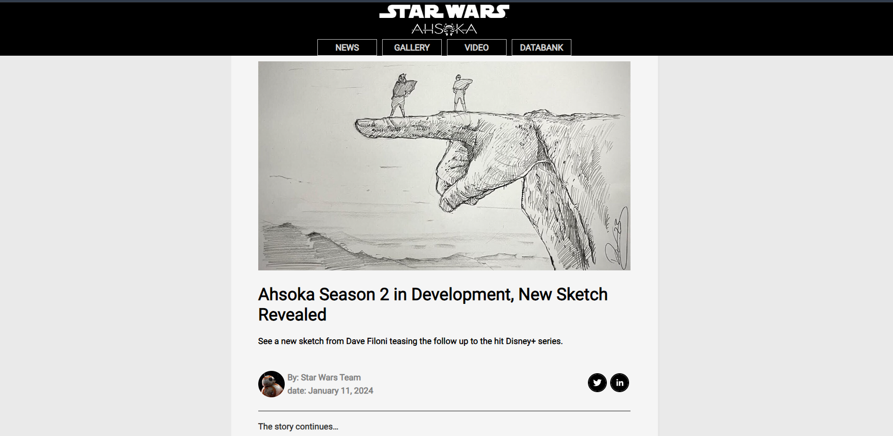

---

#### In this article, we explore the React Share library. You will learn how to integrate social media sharing buttons using React Router DOM, enhancing your React projects with dynamic, shareable content!

---



---

### Article Concept Overview

#### The problem:

React projects are single-page applications with a single URL, which poses a challenge for libraries like [react-share](https://www.npmjs.com/package/react-share), which require unique URLs for each page you want to share.

#### The solution:

Use [React Router DOM](https://www.npmjs.com/package/react-router-dom) to create distinct URL paths within your single-page React project, enabling the React Share library to function properly.

---

### React Share Concepts Covered

**In this article, we will cover the following React Share concepts:**

* **Installation**: How to install the React Share library in your project using npm.
    
* **TwitterShareButton and TwitterIcon**: Components used to create a Twitter share button with customizable icon size and style.
    
* **LinkedinShareButton and LinkedinIcon**: Components used to create a LinkedIn share button with customizable icon size and style.
    
* **Props**: How to use props such as URL, title, size, and shape to customize the share buttons.
    
* **Integration with React Router**: How to use React Router DOM to create unique URLs for each page, enabling the React Share library to function properly.
    

---

### **Introduction to the React Share Library**

The React Share library is a simple and flexible tool for adding social media sharing buttons to React applications. It supports various platforms like Facebook, Twitter, and LinkedIn, allowing easy customization of button appearance and behavior.

**Although they look similar to icons that link to your social media accounts, the React Share icons are used to share specific web pages from your app.**

The library offers several customization options, including setting the URL to be shared, adding hashtags, and customizing the icons' styles. A unique URL is essential if you want to share specific pages of your React project, such as articles.

---

**Note:** *For React Share to work properly, you need to add unique URLs to your single-page app. This can be achieved using React Router DOM.*

---

### Getting Started with React Share

Getting started with the React Share library is straightforward and simple. First, install the library, then use the components you need, such as Twitter/X and LinkedIn. Add props like the URL, title, size, and shape, and everything works right out of the box!

#### To begin using the React Share library in your project, follow these simple steps:

#### Installation

First, you need to install the React Share library. Open your terminal, navigate to your project directory, and run the following command:

```bash
npm install react-share
```

This command will install the React Share library and add it to your project's dependencies.

#### Adding Twitter and LinkedIn Share Buttons

Once the library is installed, you can start adding social media share buttons to your React components. Here’s a basic example of how to add Twitter and LinkedIn share buttons:

1. **Import the necessary components:**
    

```javascript
import React from 'react';
import { TwitterShareButton, TwitterIcon, LinkedinShareButton, LinkedinIcon } from 'react-share';
```

2. **Create a component to include the share buttons:**
    

```javascript
const ShareButtons = () => {
  const shareUrl = 'https://yourwebsite.com';
  const title = 'Check out this awesome website!';

  return (
    <div>
      <TwitterShareButton url={shareUrl} title={title}>
        <TwitterIcon size={32} round />
      </TwitterShareButton>
      <LinkedinShareButton url={shareUrl} title={title}>
        <LinkedinIcon size={32} round />
      </LinkedinShareButton>
    </div>
  );
};

export default ShareButtons;
```

3. **Use the** `ShareButtons` component in your application:
    

```javascript
import React from 'react';
import ShareButtons from './ShareButtons';

const App = () => {
  return (
    <div>
      <h1>Welcome to My Website</h1>
      <ShareButtons />
    </div>
  );
};

export default App;
```

In this example, the `ShareButtons` component includes both Twitter and LinkedIn share buttons. The `shareUrl` and `title` variables define the URL and the message that will be shared.

*By following these steps, you can easily integrate social media sharing functionality into your React application using the React Share library.*

---

### **Integrating React Router for use with React Share Library**

In my [previous article](https://selftaughttxg.com/2024/07-24/how-to-set-up-dynamic-routing-with-react-router/), I covered how I integrated [React Router DOM](https://www.npmjs.com/package/react-router-dom) in my Star Wars Ahsoka project for the specific use case of using the [react-share library.](https://www.npmjs.com/package/react-share) Using React Router was a necessary step for creating unique URLs for each of the news articles I wanted to share using the React Share library.

**For the rest of this article, I will cover how I incorporated the React Share library into my Star Wars Ahsoka project, including the struggles I had and how I resolved them.**

---

### **Prerequisites**

Building on the series of articles about creating a "Star Wars Ahsoka React website," understanding the implementation of the React Share library requires familiarity with certain concepts. Please refer to my previous articles to understand the custom components and functions used.

**The prerequisites include familiarity with the:**

* **Navbar** component
    
* **Hamburger** menu component
    
* **SmallCardContent** component
    
* **mapItems** function
    
* **NewsArticle** component
    

#### **Article Series:**

1. [Learn to Use Component Identifiers as Props for Rendering Various HTML Elements Dynamically](https://selftaughttxg.com/2024/01-24/learn-to-use-component-identifiers-as-props-for-rendering-various-html-elements-dynamically/)
    
2. [A Guide to Better Code Organization in React through File Separation](https://selftaughttxg.com/2024/01-24/a-guide-to-better-code-organization-in-react-through-file-separation/)
    
3. [Building a Dropdown Menu in React: A Step-by-Step Guide](https://selftaughttxg.com/2024/01-24/building-a-dropdown-menu-in-react-a-step-by-step-guide/)
    
4. [Developing a Dynamic Hamburger Menu in React: A Step-by-Step Guide](https://selftaughttxg.com/2024/02-24/developing-a-dynamic-hamburger-menu-in-react-a-step-by-step-guide/)
    
5. [How to Integrate YouTube Videos into React Applications](https://selftaughttxg.com/2024/03-24/how-to-integrate-youtube-videos-into-react-applications/)
    
6. [How to Integrate a Carouse into React Applications](https://selftaughttxg.com/2024/01-24/learn-to-use-component-identifiers-as-props-for-rendering-various-html-elements-dynamically/)
    
7. [Building Flexible React Components for Dynamic HTML Layouts](https://selftaughttxg.com/2024/06-24/building-flexible-react-components-for-dynamic-html-layouts/)
    
8. [How to Set Up Dynamic Routing with React Router](https://selftaughttxg.com/2024/07-24/how-to-set-up-dynamic-routing-with-react-router/)
    

---

### Star Wars News Articles

My goal is to utilize the React Share library to share Star Wars news articles that I add to my website. Each article contains a header that includes the React Share Twitter/X and LinkedIn components.

To ensure the React Share library can properly share each individual article, I needed to use React Router DOM to create unique URLs for each article. I configured React Router to generate a URL based on each article's `story ID.` The URL for the following article is [https://react-dynamic-elements-starwars-cards.netlify.app/article/0](https://react-dynamic-elements-starwars-cards.netlify.app/article/0).

**Star Wars article utilizing the React Share Twitter/X and LinkedIn components:**



I created the custom News Article component that dynamically renders `<p>` and `` tags based on the data provided. The creation of this component was detailed in previous articles in the series.

**Data used to dynamically render a Star Wars News Article:**

```javascript
const news = [
	{
		story: 0,
		image: story_0_image_title,
		name: 'Join Forces with Sabine Wren at Star Wars: Galaxy’s Edge – Reveal',
		sub_title: 'Meet the Mandalorian warrior from Ahsoka and Star Wars Rebels inside the market at Batuu.',
		by: 'Star Wars Team',
		date: 'April 5, 2024',
		paragraph_1: 'Sabine Wren, the colorful Mandalorian warrior and Padawan to Ahsoka Tano, is making her way to Star Wars: Galaxy’s Edge at Disneyland Resort. And today, StarWars.com has your first look at her latest, limited-time appearance!',
		image_1: story_0_image_1,
		paragraph_2: 'With her short-cropped purple hair, unique beskar armor including stunning red and purple helmet, and her lightsaber at her hip, the artist and Rebel has officially arrived on Batuu. Sharp-eyed visitors may spot her exploring the districts near Black Spire Outpost.',
		paragraph_3: `We’re ready.`,
		paragraph_4: `Visit Star Wars: Galaxy’s Edge at Disneyland Resort and experience Season of the Force April 5 - June 2!`,
	},
]
```

---

### Incorporating React Share into My Project

**While installing React Share was straightforward and simple, incorporating it into my project proved to be challenging. I had to take a step backward and install React Router Dom, learn how to create unique URLs for my single-page React App, and deal with bugs due to navigation through drop-down menus. As the file has become pretty big, I'm breaking down how my component works into smaller sections.**

*I also cover styling problems I had with the solutions. If you are running into similar issues, you may find this insightful.*

---

### Adding Social Share Buttons to My Project

#### Import

In my code, I start by importing some components from the `react-share` library. These components are `TwitterShareButton`, `TwitterIcon`, `LinkedinShareButton`, and `LinkedinIcon`. They help me create social media share buttons for Twitter and LinkedIn.

Next, I import the `useParams` hook from the `react-router-dom` library. This hook allows me to access the URL parameters in my React application. In this case, I use it to get the `storyNumber` parameter from the URL.

Finally, I import the `news` data from a local file called `data.js`. This data contains the information about the news articles that I want to display and share.

```javascript
import { TwitterShareButton, TwitterIcon, LinkedinShareButton, LinkedinIcon } from 'react-share';
import { useParams } from "react-router-dom";
import { news } from "../data.js";
```

#### News Article Function

In my `NewsArticle` function, I start by using the `useParams` hook from `react-router-dom` to get the `storyNumber` parameter from the URL. This helps me identify which news article to display.

Next, I set up a variable called `shareUrl` that holds the current URL of the page. This URL will be used when sharing the article on social media.

Then, I create a variable called `title` that gets the name of the news article based on the `storyNumber`. If the article name is not available, it defaults to an empty string.

Finally, I set up an array called `hashtags` that contains the hashtags I want to include when sharing the article. In this case, the hashtags are 'StarWars' and 'News'.

```javascript
const { storyNumber } = useParams();
const shareUrl = window.location.href;
const title = news[storyNumber]?.name || '';
const hashtags = ['StarWars', 'News'];
```

#### Rendering Social Share Buttons

In this part of the `NewsArticle` function, I return a JSX block that renders the social share buttons for Twitter and LinkedIn.

First, I create a `div` element with the class name `news__social-icons`. This `div` will contain the social share buttons.

Inside the `div`, I add a `TwitterShareButton` component. I pass the `url`, `title`, and `hashtags` as props to this component. These props are used to configure the content that will be shared on Twitter. Inside the `TwitterShareButton`, I include a `TwitterIcon` component with a size of 32 pixels, a round shape, and a class name of `social-icons`.

Next, I add a `LinkedinShareButton` component. Similar to the Twitter button, I pass the `url` and `title` as props to configure the content that will be shared on LinkedIn. Inside the `LinkedinShareButton`, I include a `LinkedinIcon` component with a size of 32 pixels, a round shape, and a class name of `social-icons`.

```javascript
return (
  <div className="news__social-icons">
    <TwitterShareButton url={shareUrl} title={title} hashtags={hashtags}>
      <TwitterIcon size={32} round className="social-icons"/>
    </TwitterShareButton>
    <LinkedinShareButton url={shareUrl} title={title}>
      <LinkedinIcon size={32} round className="social-icons" />
    </LinkedinShareButton>
  </div>
);
```

#### **The Basic Structure of Rendering the Social Share Components**

Here is the basic structure for rendering social share components: import the necessary modules, create the function, and return the HTML.

```javascript
import { TwitterShareButton, TwitterIcon, LinkedinShareButton, LinkedinIcon } from 'react-share';
import { useParams } from "react-router-dom";
import { news } from "../data.js";

function NewsArticle() {
  const { storyNumber } = useParams();
  const shareUrl = window.location.href;
  const title = news[storyNumber]?.name || '';
  const hashtags = ['StarWars', 'News'];

  return (
    <div className="news__social-icons">
      <TwitterShareButton url={shareUrl} title={title} hashtags={hashtags}>
        <TwitterIcon size={32} round className="social-icons"/>
      </TwitterShareButton>
      <LinkedinShareButton url={shareUrl} title={title}>
        <LinkedinIcon size={32} round className="social-icons" />
      </LinkedinShareButton>
    </div>
  );
}

export default NewsArticle;
```

---

### Problems I Resolved

#### Assigning the correct URLs

The main problem I encountered was that the Social Share icon URLs were always assigned to the root URL, regardless of the current state of my React app. I resolved this issue by installing the [React Router DOM](https://www.npmjs.com/package/react-router-dom) library and utilizing it in my app to create unique URLs for each of my Star Wars news articles.

#### Styling the Social Share Icons

Although the Social Share icons are CSS adjustable, I had problems styling them, specifically the hover states.

**I was able to target the Social Share icon border in my CSS file by adding a class name to the component "social-icons." I then styled it to be round by adjusting the radius, and I also successfully changed the border color with the hover effect.**

```css
.social-icons {
	border: 2px solid gray;
	margin: 3px;
	border-radius: 50%;
}

.social-icons:hover {
	border: 2px solid black;
	border-radius: 50%;
}
```

**However, I was unable to change the background color of the Social Share icon, including the hover effect, in the App CSS file. I opted for an improvisational solution, utilizing the available Social Share icon props.**

#### The Social Icons support the following props:

* `size`: Icon size in pixels (number)
    
* `round`: Whether to show round or rect icons (bool)
    
* `borderRadius`: Allow rounded corners if using rect icons (number)
    
* `bgStyle`: customize background style, e.g. `fill` (object)
    
* `iconFillColor`: customize icon fill color (string, default = 'white')
    

**Here is the Twitter Social Icon component utilizing the available CSS props:**

```javascript
<TwitterIcon
size={32}
round
bgStyle={{ fill: twitterBgColor }}
iconFillColor={twitterIconColor}
onMouseEnter={handleMouseEnterTwitter}
onMouseLeave={handleMouseLeaveTwitter}
className="social-icons"
/>
```

*In my code, I added hover effects to the social media icons (Twitter and LinkedIn) using React's state and event handlers. Here's how I did it:*

**First, I set up state variables to manage the background and icon colors for both the Twitter and LinkedIn icons:**

```javascript
const [twitterBgColor, setTwitterBgColor] = useState('black');
const [twitterIconColor, setTwitterIconColor] = useState('white');
const [linkedinBgColor, setLinkedinBgColor] = useState('black');
const [linkedinIconColor, setLinkedinIconColor] = useState('white');
```

**Next, I created event handlers for when the mouse enters and leaves the icons. These handlers change the colors to give a visual effect:**

```javascript
const handleMouseEnterTwitter = () => {
  setTwitterBgColor('lightgray');
  setTwitterIconColor('black');
};

const handleMouseLeaveTwitter = () => {
  setTwitterBgColor('black');
  setTwitterIconColor('white');
};

const handleMouseEnterLinkedin = () => {
  setLinkedinBgColor('lightgray');
  setLinkedinIconColor('black');
};

const handleMouseLeaveLinkedin = () => {
  setLinkedinBgColor('black');
  setLinkedinIconColor('white');
};
```

**Finally, I applied these event handlers to the** `TwitterIcon` **and** `LinkedinIcon` **components. This way, the colors change when I hover over the icons:**

```javascript
<TwitterShareButton url={shareUrl} title={title} hashtags={hashtags}>
  <TwitterIcon
    size={32}
    round
    bgStyle={{ fill: twitterBgColor }}
    iconFillColor={twitterIconColor}
    onMouseEnter={handleMouseEnterTwitter}
    onMouseLeave={handleMouseLeaveTwitter}
    className="social-icons"
  />
</TwitterShareButton>
<LinkedinShareButton url={shareUrl} title={title}>
  <LinkedinIcon
    size={32}
    round
    bgStyle={{ fill: linkedinBgColor }}
    iconFillColor={linkedinIconColor}
    onMouseEnter={handleMouseEnterLinkedin}
    onMouseLeave={handleMouseLeaveLinkedin}
    className="social-icons"
  />
</LinkedinShareButton>
```

---

### Explanation of the Remaining Code

**Since my News Article component has become quite sizable, I wanted to focus mainly on the React Share library in this article to respect your time. This is why I structured the explanations in the order that I did, leaving the remaining code for last, which we will cover briefly now.**

The remaining code in the `NewsArticle` component, which was covered in my previous articles, includes the following:

**Importing Additional Components and Data:**

* Importing BB8 image, useState, useEffect from React, and NotFound component.
    
* Importing StarWarsCard, SmallCardContent, and mapItems utility function.
    
* Importing CSS for styling.
    

**Article Sub-Component:**

* The Article component dynamically renders paragraphs and images based on the content array.
    

**State Management and Event Handlers:**

* Using useState to manage the selected news item, share URL, title, hashtags, and icon colors.
    
* Event handlers for changing icon colors on mouse enter and leave events.
    

**Effect Hook:**

* Using useEffect to update the selected item, share URL, title, and hashtags when the storyNumber changes.
    

**Conditional Rendering:**

* Returning the NotFound component if the news article does not exist.
    
* Iterating over the news object to prepare the article content dynamically.
    

**Rendering the News Article:**

* Structuring the return statement to display the complete news article with various sections, including the main image, title, author details, social icons, article content, and footer.
    

```javascript
import BB8 from "../images/news/BB8.jpeg";
import StarWarsCard from "../components/StarWarsCard";
import SmallCardContent from "../components/SmallCardContent";
import { mapItems } from "../utils/mapFunctions.jsx";
import NotFound from './NotFound.jsx';
import "../App.css";

const Article = ({ content }) => {
  return (
    <div>
      {content.map((item, index) => {
        if (item.type === 'paragraph') {
          return <p key={index}>{item.text}</p>;
        } else if (item.type === 'image') {
          return ;
        }
        return null;
      })}
    </div>
  );
};

function NewsArticle() {
  const { storyNumber } = useParams();
  const [selectedItem, setSelectedItem] = useState(news[storyNumber] || null);

  const articleContent = [];

  useEffect(() => {
    if (!news[storyNumber]) {
      setSelectedItem(null);
    } else {
      setSelectedItem(news[storyNumber]);
    }
  }, [storyNumber]);

  if (!news[storyNumber]) {
    return <NotFound />;
  }

  for (let key in news[storyNumber]) {
    if (key.startsWith('paragraph')) {
      articleContent.push({ type: 'paragraph', text: news[storyNumber][key] });
    } else if (key.startsWith('image') && !news[storyNumber][key].includes('title')) {
      articleContent.push({ type: 'image', src: news[storyNumber][key], alt: key });
    }
  }

  return (
    <>
    <section className="small-card-container">
      {mapItems(
        news,
        StarWarsCard,
        setSelectedItem,
        selectedItem,
        SmallCardContent,
        "/article"
      )}
    </section>
    <div className="ctn-news">
      
      <div className="news__title">
        <h1>{news[storyNumber].name}</h1>
        <h4>{news[storyNumber].sub_title}</h4>
      </div>
      <div className="news__about">
        <div className="ctn-news-header">
          
          <div>
            <p className="ctn-news-author gray"><strong>By:</strong> {news[storyNumber].by}</p>
            <p className="ctn-news-date gray"><strong>date:</strong> {news[storyNumber].date}</p>
          </div>
        </div>
        <div className="news__content ctn-news-article">
          <Article content={articleContent} />
        </div>
        <div className="news__footer">
          <footer><strong>StarWars.com. All Star Wars, all the time.</strong></footer>
        </div>
      </div>
    </>
  );
}

export default NewsArticle;
```

---

### The Finished News Article Component

Without further ado, here is the "quite sizable" completed News Article component, which effectively shares each Star Wars article from the database using the React Share library:

```javascript
import { TwitterShareButton, TwitterIcon, LinkedinShareButton, LinkedinIcon } from 'react-share';
import BB8 from "../images/news/BB8.jpeg";
import React, { useState, useEffect } from "react";
import { useParams } from "react-router-dom";
import { news } from "../data.js";
import StarWarsCard from "../components/StarWarsCard";
import SmallCardContent from "../components/SmallCardContent";
import { mapItems } from "../utils/mapFunctions.jsx";
import NotFound from './NotFound.jsx';
import "../App.css";

// Component to render the content of the article
const Article = ({ content }) => {
  return (
    <div>
      {content.map((item, index) => {
        if (item.type === 'paragraph') {
          return <p key={index}>{item.text}</p>;
        } else if (item.type === 'image') {
          return ;
        }
        return null;
      })}
    </div>
  );
};

function NewsArticle() {
  // Get the story number from the URL parameters
  const { storyNumber } = useParams();
  // State to hold the selected news item
  const [selectedItem, setSelectedItem] = useState(news[storyNumber] || null);

  const articleContent = [];
  // State to hold the URL to be shared
  const [shareUrl, setShareUrl] = useState(window.location.href);
  // State to hold the title of the article
  const [title, setTitle] = useState(news[storyNumber]?.name || '');
  // State to hold the hashtags for sharing
  const [hashtags, setHashtags] = useState(['StarWars', 'News']);

  // State for Twitter icon background and icon color
  const [twitterBgColor, setTwitterBgColor] = useState('black');
  const [twitterIconColor, setTwitterIconColor] = useState('white');

  // State for LinkedIn icon background and icon color
  const [linkedinBgColor, setLinkedinBgColor] = useState('black');
  const [linkedinIconColor, setLinkedinIconColor] = useState('white');

  // Event handlers for Twitter icon hover effects
  const handleMouseEnterTwitter = () => {
    setTwitterBgColor('lightgray');
    setTwitterIconColor('black');
  };

  const handleMouseLeaveTwitter = () => {
    setTwitterBgColor('black');
    setTwitterIconColor('white');
  };

  // Event handlers for LinkedIn icon hover effects
  const handleMouseEnterLinkedin = () => {
    setLinkedinBgColor('lightgray');
    setLinkedinIconColor('black');
  };

  const handleMouseLeaveLinkedin = () => {
    setLinkedinBgColor('black');
    setLinkedinIconColor('white');
  };

  // Effect to update the selected item and share details when the story number changes
  useEffect(() => {
    if (!news[storyNumber]) {
      setSelectedItem(null);
    } else {
      setSelectedItem(news[storyNumber]);
      setShareUrl(window.location.href);
      setTitle(news[storyNumber].name);
      setHashtags(['StarWars', 'News']);
    }
  }, [storyNumber]);

  // If the news article does not exist, render the NotFound component
  if (!news[storyNumber]) {
    return <NotFound />;
  }

  // Prepare the article content based on the news data
  for (let key in news[storyNumber]) {
    if (key.startsWith('paragraph')) {
      articleContent.push({ type: 'paragraph', text: news[storyNumber][key] });
    } else if (key.startsWith('image') && !news[storyNumber][key].includes('title')) {
      articleContent.push({ type: 'image', src: news[storyNumber][key], alt: key });
    }
  }

  return (
    <>
      {/* Section to display small cards for other news articles */}
      <section className="small-card-container">
        {mapItems(
          news, // Data source
          StarWarsCard, // Component to render each card
          setSelectedItem, // Function to set the selected item
          selectedItem, // Currently selected item
          SmallCardContent, // Component to render the content of each card
          "/article" // Base URL for each card link
        )}
      </section>

      {/* Main container for the news article */}
      <div className="ctn-news">
        {/* Main image of the news article */}
        

        {/* Title and subtitle of the news article */}
        <div className="news__title">
          <h1>{news[storyNumber].name}</h1>
          <h4>{news[storyNumber].sub_title}</h4>
        </div>

        {/* Author and date information */}
        <div className="news__about">
          <div className="ctn-news-header">
            
            <div>
              <p className="ctn-news-author gray"><strong>By:</strong> {news[storyNumber].by}</p>
              <p className="ctn-news-date gray"><strong>date:</strong> {news[storyNumber].date}</p>
            </div>
          </div>

          {/* Social media share buttons */}
          <div className="news__social-icons">
            <div>
              <TwitterShareButton url={shareUrl} title={title} hashtags={hashtags}>
                <TwitterIcon 
                  size={32} 
                  round 
                  bgStyle={{ fill: twitterBgColor }} 
                  iconFillColor={twitterIconColor} 
                  onMouseEnter={handleMouseEnterTwitter} 
                  onMouseLeave={handleMouseLeaveTwitter} 
                  className="social-icons"
                />
              </TwitterShareButton>
              <LinkedinShareButton url={shareUrl} title={title}>
                <LinkedinIcon 
                  size={32} 
                  round 
                  bgStyle={{ fill: linkedinBgColor }} 
                  iconFillColor={linkedinIconColor} 
                  onMouseEnter={handleMouseEnterLinkedin} 
                  onMouseLeave={handleMouseLeaveLinkedin} 
                  className="social-icons" 
                />
              </LinkedinShareButton>
            </div>
          </div>
        </div>

        {/* Content of the news article */}
        <div className="news__content ctn-news-article">
          <Article content={articleContent} />
        </div>

        {/* Footer of the news article */}
        <div className="news__footer">
          <footer><strong>StarWars.com. All Star Wars, all the time.</strong></footer>
        </div>
      </div>
    </>
  );
}

export default NewsArticle;
```

---

### **The Project So Far**

**Here are the links to the project:**

* [GitHub repo](https://github.com/MichaelLarocca/react-dynamic-elements-starwars-cards)
    
* [Netlify deployed project](https://react-dynamic-elements-starwars-cards.netlify.app/)
    



---

### Key Takeaways

**Getting Started with React Share**: Installing and setting up the React Share library is straightforward. By following the steps outlined, you can quickly add social media share buttons to your React application, enhancing user engagement.

**Customizing Share Buttons**: The React Share library provides various props to customize the appearance and behavior of share buttons. Understanding how to use props like URL, title, size, and shape allows you to tailor the buttons to fit your application's design.

**Integration with React Router**: Integrating React Share with React Router enables the creation of unique URLs for each page in your single-page application. This is essential for sharing specific content on social media platforms, solving the challenge of static URLs in SPAs.

**Practical Problem-Solving**: The article addresses common issues you might encounter when using the React Share library, such as assigning correct URLs and styling the share icons. By providing practical solutions, it helps you overcome these challenges effectively.

---

### Conclusion

Once I got individual Star Wars news articles rendering properly in my React app, I was excited to implement the React Share library. With this library, I could share each article on Twitter/X and LinkedIn via an icon, just like on the official Star Wars website. The installation process for React Share is straightforward. However, integrating it into your projects involves adding the necessary components and configuring the routes.

For the React Share library to share individual news articles, each article requires a unique URL. This situation reminds us that React Apps are single-page applications with a single URL. My solution was to also implement React Router DOM in my project to create unique URLs for each article, which allowed React Share to function as intended.

Although you can customize the React Share library social icons, I encountered difficulties with CSS hover states for changing icon colors. Using available props, I leveraged React useState to manage icon colors dynamically. By setting up state variables and event handlers for mouse enter and leave events, I achieved the desired hover effects for the social media icons.

The end result of my News Article component was a rather large file, but I am happy and relieved that it now works as expected. It took a few coverage articles to create the component and explain how it works, but I believe it now closely resembles how articles are rendered and shared on the actual Star Wars website. The standard header, which includes an image, title, author, release date, and React Share library social icons, remains consistent in format. However, the body of the article varies in the structure of paragraphs and images, necessitating the handling of dynamic React Component layouts. With the help of my Hashnode AI assistant, I was able to construct this dynamic layout feature by leveraging React components and props to render various HTML elements dynamically, ensuring a flexible and responsive design for each news article.

Consider integrating the React Share library to enhance your React projects with dynamic social media sharing. Once you learn how to implement it and style the icons, it allows you to share specific content on platforms like Twitter and LinkedIn, boosting your project's engagement and visibility!

---

###### *Do you now feel confident in integrating the React Share library into your project? Have you already enhanced your React applications with social media sharing functionality? Please share the article and comment!*

---
