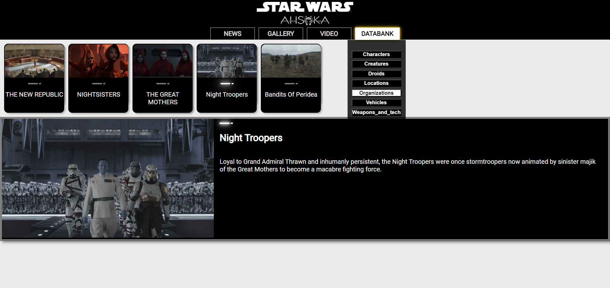

#### In this article, I share what I learned by building a React Star Wars website using Hashnode's AI for pair programming. Discover the pros and cons of working with AI and how it enhances coding skills!

---

---

#### The pros of building with AI

* It's like having a personal mentor who never tires
    
* You can build code a step above your current knowledge
    
* You can have AI explain how each line of code works
    
* You can use AI to add comments to explain how each block of code works
    

#### The cons of building with AI

* It can misdirect you
    
* Provides inconsistent code
    
* Become too dependent on it
    
* For every new session, you have to explain your work repeatedly.
    

---

### Introduction

As a self-taught developer, I decided to take on an experimental challenge: build an entire React website only by pair programming with AI.

So far, I've been learning how to code through online coding schools, Udemy courses, YouTube tutorials, and other means of online recourses.

Over several months, I have successfully created a React website and written a nine-article series covering various aspects of the journey. This article covers the lessons I learned from this experience, which I believe represents a new frontier in learning: programming with AI!

---

---

### Use AI as Your Mentor

You likely have many programming questions if you're a self-taught developer like myself. Ideally, you should have a mentor who can provide answers and guidance with coding and best programming practices. However, you might hesitate to reach out to others for fear of bothering them.

**AI is an excellent solution to this problem. Using AI as your personal teacher is like having a mentor who's always available to help and never tires of the onslaught of questions you will have!**

Reaching out to others for help is still a good idea, as it shows your commitment to learning and helps build your online presence. But using AI first ensures that the questions you ask others will be well-thought-out!

---

### Learn How to Separate Files

As you probably know, there are many ways to program and achieve the same result. While learning React, I was putting all the code into single files, which were becoming quite large.

**Although I had yet to learn how to separate files correctly in a React project, I used AI to help me. I was instructed to create separate files for data, functions, components, and images. This restructuring made my code cleaner and more efficient, demonstrating the importance of file separation in React projects.**

Using AI to help you better structure your projects is highly beneficial. Additionally, the article I wrote about this aspect of building a React website with AI was featured on Hashnode, which verifies its importance.

---

### Build Code Beyond Your Current Knowledge

Instead of searching for YouTube tutorial videos, I chose to pair program with AI to write code beyond my current knowledge.

**With trial and error, I successfully built a:**

* Dropdown Menu in React
    
* Dynamic Hamburger Menu
    

**I also learned how to use React libraries to add features such as:**

* YouTube Videos
    
* An Image Carousel
    

**Using AI to pair program has gradually improved my coding skills. I am no longer limited to my current level, as I can now ask AI how to build something and receive assistance in creating it.**

---

---

### I Built a Component for Dynamic HTML Layouts

For my website, I aimed to create news articles similar to those on the official Star Wars website. While developing a component to render these articles, I noticed that although the header section was consistent, the body structure of the articles varied in terms of paragraphs and images. Until this point, all my React components had a uniform structure.

**I created a sub-component that dynamically renders different HTML elements based on the content data by conversing with AI about the inconsistencies in paragraphs and images in the news articles I wanted to render. This sub-component maps over an array of content objects and conditionally renders paragraphs and images, ensuring flexibility and adaptability in the layout.**

This was a significant step in my React learning journey, as I learned how to create a custom component that can render dynamic layouts.

---

---

### Some Libraries Rely on Others

With the help of pair programming with AI, I now had a working news article component. I was eager to implement the React share library to share each article with the click of a Twitter and LinkedIn icon. However, even though my React app worked, the social share icons always directed users to the main webpage. That's when I remembered, and it became clear to me what a one-page React app actually is!

**My initial thought of using the react-share library in conjunction with React Router was confirmed when I conversed with AI about each article needing a unique URL for the react-share library to work. I now learned that some React libraries rely on others.**

Through pair programming with AI, I learned the basics of React Router and integrated it into my project, making the social share icons work as expected.

---

### AI Can Explain How the Code Works

A great use case for using AI when learning web development is to ask how code works. When learning how to code, we often focus on getting it to work. Then, when it works, we move on without fully understanding how it works.

**When building React components through pair programming with AI, I find asking the AI to explain how the code works is beneficial. This technique is also effective when reviewing code after some time has passed and returning to it.**

---

### Use AI to Add Comments

Although code comments are often frowned upon when misused in a professional environment, they are very helpful when you are learning.

**After completing a React component or any file in your project, you can use AI to add comments. This is useful when learning how to program because it helps clarify the purpose and functionality of the code, making it easier to understand and maintain in the future.**

---

### AI Can Misdirect You

So far, I've been discussing the benefits of pair programming with AI, but it's not perfect. AI often speaks confidently, which can be confusing when it provides incorrect information. This situation is called hallucination, where the AI generates responses that are not based on the input data or reality. These hallucinations can lead to incorrect or misleading code, making verifying the AI's suggestions essential.

Additionally, I learned that AI does not always provide the most concise code. I spent a lot of time trying to pair program a solution for submenus staying open in a hamburger menu. I resolved the problem by starting over and creating a clear prompt about what I wanted to achieve, which resulted in a few lines of code in a useEffect hook.

**So, the takeaways are to take what AI says with a grain of salt (verify the data it provides separately) and make your prompts as clear and precise as possible to get the best results.**

---

### AI is Inconsistent

Another thing I noticed is that AI provides inconsistent code solutions to prompts. For example, it provided me with both class and function versions of React code while working on the same project.

The syntax of React Router varies depending on the version. So, I also experienced inconsistency when trying to pair programs with AI, as it provided various code solutions. This was particularly difficult since I had not previously learned React Router.

**So, I advise you to inform the AI upfront about your preferences and the version of the code you want to generate.**

---

### It's Easy to Become dependent on AI

Creating code blocks by prompting AI is relatively easy, making it even easier to depend on it. Much like following along with a coding tutorial, you feel a sense of accomplishment when the code works and an embarrassment when you then try to code what you learned without referencing the tutorial and your code doesn't work (a.k.a. Tutorial Hell).

I struggled to continue building my React project because I did not fully understand how the AI-generated code blocks worked. So, I had to revisit my code and have AI explain how it worked in my project to complete my Star Wars Ahsoka React website successfully.

**As mentioned earlier, asking AI to explain how code works is beneficial, especially when you return to it after some time.**

---

### Re-explaining Your Work in Every Session

At least in the current version of the Hashnode AI assistant, you have to explain your work repeatedly for every new session. There is no chat history, so it is a fresh start for every session. This results in time-consuming copying and pasting code into the chat and having to provide context to the project you are working on for each session. I've accidentally ended chat sessions with the Hashnode AI assistant, which is frustrating because it makes me have to start over again.

*To be fair, I believe I am using the Hashnode AI assistant beyond its intended purpose (I don't think it's meant to be used to build an entire project).*

---

### Key Lesson:

**AI can be a powerful tool when used responsibly, enhancing your coding skills and efficiency. However, if misused, it can become a crutch, leading to dependency.**

*Learning to work effectively with AI is crucial for securing and maintaining a job in the tech industry, helping you stay ahead in the constantly evolving tech landscape.*

---

#### **Article Series:**

1. [Learn to Use Component Identifiers as Props for Rendering Various HTML Elements Dynamically](https://selftaughttxg.com/2024/01-24/learn-to-use-component-identifiers-as-props-for-rendering-various-html-elements-dynamically/)
    
2. [A Guide to Better Code Organization in React through File Separation](https://selftaughttxg.com/2024/01-24/a-guide-to-better-code-organization-in-react-through-file-separation/)
    
3. [Building a Dropdown Menu in React: A Step-by-Step Guide](https://selftaughttxg.com/2024/01-24/building-a-dropdown-menu-in-react-a-step-by-step-guide/)
    
4. [Developing a Dynamic Hamburger Menu in React: A Step-by-Step Guide](https://selftaughttxg.com/2024/02-24/developing-a-dynamic-hamburger-menu-in-react-a-step-by-step-guide/)
    
5. [How to Integrate YouTube Videos into React Applications](https://selftaughttxg.com/2024/03-24/how-to-integrate-youtube-videos-into-react-applications/)
    
6. [How to Integrate a Carouse into React Applications](https://selftaughttxg.com/2024/01-24/learn-to-use-component-identifiers-as-props-for-rendering-various-html-elements-dynamically/)
    
7. [Building Flexible React Components for Dynamic HTML Layouts](https://selftaughttxg.com/2024/06-24/building-flexible-react-components-for-dynamic-html-layouts/)
    
8. [How to Set Up Dynamic Routing with React Router](https://selftaughttxg.com/2024/07-24/how-to-set-up-dynamic-routing-with-react-router/)
    
9. [Implementing Dynamic Social Media Sharing in Your React App with React Share](https://selftaughttxg.com/2024/07-24/implementing-dynamic-social-media-sharing-in-your-react-app-with-react-share/)
    

---

### **The Finished Project**

**Here are the links to the project:**

* [GitHub repo](https://github.com/MichaelLarocca/react-dynamic-elements-starwars-cards)
    
* [Netlify deployed project](https://react-dynamic-elements-starwars-cards.netlify.app/)
    

---

### Conclusion

Building a React Star Wars Ahsoka website with the help of Hashnode's AI for pair programming has been an enlightening experience. While AI offers numerous benefits, such as acting as a tireless mentor and enabling you to write code beyond your current knowledge, it also comes with challenges like potential misinformation and dependency.

From my personal experience, I've learned that using AI responsibly can significantly enhance your coding skills and efficiency. However, it can also become a crutch, leading to dependency and hindering your growth as a developer.

When using AI to aid your development journey, always verify its suggestions and take the time to understand the code it provides. This balanced approach will help you stay ahead in the fast-changing tech world!

---

###### *Are you now confident in building a website with AI assistance? Do you have any other tips or experiences with AI pair programming? Please share the article and comment!*