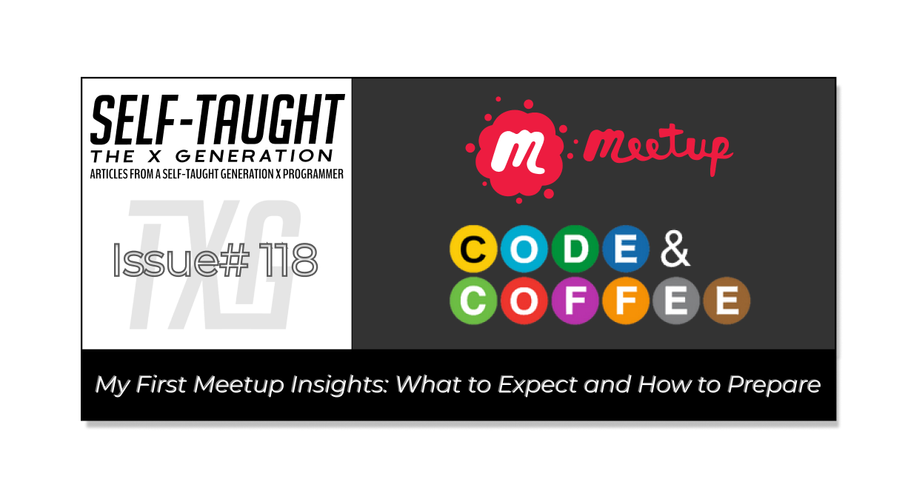

---

#### Attending meetups can help advance your tech career. But what should you expect, and how should you prepare for your first one? I share my insights in this article to help you make the most of yours!

---

---

### Why Attend Meetups?

As a web developer seeking a tech job, attending meetups offers numerous benefits. These events provide networking opportunities, which include meeting developers and others already working in the tech industry. You will also have opportunities to enhance your technical skills, stay updated on industry trends, and seek mentorship from experienced professionals.

Meetups also offer the chance to improve your public speaking skills through casual conversations and presentations if you choose to give them. Additionally, you can engage in collaborative learning and even meet industry celebrities, as I did!

**Benefits of Attending Meetups for Web Developers:**

* **Networking:** Meet developers and others already working in the tech industry to expand your professional network.
    
* **Skill Development:** Enhance your technical skills and learn new technologies.
    
* **Mentorship:** Seek guidance and mentorship from experienced professionals in the community.
    
* **Career Advancement:** Discover job opportunities and get career advice from industry experts.
    
* **Community Building:** Build lasting friendships and participate in an inclusive environment emphasizing belonging, safety, and trust.
    

---

## What is Code & Coffee

Code & Coffee is a community-driven meetup group designed for developers and those who work with them, such as project managers, UX professionals, and data scientists. The group welcomes individuals at any experience level, from aspiring developers to seasoned professionals.

At Code & Coffee events, attendees engage in discussions, work on projects, seek mentorship, and build lasting friendships. The community emphasizes belonging, safety, and trust and aims to create an inclusive environment where members can learn, network, and support each other.

*Currently,* [*Code & Coffee*](https://codeandcoffee.org/) *hosts events in 35 cities and is growing!*

---

### Meetup Events

**To attend an official** [**Meetup**](https://www.meetup.com/) **event, you need a Meetup account and must RSVP for each event you plan to join. When you arrive, you must sign in using a QR code from the Meetup App.**

Upon arriving at the Code & Coffee Meetup at "The Yard" in Brooklyn, New York, I encountered a problem. My Meetup App on my iPhone 11 glitched, preventing me from displaying my QR code to sign in. Oh, calamity! I was already off to a nerve-racking start. Fortunately, there was an alternative method: I signed into the Meetup manually, filling out a form on the same provided laptop that others were scanning into with QR codes.

*So, be prepared to sign in when you arrive. I suggest taking a screenshot of your QR code ahead of time. This way, you will be prepared if you encounter problems like poor cellphone reception, Meetup App glitches, or other potential issues.*

---

### A Warm Greeting

Fortunately, I quickly rebounded from the embarrassing sign-in problem. Two people from my online social network recognized me and greeted me warmly: Code & Coffee host Steven Troy Gittens and Richard Choi. I recently gave both of them and Code & Coffee a shoutout in an article covering the highlights of "[THAT Conference](https://www.htmlallthethings.com/blog-posts/highlights-from-that-conference-wi-2024)," held in Wisconsin.

**Based on my experience, to make your first in-person event more comfortable, plan on meeting people you know from social networks and consider becoming a content creator for even more potential recognizability.**

*As Kent Dodds, a well-respected figure in the developer community, stated in his THAT Conference Keynote presentation, "It's not what you know or who you know. It's who knows you and what they know about you!"*

###### *Richard Choi (left), Steven Troy Gittens (middle), and myself (right).*

---

### 7-Second Introductions

Everyone was already enjoying lively conversations when a loudspeaker announcement instructed us to move up to the third floor for introductions. The event hadn't officially started yet, as others were still arriving, but this was a good sign because everyone was already having a good time!

We went to the third floor, formed a circle, and each gave a seven-second elevator pitch describing ourselves, our interests, and our tech goals. This activity aimed to help people form groups with common interests. I was surprisingly nervous and slurred my speech, as I was unprepared with a pitch.

**Tips for Perfecting Your Elevator Pitch:**

1. **Prepare Your Pitch**: Write and practice a concise seven-second pitch that includes your name, interests, and tech goals.
    
2. **Practice Public Speaking**: Rehearse in front of a mirror or with friends to build confidence and reduce nervousness.
    
3. **Stay Calm and Breathe**: Take deep breaths before speaking to stay calm and deliver your pitch clearly.
    
4. **Engage with the Audience**: Make eye contact to create a connection and make your pitch more engaging.
    
5. **Listen to Others**: Pay attention to other pitches to identify common interests and form groups easily.
    

###### *Each attendee gave a seven-second introduction about themselves.*

---

### Meeting Celebrities

Meetups are more than networking for job opportunities; they are also an opportunity to meet tech industry celebrities! At this Meetup, I finally met [James Q. Quick](https://www.youtube.com/@JamesQQuick) in person after corresponding with him on social media for years. James is a renowned JavaScript Developer, Speaker, and Teacher passionate about empowering developers. He has worked with companies like Microsoft and Auth0 and has a YouTube channel with over 200k subscribers, where he shares his expertise in modern web development. I kept mentioning his status as a YouTube celebrity to others who joined our conversation circle. 😉

###### *From left to right: [Steven Troy Gittens](https://twitter.com/troygittens), [Sam](https://twitter.com/metruzanca), [Richard Choi](https://twitter.com/choir241), [myself](https://twitter.com/mikejudelarocca), and [James Q. Quick](https://twitter.com/jamesqquick).*

---

I realized that not everyone knew James Q. Quick, other Twitter members in our conversation circle, or myself, which made for balanced introductions. This was advantageous because it leveled the playing field and allowed everyone to start fresh.

*Without preconceived notions, attendees could focus on genuine interactions and form connections based on shared interests. This inclusive environment encouraged meaningful conversations, as people were open to learning about each other without prior judgments.*

---

### A Quick Exit

I did not stay for the entire event due to prior engagements, but I'm glad I put myself out there, tested the waters, and had my first in-person event experience. I just intended to see what they are all about firsthand and to meet people I already knew from social online networks in person.

After saying my goodbyes to the people in my group circle, I went to look for Code & Coffee host Steven Troy Gittens to express my gratitude. After finding and thanking him, I turned around and walked down the corridor to the door, which I believed was the exit back to the first floor. I embarrassingly had to walk back to Steven and ask him where the exit was, which was actually right there!

**So, I strongly advise you to familiarize yourself with the venues you attend so you know how to navigate and exit the meetups to avoid any potential embarrassment, as I did.**

*(Steven was glad to instruct me on how to exit and most likely unaware of my embarrassment, I hope! 😅)*

---

---

### Making Connections Through the Meetup App

After the event, you have limited time to connect with other attendees on the Meetup App. However, I didn't realize there was a 24-hour limit for the connection requests you can send. So, once I maxed out, they gave me an option to pay for the "Meetup+" subscription. Also, to make a connection, the other person has to choose you too!

**To make the most of your Meetup App connection limit, first:**

* Connect on other social platforms (Twitter, LinkedIn, etc.)
    
* Exchange contact information (e-mail, phone number, etc.)
    
* Don't connect with people you're already connected with on other platforms
    
* Plan to meet others at another event
    
* Consider joining online communities or forums with the people you meet
    

*Now that you've first connected through other means, you can use your limited Meetup App connection requests to connect with additional attendees.*

---

### What I plan to do next time

Now that I have attended my first in-person meetup event, I have a few plans to make the next one an even better experience.

First, I need to write and practice my 7-second elevator pitch. It should clearly tell other attendees what I do and what I want to learn. A new approach I thought of is offering what I can teach others instead of asking for help. I can let others know that I am earning side income as a technical writer and offer to teach them what has been working for me if they are interested in blogging. With this approach, others will come to me, which I believe is more comfortable than going to them.

Next, I also plan to bring a computer to showcase my projects. Since my friends and family aren't programmers, I'm really looking forward to having my code reviewed by more experienced developers.

Finally, I plan to attend meetups regularly because the more you do something, the better you get at it! At the events, I will make an effort to make new connections with people outside of my current network. Meeting my online friends in person was a great experience, and I look forward to forming new connections. So, if you're attending upcoming meetups, keep an eye out for me. I'm glad to connect with you!

---

### Key Points for Making the Most of Your First Meetup Event

* **Create a Meetup Account**: Sign up for a Meetup account and RSVP for the events you plan to attend.
    
* **QR Code Preparation**: Before attending the event, take a screenshot of the QR code needed to sign in to avoid potential issues with the Meetup App.
    
* **Prepare Your Elevator Pitch**: Write and practice a concise seven-second elevator pitch that includes your name, tech goals, and interests.
    
* **Offer Help**: Consider offering others what you can teach them instead of asking for help to attract more connections.
    
* **Showcase Your Projects**: Bring a computer to showcase your work and get feedback from experienced developers.
    
* **Connections**: Connect with attendees on other social platforms and exchange contact information (Twitter, LinkedIn, Discord, etc.)
    
* **Meetup App Connection Limit**: Be aware of the 24-hour limit for connection requests on the Meetup App and plan accordingly. Remember, to make a connection, the other person has to choose you too!
    
* **Familiarize with the Venue**: Know how to navigate and exit the venue to avoid any potential embarrassment.
    

---

### Conclusion

Attending your first Meetup is a milestone step for your tech career. Meetups offer excellent opportunities for networking, learning new skills, finding mentors, and advancing your career.

The Code & Coffee Meetup is a great entry-level event because it doesn't focus on a specific technology. Instead, it covers tech in general, and they have a warm and welcoming staff.

You can make your first in-person event more comfortable by just meeting others you know on your social network and not worrying about seeking employment opportunities. Think of it as a test run to see firsthand what it's all about.

To make the most of your first Meetup, prepare a concise seven-second elevator pitch that includes your name, tech goals, and interests. Instead of asking for help, consider offering what you can teach others to attract more connections. Try to connect with attendees through your socials first, such as Twitter, LinkedIn, and Discord, as the official Meetup app has limitations for connections.

Finally, consider bringing a computer to showcase your projects and get feedback from experienced developers, and be sure to familiarize yourself with the venue to navigate and exit smoothly, avoiding any potential embarrassment, as I did!

So, take the plunge, attend your first Meetup, and start building your tech community. Look for me at future events—I’d be happy to connect!

---

###### *Are you now confident in making the most of your first Meetup event? Do you have any additional tips or experiences to share? Please share the article and comment*
