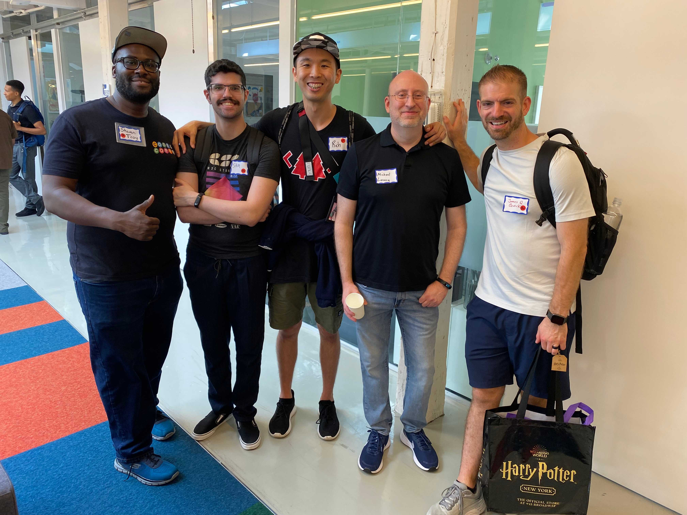
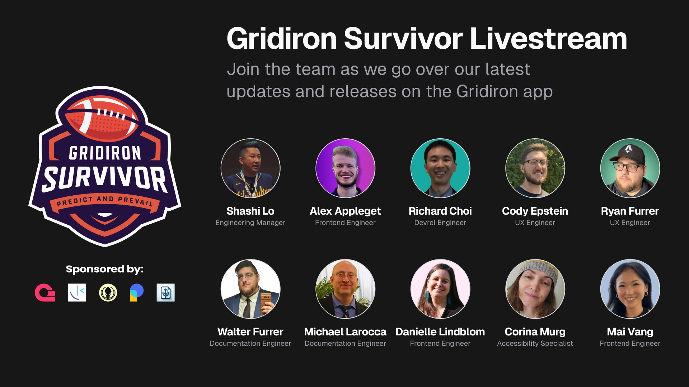

#### Discover how learning in public and networking can transform your tech career. Uncover strategies to enhance your skills, build connections, and unlock unexpected opportunities for growth and success!

---

---

### Introduction

I want to share with you a profound technique that is greatly assisting me in advancing my journey in changing careers into tech: **learning in public** and **networking with people**.

While it may take some time to explain, this technique is practical and can be easily integrated into your learning process. Once you understand and apply it, I believe you can achieve similar positive results.

---

### Learning in Public

What do I mean by learning in public? As an aspiring web developer, you will be learning continually. Taking the extra time to document and share your learning will significantly benefit you in several ways.

* Reinforce what you learn
    
* Understand the topic better
    
* Create documentation for yourself and others
    
* Form and display a habit of discipline
    
* Provide others with examples of your work and skills
    

They say if you cannot explain a topic in detail to others, you do not truly understand it. Writing an article, recording a video, or sharing what you are learning in a detailed post will help reinforce what you've learned and improve your understanding of the topic.

Creating content based on what you are learning also provides documentation for yourself and others; reading your articles for refreshers on topics and step-by-step instructions is a great feeling.

As an aspiring professional developer, learning in public in this manner consistently creates and displays a habit of discipline. It provides others with examples of your work and skills, which can lead to career-advancing opportunities!

*As you'll see in my success story later, learning in public is opening doors to unexpected opportunities and is pivotal to my career advancement.*

---

### Networking with People

While you are learning in public, be sure to also network with the people engaging in your work.

Network with the people you interact with on social media, online coding schools, Discord, and other means of communication web developers use. You will gradually grow your network over time by doing so.

**A robust network will provide career-advancing opportunities and a safety net should you lose your job: when work opportunities arise through your network, you can reach out to them, and they might even contact you first!**

Within my network, [Brian Morrison](https://x.com/brianmmdev) quickly secured a new job at [Clerk](https://x.com/ClerkDev) just days after being laid off. [James Q. Quick](https://www.youtube.com/@JamesQQuick) received numerous guaranteed job offers from his connections following his layoff from PlanetScale.

I've recently taken this networking technique a step further by attending local [Code and Coffee](https://codeandcoffee.org/) meetups. Making connections online is important, but meeting people in person can solidify these connections and even help you meet more people who can help advance your career.

###### *From left to right:* [*Steven Troy Gittens*](https://twitter.com/troygittens)*,* [*Sam*](https://twitter.com/metruzanca)*,* [*Richard Choi*](https://twitter.com/choir241)*,* [*myself*](https://twitter.com/mikejudelarocca)*, and* [*James Q. Quick*](https://twitter.com/jamesqquick)*.*

---

### Authenticity and Consistency

**The technique of learning in public and networking with people to advance your career comes with a caveat: it must be done with authenticity and consistency.**

It is in your best interest to network with others authentically, wanting to get to know them for who they are, not with the intention of what they can do for you! Be encouraged. In my experience, what is known as “Tech Twitter“ is full of wonderful people who teach, inspire, encourage, and help one another. So I personally invite you to start there!

Most importantly, you must consistently learn in public and engage with your network. In order for this technique to be effective, you must play the long game; think of it like a marathon race, as opposed to a sprint. In time, you will have accumulated so much content creation by learning in public and have grown your personal network so extensively that you will significantly increase your chances of achieving career success when opportunities arise!

---

### Success Stories

Why am I so insistent that you learn in public and network with people? Because in an unstable job market, these are two things you can control that will increase your chances of success, just as they have for me.

**I take a famous saying to heart: Success is where preparation meets opportunity. Preparation in this context is learning in public and networking with people; success is securing job opportunities when they arise.**

Keep in mind that career-advancing opportunities do not always involve receiving payment. A great opportunity I secured is becoming a [contributing author for freeCodeCamp](https://www.freecodecamp.org/news/author/MichaelJudeLarocca/). Writing for freeCodeCamp provides an unbelievable reach for my articles, as they are literally shared with millions of people! Writing for freeCodeCamp increased my credibility, recognition, and reputation. I credit being accepted as a freeCodeCamp contributing author to my personal blog, Self-Taught the X Generation, where I wrote coverage articles about their platform, including my experiences learning on it. Founder Quincy Larson read one of my coverage articles and directly messaged me on Twitter. He liked the article and complimented me on the name of my blog and my branding; it turns out that he is also a Star Trek the Next Generation fan, and he noticed the reference!

When I applied to become a contributing author for freeCodeCamp, I was surprised to learn that Quincy was one of the three staff members making the decision. I wonder if my existing articles, some of which featured freeCodeCamp, and my personal connection with Quincy Larson, the platform's founder, influenced their decision. This rhetorical question supports the idea of learning in public and networking with people to secure career-advancing opportunities! Special note: I provided three of my best articles, as required, demonstrating my writing abilities, and they were not freeCodeCamp articles.

I secured my first paid opportunity when a writing gig came up at [Scrimba](https://scrimba.com/articles/author/michael/), as they began paying writers to contribute to their blog. Since I had been writing articles on my personal blog about my experience with Scrimba, they were already familiar with me and my writing skills, so they brought me on board.

Learning in public showcased my coding skills by sharing my projects and writing articles about them, complete with links to the live models. This helped me land additional opportunities with Scrimba, where I became a paid code reviewer for their bootcamp. I also received an invitation for a paid public speaking livestream event with them to teach students about the benefits of blogging.

My work opportunities, gained through learning in public and networking, also led to collaborations on additional projects. The [HTML All The Things Podcast](https://www.htmlallthethings.com/blog) contacted me and offered a paid position to write articles for their website and assist in expanding their platform. More recently, I also secured a role as a Documentation Engineer for [Gridion Survivor](https://github.com/LetsGetTechnical/gridiron-survivor), an app developed by a select group of junior developers under the mentorship of Microsoft Engineer Shashi Lo as part of his [apprenticeship program](https://www.htmlallthethings.com/blog-posts/bridging-the-skills-gap-empowering-junior-developers-through-apprenticeship-programs). This program aims to provide real-world team environment experience, which is highly valued by hiring managers, as it makes candidates' onboarding process more manageable, ultimately leading to being hired!

---

---

***This technique of learning in public and networking is easy and attainable to adopt, and I believe you will also reap career-advancing opportunities by applying them! It will take time, and you must do it consistently and authentically. When done effectively, this approach will create a wealth of ongoing opportunities for you!***

---

#### **My Other Related Articles**

* [My First Meetup Insights: What to Expect and How to Prepare](https://selftaughttxg.com/2024/08-24/my-first-meetup-insights-what-to-expect-and-how-to-prepare/)
    
* [Milestone 100th Issue: Using Blogging to Elevate Your Career](https://selftaughttxg.com/2023/10-23/milestone-100th-issue-using-blogging-to-elevate-your-career/)
    
* [Developing Executive Presence: How to Become a Sought-After Developer](https://selftaughttxg.com/2023/08-23/developing-executive-presence-how-to-become-a-sought-after-developer/)
    
* [Creating Opportunity: Personal Branding Strategies for Success](https://selftaughttxg.com/2023/06-23/creating-opportunity-personal-branding-strategies-for-success/)
    
* [Maximizing Your Job Search: Insights from Andronica Klaas, Meta Engineer](https://selftaughttxg.com/2023/03-23/maximizing-your-job-search-andronica-klaas/)
    
* [Always Prepared: Crafting a Contingency Plan for Job Loss and Recovery](https://selftaughttxg.com/2023/05-23/always-prepared-crafting-a-contingency-plan-for-job-loss-and-recovery/)
    
* [Bridging the Skills Gap: Empowering Junior Developers Through Apprenticeship Programs](https://www.htmlallthethings.com/blog-posts/bridging-the-skills-gap-empowering-junior-developers-through-apprenticeship-programs)
    

---

### Advance your career with a 20% discount on Scrimba Pro using this [affiliate link](https://scrimba.com/?via=MichaelLarocca)!

Become a hireable developer with Scrimba Pro! Discover a world of coding knowledge with full access to all courses, hands-on projects, and a vibrant community. You can [read my article](https://selftaughttxg.com/2021/06-21/06-07-21/) to learn more about my exceptional experiences with Scrimba and how it helps many become confident, well-prepared web developers!

###### ***Important:*** *This discount is for new accounts only. If a higher discount is currently available, it will be applied automatically.*

**How to Claim Your Discount:**
1. Click [the link](https://scrimba.com/?via=MichaelLarocca) to explore the new Scrimba 2.0.
2. Create a new account.
3. Upgrade to Pro; the 20% discount will automatically apply.

##### ***Disclosure:*** *This article contains affiliate links. I will earn a commission from any purchases made through these links at no extra cost to you. Your support helps me continue creating valuable content. Thank you!*

---

### Conclusion

Learning in public and actively networking are continually providing career-advancing opportunities for me, and I believe that if you follow the same technique, you will achieve similar success!

By sharing your learning journey with others, you strengthen what you already know and gain a better understanding of the subject matter. By documenting and sharing your experiences, you effectively showcase your skills and knowledge to a wider audience. This can catch the attention of potential employers and collaborators, helping you connect with people who might offer valuable career opportunities.

Most importantly, be authentic when networking with others. Focus on getting to know them rather than trying to gain something from them! Over time, as your network grows, you'll create a safety net of career opportunities and support in uncertain job markets. By genuinely connecting with your network, you'll find that these efforts can lead to unexpected growth and success, as it has for me!

Start your journey today by sharing your learning experiences and connecting with others—your future self will thank you for the opportunities and career growth that follow!

---

###### *Are you now ready to embrace learning in public and networking to advance your tech career? Have you already started seeing the benefits of these practices? Please share the article and comment!*
