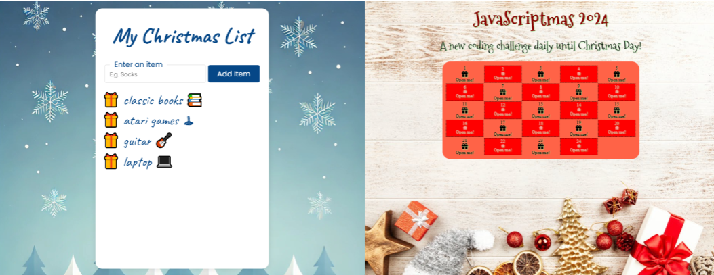

#### Tis the season! JavaScriptmas is here again! JavaScriptmas is a FREE annual festive coding event hosted by the online coding school Scrimba, consisting of 24 daily coding challenges, prizes, and more!

---


---

### What is JavaScriptmas?

JavaScriptmas is a festive coding event hosted by Scrimba from December 1st to 24th. Each day, you will get a new JavaScript challenge to help improve your coding skills, and you can win prizes! You can submit each valid challenge solution twice for two chances of winning! Since it's a raffle, it's fair for developers of any coding level, as it doesn't depend on skill.

To submit your challenge solution, click "Submit Solution" to save your work, which will automatically enter you into the Grand Prize draw. For an additional chance to win, click the "Share" button to spread the JavaScriptmas cheer on X and/or LinkedIn—they will select a second lucky winner from the social posts! The more challenges you solve, the better your chances of winning the grand prize, so keep submitting!

**On December 24th, they will be choosing two lucky Grand Prize winners who will each receive:**

* A 13” **MacBook** Air M3
    
* Merch from **MDN** and **Scrimba**
    
* Lifetime Scrimba Pro access
    

*Join the fun and improve your JavaScript skills this holiday season!*

---

#### **Community highlights**

In the spirit of the festive holiday season, I enjoy showcasing others' work in the community highlights section of my JavaScriptmas articles! I'll be searching X/Twitter, LinkedIn, and the Scrimba Discord channel for "outstanding" submissions by fellow participants to feature. 🎉

---

#### **My solutions**

As I do every year, I will participate in JavaScriptmas and share my solutions on social media. I will provide links to the Scrims in these coverage articles as I complete the challenges. 💻

---

### **Community highlights ⬇**

---

#### **Berat (**[**@BeratSakipi**](https://x.com/beratsakipi)**)**


Berat solved the day one Christmas List challenge and explained in detail how each part of his wishlist variable works. He used JavaScript’s `trim`, `split`, `filter`, `join`, and `toLowerCase` to help prepare unique items to enter into the Christmas List, including trimming out troublesome white spaces!

Next, with the wishlist variable ready, Berat uses the JavaScript `includes` method to check if a duplicate item is already in the list array before adding the new item.

```javascript
// Function to check item is not duplicate
function checkDuplicate() {
    const itemText = itemInput.value
    // trimming the spaces out of the sentence before checking if it included in the 'listArr' array
    const wishListItem = itemText.trim() // trim the leading and trailing empty spaces
                                 .split(' ') // split every word and possible empty space inside the string into an array of words and spaces
                                 .filter(str => str !== '') // take only the words
                                 .join(' ') // and join them with one space inbetween
                                 .toLowerCase() // transform the word/sentence to lowercase letters
    // Checking if there is an input and if that input value is not included in the 'listArr' array
    if (wishListItem && !listArr.includes(wishListItem)) {
        listArr.push(wishListItem)
        renderList()
    }
}
```

Berat also solved the delete button stretch goal, as you can see in the code block below. Great job, Berat!

```javascript
// Function to add an item to the shopping list
function renderList() {
    shoppingList.innerHTML = ''
    listArr.forEach((gift, index) => {
        const listItem = document.createElement('li')
        listItem.textContent = gift
        
        const deleteItemBtn = document.createElement('button')
        deleteItemBtn.textContent = 'Delete Item'
        deleteItemBtn.classList.add('delete-gift-btn')
        deleteItemBtn.id = `delete-gift-btn`
        
        const giftContainer = document.createElement('div')
        giftContainer.classList.add('gift-container')
        
        deleteItemBtn.addEventListener('click', () => {
            listArr.splice(index, 1)
            renderList()
        })
        
        giftContainer.appendChild(listItem)
        giftContainer.appendChild(deleteItemBtn)
        shoppingList.appendChild(giftContainer)
    })
    itemInput.value = ''; // Clear the input field
}
```

[***🔗 Link to the scrim***](https://scrimba.com/javascriptmas-c0javascriptmas/~07tn/s0fqbljkrr/head)

---

#### **Lynjai Jimenez (**[**@imdesignsllc**](https://x.com/imdesignsllc)**)**


For the day two challenge, Lynjai Jimenez created a beautiful “ugly calendar!“ She completed the stretch goal of clicking each box to reveal an opened image and included captivating animations!

Lynjai also turned the calendar into a countdown! Each date box clicked brings you one day closer to JavaScriptmas! Outstanding work, Lynjai Jimenez!

**Features:**

* User can click each day to open
    
* UI has been updated with Christmas colors
    
* Added countdown to JavaScriptmas
    
* The 24th day changes the background image
    
* User can unclick the current clicked date if needed
    

[***🔗 Link to the scrim***](https://scrimba.com/javascriptmas-c0javascriptmas/~02cq/s0s1ba5sso/head)

---



### ❄ My JavaScriptmas submissions ❄

| **Date** | **Scrim** |
| --- | --- |
| 12/01/2024 | [Grandpa's Gift List](https://scrimba.com/javascriptmas-c0javascriptmas/~07tn/s0b1lfvfka/head) |
| 12/02/2024 | [Ugly Advent Calendar](https://scrimba.com/s06j6m7/s0uukfplts/head) |

---

#### ***If you would like to learn more about my journey with Scrimba and how learning with them may help you, you can read my article:*** [***How Scrimba is helping me and many others to become confident, well-prepared web developers***](https://selftaughttxg.com/2021/06-21/06-07-21/)

---

#### **Scrimba has once again impressed and inspired me! You can read my full** [**Scrimba review**](https://selftaughttxg.com/2020/12-20/Review-Scrimba/) **on my 12/13/2020 post.**


#### ***"That's one of the best Scrimba reviews I've ever read,*** [***@MikeJudeLarocca***](https://twitter.com/MikeJudeLarocca?ref_src=twsrc%5Etfw)***. Thank you! 🙏 "***

###### **— Per Harald Borgen, CEO of Scrimba** [**December 14, 2020**](https://twitter.com/perborgen/status/1338462544143540227?ref_src=twsrc%5Etfw)

---

**Get a 20% Discount with This Affiliate Link!**

Use this [affiliate link](https://scrimba.com/?via=MichaelLarocca) for a special 20% discount! (If a higher discount is currently available, that will be applied instead.)
- **Important:** This discount is for new accounts only.
- Click the link to explore the new Scrimba 2.0!
- Create an account, and you can upgrade to pro content, where you should see the 20% discount listed.

**Disclosure**: This article contains affiliate links. I may earn a commission on any purchases made through these links at no extra cost to you. Your support helps me continue producing valuable content. Thank you!

---

### **Conclusion**

Scrimba's annual JavaScriptmas event is a fun, festive way to commit to coding daily. Whether you are a new coder or a seasoned one, you can share your work with the community, make new friends, and even win prizes!

If you want to continue learning with Scrimba after the FREE event, check out their many FREE courses! If you are ready to commit to becoming a hireable front-end web developer, be on the lookout for their holiday discounted course rates!

Don't miss out on this exciting coding event! Participate in Scrimba's JavaScriptmas today, share your solutions, connect with fellow developers, and improve your skills while having fun! Merry JavaScriptmas! 🎄

---

**Let's connect! I'm active on** [**LinkedIn**](https://www.linkedin.com/in/michaeljudelarocca/) **and** [**Twitter**](https://twitter.com/MikeJudeLarocca)**.**

---

###### ***Are you now interested in participating in this year's Scrimba's JavaScriptmas? Have you already participated in last year's Scrimba's JavaScriptmas? Please share the article and comment!***
