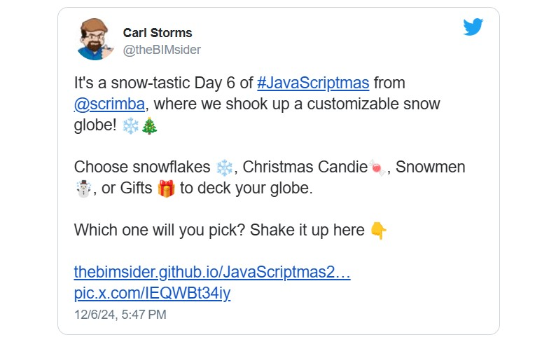

#### **Tis the season! JavaScriptmas is here again! JavaScriptmas is a FREE annual festive coding event hosted by the online coding school Scrimba, consisting of 24 daily coding challenges, prizes, and more!**

---


---

### What is JavaScriptmas?

JavaScriptmas is a festive coding event hosted by Scrimba from December 1st to 24th. Each day, you will get a new JavaScript challenge to help improve your coding skills, and you can win prizes! You can submit each valid challenge solution twice for two chances of winning! Since it's a raffle, it's fair for developers of any coding level, as it doesn't depend on skill.

To submit your challenge solution, click "Submit Solution" to save your work, which will automatically enter you into the Grand Prize draw. For an additional chance to win, click the "Share" button to spread the JavaScriptmas cheer on X and/or LinkedIn—they will select a second lucky winner from the social posts! The more challenges you solve, the better your chances of winning the grand prize, so keep submitting!

**On December 24th, they will be choosing two lucky Grand Prize winners who will each receive:**

* A 13” **MacBook** Air M3
    
* Merch from **MDN** and **Scrimba**
    
* Lifetime Scrimba Pro access
    

*Join the fun and improve your JavaScript skills this holiday season!*

---

#### **Community highlights**

In the spirit of the festive holiday season, I enjoy showcasing others' work in the community highlights section of my JavaScriptmas articles! I'll be searching X/Twitter, LinkedIn, and the Scrimba Discord channel for "outstanding" submissions by fellow participants to feature. 🎉

---

#### **My solutions**

As I do every year, I will participate in JavaScriptmas and share my solutions on social media. I will provide links to the Scrims in these coverage articles as I complete the challenges. 💻

---

### **Community highlights ⬇**

---

#### Carl Storms [(@theBIMsider)](https://x.com/thebimsider)



Carl Storms lives up to his name by wowing us with his winter wonderland snow “storm” globe! The Day 6 challenge, “**Snow Globe Animation**,” involves making snowflakes fall inside a snow globe. Each snowflake must have a random starting position, animation duration, and size.

With Carl’s addition of **gentle shake** and **hard shake** buttons, you can now emulate a full-blown snowstorm within the snow globe! Clicking the shake buttons achieves a stretch goal by animating the snow globe's movement and making the swirling snowflakes burst into a frenzy!

**Carl completed additional stretch goals by adding buttons to start and resume the snowfall and change the snowflakes, allowing users to choose from Christmas candies, snowmen, or gift emojis. Well done, Carl!**


*Carl Storms, also known as the BIMsider, has over 25 years of experience in the AECO industry and is on a journey to learn new coding tricks, including JavaScript, CSS, HTML, C#, and Python. As the Head of Community, Advocacy, and Technology at Newforma, he champions BIM, explores coding, and delves into AI.*

Carl shares his insights through articles on [The BIMsider](https://thebimsider.com/) and engages audiences as a host on podcasts like [Wrenches Gadgets & Hacks](https://bio.link/wghfeed), [BIMThoughs](https://www.youtube.com/channel/UCluEu87j8_lvtI5LSi_1VBg), [The BILT Academy Podcast](https://biltacademypodcast.buzzsprout.com/), and [The Simply Complex Podcast](https://www.simplycomplex.org/podcast).

**Links to Carl’s solutions:**

* [***🔗 Link to the code on GitHub***](https://github.com/TheBIMsider/JavaScriptmas24/tree/main/Day6)
    
* [***🔗 Link to the deployed project***](https://thebimsider.github.io/JavaScriptmas24/Day6/)
    

---

#### **Lynjai Jimenez (**[**@imdesignsllc**](https://x.com/imdesignsllc)**)**


Lynjai Jimenez has once again impressed the JavaScriptmas community, this time by adding video animation to the Day 9 challenge, “**Which recipe should Grandma make**?”

Has TikTok runied Christmas? This challenge involves helping Grandma update her recipes to accommodate her grandchildren’s new food preferences, which resulted from their following of TikTok influencers! Finding a recipe for Grandma requires filtering recipes according to her grandchildren's preferences, which include recipes with at least one ingredient they like and excluding those with ingredients they now dislike.

**Lynjai solved the JavaScript portion of the coding challenge, but what caught everyone's eye was her addition of the delightful dancing gingerbread girl video displayed as the background of her project!**


To set a video as a background, Lynjai first added the video to the images folder. She then used the `<video>` element with `autoplay`, `muted`, and `loop` attributes for seamless playback and applied the class `video-background` for styling. The `<source>` tag specifies the path and type of the video file, ensuring proper display.

```xml
  <video autoplay muted loop class="video-background">
      <source src="./images/gingergirl.mp4" type="video/mp4">
  </video>
```

**While TikTok may have ruined Grandma’s Christmas recipes, the TikTok dancing gingerbread girl video background has delightfully resonated with the JavaScriptmas community! Wonderful work, Lynjai!**

[***🔗 Link to the scrim***](https://scrimba.com/javascriptmas-c0javascriptmas/~07pj/s03ku76ig2/s0gggo1jbj/head)

---

#### Urvashi ([@ihsavru](https://x.com/ihsavru))

<iframe width="928" height="522" src="https://www.youtube.com/embed/NR8O_K4JJMM"></iframe>

---

**Urvashi**, also known as **The Code Dose**, recorded a YouTube video covering how to solve the Day 10 challenge of making a “**Christmas Flag in CSS**.“

Before tackling the JavaScriptmas challenge, Urvashi provides a quick pre-requisite CSS art tutorial, where she teaches how to create basic shapes. She introduces a handy tool, the [CSS clip-path maker](https://bennettfeely.com/clippy/), which allows you to choose from premade shapes, such as a triangle, by copying the selected shape’s clip-path. You can also create clip paths with this tool by simply pointing, clicking, and dragging!

```css
clip-path: polygon(50% 0%, 0% 100%, 100% 100%);
```


Urvashi also demonstrates how to combine simple shapes to create more complex shapes, which is crucial for solving the Day 10 JavaScriptmas challenge. She illustrates how to make a heart shape, first with pen and graph paper and then with code, combining three divs within a container.

**After her CSS art tutorial, Urvashi skillfully and artistically steps through solving the challenge of making a Santa Clause flag. She then goes above and beyond by creating an animated version on Codepen! Outstanding work, Urvashi!**

*Urvashi's social links courses and more are available at* [*beacons.ai/thecodedose*](https://beacons.ai/thecodedose)*.*

**Links to Urvashi's Day 10 solutions:**

* [***🔗 Animated Codepen***](https://codepen.io/ihsavru/pen/VYZaVBd)
    
* [***🔗 Link to the scrim***](https://scrimba.com/s06j5l7/s03cm*abvo0/s04s3mbhmk/head)
    

---

#### Daniel Laera ([@daniellaera](https://x.com/daniellaera))

<iframe width="928" height="522" src="https://www.youtube.com/embed/JWYKtGetyzY"></iframe>

---

Daniel Laera skillfully steps through solving the Day 11 challenge, “**Card Matching Game,** “ in a Livestream YouTube video!

The Card Matching Game challenge is a classic "Find the Pair" game with a festive Christmas theme. In this game, players reveal cards by clicking on them. When a player reveals one card, it remains visible until a second card is revealed. If the two revealed cards match, they stay visible for the remainder of the game. However, if the cards do not match, they are flipped back to their hidden state. To add an element of unpredictability, the cards are shuffled at the beginning of each game, ensuring a fresh and engaging experience every time.

**Daniel solved the Card Matching Game challenge by implementing a series of functions to manage the game's logic. The** `shuffleArray` **function is used to randomize the order of the emoji pairs, ensuring a fresh game each time. Upon loading the document, the game board is populated with eight cards, each representing a pair of emojis. These cards are initially displayed with a question mark and are revealed upon clicking.**

```javascript
// Shuffle logic
function shuffleArray(array) {
  for (let i = array.length - 1; i > 0; i--) {
    const j = Math.floor(Math.random() * (i + 1));
    [array[i], array[j]] = [array[j], array[i]];
  }
  return array;
}
```

**The** `handleCardClick` **function manages the card reveal process. It prevents interaction with already revealed cards and handles the logic for matching pairs. When a card is clicked, it is revealed, and if it matches the previously revealed card, both remain visible. If not, they are hidden again after a short delay. The game tracks matched pairs, and upon finding all pairs, it declares a win. The** `resetCards` **function resets the game state after each attempt, allowing for continued play until all matches are found.**

```javascript
// Handle card click logic
function handleCardClick(ev) {
  if (lockBoard) return; // Prevent clicks during timeout logic

  const clickedCard = ev.target;
  if (clickedCard.classList.contains('revealed')) return; // Prevent clicking already revealed cards

  clickedCard.classList.add('revealed');
  clickedCard.textContent = clickedCard.getAttribute('data-emoji');

  if (!firstCard) {
    firstCard = clickedCard;
    return;
  }

  secondCard = clickedCard;
  lockBoard = true;

  if (firstCard.getAttribute('data-emoji') === secondCard.getAttribute('data-emoji')) {
    // Match found
    matchedPairs++;
    resetCards();
    if (matchedPairs === 4) {
      alert('You win!');
    }
  } else {
    // Not a match
    setTimeout(() => {
      firstCard.classList.remove('revealed');
      firstCard.textContent = '?';
      secondCard.classList.remove('revealed');
      secondCard.textContent = '?';
      resetCards();
    }, 1000);
  }
}
```

**Be sure** **to watch the YouTube video to see how the entire code for this challenge was developed from the ground up. Great job, Daniel!**

*Daniel is a seasoned software engineer who has lived in Geneva, Switzerland, for the past twelve years. His time there has enhanced his appreciation for Swiss chocolate and fondue and honed his coding skills! Daniel likens his life in Geneva to a well-optimized algorithm, balancing the challenges of debugging programs with the serene enjoyment of Swiss mountain views. His unique professional expertise and personal enjoyment reflect a smooth and satisfying lifestyle.*

**Daniel Laera’s links:**

* [YouTube](https://www.youtube.com/@daniellaerachannel)
    
* [Instagram](instagram.com/daniellaerasoftwareengineer)
    
* [Facebook](facebook.com/profile.php?id=100094721120783)
    
* [Twitter](twitter.com/daniellaera)
    
* [Buymeacoffee](buymeacoffee.com/daniellaera)
    
* [Discord](discord.gg/rg7Zh8gJ2V)
    
* [Epidemic Sound](share.epidemicsound.com/kabxaz)
    

[***🔗 Link to the scrim***](https://scrimba.com/s06j5mj/s0383m77nv/head?via=daniellaera)

[***🔗 Link to the YouTube video***](https://www.youtube.com/watch?v=JWYKtGetyzY)

---

#### **Tricellulin (**[**@Tricellulin**](https://https://discord.com/)**)**


#### How the Grinch Hacked Christmas!

Tricellulin stole the spotlight on Discord by solving the Day 12 challenge, 
"Hack Santa's Merch Store," with a Dr. Seuss Grinch theme!

Santa is trying to monetize Christmas by setting up a merch store. But is the merch store secure? It is up to an ethical hacker to perform a penetration test!

*Tricellulin not only solved the challenge but also developed a "HOT-FIX" code to repair the website, preventing any future Grinch-like attempts to ruin Christmas!*

**How did he hack in and then fix the site? He broke it in just two quick steps, and on the third, he set it back right!**
1. First, he rendered a button that logs 'You have been hacked 🏴‍☠️' to the console when hovered over to prove there are vulnerabilities.
2. Second, he changed the product title h2 to "Do not buy this."
3. Third, he fixed the code, so it's unhackable!

**Paste the following code into the "Leave a review" input field to initiate the hack.**
###### *Note: Unremark line 38 in the index.js file ( // return str // uncomment for hack test)*
```javascript
//PASTE BUTTON CODE ON REVIEW FIELD TO HIJACK PAGE. Works on mouseover.
const hackingCode = `
<button id="grinchThis" onmouseover="import('./mySolution.js');">YOU WIN! Exclusive pay 2 get 1 promotion Click here for a BIG RIPOFF!</button>
`
```

**Below is the console log:**
```
You have been hacked 🏴‍☠️ ... in case you haven't noticed
›
Product added to basket.
›
diverting payment to my account 💰
›
accessing financial details...
›
name: Santa Claus | First Bank of Lapland 25-12-00 | cc: 8463859365949 PIN: 2512 | password: J1ngleB3ll$
›
name: Sugarplum Mary | Sweet Treat Savings 15-12-25 | cc: 1234567890123 PIN: 1512 | password: SugarAndSp1ce
›
name: Wunorse Openslae | SleighMaster Credit Union 02-12-80 | cc: 2345678901234 PIN: 138 | password: F1xItF4st!
›
name: Bushy Evergreen | ToyMakers Bank 19-12-00 | cc: 3456789012345 PIN: 1912 | password: Mach1neW1zard
›
name: Alabaster Snowball | List Keepers Bank 24-12-77 | cc: 4567890123456 PIN: 2412 | password: NaughtyOrNice
›
name: Pepper Minstix | Secret Village Bank 31-12-01 | cc: 5678901234567 PIN: 3112 | password: SecretK33p3r
›
name: Elf Grumbles | Quality Control Bank 14-12-15 | cc: 6789012345678 PIN: 1412 | password: ToyT3st3r
›
name: Elf Bernard | Workshop Council Bank 01-01-99 | cc: 7890123456789 PIN: 65 | password: HeadHonch0
›
name: Mary Claus | Lapland Family Bank 14-02-02 | cc: 8473629104827 PIN: 1402 | password: MrsCl4us123
›
Seriously, I hacked your store 🏴‍☠️ 100K Bitcoins and we can settle this!! It's cheap, I know, but I'm feeling generous in the spirit of Christmas and all.
```

*Tricelluin explains that the most complex task for him was passing his script to the page, which took the better part of two hours to figure out. Ironically, he reveals that the solution was achieved with a rather unassuming "import('./mySolution.js');" statement, which gave him full control to tweak the page as he wanted.*

```javascript
├┈┈┈┈┈┈┈┈┈┈┈┈┈┈┈┈┈┈┈┈┈┈┈┈┈┈┈┈┈┈┈┈┈┈┈┈┈┈┈┈┈┈┈┈┈
▻  HOT-FIX
├┈┈┈┈┈┈┈┈┈┈┈┈┈┈┈┈┈┈┈┈┈┈┈┈┈┈┈┈┈┈┈┈┈┈┈┈┈┈┈┈┈┈┈┈┈
*/
const microSanitize = (str) => {
    // return str // uncomment for hack test
    const escapedInput = str.replace(/&/g, '&amp;')
        .replace(/</g, '&lt;')
        .replace(/>/g, '&gt;')
        .replace(/"/g, '&quot;')
        .replace(/'/g, '&#039;')
    return escapedInput
        .replace(/eval/ig, '')
        .replace(/javascript:/ig, '')
        .replace(/script:/ig, '')
}
/*┈┈┈┈┈┈┈┈┈┈┈┈┈┈┈┈┈┈┈┈┈┈┈┈┈┈┈┈┈┈┈┈┈┈┈┈┈┈┈┈┈┈┈┈┈*/
```

And so, with a giggle and a cheer, Tricellulin saved JavaScriptmas, spreading joy far and near! With a website now safe and a heart full of glee, he secured Santa’s merch store, so merry it could be! 🎄✨

[***🔗 Link to scrim***](https://scrimba.com/javascriptmas-c0javascriptmas/~06y/s09el1h8se/head)

---


### ❄ My JavaScriptmas submissions ❄

| **Date** | **Scrim** |
| --- | --- |
| 12/01/2024 | [Grandpa's Gift List](https://scrimba.com/javascriptmas-c0javascriptmas/~07tn/s0b1lfvfka/head) |
| 12/02/2024 | [Ugly Advent Calendar](https://scrimba.com/s06j6m7/s0uukfplts/head) |
| 12/03/2024 | [Santa's Emoji Hack](https://scrimba.com/javascriptmas-c0javascriptmas/~02zu) |

---

#### ***If you would like to learn more about my journey with Scrimba and how learning with them may help you, you can read my article:*** [***How Scrimba is helping me and many others to become confident, well-prepared web developers***](https://selftaughttxg.com/2021/06-21/06-07-21/)

---

#### **Scrimba has once again impressed and inspired me! You can read my full** [**Scrimba review**](https://selftaughttxg.com/2020/12-20/Review-Scrimba/) **on my 12/13/2020 post.**


#### ***"That's one of the best Scrimba reviews I've ever read,*** [***@MikeJudeLarocca***](https://twitter.com/MikeJudeLarocca?ref_src=twsrc%5Etfw)***. Thank you! 🙏 "***

###### **— Per Harald Borgen, CEO of Scrimba** [**December 14, 2020**](https://twitter.com/perborgen/status/1338462544143540227?ref_src=twsrc%5Etfw)

---


### **Be sure to listen to the HTML All The Things Podcast!**

#### 📝 *I also write articles for the HTML All The Things Podcast, which you can read on their website:* [*https://www.htmlallthethings.com/*](https://www.htmlallthethings.com/)*.*

#### **Be sure to check out HTML All The Things on socials!**

* [Twitter](https://twitter.com/htmleverything)
    
* [LinkedIn](https://www.linkedin.com/company/html-all-the-things/)
    
* [TikTok](https://www.tiktok.com/@htmlallthethings)
    
* [Instagram](https://www.instagram.com/htmlallthethings/)
    

---

### **Conclusion**

Scrimba's annual JavaScriptmas event is a fun, festive way to commit to coding daily. Whether you are a new coder or a seasoned one, you can share your work with the community, make new friends, and even win prizes!

If you want to continue learning with Scrimba after the FREE event, check out their many FREE courses! If you are ready to commit to becoming a hireable front-end web developer, be on the lookout for their holiday discounted course rates!

Don't miss out on this exciting coding event! Participate in Scrimba's JavaScriptmas today, share your solutions, connect with fellow developers, and improve your skills while having fun! Merry JavaScriptmas! 🎄

---

**Let's connect! I'm active on** [**LinkedIn**](https://www.linkedin.com/in/michaeljudelarocca/) **and** [**Twitter**](https://twitter.com/MikeJudeLarocca)**.**

---

###### ***Are you now interested in participating in this year's Scrimba's JavaScriptmas? Have you already participated in last year's Scrimba's JavaScriptmas? Please share the article and comment!***
