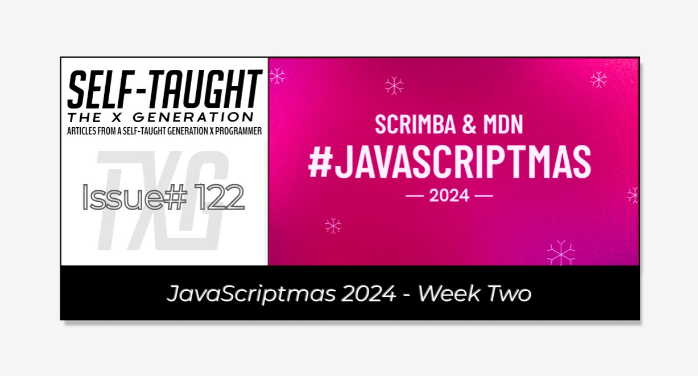
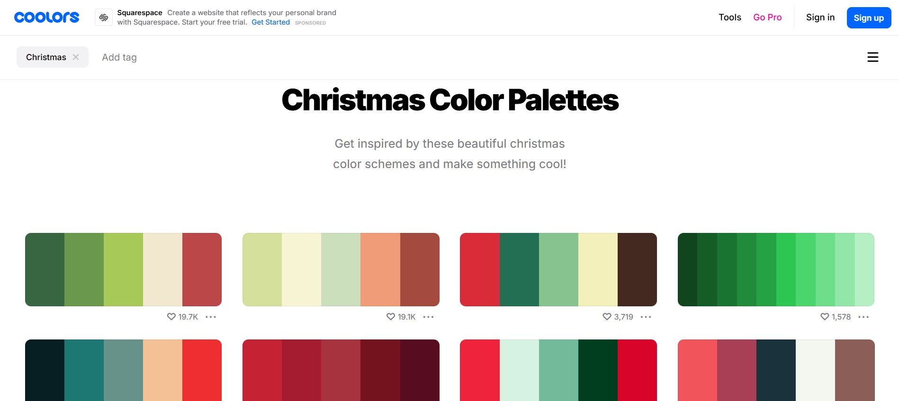
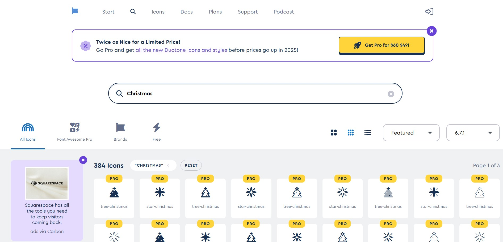
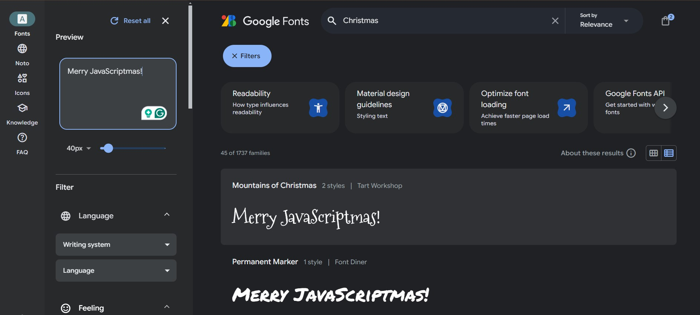
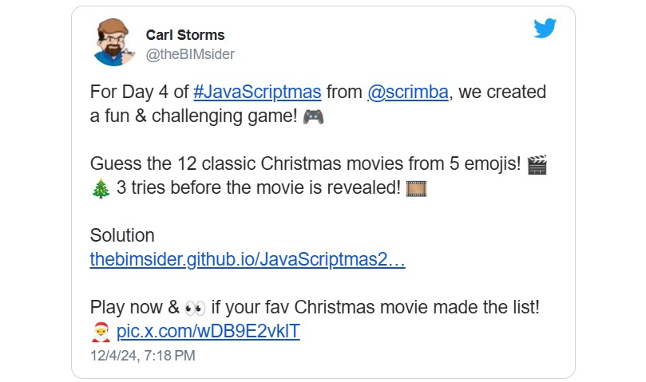
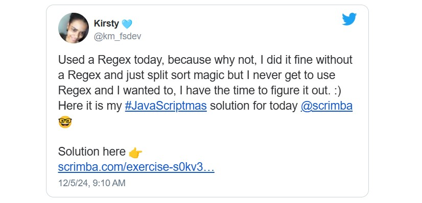
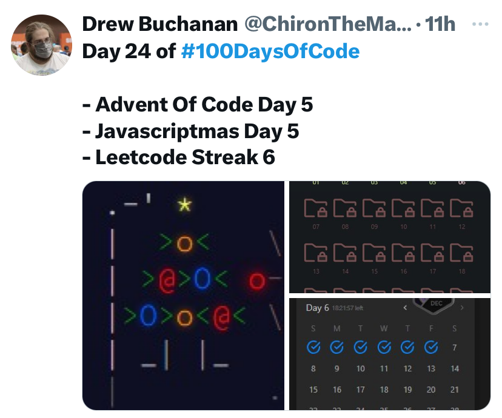
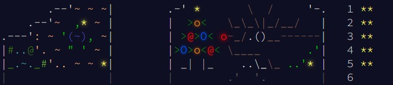
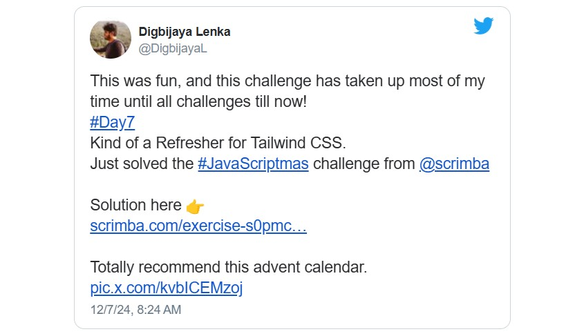
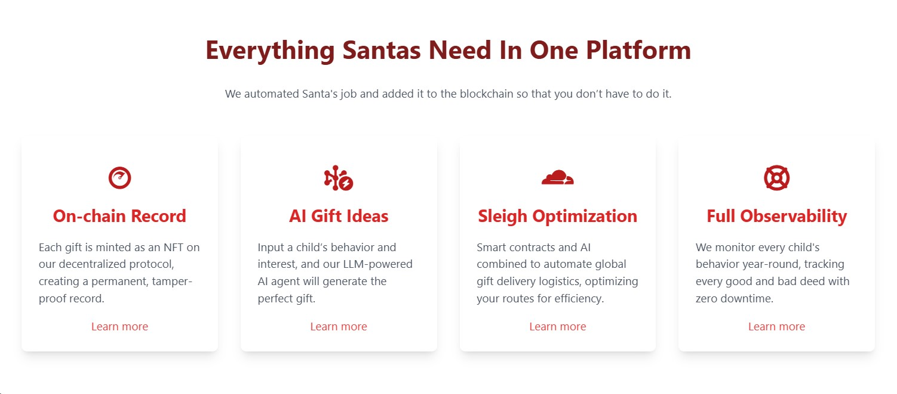

#### Tis the season! JavaScriptmas is here again! JavaScriptmas is a FREE annual festive coding event hosted by the online coding school Scrimba, consisting of 24 daily coding challenges, prizes, and more!

---



---

### What is JavaScriptmas?

JavaScriptmas is a festive coding event hosted by Scrimba from December 1st to 24th. Each day, you will get a new JavaScript challenge to help improve your coding skills, and you can win prizes! You can submit each valid challenge solution twice for two chances of winning! Since it's a raffle, it's fair for developers of any coding level, as it doesn't depend on skill.

To submit your challenge solution, click "Submit Solution" to save your work, which will automatically enter you into the Grand Prize draw. For an additional chance to win, click the "Share" button to spread the JavaScriptmas cheer on X and/or LinkedIn—they will select a second lucky winner from the social posts! The more challenges you solve, the better your chances of winning the grand prize, so keep submitting!

**On December 24th, they will be choosing two lucky Grand Prize winners who will each receive:**

* A 13” **MacBook** Air M3
    
* Merch from **MDN** and **Scrimba**
    
* Lifetime Scrimba Pro access
    

*Join the fun and improve your JavaScript skills this holiday season!*

---

#### **Community highlights**

In the spirit of the festive holiday season, I enjoy showcasing others' work in the community highlights section of my JavaScriptmas articles! I'll be searching X/Twitter, LinkedIn, and the Scrimba Discord channel for "outstanding" submissions by fellow participants to feature. 🎉

---

#### **My solutions**

As I do every year, I will participate in JavaScriptmas and share my solutions on social media. I will provide links to the Scrims in these coverage articles as I complete the challenges. 💻

---

### **Community highlights ⬇**

---

#### Bree Hall [(@bytesofbree)](https://x.com/bytesofbree)

<iframe width="928" height="522" src="https://www.youtube.com/embed/9curATl9img"></iframe>

---

Bree Hall recorded a step-by-step YouTube video covering how she solved the Day 1 challenge, “**Lists Without Duplicates**,” to help teach YOU how to code!

***The challenge:*** *Grandpa has a Christmas wish list to manage the gifts he plans to request. However, he often accidentally adds the same item more than once, and the list becomes cluttered with duplicates.*

**In the video, Bree takes on the JavaScript coding challenge where she:**

* ✅ Prevents duplicate items from sneaking onto the list (even with sneaky spaces!)
    
* ✅ Handles tricky edge cases like extra spaces and capitalization differences
    
* ✅ Adds functionality to edit and delete items dynamically.
    

Bree Hall is a very talented and dedicated software engineer who shares her experiences and knowledge on her [YouTube channel](https://www.youtube.com/@bytesofbree). She supports diversity and representation in the tech industry and helps new coders, developers, and engineers.

Be sure to check out Bree Hall’s website, “[bytesofbree](https://www.bytesofbree.com/),” where she shares valuable resources and includes all her social links!

*If you're a Legend of Zelda fan, be sure to watch her* [*Frontend Techniques in the Realm of Hyrule with React,*](https://www.youtube.com/watch?v=-_LioxAeCSU) *which she based on her presentation at* [*THAT Conference WI 2024*](https://www.htmlallthethings.com/blog-posts/highlights-from-that-conference-wi-2024)*!*

[***🔗 Link to the YouTube video***](https://www.youtube.com/watch?v=9curATl9img)

---

#### Zoran Jambor [(@cssweekly)](https://x.com/cssweekly)

<iframe width="928" height="522" src="https://www.youtube.com/embed/pHOUAoAX1MQ"></iframe>

---

Zoran Jambor also created a valuable YouTube video. His video articulately covers solving the Day 2 challenge, “**Ugly Advent Calendar**,” while turning it into a mini UI/UX design course!

**His comprehensive guide teaches YOU how to improve poor user interfaces using fundamental UI design principles, including valuable tips to elevate your UI skills!**

In this YouTube video, you'll learn how to set up a color palette, check color contrast in DevTools, and establish good typography. The video also covers setting up an HTML headline hierarchy, using alignment and whitespace in UI, and fine-tuning text sizes and spacing.

*Additional topics include adding colors to UI, tweaking CSS Grid sizing and HSL colors, refining UI, using Font Awesome, making mobile responsive UI, and adding interactivity to Card UI.*



While solving the challenge, Zoran introduces you to [coolors.co](https://coolors.co/), a versatile online tool that helps designers generate, save, and share beautiful color palettes for their creative projects. This is especially handy for developers who are not familiar with color schemes. Using pre-made color palettes ensures your designs are visually appealing and cohesive, saving time and effort in the creative process.



Zoran also teaches you how to use [Font Awesome](https://fontawesome.com/), a popular icon library that provides scalable vector icons for web projects, enhancing the user interface's visual appeal and functionality.



Another valuable tool Zoran teaches you how to use is [Google Fonts](https://fonts.google.com/), a comprehensive library of open-source fonts that can be easily imported and used in your web projects. Google Fonts allows you to customize typography to align with your project's style, making your web pages more visually engaging and professional.

*Check out Zoran's YouTube channel,* [*CSS Weekly,*](https://www.youtube.com/@CSSWeekly) *for practical tutorials, hands-on guides, tool overviews, news, and more—everything related to CSS, Browser DevTools, and Visual Studio Code. Subscribe to enhance your skills as a front-end developer and stay updated on the latest concepts, tools, techniques, and methodologies!*

**You can learn much more about Zoran Jambor on his** [**website**](https://zoranjambor.com/)**!**

[***🔗 Link to the YouTube video***](https://www.youtube.com/watch?v=pHOUAoAX1MQ)

---

#### Anthony Sistilli [(@SistilliAnthony )](https://x.com/SistilliAnthony)

<iframe width="928" height="522" src="https://www.youtube.com/embed/hgCglc17feo"></iframe>

---

Anthony Sistilli skillfully solved the Day 3 challenge, “**Santa's Emoji Hac**,” in a YouTube video showing us how to solve the base challenge and the stretch goal in detail!

*The challenge involves creating functions to replace the provided negative emoji shortcodes with positive emojis within a sentence. For the stretch goal, replace any negative emojis directly added to the text with positive ones.*

```javascript
const hackedEmojis = {
    "angry":            "🎁",   // 😠
    "thumbsdown":       "👏",   // 👎  
    "man_facepalming":  "🎅",   // 🤦‍♂️
    "cry":              "‍😄",   // 😭
    "puke":             "🤩"    // 🤮
}
```

For example, `:angry:`, which represents a negative emoji, should be replaced with the provided corresponding emoji "🎁" ( I hope no one gets angry reading this article! ).

```javascript
console.log(emojifyPhrase("Just read your article :angry:"));
    Just read your article 🎁
```

For the stretch goal of replacing emojis directly —*😠 should be directly replaced with 🎁*— Anthony searched Stack Overflow for a Regex expression to detect emojis: If an emoji is detected, it returns `true`.

```javascript
const hackedEmojis = {
    "😠": "🎁",   
    "👎": "👏",      
    "🤦‍♂️": "🎅",       
    "😭": "‍😄",   
    "🤮": "🤩"        
}

function isEmoji(char) {
  const emojiRegex = /[\p{Emoji_Presentation}|\p{Emoji}]/gu;
  return emojiRegex .test(char);	
}
console.log(isEmoji("Just read your article 😠"));
    true
```

**Watch the entire YouTube video to see how Anthony uses these coding concepts to solve the base and stretch goal challenges!**

*Anthony Sistilli has over 100k subscribers on YouTube, where he created a place for tech & startup enthusiasts to hang out, learn, and build cool things together!*

You can find all of Anthony's links at [links.sistilli.dev](https://links.sistilli.dev/)

[***🔗 Link to the YouTube video***](https://www.youtube.com/watch?v=hgCglc17feo&t)

---

#### Carl Storms [(@theBIMsider)](https://x.com/thebimsider)



[Carl Storms](https://github.com/TheBIMsider) went above and beyond when solving the Day 4 challenge, “**Christmas Movie Emoji Quiz**,“ by adding a common movie name variation functionality to accommodate close guesses and deploying it from GitHub! This coding challenge asks participants to create an app that tests players' ability to identify Christmas movies from emoji clues. Players are given three guesses per movie, with feedback provided after each attempt.

**Carl first completed the required challenge by developing a dynamic game that randomly selects emoji sets from a predefined list, ensuring each film is used only once. Then, he imaginatively wrote code for smart title comparison functionality that accounts for common variations and uses a similarity algorithm to accept close matches, enhancing the game's flexibility. Well done, Carl!**


*Carl Storms, also known as the BIMsider, has over 25 years of experience in the AECO industry and is on a journey to learn new coding tricks, including JavaScript, CSS, HTML, C#, and Python. As the Head of Community, Advocacy, and Technology at Newforma, he champions BIM, explores coding, and delves into AI.*

Carl shares his insights through articles on [The BIMsider](https://thebimsider.com/) and engages audiences as a host on podcasts like [Wrenches Gadgets & Hacks](https://bio.link/wghfeed), [BIMThoughs](https://www.youtube.com/channel/UCluEu87j8_lvtI5LSi_1VBg), [The BILT Academy Podcast](https://biltacademypodcast.buzzsprout.com/), and [The Simply Complex Podcast](https://www.simplycomplex.org/podcast).

**Links to Carl’s solutions:**

* [***🔗 Link to the code on GitHub***](https://github.com/TheBIMsider/JavaScriptmas24/tree/main/Day4)
    
* [***🔗 Link to the deployed project***](https://thebimsider.github.io/JavaScriptmas24/Day4/)
    

---

#### Kirsty [(@km\_fsdev)](https://x.com/km_fsdev)



For the day five challenge, "**Find The Anagrams**," Kirsty improved her coding skills by broadening her current understanding of Regex; after all, that's what coding challenges are all about!

In this particular challenge, you're responsible for hosting a quiz at a family gathering. With a list of anagrams, your task is to identify and filter out incorrect pairs using a JavaScript function. This challenge ignores the spaces, so phrases like "Be The Helm" are valid anagrams of "Bethlehem."

*Regex, or regular expression, is a sequence of characters that forms a search pattern, often used for pattern matching within strings.*

**Below is Kirsty’s code, along with detailed instructions on how it works:**

```javascript
let anagrams = [
    ["Can Assault", "Santa Claus"],
    ["Refreshed Erudite Londoner", "Rudolf the Red Nose Reindeer"],
    ["Frosty The Snowman", "Honesty Warms Front"],
    ["Drastic Charms", "Christmas Cards"],
    ["Congress Liar", "Carol Singers"],
    ["The Tin Glints", "Silent Night"],
    ["Be The Helm", "Bethlehem"],
    ["Is Car Thieves", "Christmas Eve"]
];

function findAnagrams(array) {
    return array.filter((el) => {
        let lowerCaseAndSmushedArr = el.map((el) => el.toLowerCase().replace(/\s+/g, ""));
        let sortedItems = lowerCaseAndSmushedArr.map((el) => el.split("").sort().join(""));
        return sortedItems[0] === sortedItems[1];
    });
}

let isAnAnagram = findAnagrams(anagrams);

console.log(isAnAnagram);
[['Can Assault', 'Santa Claus'], ['Refreshed Erudite Londoner', 'Rudolf the Red Nose Reindeer'], ['Congress Liar', 'Carol Singers'], ['Be The Helm', 'Bethlehem']]
```

1. **Data Structure**: You have an array of arrays called `anagrams`, where each sub-array contains two strings that are potential anagrams.
    
2. **Function Definition**: The function `findAnagrams` takes an array as an argument and returns a filtered version of that array.
    
3. **Filtering Logic**:
    
    * The `filter` method is used to iterate over each pair of strings in the `anagrams` array.
        
    * For each pair, the `map` method is applied to convert both strings to lowercase and remove all spaces using `toLowerCase()` and `replace(/\s+/g, "")`.
        
    * The processed strings are then split into individual characters, sorted alphabetically, and joined back into strings using `split(""), sort(), and join("")`.
        
    * The sorted strings are compared. If they are identical, it means the original strings are anagrams, and the pair is kept in the filtered array.
        
4. **Result**: The `findAnagrams` function returns an array of pairs that are true anagrams. This result is stored in `isAnAnagram`.
    
5. **Output**: The `console.log(isAnAnagram);` statement prints the filtered list of anagram pairs to the console.
    

*Kirsty’s code solution effectively filters out any pairs that are not anagrams by comparing the sorted character sequences of the strings!*

**Keep up the fantastic work, Kirsty, and Merry JavaScriptmas!** 🎄

[***🔗 Link to the scrim***](https://scrimba.com/javascriptmas-c0javascriptmas/~05yl/s0kv33o03f/head)

---

#### Drew Buchanan [(@ChironTheMage)](https://x.com/ChironTheMage)



[Drew Buchanan](https://github.com/DrewBuchanan) has been hard at work, not only taking on Scrimba’s JavaScriptmas challenges but also tackling **Advent of Code** and **LeetCode** challenges! What a feat!

Drew is a software developer based in the Twin Cities of Minnesota. He has over 10 years of experience in various industries, including game development, logistics, and finance. Drew always looks for the next puzzle to solve and strives to improve the world through technology. He enjoys walking in nature, playing trading card games, and indulging in donuts in his free time. He is also a connoisseur of memes and horror films!

**What specifically caught my eye was Drew’s ASCII Christmas tree! I’ve always been fond of ASCII games and art, and this creation captures that charm. With its colorful characters, the ASCII Christmas tree stands out brilliantly. It illuminates the coding challenge landscape shared on social media, showcasing Drew as a star coder, much like the star atop his ASCII tree!**



**Links to Drew Buchanan's solutions:**

* [***🔗 Link to the Advent Of Code solutions***](https://github.com/DrewBuchanan/AdventOfCode2024)
    
* [***🔗 Link to the LeetCode solutions***](https://github.com/DrewBuchanan/LeetCode)
    
* [***🔗 Link to the scrim***](https://scrimba.com/javascriptmas-c0javascriptmas/~05yl/s0eecpe5fg/head)
    

You can also follow Drew Buchanan on Bluesky Social: [chironthemage.bsky.social](https://bsky.app/profile/chironthemage.bsky.social)

---

#### Digbijaya Lenka [@DigbijayaL](https://x.com/digbijayal)



Digbijaya Lenka took a different approach to solving the Day 7 “**SaaS Landing Page**” challenge. In this UI/UX Design challenge, coders are asked to write HTML and CSS code to complete it. However, Digbijaya opted out of CSS and tackled the challenge using Tailwind instead!

[*Tailwind CSS*](https://tailwindcss.com/) *is a utility-first CSS framework that allows developers to build custom designs without leaving their HTML. Unlike traditional CSS, which requires writing custom styles, Tailwind provides a set of utility classes that can be directly applied to HTML elements. This approach enables rapid prototyping and design consistency, as developers can compose complex designs by combining these utility classes. Tailwind's flexibility and efficiency make it a popular choice for developers looking to streamline their styling process and maintain a clean, maintainable codebase.*

**To use Tailwind in the JavaScriptmas challenge, Digbijaya added the following script tag, which is used to include Tailwind CSS in a web project directly from a Content Delivery Network (CDN).**

```xml
<script src="https://cdn.tailwindcss.com"></script>
```



*The code block below shows that the “On-chain Record” div uses Tailwind CSS to style a card component with a clean and modern design.*

```xml
<div class="bg-white p-6 rounded-lg shadow-lg  flex flex-col justify-center items-center">
    <div class="p-4"><i class="fa-brands fa-cloudscale text-4xl text-red-700"></i></div>
    <h3 class="text-2xl font-bold mb-4 text-red-600 ">On-chain Record</h3>
    <p class="text-gray-600">Each gift is minted as an NFT on our decentralized protocol, creating a
        permanent, tamper-proof record.</p>
    <a href="#on-chain-record" class="text-red-500 hover:underline mt-4 inline-block">Learn more</a>
</div>
```

**Here's how the Tailwind classes work:**

* `bg-white`: Sets the background color of the card to white.
    
* `p-6`: Applies padding of 1.5rem (24px) around the card, creating space between the content and the card's edges.
    
* `rounded-lg`: Rounds the corners of the card, giving it a softer, more visually appealing look.
    
* `shadow-lg`: Adds a large shadow to the card, providing a sense of depth and elevation.
    
* `flex flex-col justify-center items-center`: Uses Flexbox to arrange the card's content in a column, centering the items both vertically and horizontally.
    
* `p-4`: Adds padding of 1rem (16px) around the icon, ensuring it has space within its container.
    
* `text-4xl text-red-700`: Sets the icon's font size to 4xl and its color to a dark red, making it prominent and visually striking.
    
* `text-2xl font-bold mb-4 text-red-600`: Styles the heading with a 2xl font size, bold weight, a bottom margin of 1rem (16px), and a red color, making it stand out.
    
* `text-gray-600`: Colors the paragraph text in a medium gray, ensuring readability while maintaining a subtle appearance.
    

**Digbijaya used Tailwind exclusively for the entire project, and you can see in his code that he commented out the entire CSS file! He demonstrates once again that there are many ways to tackle programming challenges. Great work, Digbijaya!**

[***🔗 Link to the scrim***](https://scrimba.com/exercise-s0pmc8l9hv)

---


### ❄ My JavaScriptmas submissions ❄

| **Date** | **Scrim** |
| --- | --- |
| 12/01/2024 | [Grandpa's Gift List](https://scrimba.com/javascriptmas-c0javascriptmas/~07tn/s0b1lfvfka/head) |
| 12/02/2024 | [Ugly Advent Calendar](https://scrimba.com/s06j6m7/s0uukfplts/head) |
| 12/03/2024 | [Santa's Emoji Hack](https://scrimba.com/javascriptmas-c0javascriptmas/~02zu) |

---

#### ***If you would like to learn more about my journey with Scrimba and how learning with them may help you, you can read my article:*** [***How Scrimba is helping me and many others to become confident, well-prepared web developers***](https://selftaughttxg.com/2021/06-21/06-07-21/)

---

#### **Scrimba has once again impressed and inspired me! You can read my full** [**Scrimba review**](https://selftaughttxg.com/2020/12-20/Review-Scrimba/) **on my 12/13/2020 post.**


#### ***"That's one of the best Scrimba reviews I've ever read,*** [***@MikeJudeLarocca***](https://twitter.com/MikeJudeLarocca?ref_src=twsrc%5Etfw)***. Thank you! 🙏 "***

###### **— Per Harald Borgen, CEO of Scrimba** [**December 14, 2020**](https://twitter.com/perborgen/status/1338462544143540227?ref_src=twsrc%5Etfw)

---


### **Be sure to listen to the HTML All The Things Podcast!**

#### 📝 *I also write articles for the HTML All The Things Podcast, which you can read on their website:* [*https://www.htmlallthethings.com/*](https://www.htmlallthethings.com/)*.*

#### **Be sure to check out HTML All The Things on socials!**

* [Twitter](https://twitter.com/htmleverything)
    
* [LinkedIn](https://www.linkedin.com/company/html-all-the-things/)
    
* [TikTok](https://www.tiktok.com/@htmlallthethings)
    
* [Instagram](https://www.instagram.com/htmlallthethings/)
    

---

### **Conclusion**

Scrimba's annual JavaScriptmas event is a fun, festive way to commit to coding daily. Whether you are a new coder or a seasoned one, you can share your work with the community, make new friends, and even win prizes!

If you want to continue learning with Scrimba after the FREE event, check out their many FREE courses! If you are ready to commit to becoming a hireable front-end web developer, be on the lookout for their holiday discounted course rates!

Don't miss out on this exciting coding event! Participate in Scrimba's JavaScriptmas today, share your solutions, connect with fellow developers, and improve your skills while having fun! Merry JavaScriptmas! 🎄

---

**Let's connect! I'm active on** [**LinkedIn**](https://www.linkedin.com/in/michaeljudelarocca/) **and** [**Twitter**](https://twitter.com/MikeJudeLarocca)**.**

---

###### ***Are you now interested in participating in this year's Scrimba's JavaScriptmas? Have you already participated in last year's Scrimba's JavaScriptmas? Please share the article and comment!***
