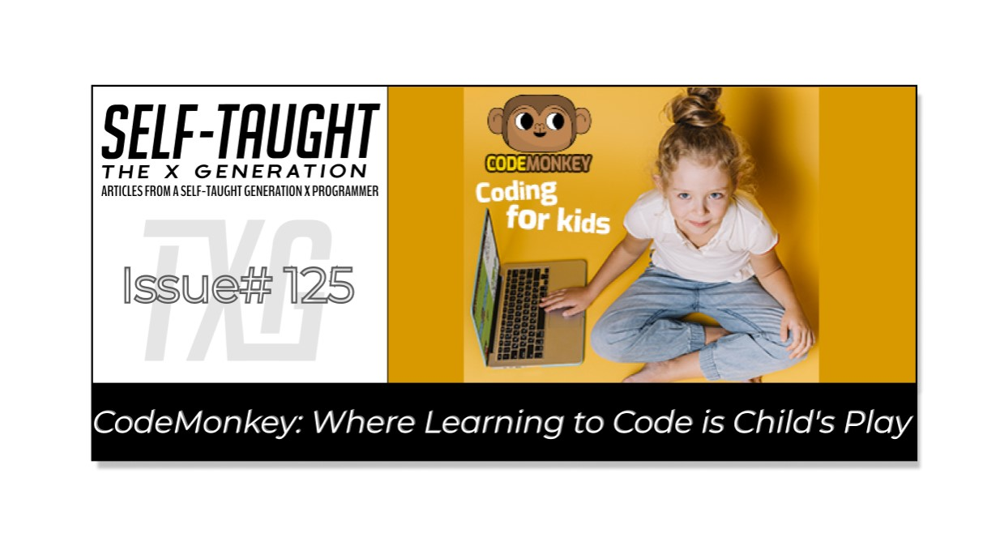
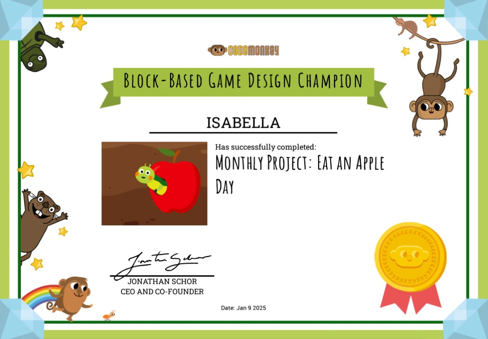

#### This article explores CodeMonkey, an engaging platform for kids to learn coding! See how it can transform kids from tech consumers into creators, equipping them with vital skills for future success!

---



---

### **Article Concept Overview**

#### Problem:

While technology jobs are constantly evolving and can offer an advantageous career path, it's important to note that many children primarily engage with technology as **consumers** rather than as **creators**. This consumer-focused interaction limits their exposure to the creative aspects of technology, such as coding, design, and innovation.

#### Solution:

Encouraging children to shift from mere **users** to active **creators** of technology will empower them to develop essential skills and foster creativity, better positioning them for future career opportunities in the tech industry.

---

### Introduction

As a tech enthusiast parent, I greatly advocate encouraging children to learn how to code, knowing that this skill can significantly benefit their future careers. Although children are growing up with tech products, they often use them as consumers without gaining the knowledge they need to build for these products.

Instilling a love of learning how to develop tech will help children transform from consumers to creators, ultimately opening up more job opportunities when they become adults. But how do we encourage our children to learn to code, as it can be a potentially dull topic?

Allow me to introduce you to CodeMonkey, an online code-learning platform designed for children. CodeMonkey offers a rich learning experience with interactive games, engaging slideshow-style lessons, and hands-on coding projects. It provides children a captivating and valuable way to develop essential skills like problem-solving, critical thinking, and creativity. With CodeMonkey, learning can be all fun and games!

---


---

### What is CodeMonkey?

CodeMonkey is a fantastic educational platform that makes learning to code an exciting adventure for children and beginners. It emphasizes coding concepts and nurtures problem-solving skills in a fun and interactive environment. With various courses and challenges, it gently guides learners through the basics of coding, ensuring that young learners and educators can quickly dive in and enjoy the journey together!

Founded in 2014, CodeMonkey has quickly become a leader in educational technology. Over the past decade, CodeMonkey has received numerous accolades, including the prestigious 2024 Educators Pick Best of STEM® Award for Best AI Curriculum for Teaching and Learning and the 2024 EdTech Breakthrough Award for Overall Early Childhood Education Solution Provider of the Year. Parents’ Picks Awards also recognize the platform for Best Products for Elementary Kids and Best Educational Products in the World. CodeMonkey's commitment to excellence has earned endorsements from educators, parents, and institutions worldwide, making it a trusted name in coding education.

---


---

### Learning Path

CodeMonkey offers an organized learning path, making it easy for learners to jump right in at their level. Their curriculum is designed for different age groups and skill levels, ensuring that every child can start learning to code with confidence. As they progress through these levels, children build essential skills like problem-solving, critical thinking, and logical reasoning. These skills are helpful not only in coding but also in many other areas of life!

**For Young Learners (K-2nd Grade):**

* **CodeMonkey Jr.:** Perfect for kindergarteners, this level introduces the basics of coding through interactive games and puzzles.
    
* **Beaver Achiever:** For first graders, this level builds on foundational skills and introduces more complex coding concepts.
    

**For Intermediate Learners (3rd-5th Grade):**

* **Coding Adventure:** Third graders dive deeper into coding with more challenging puzzles.
    
* **Dodo Does Math:** Fourth graders combine coding with math to solve problems and develop logical thinking.
    
* **Digital Literacy & Game Builder:** Fifth graders learn about digital literacy and create their own games, fostering creativity and problem-solving skills.
    

**For Advanced Learners (6th-10th Grade):**

* **Data Science:** Sixth graders explore the basics of data science, learning how to analyze and interpret data.
    
* **Artificial Intelligence:** Seventh graders delve into the world of AI, understanding how machines can learn and make decisions.
    
* **Banana Tales:** Eighth graders continue to build on their coding skills with more advanced projects.
    
* **Coding Chatbots:** For ninth and tenth graders, this level focuses on creating chatbots, teaching them about natural language processing and user interaction.
    


---

### Parent and Teacher Accounts

CodeMonkey offers two types of accounts to cater to different needs: **Parent Accounts** and **Teacher Accounts**.

**Parent Accounts:** Perfect for moms, dads, and guardians, Parent Accounts allow you to create an account for your child and monitor their progress through a parent dashboard. You can see how they're doing, view their achievements, and even access solutions to help them along the way. It's a great way to stay involved in your child's learning journey!

**Teacher Accounts:** Designed for educators, Teacher Accounts let you create a classroom and add up to 100 students. You'll have access to detailed lesson plans, progress tracking, and the ability to see your students' solutions. It's a fantastic tool for bringing coding into the classroom and making learning interactive and fun for your students.

*I set up a parent account to experience CodeMonkey and give a detailed review. Since the parent account is intended to track a child's account, I created a new child account for my daughter and used it for coding.*

---

<iframe width="928" height="522" src="https://www.youtube.com/embed/wjJqew5eqII"></iframe>

---

### Block Coding

The progressive learning path starts by teaching how to code using code blocks. Code blocks are visual representations of code that allow learners to build programs by stacking and arranging blocks. This approach makes it easier to grasp programming logic without the complexity of text-based syntax. Ideal for beginners, block coding simplifies the learning process by showing how commands interact. This method establishes a strong foundation in coding principles and boosts confidence with immediate results.

I completed the code block-based “**Linus the Lemur: New Year course**.“ Through this ten-separate challenge course, you are to help the adorable lemur collect all the separated 12-month pages to complete a calendar and assemble it. To control the lemur, you must use critical thinking to help him navigate the landscape efficiently by dragging and dropping code blocks to create a sequence of actions that guide him to his goal.

**Like all programming languages, there are multiple ways to code solutions, and CodeMonkey addresses this with a three-star rating system. If the challenge can be solved more efficiently, you will receive less than three stars and a hint on how to solve the challenge better, such as “try using fewer coding blocks.”**

I aced all the challenges until I reached the ninth, when I was prompted with the hint that it could be completed with fewer code blocks. I was then forced to think of a pattern, known as an algorithm in computing, to solve the challenge with just two code blocks! The three-star rating system is excellent for teaching coding skills while encouraging learners to consider the most efficient solutions.

*While playing through the course, children are prompted with relevant “DID YOU KNOW“ facts, an excellent additional feature that helps them learn more about topics while keeping them entertained. Did you know that July was named after the famous Roman leader Julius Caesar? Well, whoever completes this course will now know, including me!*


**Upon completing the course, each child is awarded a well-deserved certificate of completion, which they can proudly display. These certificates not only serve as a recognition of their achievement but also add an exciting element to the experience for young coders. This celebratory token acknowledges their hard work, encourages a sense of accomplishment, and motivates them to continue exploring the world of coding!**


---

### Block-Based Programming

The next level of coding on the CodeMonkey platform introduces learners to block-based programming. Now, young coders are introduced to a code editor for the first time! A code editor is a tool for programmers to write and organize computer instructions. In the code editor, programs are created by combining code blocks, fitting them together like puzzle pieces. There are many code blocks to choose from, and you can even create your own! Although it may initially seem overwhelming, these code blocks are organized into logical categories for easy access.

**The coding block categories:**

1. **Movement**: Blocks that control the movement of sprites or characters.
    
2. **Events**: Blocks that trigger actions based on specific events, like clicking or key presses.
    
3. **Display:** Blocks that manage visual elements on the screen.
    
4. **Widgets:** Blocks that add interactive elements or controls (ex. score & timers)
    
5. **Game and Sounds:** Blocks that handle game mechanics and sound effects.
    
6. **Control**: Blocks that manage the flow of the program, such as loops and conditionals.
    
7. **Logic and Data:** Blocks that perform logical operations and handle data.
    
8. **Variables**: Allow you to create blocks that store and manipulate data values.
    
9. **Object’s Functions:** Blocks that call functions specific to objects.
    
10. **Other Object’s Functions:** Blocks that interact with functions of other objects.
    

#### Sprites

In the code editor, you select individual sprites to program; each sprite added is programmable. A sprite is an image representing a character or object in a game. Players interact with the sprites on the screen, bringing the game's world to life! Sprites can move, change appearance, and respond to player actions, making them essential for creating engaging and dynamic experiences in coding projects. In the “**Eat an apple a day**“ project, the player controls a caterpillar sprite to eat an apple sprite.

**There are many sprites available to choose from, spanning a variety of categories:**

* Animals
    
* Nature
    
* Food
    
* Sports
    
* Space
    
* Fantasy
    
* Objects
    


*You also have the option to create your sprite by uploading sprite sheets or by using an available Code Monky drawing editor!*

#### Widgets

Widgets, like sprites, are also programmable assets. They include a **counter**, **text field**, **timer**, **clock**, **button**, and **dialog box**. In the *“Eat an apple a day“* project, a score widget counts how many apples are eaten, and a timer widget is cleverly used to create the caterpillar. The caterpillar's body is formed using a total of four sprites: one head and three bodies. A timer widget is used in each body part with a time delay that follows the head sprite, resulting in an animated crawling caterpillar. Very clever!

#### The Stage

The Stage is an area inside the code editor where you can view and test your project as you work on it. It is beneficial because it allows you to view your project directly within the code editor, preventing you from switching back and forth between the full-screen project and the code editor as you build it out.

#### Coding Projects

This is where the teaching begins! Coding projects provide step-by-step instructions on how to program projects within the code editor. I completed the “**Eat an apple a day**“ project, as seen in the image below, which was built through eleven exercises.

**Each coding project exercise provides detailed task instructions in a window pane on the left. In the exercise, each task is checked off with a green flag as you complete the tasks. If you are unsuccessful in completing the task, it is red-flagged, and you are prevented from moving on to the next task, ensuring that the code you create works properly.** **This system helps children stay encouraged and motivated, as they are hand-held throughout the project, knowing that all of their code will work as expected when the project is completed!**

*The exercises include well-placed fun facts for children, such as “Did you know apples are packed with benefits for your body? They contain about 4 grams of fiber, which helps with digestion and keeps you feeling full. Plus, apples are made up of about 85% water, so they're a hydrating snack, too. Eating an apple isn't just tasty—it's a great way to stay healthy and energized!” I appreciate the extra effort taken to encourage our children to eat healthy!*


**The image above displays the finished *“Eat an apple a day“* project. In it, the player controls a caterpillar sprite to eat an apple sprite. In the *Sprites* tab, you will see the selected sprite highlighted with a green border, and the sprite’s name is displayed above its code in the editor.**

**Here are the details of what is happening in each of the three code blocks:**

1. **On Run:** The “Randomize Location“ function runs when a user runs the program.
    
2. **Randomize Location:** The Randomize Location function sets the **X** coordinates to a random position from 50 to 550 and sets the **Y** coordinates to a random position from 50 to 350.
    
3. **On Collide:** The “On Collide“ event is set to detect when the “head“ sprite of the caterpillar collides with the apple sprite. Once this collision is detected, the score is incremented by plus one to the current score. Then, the “Randomize Location“ function is called to remove the current position of the apple sprite and move it to another random location.
    

Once the project is completed, students are encouraged to add new features independently, such as incorporating sounds. Additionally, stretch goals are provided throughout the course. If students have not completed these goals, they are encouraged to revisit and accomplish them after finishing the course.

*Each child also receives a certificate of completion to display proudly. This certificate recognizes their achievement and adds excitement to their coding journey. It acknowledges their hard work and motivates them to keep exploring coding!*



---

### Text Coding (CoffeeScript)

Text coding takes CodeMonkey’s block-based programming to the next level by introducing learners to CoffeeScript, a programming language that simplifies code writing. The colorful code blocks have been removed from the CodeMonkey editor, and now, the sprites are programmed exclusively using text.

**CoffeeScript is a lightweight programming language based on JavaScript, a widely used language essential for web development. It makes writing code easier, helping beginners learn by allowing them to focus more on logic rather than worrying about complicated syntax. Learning CoffeeScript is also beneficial, as it helps young coders transition to JavaScript more easily.**

💡 **Tip**: *CoffeeScript uses transpilation to automatically convert its code into JavaScript, enabling you to write more straightforward and concise code that seamlessly becomes JavaScript.*

#### Game Creation Course

I “leaped” at the opportunity to learn CodeMonkey’s text-based CoffeeScript coding by taking and completing the game creation course based on the classic game Frogger! This in-depth course covers key concepts of game development on CodeMonkey. Once learned, these concepts can be easily applied to other games, including original ones built from scratch.

*Mastering these key game development concepts* *will improve children’s technical skills and help them gain the confidence to create their own unique games!*

**Game development concepts covered include:**

* Adding sounds
    
* Collision detection
    
* Using timers for various features
    
* Tracking score and lives
    
* Randomizing times, sprite size, direction, locations
    
* Setting the camera to follow a sprite
    
* And more!
    


**The image above displays the finished *“Frogger“* project, a famous game that needs no introduction! In the *Sprites* tab, the currently selected sprite is the “frog.“ You can see the frog sprites CoffeeScript** **code in the editor.**

**Here are the details of what is happening in each of the two code blocks:**

1. **@onSwipe:** This function changes the frog sprite's direction and moves it forward when a swipe gesture is detected; it also works with a keyboard’s arrow keys. It sets the rotation based on the swipe direction (left, right, down, up) and then moves the frog sprite 100 units.
    
2. **@hit:** This function decreases the player's lives by one and plays a sound when a collision occurs. If no lives remain, it destroys the frog sprite and displays a "GAME OVER" message with the score. If lives remain, it resets the frog sprite to its starting position.
    

#### Achievements

*“Achievement Unlocked!”* is a milestone goal accomplishment sought after by gamers, and CodeMonkey incorporates this concept by integrating achievement trophies that coders can earn. These achievements help keep young coders enthusiastic, encouraging them to go above and beyond in completing stretch goals. Earning these achievements can greatly increase a learner's confidence and interest in coding by giving them clear goals that demonstrate their progress and motivate them to tackle harder challenges.

**I completed all four available achievements for the Frogger course:**

1. **Safety Crosser:** Complete Frogger course
    
2. **Sweet Home:** Complete Frogger perfectly, with all bonuses
    
3. **Say cheese:** Solve exercise 12 by setting the camera target on the frog
    
4. **Bonus Time:** Solve exercise 27 by adding bonus points


#### Share Your Projects

Once your project is complete, you can share it with fellow coders on CodeMonkey’s website to showcase your skills to the rest of the community! Others can play your game, view your code, and copy your project to “remix it,” providing a great starting point for other curious developers who are learning to code.

*CodeMonkey establishes guidelines to promote a positive experience for all participants when sharing your game or challenge: always treat others' work with kindness and respect, and express your appreciation by liking the creations you enjoy. Protect your personal information, including your full name, to ensure online safety. Ensure your content is appropriate for all audiences, and promptly report any harmful material you may encounter. Embrace the opportunity to remix games, allowing creativity and innovation to thrive. Above all, CodeMonkey encourages you to have fun and unleash your imagination while contributing to the vibrant community*!

#### 🔗 Here is a link to the completed Froger game I coded: [Playable Frogger Game](https://app.codemonkey.com/games/7DvOPK9n) 🕹


**Similar to the previous CodeMonkey courses I completed, this one also provides a certificate of completion, which helps to inspire and encourage young coders!**


---

### Data Science

What is Data Science? Data Science is a field in which we use different methods and tools to analyze and understand large amounts of data. This helps us find patterns, trends, and valuable information. It combines statistics, computer science, and knowledge of specific areas to make informed choices and predictions.

*Learning data science is essential for children because it teaches them to think critically and solve problems. This helps them better understand the world and prepare for future jobs in various industries!*

**I completed the first lesson of the Data Science course, “Introduction to Data Science course;” I also went on and completed more. The structure of the lessons involves first learning, then playing games, and finishing with a quiz.**

1. **Learn:** You will work through a slide show of information, including survey questions, multiple-choice questions, inputting text entries, and more.
    
2. **Play:** Play through games based on what you have learned.
    
3. **Review:** Take a multiple-choice quiz based on what was covered.
    

#### Learn

As seen in the image below, the learning section consists of nineteen slides; the twelfth slide is currently selected. This slide articulately describes the “Data Analysis Process.” As students progress through the learning section, as previously mentioned, they will be prompted with questions to answer in various ways, such as multiple-choice questions, text entries, and surveys.


#### Play

Once you’ve worked through the learning section, it’s time for fun and games! In the game depicted below, an air balloon drops with a word displayed on it.

The objective of this game is to distinguish between data and non-data by sorting. If the word displayed on the air balloon is related to data, click on the elephant on the right side of the screen. This action causes the elephant to use its trunk to blow a gust of wind, moving the air balloon to the left side, representing data. Currently, the word on the air balloon is “Love,” which does not qualify as data. Therefore, the correct choice is to click on the tan elephant on the left, directing a gust of wind that shifts the air balloon to the non-data side on the right.


The final game in the "Introduction To Data Science" course is a matching game set in a forest with a flowing rapid river. In the game, as seen in the image below, words describing topics throughout the Data Science course are displayed on the left side of the river, and their definitions are displayed on the right. When the student correctly matches a topic with its definition, an animation of a cute spider jumps across the stream while casting a web connecting them!


#### Review

After the course lessons and games, it’s time for a review! The review is a five-question multiple-choice quiz. And I must say, this course review, as well as the other course reviews on CodeMonkey, is not an easy walk through the park! Although it’s a bit embarrassing to admit, I averaged four correct answers out of five on the course reviews! I see this as a positive indicator because these challenging questions truly encourage children to think critically.


---

### Text Coding (Python)

Python, another high-demand language, is also taught to CodeMonkey students. As I have not yet learned the language, I was excited to gain hands-on experience. However, once I realized the main course comprised seventy-four exercises, I opted for the Python Trivia Chatbot mini-course in the interest of time to provide this article review.

The Python **Trivia Chatbot** mini course comprises sixteen exercises and, I presume, builds upon what is learned in the entire Python **Coding Chatbots** course. In the Coding Chatbots course, you program a Trivia Chatbot. Once you make it to the end of the course, students are encouraged to create their own trivia questions! I decided to create a Star Wars quiz.

*I would like to take this time to get a little more technical as I discuss what I built in detail.*


**The complicated code is already completed by two premade functions, presumably created in the main Python course:**

* **send\_message()**: This function displays or sends a message to the user. It takes a single argument or message, which is the text to be displayed or sent.
    
* **read\_message()**: This function receives or reads a message from the user. It doesn't take any arguments and returns the user's input.
    

You are then instructed to fill the `trivia_quiz` with an array of key-value pairs of questions and answers; I made up several Star Wars questions.

After setting up the trivia questions, the program initializes a `count` variable to keep track of correct answers. It then loops through each question in the `trivia_quiz`. For each question, it uses `send_message()` to display the question and `read_message()` to capture the user's response. If the response matches the correct answer, a congratulatory message is sent, and the count is incremented. Otherwise, it provides the correct answer with an encouraging message.

At the end of the quiz, the program displays the total number of correct answers. Based on the score, it assigns a fun Star Wars-themed rank: Jedi Master, Jedi Knight, and Padawan.

*During the course, students are taught about the .lower() function. The .lower() function is a useful tool in Python that converts all characters in a string to lowercase, helping to ensure consistent text comparison and processing. I used this function along with a (FULL NAME) message to help with guessing answers, as it converts everything to lowercase.*

```python
# Define welcome text
welcome = "Hello! Welcome to Star Wars triva!"
send_message(welcome)

# Define question and answer
# Add more questions to make your chatbot more fun!
trivia_quiz = [
    {
		"question": "Who is Luke Skywalker's father? (FULL NAME)",
		"answer": "Darth Vader"
	},
	    {
		"question": "Who was Darth Vader before he turned to the dark side of the force? (FULL NAME)",
		"answer": "Anakin Skywalker"
	},
	    {
		"question": "Who was Anakin Skywalker's padawan learner? (FULL NAME)",
		"answer": "Ahsoka Tano"
	},
	    {
		"question": "What is Baby Yoda's real name? (FULL NAME)",
		"answer": "Grogu"
	}
]

count = 0
for t in trivia_quiz:
    send_message(t["question"])
    response = read_message().lower()
    if response == t["answer"].lower():
        # Define text when the user answer correctly
        send_message("Correct! The force is strong with you!")
        count += 1
    else:
        # Define text when the user didn't answer correctly
        send_message("Incorrect. You have much to learn, Padawan! The answer is %s" % 
                      t["answer"])
 
 # Define text with the number of correct answer     
send_message("%d" % count)

# Define text at the end of chat based on how many
# correct answers user got
if count < 2:
    send_message("You are granted the level of Padawan!")
elif count < 4:
    send_message("You are granted the level of Jedi Knight!")
else:
    send_message("You are granted the level of Jedi Master!")
```

---

### Artificial Intelligence

Artificial intelligence (AI) is a word we hear daily and is now integrated into almost everything we use. But what exactly is AI, and how does it work? As an early AI beta tester for the Hashnode blogging platform I use, I remember conversing with AI and spending nearly an hour messaging it, just trying to understand what it was and how it worked. Despite my efforts, I still had many unanswered questions and needed much more clarification on what AI is. Although I am now more knowledgeable about working with AI, completing CodeMonkey’s course has filled in many information gaps I had!

**I am pleased to say that CodeMonkey’s Artificial Intelligence course is highly thorough and engaging. The course includes 16 lessons that build upon each other, beginning with the fundamentals of AI and ending in training AI models for integration into game development. The lessons are presented in a slideshow format for initial learning, and at the end of the slides, there are multiple-choice tests to reinforce what you have learned.**

**The Artificial Intelligence course covers:**

* Introduction To AI
    
* Ethical Considerations
    
* Using AI Language Models
    
* Using AI Image Generation Models
    
* Prompt Engineering
    
* Creating Images With AI
    
* AI And Critical Thinking
    
* Neural Networks
    
* How Generative AI Works


**You will also learn how AI models are trained:**

* **Supervised Learning:** A method in which an AI model is trained using a set of labeled data. Think of it as a teacher guiding a student to the correct answers. The model learns by comparing its predictions to the correct answers and adjusting until it gets them right.
    
* **Unsupervised Learning:** The AI model is given data without labels or correct answers in this approach. It's like exploring a new place without a map. The model tries to find patterns or group similar items on its own.
    
* **Reinforcement Learning:** Training an AI model through a system of rewards and penalties. For example, you could teach a pet tricks by giving it treats for good behavior. The model would learn by trying different actions and receiving feedback on which actions lead to the best outcomes.
    

#### CodeMonkey AI Models

In CodeMonkey’s AI course, you will learn to train an AI model on their platform by capturing images with your webcam. Training the AI is as simple as waving your hand in front of the webcam and then naming the AI Model you just created as “Hand Wave.“ In this use case example, your newly trained AI “Hand Wave“ Model will activate each time it recognizes a hand wave through your web camera.

**There are two types of AI Models you can create:**

* **AI Image:** Train a model based on images from your webcam
    
* **AI Pose:** Train a model based on poses from your webcam
    

*Using my webcam, I trained CodeMonkey’s AI to create a “****Thumb Control****” model. First, I created a Thumb Up Class by capturing around 500 images of my thumb in various thumbs-up positions (images are easily captured by holding down the record button). I repeated similar steps to create a Thumb Left and Thumb Right Class.*

Once I created the **Thumb Up**, **Thumb Left**, and **Thumb Right** classes, I mirrored the monkey sprites “**On Key**” code blocks that control it. Now, I can control the monkey sprite movements using my thumb as well as the keyboard arrow keys!

**In the image below, you will see that I am controlling the monkey sprite with my thumb: thumb up to jump, thumb left to move left, and thumb right to move right. This is very cool indeed! I give CodeMonkey’s entire learning platform an enthusiastic thumbs up!**


---

### For Teachers

Throughout this article, I have been completing CodeMonky’s courses through the **Parent account**, where I created an account for my child and used it.

CodeMonkey also offers a **Teacher account**, through which educators can create a classroom, add up to 100 students, access detailed lesson plans, track student progress, and view students' solutions. This account provides a comprehensive set of tools to facilitate interactive and engaging coding lessons in the classroom.

**CodeMonkey offers a range of features that help teachers effectively teach coding in the classroom. Here are some key features of the Teacher account:**

1. **Classroom Management**: Teachers can create a classroom and add up to 100 students. This allows for easy organization and management of multiple students.
    
2. **Progress Tracking**: Teachers have access to a dashboard where they can monitor each student's progress and achievements in real-time. This helps in identifying areas where students might need additional support.
    
3. **Course Access**: Teachers can access all the courses available on CodeMonkey, including detailed lesson plans with both online and unplugged activities.
    
4. **Student Solutions**: Teachers can view and display students' solutions to the entire class for discussion, which encourages collaborative learning and problem-solving.
    
5. **Automated Grading**: Each solution submitted by students is automatically checked and graded, providing instant feedback.
    
6. **Professional Development**: CodeMonkey offers webinars and resources to help teachers get started and make the most out of the platform.
    
7. **Customization**: Teachers can customize their course selection and align the content with educational standards.
    
8. **Reporting Features**: Detailed reports and analytics are available to track student performance and progress over time.
    

*Here’s a helpful YouTube playlist for teachers and educators to learn more about CodeMonkey's Teacher account:*

<iframe width="560" height="315" src="https://www.youtube.com/embed/videoseries?si=rgbJyt4np7NPKDTz&list=PLyU-6kEcAhfl05DgNsyOscuCaI5qKjRf8"></iframe>

---

### CodeMonkey Links:

* 🔗 [Website](https://www.codemonkey.com/)
    
* 🔗 [You Tube](https://www.youtube.com/@CodeMonkeyStudios)
    
* 🔗 [Twitter](https://x.com/codemonkeystu/)
    
* 🔗 [LinkedIn](https://www.linkedin.com/company/codemonkeystu/)
    

---

### My other related articles

* [Review: Scratch (programming language)](https://selftaughttxg.com/2021/02-21/Review-Scratch/)
    
* [Kickstart Your Coding Journey: A Guide to Free Web Development Resources](https://www.htmlallthethings.com/blog-posts/kickstart-your-coding-journey-a-guide-to-free-web-development-resources)
    
* [How to Get Started Learning Web Development from Scratch](https://www.htmlallthethings.com/blog-posts/how-to-get-started-learning-web-development-from-scratch)

---


### **Be sure to listen to the HTML All The Things Podcast!**

#### 📝 *I also write articles for the HTML All The Things Podcast, which you can read on their website:* [*https://www.htmlallthethings.com/*](https://www.htmlallthethings.com/)*.*

#### **Be sure to check out HTML All The Things on socials!**

* [Twitter](https://twitter.com/htmleverything)
    
* [LinkedIn](https://www.linkedin.com/company/html-all-the-things/)
    
* [TikTok](https://www.tiktok.com/@htmlallthethings)
    
* [Instagram](https://www.instagram.com/htmlallthethings/)
    

---


### Affiliate & Discounts Links!

Inspire young coders to become tech creators with a **FREE trial** to CodeMonkey! Jump into fun and interactive coding lessons that encourage creativity and problem-solving skills. Begin your journey today and unlock the potential of future tech innovators!

**Affiliate Links:**

* [Sign Up for Parents](https://codemonkey.sjv.io/c/5987452/919057/12259)
    
* [Sign Up for Teachers](https://codemonkey.sjv.io/c/5987452/919060/12259)
    

---

### Advance your career with a 20% discount on Scrimba Pro using this [affiliate link](https://scrimba.com/?via=MichaelLarocca)!

Become a hireable developer with Scrimba Pro! Discover a world of coding knowledge with full access to all courses, hands-on projects, and a vibrant community. You can [read my article](https://selftaughttxg.com/2021/06-21/06-07-21/) to learn more about my exceptional experiences with Scrimba and how it helps many become confident, well-prepared web developers!

###### ***Important:*** *This discount is for new accounts only. If a higher discount is currently available, it will be applied automatically.*

**How to Claim Your Discount:**

1. Click [the link](https://scrimba.com/?via=MichaelLarocca) to explore the new Scrimba 2.0.
    
2. Create a new account.
    
3. Upgrade to Pro; the 20% discount will automatically apply.
    

##### ***Disclosure:*** *This article contains affiliate links. I will earn a commission from any purchases made through these links at no extra cost to you. Your support helps me continue creating valuable content. Thank you!*

---

### Conclusion

With CodeMonkey, learning can be fun and games! Children will transition from tech consumers to creators, acquiring essential skills in problem-solving, critical thinking, and creativity while having fun coding!

CodeMonkey offers an interactive and organized learning path designed for different age groups. This helps children move confidently through various coding levels, starting with block coding and advancing to topics like data science and artificial intelligence. Along the way, they will learn to code using CoffeeScript and Python, engage in hands-on projects, and explore creating chatbots and AI models.

With parent and teacher accounts, CodeMonkey offers a supportive environment to track progress and help with learning, making it easy to integrate coding education at home and in the classroom. The platform's fun games, hands-on projects, and community features encourage young learners to explore and share their creations, building a sense of accomplishment and teamwork while earning certificates and achievement awards throughout the journey! And for other tech-enthusiastic parents like me, coding with your children can be a great way to spend family time together, with the added benefit that it’s also educational!

As technology continues to evolve, platforms like CodeMonkey play a crucial role in preparing the next generation for career success. By instilling a love for coding in children, we not only equip them for future careers but also unlock a broader range of job opportunities that promise fulfilling and prosperous futures!

*With these affiliate links, you can experience the excitement of CodeMonkey for FREE and watch your child embark on a journey of discovery and growth!*

**Affiliate Links:**

* [Sign Up for Parents](https://codemonkey.sjv.io/c/5987452/919057/12259)
    
* [Sign Up for Teachers](https://codemonkey.sjv.io/c/5987452/919060/12259)
    

---

###### *Are you excited about CodeMonkey’s potential to turn young learners into tech creators? Do you see the value in giving children essential coding skills for future career success? Please share the article and leave a comment*

---
