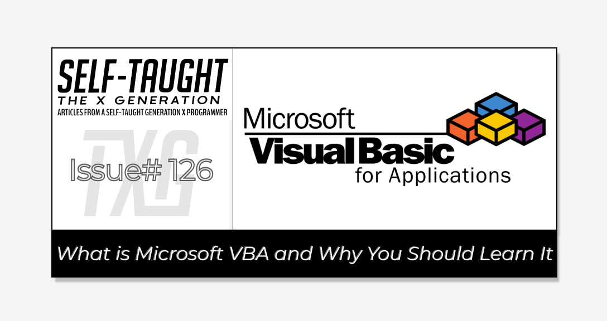
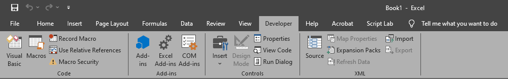
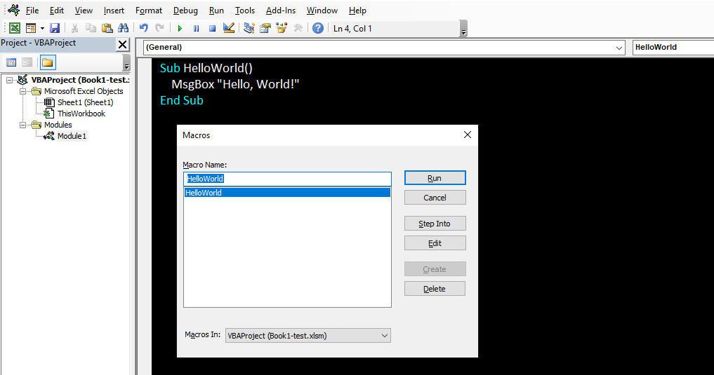
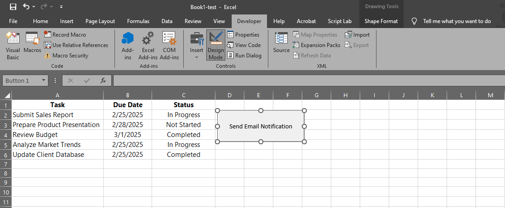
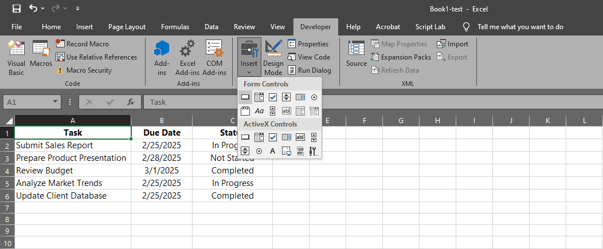

#### Learn to code VBA to take Microsoft Office to a new level! Automate repetitive tasks, connect applications, and create custom solutions tailored to specific needs, making you a valuable company asset!

---



---

### Why You Should Learn Microsoft VBA

Microsoft Office remains extremely popular for corporate desk jobs, especially Microsoft Excel. While Excel has many built-in features, you can enhance its capabilities by writing custom code. **By learning to code with Microsoft's VBA (Visual Basic for Applications), you can become a valuable asset to your company by creating custom programs that save time and money, just like I have! Not all VBA programs have to be complicated; they just need to be effective.** 

*I have achieved writing programs as simple as filling out a worksheet using data from various sources and as complicated as connecting Microsoft Access, Excel, and Outlook to achieve tasks that would be impossible to accomplish using each application individually.* 

For example, in one program I wrote, VBA code sends automated messages to staff using Outlook when certain conditions are met in Access and Excel. In this program designed for assigning drivers to truck routes, when a truck driver's license expires within seven days (data in Access), an email is automatically sent to management (Outlook) when assigning drivers to trucks (in Excel). This program saves the company money by preventing drivers with expired licenses from being assigned to routes, solving a recurring issue of drivers receiving costly tickets from law enforcement.

**By learning how to code in VBA, you will be capable of continually writing company-specific Microsoft Office programs. This will make you the company’s go-to person and give you a competitive advantage over other Microsoft Office experts in the job market!**

---

### What is VBA?

VBA, or Visual Basic for Applications, is a programming language developed by Microsoft. It is primarily used to automate tasks and enhance functionality within Microsoft Office applications like Excel, Word, and Access. VBA allows you to write custom scripts, known as macros, to perform repetitive tasks, manipulate data, and create complex calculations.

VBA is directly integrated into Office applications, offering a user-friendly environment for beginners and experienced programmers to enhance the capabilities of these tools. By leveraging VBA, you can streamline workflows, boost efficiency, and customize Office applications to meet specific business needs.

---

### Getting Started with VBA in Excel

To begin using VBA in Excel, you first need to enable the "Developer" tab, which provides access to the VBA editor and other tools necessary for writing and managing macros. Here’s how you can set it up:

1. **Open Excel**: Start by launching Microsoft Excel on your computer.
    
2. **Access Excel Options**: Click on the "File" tab in the top-left corner of the window, then select "Options" from the menu to open the Excel Options dialog box.
    
3. **Customize the Ribbon**: In the Excel Options dialog, navigate to the "Customize Ribbon" section on the left-hand side.
    
4. **Enable the Developer Tab**: In the right pane, you’ll see a list of main tabs. Check the box next to "Developer" to enable it. Click "OK" to apply the changes and close the dialog box.
    
5. **Access the Developer Tab**: You will now see the "Developer" tab in the Excel ribbon. Click on it to access various tools, including the Visual Basic for Applications editor, which you can use to write and manage your VBA code.
    
6. **Open the VBA Editor**: To start writing VBA code, click on the "Visual Basic" button in the Developer tab. This will open the VBA editor, where you can create new macros, edit existing ones, and explore the VBA environment.
    

*By following these steps, you can easily set up your Excel environment for using VBA, allowing you to automate tasks and enhance your productivity.*



---

### **VBA Program: Hello World**

Creating a "Hello World" program in VBA is a great way to get started with the basics of writing and running code. Here's a simple example of how to create a "Hello World" message box in Excel using VBA:

1. **Open the VBA Editor**:
    
    * Go to the "Developer" tab in Excel and click "Visual Basic" to open the VBA editor.
        
2. **Insert a New Module**:
    
    * In the VBA editor, right-click on any of the items in the "Project" window, select "Insert", and then "Module".
        
3. **Write the VBA Code**:
    

```basic
Sub HelloWorld()
    MsgBox "Hello, World!"
End Sub
```

4. **Run the Program**:
    
    * Press `F5` in the VBA editor to run the program.
        

**When you run this program, a message box will appear displaying the text "Hello, World!". This simple program introduces you to the basic structure of a VBA macro and how to display output using a message box.**



---

### **VBA Program: Automated Email Notification**

A great first VBA program to demonstrate the capabilities of VBA beyond Excel's built-in features is a custom email notification system. This program can automatically send emails based on specific conditions in your Excel data, which is not easily achievable with standard Excel functions. Here's a simple example:

**This program will send an email notification when a specific condition is met in your Excel worksheet, such as when a deadline is approaching a specific threshold value.**

1. **Set Up Your Excel Sheet**:
    
    * Create a worksheet with columns for "Task", "Due Date", and "Status"”
        
    * Populate the sheet with sample data.
        
2. **Open the VBA Editor**:
    
    * Go to the "Developer" tab and click "Visual Basic" to open the VBA editor.
        
3. **Insert a New Module**:
    
    * In the VBA editor, right-click on any of the items in the "Project" window, select "Insert", and then "Module".
        
4. **Write or copy the following VBA Code**:
    

```basic
Sub SendEmailNotification()
    Dim OutlookApp As Object
    Dim OutlookMail As Object
    Dim ws As Worksheet
    Dim lastRow As Long
    Dim i As Long
    Dim dueDate As Date
    Dim today As Date
    Dim taskName As String

    Set ws = ThisWorkbook.Sheets("Sheet1")
    today = Date
    lastRow = ws.Cells(ws.Rows.Count, "B").End(xlUp).Row ' Find the last row in column B

    ' Loop through each row in the worksheet
    For i = 2 To lastRow
        dueDate = ws.Cells(i, "B").Value
        taskName = ws.Cells(i, "A").Value ' Ensure this points to the correct column for task names
        If dueDate - today <= 3 And ws.Cells(i, "C").Value <> "Completed" Then
            ' Create Outlook application and mail objects
            Set OutlookApp = CreateObject("Outlook.Application")
            Set OutlookMail = OutlookApp.CreateItem(0)

            ' Configure the email
            With OutlookMail
                .To = "recipient@example.com"
                .Subject = "Task Due Soon: " & taskName
                .Body = "The task '" & taskName & "' is due on " & dueDate & ". Please ensure it is completed on time."
                .Send
            End With

            ' Clean up
            Set OutlookMail = Nothing
            Set OutlookApp = Nothing
        End If
    Next i
End Sub
```

5. **Run the Program**:
    
    * Press `F5` in the VBA editor to run the program.
        

This program checks each task's due date and sends an email notification if the task is due within three days and is not marked as "Completed." This demonstrates VBA's ability to integrate with other applications like Outlook, automate tasks, and enhance productivity.

---



### Creating a Button to Run the VBA Program

To make it easier for users to execute the "Automated Email Notification" program, you can add a button to your Excel worksheet. This button will allow users to run the VBA code with a simple click. Follow these steps to create and assign a button to your macro:

1. **Access the Developer Tab**:
    
    * Ensure the "Developer" tab is visible in the Excel ribbon. If not, enable it through Excel Options as described earlier.
        
2. **Insert a Button**:
    
    * Go to the "Developer" tab and click on "Insert" in the Controls group.
        
    * Select the "Button (Form Control)" from the dropdown menu.
        
3. **Draw the Button**:
    
    * Click and drag on the worksheet where you want the button to appear. This will create a button of the desired size.
        
4. **Assign the Macro**:
    
    * After drawing the button, the "Assign Macro" dialog box will appear.
        
    * Select the "SendEmailNotification" macro from the list and click "OK."
        
5. **Customize the Button**:
    
    * Right-click the button and select "Edit Text" to change the button's label to something descriptive, like "Send Notifications."
        
6. **Test the Button**:
    
    * Click the button to ensure it runs the "Automated Email Notification" program as expected.
        

*By following these steps, you can provide users with a convenient way to execute the VBA program directly from the Excel interface, enhancing usability and efficiency.*



---

### Upcoming VBA Articles

If you enjoyed this article and are interested in learning VBA, look for my upcoming articles, where I will share more tutorials on how to use it!

---


### **Be sure to listen to the HTML All The Things Podcast!**

#### 📝 *I also write articles for the HTML All The Things Podcast, which you can read on their website:* [*https://www.htmlallthethings.com/*](https://www.htmlallthethings.com/)*.*

#### **Be sure to check out HTML All The Things on socials!**

* [Twitter](https://twitter.com/htmleverything)
    
* [LinkedIn](https://www.linkedin.com/company/html-all-the-things/)
    
* [TikTok](https://www.tiktok.com/@htmlallthethings)
    
* [Instagram](https://www.instagram.com/htmlallthethings/)
    

---

### Affiliate & Discounts Links!


**With CodeMonkey, learning can be all fun and games!** CodeMonkey transforms education into an engaging experience, enabling children to evolve from tech consumers to creators. Use CodeMonkey's **FREE trial** to unlock the incredible potential of young tech creators!

*With a structured learning path tailored for various age groups, kids progress from block coding to more advanced topics like data science and artificial intelligence, using languages such as CoffeeScript and Python. The platform includes features for parents and teachers to track progress, making integrating coding into home and classroom settings easy.*

Through fun games, hands-on projects, and community interaction, CodeMonkey helps young learners build teamwork skills and receive recognition for their achievements. It fosters a love for coding and prepares children for future career opportunities in an ever-evolving tech landscape.

***To learn more about CodeMonkey, you can read my detailed*** [***review article***](https://selftaughttxg.com/2025/02-25/inspiring-young-coders-how-codemonkey-turns-kids-into-tech-creators/)***!***

**Affiliate Links:**

* [Sign Up for Parents](https://codemonkey.sjv.io/c/5987452/919057/12259)
    
* [Sign Up for Teachers](https://codemonkey.sjv.io/c/5987452/919060/12259)
    

---


### Advance your career with a 20% discount on Scrimba Pro using this [affiliate link](https://scrimba.com/?via=MichaelLarocca)!

Become a hireable developer with Scrimba Pro! Discover a world of coding knowledge with full access to all courses, hands-on projects, and a vibrant community. You can [read my article](https://selftaughttxg.com/2021/06-21/06-07-21/) to learn more about my exceptional experiences with Scrimba and how it helps many become confident, well-prepared web developers!

###### ***Important:*** *This discount is for new accounts only. If a higher discount is currently available, it will be applied automatically.*

**How to Claim Your Discount:**

1. Click [the link](https://scrimba.com/?via=MichaelLarocca) to explore the new Scrimba 2.0.
    
2. Create a new account.
    
3. Upgrade to Pro; the 20% discount will automatically apply.
    

##### ***Disclosure:*** *This article contains affiliate links. I will earn a commission from any purchases made through these links at no extra cost to you. Your support helps me continue creating valuable content. Thank you!*

---

### Conclusion

Learning Microsoft VBA is a strategic move to enhance your productivity and problem-solving skills within Microsoft Office applications like Excel, Word, and Access. By automating repetitive tasks and seamlessly connecting different applications, VBA empowers you to create custom solutions tailored to specific business needs.

From writing simple macros to developing complex programs that integrate Excel, Access, and Outlook, mastering VBA allows you to streamline workflows and tackle challenges that would be difficult to address with standard Office features alone.

As you become proficient in VBA, you will not only enhance efficiency but also establish yourself as a valuable asset in any workplace. This skill drives innovation and operational excellence, makes you the company’s go-to person, and provides you with a competitive edge over other Microsoft Office experts in the job market!

---

###### ***Do you now feel empowered to automate tasks using Microsoft VBA? Are you ready to create custom solutions for your projects? Please share the article and comment!***
