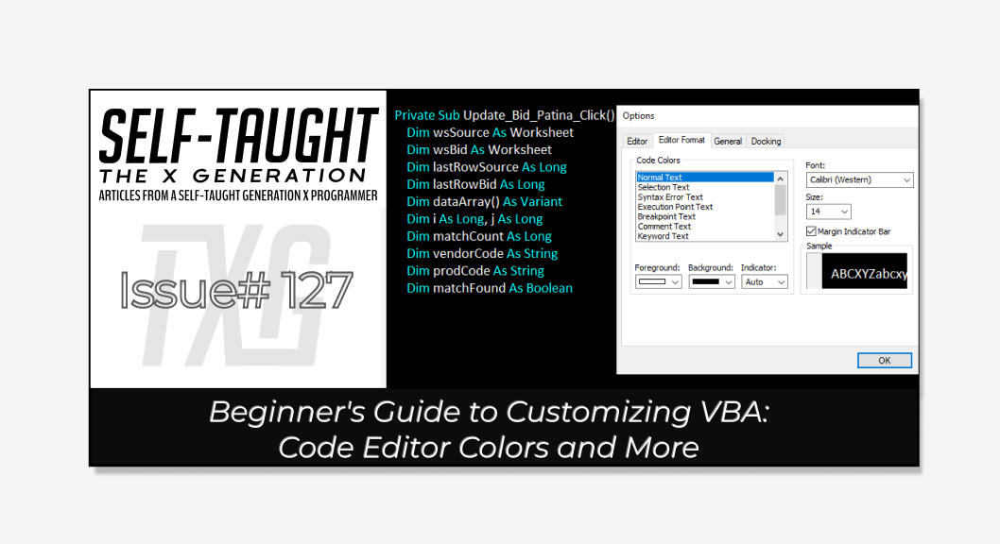

#### In this article, we focus on VBA editor tweaks. Learn to modify colors and other available settings in the VBA Options dialog box to create a personalized coding space that enhances your productivity!

---

---

### What is Microsoft VBA and Why You Should Learn It

VBA, or Visual Basic for Applications, is a programming language developed by Microsoft to automate tasks and enhance functionality in Office applications like Excel, Word, and Access. It allows users to create macros for repetitive tasks, data manipulation, and complex calculations. Integrated into Office, VBA offers a user-friendly environment for both beginners and experienced programmers to extend tool capabilities and streamline workflows.

Learning VBA is particularly advantageous in corporate settings where Microsoft Office is prevalent. Mastering VBA enhances Excel's capabilities, making you a valuable asset by creating custom programs that save time and money. These programs can range from simple data entry automation to complex integrations across Office applications. For more detailed insights, refer to my first [article](https://selftaughttxg.com/2025/02-25/what-is-microsoft-vba-and-why-you-should-learn-it/) in this series.

---

### Enabling the Developer Tab in Excel for VBA Access

To start using VBA in Excel, you must enable the "Developer" tab, which provides access to the VBA editor and other tools for managing macros. For detailed instructions on how to set up the "Developer" tab, please refer to my article "[Getting Started with VBA in Excel](https://selftaughttxg.com/2025/02-25/what-is-microsoft-vba-and-why-you-should-learn-it/)." In that article, I cover the step-by-step process of enabling the "Developer" tab, accessing the VBA editor, and setting up your Excel environment for VBA use.

---

### Where is the Night Theme?

The main reason I’m writing this article is to show you how to customize the VBA code editor to adopt a night style theme, so you’re not stuck coding with the default light style theme. As you may have guessed, the VBA code editor is not as intricate as editors such as VS Code, and if you're like me, a dark background with light-colored text is more comfortable for coding. Unfortunately, I found that achieving this is more complicated than it ought to be. But no worries. Once you see where to go and what to update, it’s pretty straightforward ( it’s in the **Editor Format** if you want to skip it ).

*Since we are using the editor tab to change the code window colors, it’s also a good opportunity to learn what all of the other available options do! So let’s jump right in!*

---

### The Options Dialog Box

To reach the options dialog box, which is what we need to change the code editor colors, follow these steps:

1. Open Excel and navigate to the "Developer" tab. If the "Developer" tab is not visible, you may need to enable it through Excel's options.
    
2. Click on "Visual Basic" in the "Developer" tab to open the VBA editor. Alternatively, you can press `ALT + F11` to open the VBA editor directly.
    
3. In the VBA editor, go to the "Tools" menu located at the top of the window.
    
4. From the "Tools" menu, select "Options" to open the Options Dialog Box.
    

*Once the Options Dialog Box is open, you can navigate through the different tabs to customize the editor settings, including changing the code editor colors in the "Editor Format" tab.*

---

### The Editor Tab Options

Several customization options are available in the VBA code editor to enhance your coding experience. These options are organized into different categories:

1. **Editor**: This section allows you to adjust settings related to the code editing environment, such as enabling or disabling features like auto syntax check and requiring variable declaration.
    
2. **Editor Format**: Here, you can customize the appearance of the code editor, including font style and size, code color schemes for different elements like comments and keywords, and the visibility of the margin indicator bar.
    
3. **General**: This category includes various settings that affect the overall behavior of the VBA environment, such as error handling and code execution preferences.
    
4. **Docking**: This option lets you configure how the VBA windows are arranged and docked within the editor, allowing you to create a workspace layout that suits your workflow.
    

These customization options allow you to customize the VBA editor to your preferences, improving your coding efficiency and comfort.

---

### **Editor**

The Editor tab in the VBA Options Dialog Box is designed to streamline your coding process by providing features that enhance error detection, code completion, and readability. Here's a breakdown of the key options available:

* **Auto Syntax Check**: This feature automatically checks for syntax errors as you write your code. By enabling it, you can catch mistakes early, ensuring your code is error-free and runs smoothly.
    
* **Require Variable Declaration**: When this option is enabled, you must declare all variables explicitly. This practice reduces the risk of errors caused by undeclared or misspelled variables, promoting better coding habits and more reliable code.
    
* **Auto List Members**: This feature provides a list of available properties and methods as you type, making it easier to find and use the correct elements. It speeds up the coding process by reducing the need to remember every detail.
    
* **Auto Quick Info**: This option displays information about functions and their parameters, helping you understand how to use them effectively. It serves as a quick reference guide, enhancing your coding efficiency.
    
* **Auto Data Tips**: When enabled, this feature provides data tips that display the value of variables as you hover over them during debugging. It helps you quickly identify and resolve issues within your code.
    
* **Auto Indent**: This option automatically indents your code, maintaining a consistent and readable format. Proper indentation is crucial for understanding the structure and flow of your code, especially in complex scripts.
    

---

### **Editor Format**

The Editor Format tab in the VBA Options Dialog Box allows you to customize the visual aspects of your code editor, enhancing readability and comfort. Here's a look at the key customization options available:

* **Font and Size**: Choose a font style and size that suits your preferences and enhances readability. A comfortable font reduces eye strain and makes long coding sessions more manageable.
    
* **Code Colors**: Customize the color scheme for different code elements such as comments, keywords, and strings. By assigning distinct colors, you can quickly differentiate between various parts of your code, improving visual clarity and reducing errors.
    
* **Margin Indicator Bar**: This feature provides a visual guide along the left margin of the code window. It can be customized to help you track code blocks and navigate your code more efficiently.
    

#### How to Set a Night-Style Theme

**Unlike code editors like VS Code, VBA does not have pre-set night themes. However, you can adjust the colors so that the background is dark and the text is light. To achieve this, you will need to change the following settings.**

**As you will see, to achieve a dark background with light text, you must apply the same dark and light colors to several options. Feel free to experiment by adjusting the color, font style, and size to your liking. You can view a preview of your changes in the “Sample“ section of the Editor Format tab in the Options dialog box.**

#### Code Colors

**Normal Text**

* **Foreground:** White
    
* **Background:** Black
    

**Syntax Error Text**

* **Foreground:** Red
    
* **Background:** Black
    

**Comment Text**

* **Foreground:** Light Green
    
* **Background:** Black
    

**Keyword Text**

* **Foreground:** Light Blue
    
* **Background:** Black
    

**Identifier Text**

* **Foreground:** White
    
* **Background:** Black
    

**Note:** *No “rest default“option exists, so you must manually change each setting back. Since I wrote these step-by-step instructions after making changes, I apologise for missing any settings.*

---

### **General**

The General tab in the VBA Options Dialog Box includes settings that affect the overall behavior of the VBA environment, allowing you to tailor it to your specific needs. Here's an overview of the key options available:

* **Error Trapping**: This setting determines how VBA handles errors during code execution. Depending on your debugging preferences, you can choose from options like Break on All Errors, Break in Class Module, and Break on Unhandled Errors.
    
* **Compile on Demand**: When enabled, this option allows VBA to compile code only when necessary, which can speed up the development process by reducing initial load times.
    
* **Background Compile**: This feature enables VBA to compile code in the background, minimizing interruptions and allowing you to continue working while the code is being compiled.
    

---

### **Docking**

The Docking tab in the VBA Options dialog box lets you customize the arrangement of windows within the VBA editor, helping you create an efficient and organized workspace. Here's an overview of the key options available:

* **Docking Options**: These settings let you configure how different windows, such as the Project Explorer, Properties window, and Code window, are docked within the editor. You can choose to dock windows to the sides of the main window or allow them to float freely.
    
* **Floating Windows**: This feature allows windows to be undocked and moved independently, which can be particularly useful if you are working with multiple monitors or need to view multiple windows simultaneously.
    

---

### My other related articles

* [Getting Started with VBA in Excel](https://selftaughttxg.com/2025/02-25/what-is-microsoft-vba-and-why-you-should-learn-it/)
    

---

### **Be sure to listen to the HTML All The Things Podcast!**

#### 📝 *I also write articles for the HTML All The Things Podcast, which you can read on their website:* [*https://www.htmlallthethings.com/*](https://www.htmlallthethings.com/)*.*

#### **Be sure to check out HTML All The Things on socials!**

* [Twitter](https://twitter.com/htmleverything)
    
* [LinkedIn](https://www.linkedin.com/company/html-all-the-things/)
    
* [TikTok](https://www.tiktok.com/@htmlallthethings)
    
* [Instagram](https://www.instagram.com/htmlallthethings/)
    

---

### Affiliate & Discounts Links!

**With CodeMonkey, learning can be all fun and games!** CodeMonkey transforms education into an engaging experience, enabling children to evolve from tech consumers to creators. Use CodeMonkey's **FREE trial** to unlock the incredible potential of young tech creators!

*With a structured learning path tailored for various age groups, kids progress from block coding to more advanced topics like data science and artificial intelligence, using languages such as CoffeeScript and Python. The platform includes features for parents and teachers to track progress, making integrating coding into home and classroom settings easy.*

Through fun games, hands-on projects, and community interaction, CodeMonkey helps young learners build teamwork skills and receive recognition for their achievements. It fosters a love for coding and prepares children for future career opportunities in an ever-evolving tech landscape.

***To learn more about CodeMonkey, you can read my detailed*** [***review article***](https://selftaughttxg.com/2025/02-25/inspiring-young-coders-how-codemonkey-turns-kids-into-tech-creators/)***!***

**Affiliate Links:**

* [Sign Up for Parents](https://codemonkey.sjv.io/c/5987452/919057/12259)
    
* [Sign Up for Teachers](https://codemonkey.sjv.io/c/5987452/919060/12259)
    

---

### Advance your career with a 20% discount on Scrimba Pro using this [affiliate link](https://scrimba.com/?via=MichaelLarocca)!

Become a hireable developer with Scrimba Pro! Discover a world of coding knowledge with full access to all courses, hands-on projects, and a vibrant community. You can [read my article](https://selftaughttxg.com/2021/06-21/06-07-21/) to learn more about my exceptional experiences with Scrimba and how it helps many become confident, well-prepared web developers!

###### ***Important:*** *This discount is for new accounts only. If a higher discount is currently available, it will be applied automatically.*

**How to Claim Your Discount:**

1. Click [the link](https://scrimba.com/?via=MichaelLarocca) to explore the new Scrimba 2.0.
    
2. Create a new account.
    
3. Upgrade to Pro; the 20% discount will automatically apply.
    

##### ***Disclosure:*** *This article contains affiliate links. I will earn a commission from any purchases made through these links at no extra cost to you. Your support helps me continue creating valuable content. Thank you!*

---

### Conclusion

Learning VBA (Visual Basic for Applications) can significantly enhance your productivity by automating tasks and extending the functionality of Microsoft Office applications. Using VBA, you can create programs that range from as simple as filling out a worksheet with data from various sources to as complex as connecting Microsoft Access, Excel, and Outlook to perform tasks that would be impossible to accomplish with each application individually!

Customizing the VBA code editor further personalizes your coding environment, making it more efficient and comfortable to work with.

Whether you're fine-tuning the color scheme for a more comfortable way to work, such as using a night-style theme, or fine-tuning editor settings to boost your productivity, these little adjustments can help significantly improve your workflow!

---

###### *Are you ready to boost your VBA productivity with personalized settings? Do you have other useful VBA tips to share? Please share the article and comment*

---
