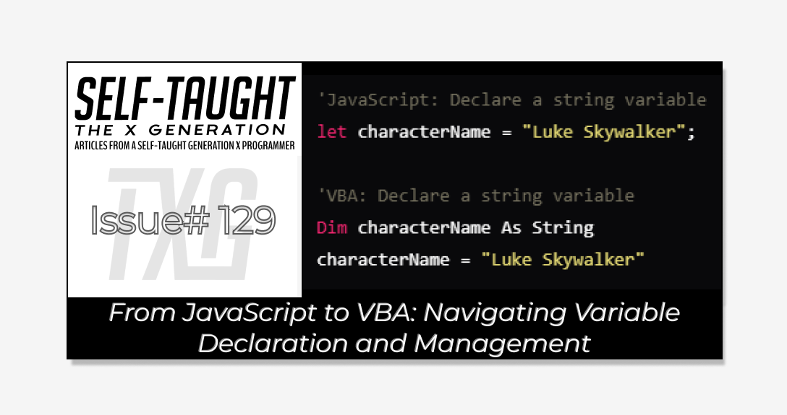

#### Transitioning from JavaScript to VBA? This article covers the key aspects of variable declaration and management in VBA. Embrace this structured approach to ensure a smooth transition from JavaScript!

---



---

### **Article Concept Overview**

#### **Problem:**

Transitioning from JavaScript to VBA can be daunting due to differences in variable declaration and management. JavaScript's dynamic typing and modern code editors provide a flexible environment, whereas VBA requires a more structured approach to variable declaration and debugging. This can lead to confusion and inefficiencies, especially for those accustomed to JavaScript's flexible nature and advanced debugging tools.

#### **Solution:**

This article aims to bridge the gap between JavaScript and VBA by focusing on the essential aspect of variable declaration. You can effectively manage variables by understanding the syntax and structure of VBA, including using the `Dim` keyword and various data types.

---

### What is Microsoft VBA and Why You Should Learn It

VBA, or Visual Basic for Applications, is a programming language developed by Microsoft to automate tasks and enhance functionality in Office applications like Excel, Word, and Access. It allows you to create macros for repetitive tasks, manage data, and perform complex calculations. Integrated into Office, VBA offers a user-friendly environment for beginners and experienced programmers to improve tool capabilities and streamline workflows.

Learning VBA is particularly beneficial in corporate settings where Microsoft Office is widely used. Mastering VBA enhances Excel's functionalities, making you a valuable asset by creating custom programs that save both time and money. These programs can range from basic data entry automation to complex integrations across Office applications. For more detailed insights, refer to my first [article](https://selftaughttxg.com/2025/02-25/what-is-microsoft-vba-and-why-you-should-learn-it/) in this series.

---

### Enabling the Developer Tab in Excel for VBA Access

To begin using VBA in Excel, you must enable the "Developer" tab, which provides access to the VBA editor and various tools for managing macros. For detailed guidance on how to set up the "Developer" tab, please refer to my article "[Getting Started with VBA in Excel](https://selftaughttxg.com/2025/02-25/what-is-microsoft-vba-and-why-you-should-learn-it/)." In that article, I explain the step-by-step process of enabling the "Developer" tab, accessing the VBA editor, and preparing your Excel environment for VBA use.

---

### **Understanding Variables in JavaScript**

JavaScript's dynamic typing offers flexibility but can cause runtime errors if types aren't managed well. This is useful for quick development but needs careful handling to prevent issues. Unlike JavaScript, VBA requires explicit declaration and typing, reducing type-related errors and promoting disciplined variable management. Understanding this difference is crucial for those transitioning from JavaScript to VBA.

**Comparison with JavaScript**:

* JavaScript uses `var`, `let`, and `const` to declare variables, and it is dynamically typed, meaning you don't specify the data type. Variables can hold any type of data and can change types during execution.
    
* `let` and `const` provide block scope, while `var` provides function scope. This differs from VBA's more rigid scope rules.
    

**Example in JavaScript**:

* `let age = 25;` declares a variable `age` that can hold any type of data, initially a number.
    
* JavaScript's flexibility allows `age` to later hold a string, like `age = "twenty-five";`, which is not possible in VBA without changing the variable's declaration.
    

---

### **Understanding Variables in VBA**

In VBA, a variable is a named storage spot for data that can change during a program. Variables store, retrieve, and manipulate data. They must be declared with a data type using the `Dim` keyword, which helps use memory efficiently and reduces errors. Explicit typing ensures consistent use and optimizes memory by allocating the right space for each variable.

**Declaration**:

* In VBA, you use `Dim` to declare a variable, specifying its name and data type. For example: `Dim age As Integer`.
    
* This declaration allocates memory for the variable and defines the type of data it can hold, ensuring efficient memory usage and reducing errors.
    

**Explicit Typing**:

* VBA requires explicit typing, meaning you must specify the data type of each variable. This helps prevent type-related errors and ensures consistent use of variables.
    
* Example: `Dim name As String` declares a variable `name` that can only hold text.
    

**Scope**:

* The scope of a variable declared with `Dim` depends on where it is declared. If declared within a procedure, it is local to that procedure. If declared at the module level, it is accessible throughout the module.
    

*Understanding* `Dim` *and its role in VBA is crucial for writing structured and error-free code. It enforces a disciplined approach to variable management, contrasting with JavaScript's more flexible but potentially error-prone dynamic typing.*

---

### **VBA Data Types**

Understanding the various data types available in VBA is crucial for efficient programming and memory management. Each data type serves a specific purpose, allowing you to store and manipulate data effectively. By choosing the appropriate data type for your variables, you can optimize performance and reduce errors in your VBA projects.

**Below is a comprehensive list of data types you can utilize in VBA to handle different kinds of data and calculations.**

1. **Byte**: Stores integer values from 0 to 255.
    
2. **Integer**: Stores whole numbers from -32,768 to 32,767.
    
3. **Long**: Stores larger whole numbers from -2,147,483,648 to 2,147,483,647.
    
4. **LongLong**: Available in 64-bit versions of VBA, stores even larger whole numbers.
    
5. **LongPtr**: Used for pointers and handles, size depends on the platform (32-bit or 64-bit).
    
6. **Single**: Single-precision floating-point for numbers with decimals.
    
7. **Double**: Double-precision floating-point for more precise decimal calculations.
    
8. **Currency**: Fixed-point for financial calculations, supporting four decimal places.
    
9. **Decimal**: High-precision calculations, used as a subtype of Variant.
    
10. **String**: Stores sequences of characters (text).
    
11. **Boolean**: Represents logical values, `True` or `False`.
    
12. **Date**: Stores date and time values.
    
13. **Variant**: Can hold any type of data, including numbers, strings, and objects.
    
14. **Object**: Stores references to objects for manipulation within VBA.
    

These data types provide a range of options for handling different kinds of data and calculations in VBA, allowing for efficient and precise programming.

---

### Exploring VBA Data Types Through a Star Wars Character Example

This VBA program provides a practical demonstration of how various data types can be utilized to represent and manage information about a Star Wars character!

By declaring variables with specific data types, such as `Byte`, `Integer`, `Long`, and others, the program efficiently stores and manipulates character attributes like rank, age, and force power level. This example not only highlights the versatility of VBA's data types but also offers a fun and engaging way to understand their application in real-world scenarios.

```basic
Sub StarWarsCharacterInfo()
    ' Declare variables using different data types
    Dim characterRank As Byte
    Dim characterAge As Integer
    Dim characterID As Long
    Dim midichlorianCount As LongLong
    Dim pointerExample As LongPtr ' Used for demonstration, not functional in this context
    Dim characterHeight As Single
    Dim forcePowerLevel As Double
    Dim credits As Currency
    Dim preciseCalculation As Variant ' Decimal is used as a subtype of Variant
    Dim characterName As String
    Dim isJedi As Boolean
    Dim birthDate As Date
    Dim characterDescription As Variant
    Dim characterObject As Object ' Example object, not functional in this context

    ' Assign values to the variables
    characterRank = 5
    characterAge = 19
    characterID = 1001
    midichlorianCount = 20000
    ' pointerExample is not assigned as it's for demonstration
    characterHeight = 1.72
    forcePowerLevel = 9000.5
    credits = 1500.75
    preciseCalculation = CDec(12345.6789) ' Example Decimal value using CDec
    characterName = "Luke Skywalker"
    isJedi = True
    birthDate = #7/24/1976# ' fictional date
    characterDescription = "A young farm boy who becomes a Jedi Knight."
    ' characterObject is not assigned as it's for demonstration

    ' Display the character information
    MsgBox "Character Rank: " & characterRank & vbCrLf & _
           "Age: " & characterAge & vbCrLf & _
           "Character ID: " & characterID & vbCrLf & _
           "Midichlorian Count: " & midichlorianCount & vbCrLf & _
           "Height: " & characterHeight & " meters" & vbCrLf & _
           "Force Power Level: " & forcePowerLevel & vbCrLf & _
           "Credits: " & credits & vbCrLf & _
           "Precise Calculation: " & preciseCalculation & vbCrLf & _
           "Character Name: " & characterName & vbCrLf & _
           "Is Jedi: " & isJedi & vbCrLf & _
           "Birth Date: " & birthDate & vbCrLf & _
           "Description: " & characterDescription
End Sub
```

*Following these instructions will allow you to effectively run and interact with the VBA program, gaining a practical understanding of how various data types manage and display information:*

**To use the "Exploring VBA Data Types Through a Star Wars Character Example" program, follow these steps:**

**Open Excel and Access the VBA Editor:**

* Open Microsoft Excel.
    
* Press `Alt + F11` to open the VBA editor.
    

**Insert a New Module:**

* In the VBA editor, click on `Insert` in the menu bar.
    
* Select `Module` from the dropdown menu. This will create a new module where you can write your VBA code.
    

**Copy and Paste the Code:**

* Copy the entire VBA code provided in the example.
    
* Paste the code into the newly created module in the VBA editor.
    

**Run the Program:**

* Ensure your cursor is within the `Sub StarWarsCharacterInfo()` procedure.
    
* Press `F5` or click on the `Run` button (green triangle) in the toolbar to execute the program.
    

**View the Output:**

* A message box will appear displaying the character information for Luke Skywalker, including attributes like rank, age, and force power level.
    

**Explore and Modify:**

* Feel free to modify the variable values or add additional characters to explore how different data types can be used in VBA.
    
* You can also add more message boxes or print statements to display additional information or test other data types.
    

---

### My other related articles

* [What is Microsoft VBA and Why You Should Learn It](https://selftaughttxg.com/2025/02-25/what-is-microsoft-vba-and-why-you-should-learn-it/)
    
* [Beginner's Guide to Customizing VBA: Code Editor Colors and More](https://selftaughttxg.com/2025/03-25/beginner's-guide-to-customizing-vba:-code-editor-colors-and-more/)
    
* [Simplifying VBA Debugging: Real-Time Insights with Immediate and Locals Windows](https://selftaughttxg.com/2025/03-25/simplifying-vba-debugging-real-time-insights-with-immediate-and-locals-windows/)
    

---


### **Be sure to listen to the HTML All The Things Podcast!**

#### 📝 *I also write articles for the HTML All The Things Podcast, which you can read on their website:* [*https://www.htmlallthethings.com/*](https://www.htmlallthethings.com/)*.*

#### **Be sure to check out HTML All The Things on socials!**

* [Twitter](https://twitter.com/htmleverything)
    
* [LinkedIn](https://www.linkedin.com/company/html-all-the-things/)
    
* [TikTok](https://www.tiktok.com/@htmlallthethings)
    
* [Instagram](https://www.instagram.com/htmlallthethings/)
    

---

### Affiliate & Discount Links!


**With CodeMonkey, learning can be all fun and games!** CodeMonkey transforms education into an engaging experience, enabling children to evolve from tech consumers to creators. Use CodeMonkey's **FREE trial** to unlock the incredible potential of young tech creators!

*With a structured learning path tailored for various age groups, kids progress from block coding to more advanced topics like data science and artificial intelligence, using languages such as CoffeeScript and Python. The platform includes features for parents and teachers to track progress, making integrating coding into home and classroom settings easy.*

Through fun games, hands-on projects, and community interaction, CodeMonkey helps young learners build teamwork skills and receive recognition for their achievements. It fosters a love for coding and prepares children for future career opportunities in an ever-evolving tech landscape.

***To learn more about CodeMonkey, you can read my detailed*** [***review article***](https://selftaughttxg.com/2025/02-25/inspiring-young-coders-how-codemonkey-turns-kids-into-tech-creators/)***!***

**Affiliate Links:**

* [Sign Up for Parents](https://codemonkey.sjv.io/c/5987452/919057/12259)
    
* [Sign Up for Teachers](https://codemonkey.sjv.io/c/5987452/919060/12259)
    

---


### Advance your career with a 20% discount on Scrimba Pro using this [affiliate link](https://scrimba.com/?via=MichaelLarocca)!

Become a hireable developer with Scrimba Pro! Discover a world of coding knowledge with full access to all courses, hands-on projects, and a vibrant community. You can [read my article](https://selftaughttxg.com/2021/06-21/06-07-21/) to learn more about my exceptional experiences with Scrimba and how it helps many become confident, well-prepared web developers!

###### ***Important:*** *This discount is for new accounts only. If a higher discount is currently available, it will be applied automatically.*

**How to Claim Your Discount:**

1. Click [the link](https://scrimba.com/?via=MichaelLarocca) to explore the new Scrimba 2.0.
    
2. Create a new account.
    
3. Upgrade to Pro; the 20% discount will automatically apply.
    

##### ***Disclosure:*** *This article contains affiliate links. I will earn a commission from any purchases made through these links at no extra cost to you. Your support helps me continue creating valuable content. Thank you!*

---

### Conclusion

Transitioning from JavaScript to VBA involves understanding key differences in how each language handles variables. In JavaScript, variables are declared using keywords like `var`, `let`, or `const`, and the language is dynamically typed. This means that a variable can hold any type of data, such as a number, string, or object, and can change types during execution. This flexibility allows for quick development but requires careful management to avoid runtime errors.

In contrast, VBA employs a more structured approach to variable management. It requires explicit declaration and typing of variables using the `Dim` keyword. For example, when you declare a variable in VBA, you must specify its data type, such as `Dim age As Integer`. This explicit declaration helps ensure that the variable is used consistently throughout the code, optimizing memory usage and reducing the likelihood of type-related errors. Understanding this fundamental difference is crucial for a smooth transition from JavaScript to VBA.

In addition to the differences in variable declaration and typing, there are various data types available in VBA, such as `Integer`, `Long`, `String`, `Boolean`, and `Date`, among others. Each data type serves a specific purpose, allowing for efficient data storage and manipulation.

The variable scope in VBA also differs from JavaScript. In VBA, variable scope can be local, meaning the variable is accessible only within the procedure where it is declared, or module-level, where the variable is accessible throughout the entire module. This differs from JavaScript, which uses function and block scope.

Understanding these concepts of variable declaration, typing, and scope will enhance your programming skills and ease your transition from JavaScript to VBA!

---

###### *Do you now understand the difference in variable declaration between VBA and JavaScript?* *Do you feel more confident in transitioning from JavaScript to VBA? Please share the article and comment!*

---
