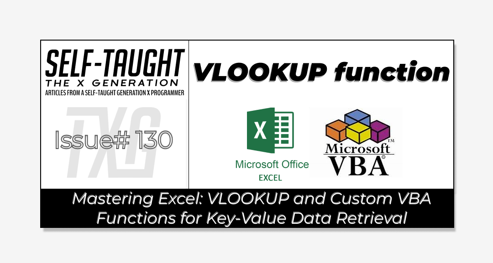

#### This article teaches how to use the Excel VLOOKUP function, which retrieves data similar to key-value pairs in JavaScript. You will then learn to build a similar custom function in VBA from scratch!

---


---

### The VLOOKUP Function

When it comes to writing programs, they don’t always have to be complicated; they just need to be effective. And sometimes, a simple solution is the best solution, and that might not be a program!

Microsoft Excel’s built-in VLOOKUP function is a powerful tool. It simplifies data retrieval by allowing you to quickly find and return information from large datasets, making it an essential feature for efficient data management.

**I’ve been using VLOOKUP a lot recently to retrieve product prices. The VLOOKUP function is ideal if you just need to retrieve one unique value to a corresponding unique value (think of key-value pairs).**

*In respect of your time, if you just need to learn how to use Excel’s VLOOKUP, I will step through it now.*

**VLOOKUP Function Syntax:**

`=VLOOKUP(lookup_value, table_array, col_index_num, [range_lookup])`

**Breakdown of Each Parameter:**

**lookup\_value:**

* This is the value you want to search for in the first column of your data range (table\_array). It acts as the "key" in a key-value pair.
    
* Example: If you're looking up a product price using a product ID, the product ID would be your lookup\_value.
    

**table\_array:**

* This is the range of cells that contains the data you want to search through. It should include both the column with the lookup\_value and the column with the value you want to retrieve.
    
* Example: If your data is in columns A to C, you might use A2:C10 as your table\_array.
    

**col\_index\_num:**

* This is the column number in the table\_array from which you want to retrieve the value. The first column in the range is 1, the second is 2, and so on.
    
* Example: If you want to retrieve data from the third column of your table\_array, you would use 3 as your col\_index\_num.
    

**\[range\_lookup\]:**

* This is an optional parameter that specifies whether you want an exact match (FALSE) or an approximate match (TRUE). Using FALSE is recommended for exact matches.
    
* Example: If you want to ensure that the function only returns a result when there is an exact match for the lookup\_value, you would set this to FALSE.
    

---

#### **Example Usage:**

Suppose you have a table with product IDs in column A on Sheet1, product names in column B, and prices in column C on Sheet2. To find the price of a product using the product ID stored in column A on Sheet2, you would use:

`=VLOOKUP(A2, Sheet2!A2:C10, 3, FALSE)`

* `A2` is the cell reference containing the lookup\_value (e.g., a product ID) on the current sheet.
    
* `Sheet2!A2:C10` is the table\_array where the data is located on Sheet2.
    
* `3` is the col\_index\_num, indicating you want the price from the third column.
    
* `FALSE` ensures an exact match is required.
    

**This function will search for the product ID in the first column of the range A2:C10 on Sheet2 and return the corresponding price from the third column.**

**Sheet1:**

| **A** | **B** |
| --- | --- |
| 101 | `=VLOOKUP(A2, Sheet2!A2:C10, 3, FALSE)` |
| 102 | `=VLOOKUP(A3, Sheet2!A2:C10, 3, FALSE)` |
| 103 | `=VLOOKUP(A4, Sheet2!A2:C10, 3, FALSE)` |

**Sheet2:**

| A | B | C |
| --- | --- | --- |
| 101 | Item1 | $10.00 |
| 102 | Item2 | $15.00 |
| 103 | Item3 | $20.00 |

---

**💡 Tip:** *Using* `VALUE()` *for your first argument in the VLOOKUP function ensures that the* `lookup_value` *is interpreted as a number. This is particularly useful when your data includes numeric values stored as text, as it helps prevent mismatches caused by data type differences and enhances the accuracy of your VLOOKUP results. For example, you can use* `=VLOOKUP(VALUE(A1), A2:C10, 3, FALSE)` *to convert the value in A1 to a number before performing the lookup.*

---

**Important Notes:**

* **First Column Requirement:** The VLOOKUP function requires that the lookup\_value be located in the ***first column*** of the specified table\_array. This means that the column containing the data you want to search through must be the leftmost column in your range. If your lookup\_value is not in the first column, you will need to rearrange your data or use alternative functions like INDEX and MATCH to perform the lookup.
    
* **Exact Match:** When using FALSE for the range\_lookup parameter, VLOOKUP will only return a result if it finds an exact match for the lookup\_value. This is crucial for ensuring accuracy, especially when dealing with unique identifiers like product IDs.
    
* **Static Column Index:** The col\_index\_num is static, meaning if you add or remove columns in your table\_array, you will need to update the VLOOKUP formula to reflect the new column positions.
    
* **Single Value Return:** VLOOKUP returns only the first match it finds. If there are multiple matches for the lookup\_value, only the first one encountered will be returned. For more complex scenarios, consider using other functions or approaches.
    

---

### VLOOKUP: The Good, The Bad, and The Limited

VLOOKUP is a powerful function in Excel, but it has its strengths and limitations. Here are some use-case examples:

**The Good:**

* **Simple Data Retrieval:** VLOOKUP is excellent for retrieving data from a table when you have a unique identifier. For example, looking up a student's grade using their student ID.
    
* **Price Lists:** It's useful for finding prices of products in a list by using product codes.
    
* **Employee Information:** Quickly retrieve employee details like department or contact information using employee IDs.
    

**The Bad:**

* **Column Limitation:** VLOOKUP can only search for values in the first column of the table array. If your lookup value is not in the first column, you'll need to rearrange your data or use other functions like INDEX and MATCH.
    
* **Performance Issues:** In large datasets, VLOOKUP can be slow because it searches from top to bottom.
    

**The Limited:**

* **Exact Match Requirement:** If you need an exact match, you must set the range\_lookup argument to FALSE. Otherwise, it may return incorrect results.
    
* **Static Column Index:** The column index is static, meaning if you add or remove columns, you need to update the VLOOKUP formula manually.
    
* **Single Value Return:** VLOOKUP returns only the first match it finds, which can be limiting if there are multiple matches.
    

*For more complex lookups or when dealing with large datasets, consider using* [*INDEX*](https://support.microsoft.com/en-us/office/index-function-a5dcf0dd-996d-40a4-a822-b56b061328bd) *and* [*MATCH*](https://support.microsoft.com/en-us/office/match-function-e8dffd45-c762-47d6-bf89-533f4a37673a) *or newer functions like* [*XLOOKUP*](https://support.microsoft.com/en-us/office/xlookup-function-b7fd680e-6d10-43e6-84f9-88eae8bf5929)*, which offer more flexibility and efficiency.*

---

### Custom VBA VLOOKUP Function

Coding in VBA empowers you to manipulate data in Excel in any manner you please, which is why I’m such a fan! In fact, I credit my VBA and Microsoft Office skills as determining factors that have helped me maintain job security.

So, let's now go above and beyond and examine how the VLOOKUP function is constructed in VBA!

---

**💡 Note:** *To use VBA in Excel, enable the "Developer" tab to access the VBA editor and macro tools. For setup details, see my article "*[*Getting Started with VBA in Excel*](https://selftaughttxg.com/2025/02-25/what-is-microsoft-vba-and-why-you-should-learn-it/)*."*

---

**To create a custom VLOOKUP function in VBA, you'll need to set up a module in the VBA editor. Here's how you can do it:**

**Open the VBA Editor**

* Start by opening Excel and pressing `ALT` + `F11` to access the Visual Basic for Applications (VBA) editor.
    

**Insert a New Module**

* In the VBA editor, go to the menu and click on `Insert` &gt; `Module`. This will create a new module where you can write your VBA code.
    

**Write/Copy the VLOOKUP Function**

* You can write or copy this custom VLOOKUP function in the newly created module.
    

```basic
Function VLookupVBA(lookupValue As Variant, tableArray As Range, colIndexNum As Integer, Optional rangeLookup As Boolean = False) As Variant
    Dim cell As Range
    Dim result As Variant
    Dim found As Boolean
    found = False

    ' Loop through each cell in the first column of the table array
    For Each cell In tableArray.Columns(1).Cells
        ' Check if the cell value matches the lookup value
        If (rangeLookup And cell.Value >= lookupValue) Or (Not rangeLookup And cell.Value = lookupValue) Then
            ' If a match is found, get the value from the specified column
            result = cell.Offset(0, colIndexNum - 1).Value
            found = True
            Exit For
        End If
    Next cell

    ' If no match is found, return "N/A"
    If Not found Then
        result = "N/A"
    End If

    VLookupVBA = result
End Function
```

**Save and Use the Function:**

* After writing the function, save your work. You can now use this custom function in your Excel worksheets just like any other Excel function by typing `=VLookupVBA(...)` in a cell.
    

***Note:*** *After writing your custom VBA function, it's important to save your Excel workbook as a macro-enabled file. This is because standard Excel files (.xlsx) do not support macros. To do this, choose "Save As" from the File menu, and select "Excel Macro-Enabled Workbook (\*.xlsm)" from the file type options. This ensures that your VBA code is saved and can be executed when you reopen the workbook. Saving as a macro-enabled file is crucial for maintaining the functionality of any macros or custom functions you create.*

---

### How The Custom Function Works

In this section, we will take some time to step through each line of code in the customer VLookupVBA function to see how it works.

The VLookupVBA function involves creating a module, declaring variables, and using a loop and a conditional statement to retrieve data efficiently. The function iterates through each cell in the first column of the table array, checks for a match with the lookup value, retrieves the corresponding value from the specified column if a match is found, and returns "N/A" if no match is found.

**Building the Function:**

**Function Declaration:**

* `Function VLookupVBA(lookupValue As Variant, tableArray As Range, colIndexNum As Integer, Optional rangeLookup As Boolean = False) As Variant`
    
* This line declares the function `VLookupVBA`, specifying the parameters it accepts: `lookupValue`, `tableArray`, `colIndexNum`, and an optional `rangeLookup`. The function returns a `Variant` type, allowing for flexibility in the return value.
    

**Variable Declarations:**

* `Dim cell As Range`
    
* `Dim result As Variant`
    
* `Dim found As Boolean`
    
* These lines declare variables used within the function. `cell` is used to iterate through the range, `result` stores the lookup result, and `found` is a Boolean flag to indicate if a match is found.
    

**Initialize the Found Flag:**

* `found = False`
    
* This sets the `found` flag to `False` initially, indicating that no match has been found yet.
    

**Using a For Loop:**

* `For Each cell In tableArray.Columns(1).Cells`
    
* This loop iterates through each cell in the first column of the `tableArray`. It allows us to examine each cell to find a match for the `lookupValue`.
    

**Checking for a Match with an If Statement:**

* `If (rangeLookup And cell.Value >= lookupValue) Or (Not rangeLookup And cell.Value = lookupValue) Then`
    
* This line checks if the current cell's value matches the `lookupValue`. If `rangeLookup` is `True`, it checks for a value greater than or equal to `lookupValue`. Otherwise, it checks for an exact match.
    

**Retrieving and Storing the Result:**

* `result = cell.Offset(0, colIndexNum - 1).Value`
    
* `found = True`
    
* `Exit For`
    
* If a match is found, this retrieves the value from the specified column (`colIndexNum`) and stores it in `result`. It sets `found` to `True` and exits the loop.
    

**Handling No Match Found:**

* `If Not found Then`
    
* `result = "N/A"`
    
* If no match is found after the loop, this sets `result` to "N/A".
    

**Returning the Result:**

* `VLookupVBA = result`
    
* This assigns the final result to the function's return value, completing the function.
    

**By understanding each part of this function, you can see how VBA can enhance Excel's features, letting you create custom solutions for your specific needs. This method not only replicates what VLOOKUP does, but it also helps you understand how to build other custom functions in Excel!**

---

### My other related articles

* [What is Microsoft VBA and Why You Should Learn It](https://selftaughttxg.com/2025/02-25/what-is-microsoft-vba-and-why-you-should-learn-it/)
    
* [Beginner's Guide to Customizing VBA: Code Editor Colors and More](https://selftaughttxg.com/2025/03-25/beginner's-guide-to-customizing-vba:-code-editor-colors-and-more/)
    
* [Simplifying VBA Debugging: Real-Time Insights with Immediate and Locals Windows](https://selftaughttxg.com/2025/03-25/simplifying-vba-debugging-real-time-insights-with-immediate-and-locals-windows/)
    
* [From JavaScript to VBA: Navigating Variable Declaration and Management](https://selftaughttxg.com/2025/03-25/from-javascript-to-vba-navigating-variable-declaration-and-management/)
    

---


### **Be sure to listen to the HTML All The Things Podcast!**

#### 📝 *I also write articles for the HTML All The Things Podcast, which you can read on their website:* [*https://www.htmlallthethings.com/*](https://www.htmlallthethings.com/)*.*

#### **Be sure to check out HTML All The Things on socials!**

* [Twitter](https://twitter.com/htmleverything)
    
* [LinkedIn](https://www.linkedin.com/company/html-all-the-things/)
    
* [TikTok](https://www.tiktok.com/@htmlallthethings)
    
* [Instagram](https://www.instagram.com/htmlallthethings/)
    

---

### Affiliate & Discount Links!


**With CodeMonkey, learning can be all fun and games!** CodeMonkey transforms education into an engaging experience, enabling children to evolve from tech consumers to creators. Use CodeMonkey's **FREE trial** to unlock the incredible potential of young tech creators!

*With a structured learning path tailored for various age groups, kids progress from block coding to more advanced topics like data science and artificial intelligence, using languages such as CoffeeScript and Python. The platform includes features for parents and teachers to track progress, making integrating coding into home and classroom settings easy.*

Through fun games, hands-on projects, and community interaction, CodeMonkey helps young learners build teamwork skills and receive recognition for their achievements. It fosters a love for coding and prepares children for future career opportunities in an ever-evolving tech landscape.

***To learn more about CodeMonkey, you can read my detailed*** [***review article***](https://selftaughttxg.com/2025/02-25/inspiring-young-coders-how-codemonkey-turns-kids-into-tech-creators/)***!***

**Affiliate Links:**

* [Sign Up for Parents](https://codemonkey.sjv.io/c/5987452/919057/12259)
    
* [Sign Up for Teachers](https://codemonkey.sjv.io/c/5987452/919060/12259)
    

---


### Advance your career with a 20% discount on Scrimba Pro using this [affiliate link](https://scrimba.com/?via=MichaelLarocca)!

Become a hireable developer with Scrimba Pro! Discover a world of coding knowledge with full access to all courses, hands-on projects, and a vibrant community. You can [read my article](https://selftaughttxg.com/2021/06-21/06-07-21/) to learn more about my exceptional experiences with Scrimba and how it helps many become confident, well-prepared web developers!

###### ***Important:*** *This discount is for new accounts only. If a higher discount is currently available, it will be applied automatically.*

**How to Claim Your Discount:**

1. Click [the link](https://scrimba.com/?via=MichaelLarocca) to explore the new Scrimba 2.0.
    
2. Create a new account.
    
3. Upgrade to Pro; the 20% discount will automatically apply.
    

##### ***Disclosure:*** *This article contains affiliate links. I will earn a commission from any purchases made through these links at no extra cost to you. Your support helps me continue creating valuable content. Thank you!*

---

### Conclusion

Microsoft Excel's VLOOKUP function is a powerful tool for extracting values from tables using a corresponding matching value; think of it as creating key-value pairs. A great use case is retrieving a price using a product number, which I often use!

So, if you only need to retrieve one unique value, the VLOOKUP function may be a suitable solution for you. Remember, a simple solution is often the best solution! However, the VLOOKUP function has limitations—other Excel functions, such as INDEX, MATCH, or XLOOKUP, might be a better solution.

If a built-in Excel function does not meet your specific needs, you can build your own! When it comes to VBA, learning how to build custom functions in Excel for others and yourself is an empowering feeling! You can build custom functions in Excel via VBA Modules and then use them as you would any other built-in Excel function. Just make sure to save your workbook as a Macro-Enabled Workbook (\*.xlsm).

By mastering both VLOOKUP and creating custom VBA functions, you’ll improve your ability to manage and analyze data efficiently in Excel, position yourself to tackle a broader range of data challenges, and continue growing your expertise!

---

###### *Are you now confident in using Excel's VLOOKUP function and creating custom VBA functions? Do you have other tips for handling key-value data in Excel? Please share the article and comment*

---
