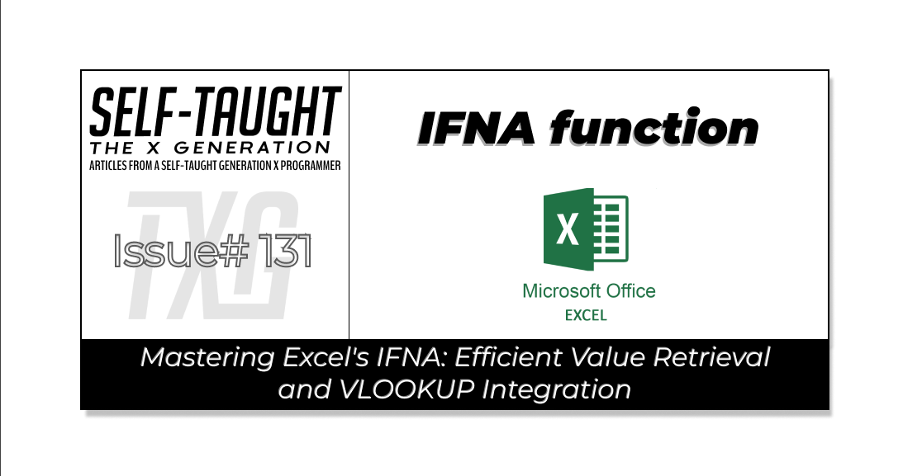

#### In this article, master Excel's IFNA function to efficiently retrieve the correct value when faced with two options. Also, explore using VLOOKUP with IFNA for enhanced data retrieval and management!

---

---

### IFNA function

Microsoft explains that the [IFNA](https://support.microsoft.com/en-us/office/ifna-function-6626c961-a569-42fc-a49d-79b4951fd461) function returns the value you specify if a formula returns the #N/A error value; otherwise, it returns the result of the formula.

**The IFNA function comes in handy when you need to return one out of two values. An easy illustration would be a retail price and sale price for a product: If the product is on sale, return the sale price; otherwise, return the retail price.**

It’s important to note that IFNA function is not checking for greater or less than values; its role is to handle errors by providing an alternative value when a formula results in an #N/A error.

**Let’s take a look at the syntax of the formula:**

`=IFNA(value, value_if_na)`

* **value**: This is the argument or formula you want to check for the #N/A error.
    
* **value\_if\_na**: This is the value you want to return if the formula results in an #N/A error.
    

---

**In this Star Wars-themed example, we explore a selection of iconic weapons, each with its own unique pricing structure.**

* **Item Code (Column A):** Quick reference for each weapon.
    
* **Item Description (Column B):** Brief overview of the weapon.
    
* **Retail Price (Column C):** Standard cost of each item.
    
* **Adjusted Price (Column D):** Discounts or special pricing; "N/A" if not applicable.
    
* **Final Price (Column E):** In row 2, the formula in the Final Price column uses `=IFNA(D2, C2)` to default to the "Retail Price" if the "Adjusted Price" is unavailable.
    

| Item Code | Item Description | Retail Price | Adjusted Price | Final Price |
| --- | --- | --- | --- | --- |
| 001 | Lightsaber | 250 Credits | 200 Credits | 200 Credits |
| 002 | Blaster Rifle | 150 Credits | N/A | 150 Credits |
| 003 | Thermal Detonator | 500 Credits | 450 Credits | 450 Credits |
| 004 | Vibroblade | 300 Credits | N/A | 300 Credits |
| 005 | Bowcaster | 400 Credits | 450 Credits | 450 Credits |

*In this example, the "Final Price" for the Bowcaster reflects the "Adjusted Price" of 450 Credits, demonstrating that the IFNA function can return the adjusted price regardless of whether it is higher or lower.*

---

### What If Both Retail and Adjusted Prices Are Available?

In the Star Wars-themed example, the IFNA function first checks the "Adjusted Price" to see if it is available and does not result in an #N/A error. If the "Adjusted Price" is valid and present, the function will return this value. This means that the "Adjusted Price" is prioritized because it might reflect a discount or special offer that you want to apply.

**For instance, consider the pricing for a Lightsaber:**

| Item Code | Item Description | Retail Price | Adjusted Price | Final Price |
| --- | --- | --- | --- | --- |
| 001 | Lightsaber | 250 Credits | 200 Credits | 200 Credits |

*In this example, the "Final Price" for the Lightsaber reflects the "Adjusted Price" of 200 Credits, demonstrating how the IFNA function prioritizes the "Adjusted Price" when it is available.*

**However, if the "Adjusted Price" is missing or results in an #N/A error, the IFNA function will then return the "Retail Price" instead. The "Retail Price" acts as a fallback option, ensuring that you always have a price to display, even if the "Adjusted Price" is unavailable.**

This approach allows you to seamlessly handle pricing scenarios where you want to use a special price when available, but default to the standard price if not.

---

### Real-World Use Case

At work, I needed to automate pricing bid sheets sent out to customers weekly. I accomplished this by creating Excel templates for each customer that take exported system information and match the current prices to the items via a VLOOKUP formula; I wrote a detailed article on using [VLOOKUP](https://selftaughttxg.com/2025/03-25/mastering-excel-vlookup-and-custom-vba-functions-for-key-value-data-retrieval/).

However, one bid sheet worked off of two price lists; price list one had the default price while price list two had the priotized price. This means that if the identical item has different prices on both price lists, the price on price list two is correct (regardless of whether the price is higher or lower).

So, I was able to retrieve the correct price by using the IFNA function. I set up the formula to first check the price from list two (the prioritized price). If this price was available and not an #N/A error, it would be used. If it was unavailable, the formula would default to the price from list one (the default price). This simple yet effective approach ensures the correct price is displayed in the customer’s bid sheet.

**In this table, the "Final Price" reflects the "Prioritized Price" from Price List Two if available. Otherwise, it defaults to the "Default Price" from Price List One.**

| Item Code | Item Description | Price List One (Default Price) | Price List Two (Prioritized Price) | Final Price |
| --- | --- | --- | --- | --- |
| 001 | Case of Apples | N/A | $35.00 | $35.00 |
| 002 | Case of Bananas | $25.00 | N/A | $25.00 |
| 003 | Case of Carrots | $30.00 | $28.00 | $28.00 |
| 004 | Case of Lettuce | N/A | $38.00 | $38.00 |
| 005 | Case of Tomatoes | $45.00 | $47.00 | $47.00 |

---

**💡 TIP:** *By taking the time to create these bid sheet templates, I’ve helped save staff hours of manual work! Consider how YOU can develop similar time-saving Excel templates to boost your office's productivity!*

---

### My other related articles

* [What is Microsoft VBA and Why You Should Learn It](https://selftaughttxg.com/2025/02-25/what-is-microsoft-vba-and-why-you-should-learn-it/)
    
* [Beginner's Guide to Customizing VBA: Code Editor Colors and More](https://selftaughttxg.com/2025/03-25/beginner's-guide-to-customizing-vba:-code-editor-colors-and-more/)
    
* [Simplifying VBA Debugging: Real-Time Insights with Immediate and Locals Windows](https://selftaughttxg.com/2025/03-25/simplifying-vba-debugging-real-time-insights-with-immediate-and-locals-windows/)
    
* [From JavaScript to VBA: Navigating Variable Declaration and Management](https://selftaughttxg.com/2025/03-25/from-javascript-to-vba-navigating-variable-declaration-and-management/)
    
* [Mastering Excel: VLOOKUP and Custom VBA Functions for Key-Value Data Retrieval](https://selftaughttxg.com/2025/03-25/mastering-excel-vlookup-and-custom-vba-functions-for-key-value-data-retrieval/)
    

---

### **Be sure to listen to the HTML All The Things Podcast!**

#### 📝 *I also write articles for the HTML All The Things Podcast, which you can read on their website:* [*https://www.htmlallthethings.com/*](https://www.htmlallthethings.com/)*.*

#### **Be sure to check out HTML All The Things on socials!**

* [Twitter](https://twitter.com/htmleverything)
    
* [LinkedIn](https://www.linkedin.com/company/html-all-the-things/)
    
* [TikTok](https://www.tiktok.com/@htmlallthethings)
    
* [Instagram](https://www.instagram.com/htmlallthethings/)
    

---

### Affiliate & Discount Links!

**With CodeMonkey, learning can be all fun and games!** CodeMonkey transforms education into an engaging experience, enabling children to evolve from tech consumers to creators. Use CodeMonkey's **FREE trial** to unlock the incredible potential of young tech creators!

*With a structured learning path tailored for various age groups, kids progress from block coding to more advanced topics like data science and artificial intelligence, using languages such as CoffeeScript and Python. The platform includes features for parents and teachers to track progress, making integrating coding into home and classroom settings easy.*

Through fun games, hands-on projects, and community interaction, CodeMonkey helps young learners build teamwork skills and receive recognition for their achievements. It fosters a love for coding and prepares children for future career opportunities in an ever-evolving tech landscape.

***To learn more about CodeMonkey, you can read my detailed*** [***review article***](https://selftaughttxg.com/2025/02-25/inspiring-young-coders-how-codemonkey-turns-kids-into-tech-creators/)***!***

**Affiliate Links:**

* [Sign Up for Parents](https://codemonkey.sjv.io/c/5987452/919057/12259)
    
* [Sign Up for Teachers](https://codemonkey.sjv.io/c/5987452/919060/12259)
    

---

### Advance your career with a 20% discount on Scrimba Pro using this [affiliate link](https://scrimba.com/?via=MichaelLarocca)!

Become a hireable developer with Scrimba Pro! Discover a world of coding knowledge with full access to all courses, hands-on projects, and a vibrant community. You can [read my article](https://selftaughttxg.com/2021/06-21/06-07-21/) to learn more about my exceptional experiences with Scrimba and how it helps many become confident, well-prepared web developers!

###### ***Important:*** *This discount is for new accounts only. If a higher discount is currently available, it will be applied automatically.*

**How to Claim Your Discount:**

1. Click [the link](https://scrimba.com/?via=MichaelLarocca) to explore the new Scrimba 2.0.
    
2. Create a new account.
    
3. Upgrade to Pro; the 20% discount will automatically apply.
    

##### ***Disclosure:*** *This article contains affiliate links. I will earn a commission from any purchases made through these links at no extra cost to you. Your support helps me continue creating valuable content. Thank you!*

---

### Conclusion

Mastering Excel's IFNA function can significantly enhance your ability to manage data efficiently, especially when choosing between two value options. By prioritizing the correct value and seamlessly handling errors, you can ensure the accuracy and reliability of your data management processes.

Additionally, integrating VLOOKUP with IFNA offers a powerful combination for retrieving and organizing data, further streamlining your workflow. As you continue to explore these functions, you'll find new ways to optimize your Excel skills and improve productivity!

---

###### *Do you now feel confident in using Excel's IFNA function for efficient value retrieval? Have you explored integrating VLOOKUP for enhanced data management? Please share the article and comment*
