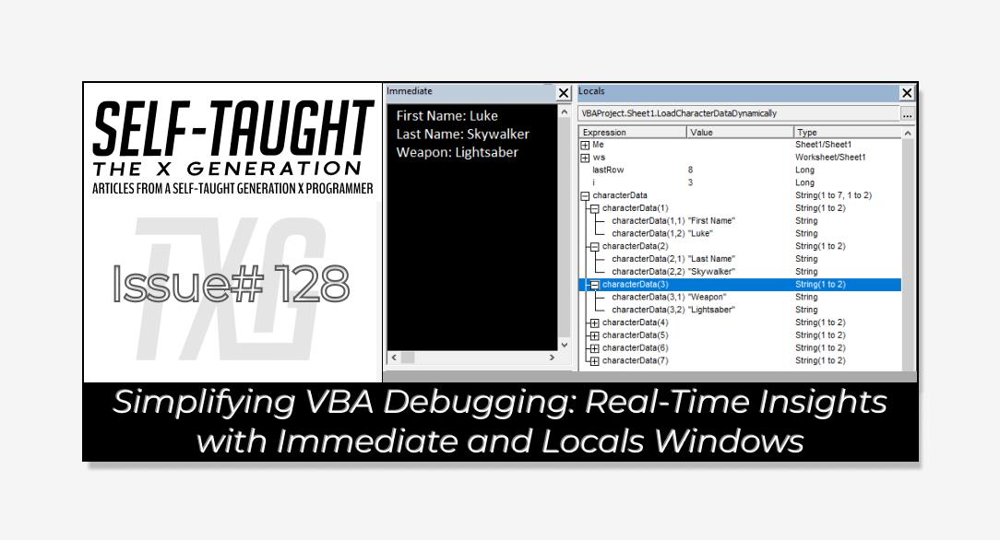
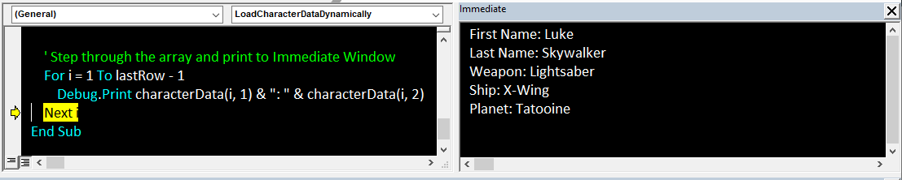
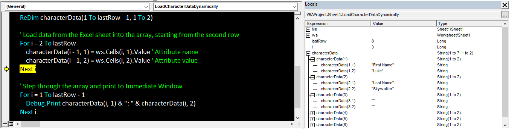

#### This article explores VBA debugging with Immediate and Locals Windows. You'll learn how to step through code, monitor variables, and set breakpoints, enhancing your debugging skills for your projects!

---



---

### **Article Concept Overview**

#### **Problem:**

When transitioning from other code editors like Visual Studio Code, using the VBA code editor can be confusing for debugging because it does not have a console. Additionally, viewing the values of your variables can be challenging.

#### **Solution:**

The VBA Immediate Window is equivalent to a console, allowing you to execute code snippets and view outputs in real-time. The Locals Window offers a dynamic view of all variables, showing their current values as your code runs. By learning to set breakpoints and step through your program using execution points, you can effectively debug and understand your code's behavior.

---

### What is Microsoft VBA and Why You Should Learn It

VBA, or Visual Basic for Applications, is a programming language created by Microsoft to automate tasks and improve functionality in Office applications like Excel, Word, and Access. It enables you to build macros for repetitive tasks, manage data, and perform complex calculations. Integrated into Office, VBA provides a user-friendly environment for beginners and experienced programmers to enhance tool capabilities and optimize workflows.

Learning VBA is especially beneficial in corporate environments where Microsoft Office is widely used. Mastering VBA improves Excel's functionalities, making you a valuable asset by developing custom programs that save time and money. These programs can vary from basic data entry automation to sophisticated integrations across Office applications. For more detailed insights, check out my first [article](https://selftaughttxg.com/2025/02-25/what-is-microsoft-vba-and-why-you-should-learn-it/) in this series.

---

### Enabling the Developer Tab in Excel for VBA Access

To start using VBA in Excel, you must enable the "Developer" tab, which provides access to the VBA editor and other tools for managing macros. For detailed instructions on how to set up the "Developer" tab, please refer to my article "[Getting Started with VBA in Excel](https://selftaughttxg.com/2025/02-25/what-is-microsoft-vba-and-why-you-should-learn-it/)." In that article, I cover the step-by-step process of enabling the "Developer" tab, accessing the VBA editor, and setting up your Excel environment for VBA use.

---

### Where is the Console?

You’re most likely coming from another code editor, such as VS Code, and wondering, *“Where is the console?”* Well, there is none! Instead, we are given an “**Immediate Window**” that allows us to execute code snippets, evaluate expressions, and print output in real time for debugging purposes in VBA.

---

### VBA’s Immediate Window

To access the Immediate Window, open the VBA editor, and then go to the "View" menu and select "Immediate Window" or simply press Ctrl + G.

**In the Immediate Window, you can perform several actions, including:**

1. **Execute Code Snippets**: You can run small pieces of VBA code directly to test functionality or perform quick calculations.
    
2. **Evaluate Expressions**: You can type expressions to see their results immediately, which is useful for debugging.
    
3. **Print Output**: Use the `Debug.Print` statement to display variable values or messages in the Immediate Window for debugging purposes.
    
4. **Set Variables**: You can assign values to variables to test how they affect your code.
    
5. **Call Procedures**: You can call subroutines or functions to see their output or behavior without running the entire program.
    

**These options make the Immediate Window a powerful tool for testing and debugging VBA code.**



---

### VBA’s Locals Window

The Locals Window in VBA is a fantastic tool for examining your code more closely. It provides a real-time view of all the variables in your program, showing their current values and how they change as your code runs. This makes it an invaluable resource for debugging and understanding the flow of your program.

To access the Locals Window, open the VBA editor, go to the "View" menu, and select "Locals Window." Once open, you'll see a list of all the variables currently in scope and their types and values.

**Using the Locals Window, you can:**

1. **Monitor Variable Changes**: Watch how variables change in real-time as you step through your code.
    
2. **Understand Code Flow**: Gain insights into how your program processes data, which is especially helpful for complex calculations or logic.
    
3. **Debug Efficiently**: Quickly spot things going wrong by observing unexpected values or behaviors.
    



---

### Running and Stepping Through Programs

Now that you’re working with both the Immediate Window and Locals Window, you can run your entire program and see the results of your `Debug.Print` statements. You can run your program by clicking the "Run" button in the VBA editor or pressing F5 on your keyboard. This will execute your code from start to finish.

You can also step through your code line by line to better understand how it operates. This allows you to observe the values of your variables as they are updated in the Locals Window. This is accomplished by using the "Step Into" feature, accessible via the "Debug" menu or by pressing F8. As you step through your code, observe how the values in the Locals Window change and how the Immediate Window displays your `Debug.Print` outputs. This process allows you to pinpoint exactly where your code might be going astray and understand the execution flow in detail.

---

### Break and Execution Points

Setting breakpoints is an effective way to assist with debugging in larger programs. You can strategically place them throughout your code, adding or removing them as needed, to identify which blocks of code are functioning correctly.

With the breakpoints method, you can run your program until it reaches a set breakpoint where errors might occur. At this point, you can step through your code line by line. The current line of code is highlighted as the execution point. As you step through your code, you can view variable values in the Immediate Window and Locals Window, which helps you identify errors.

---

### Debugging Demonstration

To demonstrate debugging in VBA, I wrote a simple program that dynamically loads data from an Excel sheet into an array, starting from row 2 and reading from columns A and B. This method accommodates varying row lengths by identifying the last row with data, ensuring all entries are captured.

The program reads this data from the Excel sheet and stores it in an array. As the program runs, you can see the Immediate Window to printing out the data, using `Debug.Print`, verifying that it's loaded correctly. Also, the Locals Window allows you to observe the array's contents in real-time, helping confirm that the information is accurately captured.

*By stepping through your code, you can see how each of your variables is updated and how the data flows through your program. This hands-on approach not only helps you catch errors but also deepens your understanding of how VBA processes data.*

**Here’s the information I entered in Excel, columns A and B, starting from row two:**

| Character Data |  |
| --- | --- |
| First Name | Luke |
| Last Name | Skywalker |
| Weapon | Lightsaber |
| Ship | X-Wing |
| Planet | Tatooine |
| Affiliation | Rebel Alliance |
| Rank | Jedi Knight |

**The following VBA code is designed to dynamically load data from an Excel sheet into an array. Here's a step-by-step explanation of how it works:**

1. **Variable Declaration**:
    
    * `ws` is declared as a `Worksheet` object to reference the specific sheet from which data will be read.
        
    * `lastRow` is a `Long` variable used to store the number of the last row that contains data in column A.
        
    * `i` is a `Long` variable used as a loop counter.
        
    * `characterData` is a dynamic array of strings that will store the character attributes and their values.
        
2. **Worksheet Setup**:
    
    * The `ws` variable is set to reference "Sheet1" of the current workbook. You can change "Sheet1" to the name of your specific sheet if needed.
        
3. **Determine Last Row**:
    
    * `lastRow` is calculated by finding the last non-empty cell in column A. This is done using `ws.Cells(ws.Rows.Count, 1).End(xlUp).Row`, which effectively moves up from the bottom of the column to find the last filled cell.
        
4. **Array Resizing**:
    
    * The `characterData` array is resized using `ReDim` to accommodate all rows of data, excluding the header. The array has two columns: one for attribute names and one for their corresponding values.
        
5. **Data Loading**:
    
    * A `For` loop iterates from the second row to the last row. This loop skips the header row and starts loading data from the second row.
        
    * Within the loop, each attribute name from column A and its corresponding value from column B are stored in the `characterData` array.
        
6. **Data Output**:
    
    * Another `For` loop iterates through the `characterData` array, printing each attribute and its value to the Immediate Window using `Debug.Print`. This provides a real-time view of the data loaded into the array.
        

*This code efficiently handles data dynamically in Excel, allowing for easy updates and modifications as the data in the sheet changes.*

```basic
Sub LoadCharacterDataDynamically()
    Dim ws As Worksheet
    Dim lastRow As Long
    Dim i As Long
    Dim characterData() As String

    ' Set the worksheet to the active sheet or specify the sheet name
    Set ws = ThisWorkbook.Sheets("Sheet1") ' Change "Sheet1" to your sheet name if needed

    ' Find the last row with data in column A
    lastRow = ws.Cells(ws.Rows.Count, 1).End(xlUp).Row

    ' Resize the array based on the number of rows with data, excluding the header
    ReDim characterData(1 To lastRow - 1, 1 To 2)

    ' Load data from the Excel sheet into the array, starting from the second row
    For i = 2 To lastRow
        characterData(i - 1, 1) = ws.Cells(i, 1).Value ' Attribute name
        characterData(i - 1, 2) = ws.Cells(i, 2).Value ' Attribute value
    Next i

    ' Step through the array and print to Immediate Window
    For i = 1 To lastRow - 1
        Debug.Print characterData(i, 1) & ": " & characterData(i, 2)
    Next i
End Sub
```

---

### My other related articles

* [What is Microsoft VBA and Why You Should Learn It](https://selftaughttxg.com/2025/02-25/what-is-microsoft-vba-and-why-you-should-learn-it/)
    
* [Beginner's Guide to Customizing VBA: Code Editor Colors and More](https://selftaughttxg.com/2025/03-25/beginner's-guide-to-customizing-vba:-code-editor-colors-and-more/)
    

---


### **Be sure to listen to the HTML All The Things Podcast!**

#### 📝 *I also write articles for the HTML All The Things Podcast, which you can read on their website:* [*https://www.htmlallthethings.com/*](https://www.htmlallthethings.com/)*.*

#### **Be sure to check out HTML All The Things on socials!**

* [Twitter](https://twitter.com/htmleverything)
    
* [LinkedIn](https://www.linkedin.com/company/html-all-the-things/)
    
* [TikTok](https://www.tiktok.com/@htmlallthethings)
    
* [Instagram](https://www.instagram.com/htmlallthethings/)
    

---

### Affiliate & Discounts Links!


**With CodeMonkey, learning can be all fun and games!** CodeMonkey transforms education into an engaging experience, enabling children to evolve from tech consumers to creators. Use CodeMonkey's **FREE trial** to unlock the incredible potential of young tech creators!

*With a structured learning path tailored for various age groups, kids progress from block coding to more advanced topics like data science and artificial intelligence, using languages such as CoffeeScript and Python. The platform includes features for parents and teachers to track progress, making integrating coding into home and classroom settings easy.*

Through fun games, hands-on projects, and community interaction, CodeMonkey helps young learners build teamwork skills and receive recognition for their achievements. It fosters a love for coding and prepares children for future career opportunities in an ever-evolving tech landscape.

***To learn more about CodeMonkey, you can read my detailed*** [***review article***](https://selftaughttxg.com/2025/02-25/inspiring-young-coders-how-codemonkey-turns-kids-into-tech-creators/)***!***

**Affiliate Links:**

* [Sign Up for Parents](https://codemonkey.sjv.io/c/5987452/919057/12259)
    
* [Sign Up for Teachers](https://codemonkey.sjv.io/c/5987452/919060/12259)
    

---


### Advance your career with a 20% discount on Scrimba Pro using this [affiliate link](https://scrimba.com/?via=MichaelLarocca)!

Become a hireable developer with Scrimba Pro! Discover a world of coding knowledge with full access to all courses, hands-on projects, and a vibrant community. You can [read my article](https://selftaughttxg.com/2021/06-21/06-07-21/) to learn more about my exceptional experiences with Scrimba and how it helps many become confident, well-prepared web developers!

###### ***Important:*** *This discount is for new accounts only. If a higher discount is currently available, it will be applied automatically.*

**How to Claim Your Discount:**

1. Click [the link](https://scrimba.com/?via=MichaelLarocca) to explore the new Scrimba 2.0.
    
2. Create a new account.
    
3. Upgrade to Pro; the 20% discount will automatically apply.
    

##### ***Disclosure:*** *This article contains affiliate links. I will earn a commission from any purchases made through these links at no extra cost to you. Your support helps me continue creating valuable content. Thank you!*

---

### Conclusion

Unlike other code editors, VBA does not feature a traditional console. Instead, it offers an Immediate Window, which you can use similarly to a console for executing code snippets and viewing outputs.

VBA also offers a Locals Window to help you examine your code more closely. It provides a real-time view of all the variables in your program, showing their current values and how they change as your code runs. This makes it an invaluable resource for debugging and understanding the flow of your program.

By learning to set breakpoints and step through your code, you can gain a deeper understanding of your program's flow and efficiently identify errors.

I wrote a simple program that you can copy to demonstrate VBA debugging. It showcases how these techniques can be applied to real-world scenarios. With these insights and skills, you're now better equipped to enhance your VBA projects and streamline your debugging process!

---

###### *Do you now feel more confident in debugging VBA code using the Immediate and Locals Windows? Have you discovered new techniques for efficient debugging? Please share the article and comment!*
