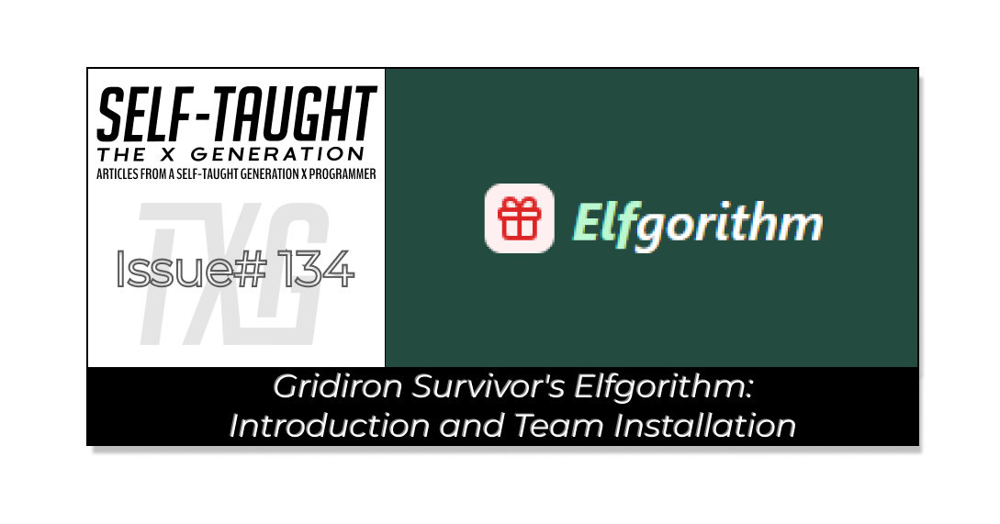

#### This article introduces Gridiron Survivor's Elfgorithm, an AI-powered Secret Santa app currently in production, and serves as an installation guide using Git and pnpm for project team members!

---



---

### What is the Elfgorithm App?

Elfgorithm is an AI-powered Secret Santa app currently in production, scheduled for release in winter 2025. It simplifies the management of gift exchanges by eliminating the guesswork involved in Secret Santa and gift exchanges! This app handles the details of gift-giving and offers personalized gift ideas, helping you find the perfect gifts for everyone on your list.

How Elfgorithm works: Create a group, invite participants, and let the intelligent algorithm match you with the perfect gifts, ensuring everyone experiences the joy of giving and receiving!

**The Elfgorithm App features:**

* **Smart Gifting:** AI-powered gift suggestions tailored to each recipient
    
* **Easy Organizing:** Effortlessly manage groups and participants
    
* **Scheduling:** Set draw dates and exchange dates with reminders
    
* **Personalization:** Customize your exchange details
    

***Check out the deployed in-progress project:***

* Deployed project: [https://elfgorithm.vercel.app/](https://elfgorithm.vercel.app/)
    
* GitHub: [https://github.com/LetsGetTechnical/elecretanta](https://github.com/LetsGetTechnical/elecretanta)
    

---

### What is Gridiron Survivor

[Gridiron Survivor](https://www.htmlallthethings.com/blog-posts/bridging-the-skills-gap-empowering-junior-developers-through-apprenticeship-programs) is an apprenticeship program initiated by Shashi Lo, Senior UX Engineer at Microsoft, designed to provide essential work experience for developers entering the tech industry. The program offers practical training in project management, coding practices, and team collaboration, equipping aspiring developers with the mentorship and skills needed to succeed in their first tech jobs.

---

### Prerequisite

For Gridiron Survivor team members, the following sections provide a detailed, step-by-step guide to help you get onboarded.

⚠ **Note:** You will need to have Node.js installed as a prerequisite.

**The onboarding steps include:**

* Cloning the project
    
* Navigating to the project directory
    
* Opening the project in VS Code
    
* Creating and verifying the .env file in VS Code
    
* Adding the environment variables
    
* Installing project dependencies using pnpm
    
* Running the development server
    

---

### Cloning the project

The following [elecretanta](https://github.com/LetsGetTechnical/elecretanta) link will bring you to the project page. Once there, follow the instructions to clone the project.

The GitHub repo: [elecretanta](https://github.com/LetsGetTechnical/elecretanta)

* Click on the green “Code” button
    
* Choose “clone using the web URL” by clicking on the copy URL to clipboard icon.
    


---

### VS Code

In VS Code’s Bash terminal, navigate to a location of your choice to download the project into. Then type the command git clone, followed by the copied *elecretanta* URL (Ctrl + v):

```bash
git clone https://github.com/LetsGetTechnical/elecretanta.git
```

---

### Navigate to the Project Directory

Once the project is downloaded, use the `ls` command to list the files and directories in the current directory, allowing you to verify that the project files have been successfully downloaded (your file path will vary from mine).

Then use the `cd` command to change into the directory of the downloaded project, allowing you to navigate to the project's root folder and begin working with its files.


*Note that you are starting on the (develop) branch. More on this branch later.*

---

### Open the Project in VS Code

Now that you have the ( develop ) branch open in the Bash terminal, it is time to open the *elecretanta* project folder in VS Code.

In the VS Code File Explorer, click the blue **Open Folder** button, and then navigate to and select the *elecretanta* project folder, which has been downloaded to your computer.


**Once you have the *elecretanta* project folder selected, click the Select Folder button, which opens the project in VS Code.**


**Note:** *You may need to reopen your Bash terminal. Once reopened, you should already be on the (develop) branch.*

---

### Create and Verify the .env File in VS Code

In the project’s root directory folder (ELECRETANTA) in the VS Code Explorer, right-click the New File icon (the first icon) and create an .env file.


---

⚠ **Important:** *Make sure to add the dot(.) when creating the env file.*

---

**You will know you have successfully created the env file by verifying that it is represented with a gear icon, as depicted in the image below.**


---

### Adding the Environment Variables

Once you have successfully created the .env file, you will need to contact a GIS team member to retrieve the necessary data to add to this file. At the time of writing this article, Alex is the primary point of contact.

*Alternatively, you can reach out to Team Lead Shashi for instructions.*

```bash
GOOGLE_API_KEY=
GOOGLE_CSE_ID=
NEXT_PUBLIC_SUPABASE_URL=
NEXT_PUBLIC_SUPABASE_ANON_KEY=
OPENAI_API_KEY=
```

---

### Installation

To install the project, it is important to note that we are exclusively using pnpm. Performant npm (pnpm), is a fast, efficient package manager for JavaScript. It saves disk space by storing a single version of each package globally and using hard links for projects. This approach speeds up installations and enforces strict dependency management, making it a powerful alternative to npm and Yarn.

When you run pnpm, it installs the packages your project needs. It checks if the packages are already stored globally on your computer. If not, it downloads them. Instead of copying, it links these packages to your project, saving space and speeding up the process. This method also ensures that each package only uses its specified dependencies, reducing errors.

**Install project dependencies using pnpm:**

```bash
pnpm install
```

⚠ **Once installed**: *run* `git pull` *to make sure your local repository is up to date with the latest changes from the remote repository.*

---

### Run the development server

To run the project, use the `pnpm dev` command to start the development server.

```bash
pnpm dev
```

**Once the development server is running, hover over the localhost URL and press (Ctrl + click) to open it in your browser.**


*Congratulations! You have successfully cloned the repository, navigated to the project directory, and opened it in VS Code. You created and verified the .env file, installed the necessary project dependencies using pnpm, and ensured your local repository is up to date. Finally, you started the development server and accessed the project in your browser!*


---

### Creating and Managing Your Own Branch

It is important to note that you do not work in the (develop) branch. You must create your own branch to work from and then push it to the GitHub repository. This process is beyond the scope of this article, but don't worry! GIS team member Danielle Lindblom has you covered! She recorded the following thorough video on this entire process.

**Example: creating your branch includes**

* Your name (in camelCase)
    
* Issue number
    
* Issue description
    

*I created a branch for writing a Story for the Avatar component as follows:*

```bash
git checkout -b michaelL/303-add-story-avatar
```

* `git`: Version control tool used to track changes in code.
    
* `checkout`: Command to switch between branches.
    
* `-b`: Option to create a new branch.
    
* `michaelL/303-add-story-avatar`: Name of the new branch, allowing separate work from the main codebase.
    

---

<iframe width="990" height="557" src="https://www.youtube.com/embed/gLYGIyIO6ik"></iframe>

---

**The complete process covered in Danielle’s instructional video includes:**

1. Creating a working branch
    
2. Committing your code
    
3. Creating a pull request (PR)
    

---

### My other related articles

* [Bridging the Skills Gap: Empowering Junior Developers Through Apprenticeship Programs](https://www.htmlallthethings.com/blog-posts/bridging-the-skills-gap-empowering-junior-developers-through-apprenticeship-programs)
    
* [How Learning in Public and Networking Can Advance Your Career](https://selftaughttxg.com/2024/10-24/how-learning-in-public-and-networking-can-advance-your-career/)
    
* [Thriving in Tech: Securing Your First Job, Leveraging Side Hustles, and Overcoming Layoffs](https://www.htmlallthethings.com/blog-posts/thriving-in-tech-securing-your-first-job-leveraging-side-hustles-and-overcoming-layoffs)
    
* [From Skillset to Networking: Tactics for Standing Out in a Challenging Job Market](https://www.htmlallthethings.com/blog-posts/from-skillset-to-networking-tactics-for-standing-out-in-a-challenging-job-market)
    
* [Shashi Lo: UI Design Fundamentals](https://selftaughttxg.com/2022/02-22/ShashiLo/)
    

---


### **Be sure to listen to the HTML All The Things Podcast!**

#### 📝 *I also write articles for the HTML All The Things Podcast, which you can read on their website:* [*https://www.htmlallthethings.com/*](https://www.htmlallthethings.com/)*.*

#### **Be sure to check out HTML All The Things on socials!**

* [Twitter](https://twitter.com/htmleverything)
    
* [LinkedIn](https://www.linkedin.com/company/html-all-the-things/)
    
* [TikTok](https://www.tiktok.com/@htmlallthethings)
    
* [Instagram](https://www.instagram.com/htmlallthethings/)
    

---

### Affiliate & Discount Links!


**With CodeMonkey, learning can be all fun and games!** CodeMonkey transforms education into an engaging experience, enabling children to evolve from tech consumers to creators. Use CodeMonkey's **FREE trial** to unlock the incredible potential of young tech creators!

*With a structured learning path tailored for various age groups, kids progress from block coding to more advanced topics like data science and artificial intelligence, using languages such as CoffeeScript and Python. The platform includes features for parents and teachers to track progress, making integrating coding into home and classroom settings easy.*

Through fun games, hands-on projects, and community interaction, CodeMonkey helps young learners build teamwork skills and receive recognition for their achievements. It fosters a love for coding and prepares children for future career opportunities in an ever-evolving tech landscape.

***To learn more about CodeMonkey, you can read my detailed*** [***review article***](https://selftaughttxg.com/2025/02-25/inspiring-young-coders-how-codemonkey-turns-kids-into-tech-creators/)***!***

**Affiliate Links:**

* [Sign Up for Parents](https://codemonkey.sjv.io/c/5987452/919057/12259)
    
* [Sign Up for Teachers](https://codemonkey.sjv.io/c/5987452/919060/12259)
    

---


### Advance your career with a 20% discount on Scrimba Pro using this [affiliate link](https://scrimba.com/?via=MichaelLarocca)!

Become a hireable developer with Scrimba Pro! Discover a world of coding knowledge with full access to all courses, hands-on projects, and a vibrant community. You can [read my article](https://selftaughttxg.com/2021/06-21/06-07-21/) to learn more about my exceptional experiences with Scrimba and how it helps many become confident, well-prepared web developers!

###### ***Important:*** *This discount is for new accounts only. If a higher discount is currently available, it will be applied automatically.*

**How to Claim Your Discount:**

1. Click [the link](https://scrimba.com/?via=MichaelLarocca) to explore the new Scrimba 2.0.
    
2. Create a new account.
    
3. Upgrade to Pro; the 20% discount will automatically apply.
    

##### ***Disclosure:*** *This article contains affiliate links. I will earn a commission from any purchases made through these links at no extra cost to you. Your support helps me continue creating valuable content. Thank you!*

---

### Conclusion

The Gridiron Survivor's Elfgorithm is a Secret Santa-style app, scheduled for a winter 2025 release, that is being built by a team of junior developers led by Shashi Lo, a Senior UX Engineer at Microsoft.

The Elfgorithm app is designed to simplify the management of gift exchanges by eliminating the guesswork involved in Secret Santa activities. It offers AI-powered gift suggestions tailored to each recipient, making it easier to find the perfect gifts for everyone on your list. Users can create a group, invite participants, and let the intelligent algorithm handle the gift matching, ensuring a joyful experience for all. The app also features easy organizing tools to manage groups and participants, scheduling options for setting drawing and exchange dates with reminders, and personalization options to customize exchange details.

Gridiron Survivor is an apprenticeship program initiated by Shashi Lo designed to provide essential work experience for developers entering the tech industry. The program offers practical training in project management, coding practices, and team collaboration, equipping aspiring developers with the mentorship and skills needed to succeed in their first tech jobs. Through this initiative, participants gain valuable real-world experience, bridging the gap between academic learning and professional work environments.

Be sure to stay tuned for Gridiron Survivor's [livestream events](https://www.youtube.com/@codingwithshashi)! If you're interested in joining the Gridiron Survivor apprenticeship program, keep your eyes peeled. As team members are hired, exciting new apprenticeship opportunities will become available!

---

###### *Are you interested in using the app for your next Secret Santa event? As a team member, are you comfortable with setting up and navigating the Gridiron Survivor's Elfgorithm project? Please share the article and comment*

