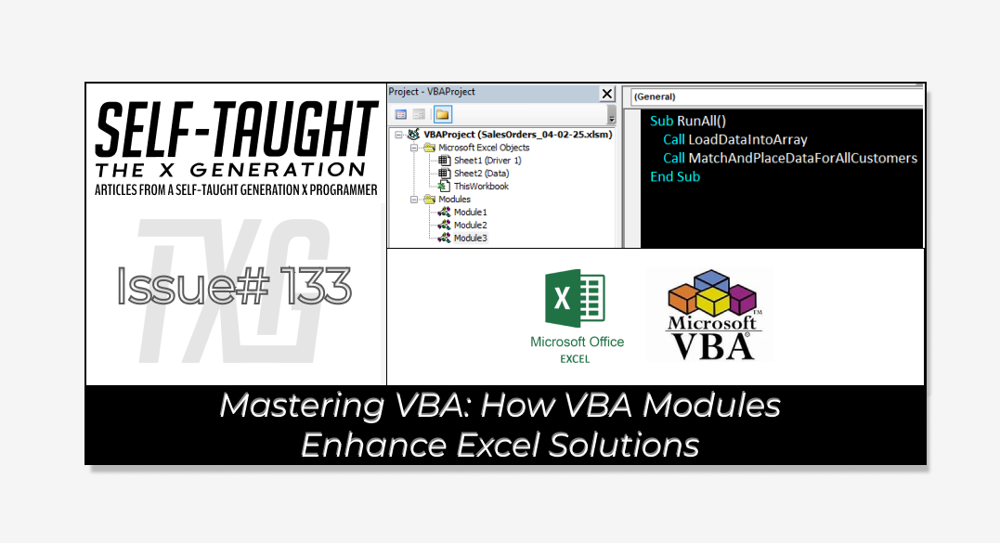
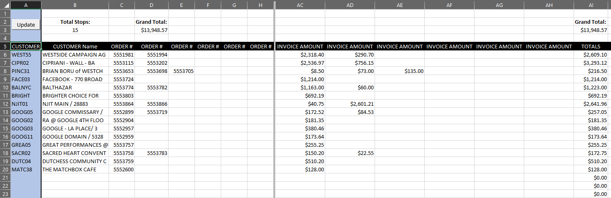
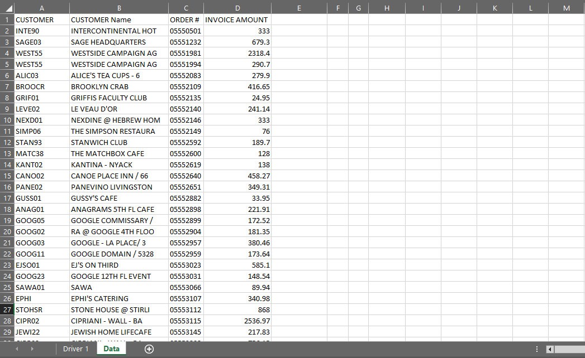

#### This article shows how breaking programs into VBA modules results in efficient, flexible, and maintainable solutions. Learn how to enhance your projects with a modular design for optimal performance!

---



---

### VBA Modules

Organizing VBA code into separate modules improves its structure, making it easier to read and reuse. Modules are like building blocks, each handling a specific task with related functions or procedures. They can be developed and tested independently.

To create a program, you connect these modules so they work together smoothly. This setup allows modules to communicate and share data effectively. Using modules, you can focus on specific parts without affecting others, simplifying bug fixes, updates, and expansion. This makes the program more flexible, as new features can be added by updating the relevant modules.

*To create modules, you must first enable the "Developer" tab. This tab provides access to the VBA editor and other tools for writing and managing macros. I outline the process in my article, “*[*What is Microsoft VBA and Why You Should Learn It*](https://selftaughttxg.com/2025/02-25/what-is-microsoft-vba-and-why-you-should-learn-it/)*.“*

---

### Driver Route Sheet Program

Using VBA modules, I developed a truck driver route sheet template that my coworkers and I utilized. In addition to the VBA code, this template includes hard-coded sum functions to automatically calculate the total number of stops, the total invoice amount for each customer, and the total invoice for the truck.

The program works by loading the day's customer orders into an array. Users then click an update button that runs the VBA code to populate the worksheet. This automation significantly reduces the time spent on manual data entry, streamlining the process and improving efficiency.

*By utilizing modules, you can create programs tailored to your specific needs. This method provides flexibility and customization, assisting you in building efficient solutions. Whether you're automating data entry or developing complex applications, modules provide a solid foundation for robust programs.*



---

### Module 1: Load Data

The first module loads data into an array. I cover this procedure in detail in my article “[Mastering VBA: Load and Manipulate Data in Excel Arrays](https://selftaughttxg.com/2025/04-25/mastering-vba-load-and-manipulate-data-in-excel-arrays/).“

*This data will be used to match customer IDs with their corresponding orders and place the order details in the "Driver 1" sheet. By loading the data into an array, the program can efficiently process and manipulate the information in memory, enabling faster and more effective data handling for subsequent operations.*

```basic
Public dataArray As Variant

Sub LoadDataIntoArray()
    Dim wsData As Worksheet
    Dim dataRange As Range
    Dim lastRow As Long
    Dim lastCol As Long

    ' Set the data worksheet
    Set wsData = ThisWorkbook.Sheets("Data") ' Change "Sheet1" to your data sheet name

    ' Find the last row and column with data
    lastRow = wsData.Cells(wsData.Rows.Count, 1).End(xlUp).Row
    lastCol = wsData.Cells(1, wsData.Columns.Count).End(xlToLeft).Column

    ' Define the range to load into the array (excluding headers and totals)
    If lastRow > 2 Then ' Ensure there are rows to process
        Set dataRange = wsData.Range(wsData.Cells(2, 1), wsData.Cells(lastRow - 1, lastCol))
    Else
        MsgBox "Not enough data to process."
        Exit Sub
    End If

    ' Load the data into the array
    dataArray = dataRange.Value
End Sub
```



---

### Module 2:

Thanks to Module 1, the data is already loaded into an array. We can now loop through the data in Module 2, which will automatically fill out the driver sheet.

*Before I wrote this program, customers’ order numbers and totals were manually entered.*

```basic
Sub MatchAndPlaceDataForAllCustomers()
    Dim wsDriver As Worksheet
    Dim i As Long, j As Long
    Dim customer As String
    Dim customerName As String
    Dim orderCount As Integer
    Dim colOffset As Integer
    Dim lastRow As Long

    ' Set the "Driver 1" worksheet
    Set wsDriver = ThisWorkbook.Sheets("Driver 1")

    ' Find the last row with data in the "Driver 1" sheet
    lastRow = wsDriver.Cells(wsDriver.Rows.Count, 1).End(xlUp).Row

    ' Loop through each customer in the "Driver 1" sheet
    For j = 6 To lastRow
        customer = wsDriver.Cells(j, 1).Value
        orderCount = 0
        colOffset = 0
        customerName = ""

        ' Loop through the array to find all matches for the current customer
        For i = LBound(dataArray, 1) To UBound(dataArray, 1)
            If dataArray(i, 1) = customer Then
                ' Set the customer name if not already set
                If customerName = "" Then
                    customerName = dataArray(i, 2)
                    wsDriver.Cells(j, 2).Value = customerName ' CUSTOMER Name
                End If

                ' Place the order number and invoice amount in the corresponding columns
                If orderCount < 6 Then
                    wsDriver.Cells(j, 3 + colOffset).Value = dataArray(i, 3) ' ORDER #
                    wsDriver.Cells(j, 29 + colOffset).Value = dataArray(i, 4) ' INVOICE AMOUNT
                    colOffset = colOffset + 1
                    orderCount = orderCount + 1
                Else
                    MsgBox "Maximum order capacity reached for customer " & customer & "."
                    Exit For
                End If
            End If
        Next i

        If orderCount = 0 Then
            MsgBox "No orders found for customer " & customer & "."
        End If
    Next j
End Sub
```

**Let’s take a closer look at how the code works in Module 2:**

* **Setup**: Declare a variable `wsDriver` to represent the "Driver 1" worksheet and set it to refer to this sheet. Find the last row with data in the first column to ensure all relevant customer entries are processed.
    
* **Loop Through Customers**: Start a loop from row 6 to the last row, iterating through each customer entry. Retrieve the customer ID from the current row and initialize `orderCount`, `colOffset`, and `customerName` to track orders and data placement.
    
* **Match Orders**: Loop through the data array to find matches for the current customer. Check if the customer ID in the array matches the current customer.
    
* **Place Data**: Set the customer name if it hasn't been set yet and place it in the second column. Ensure no more than six orders are placed per customer. Place the order number and invoice amount in the appropriate columns, and increment `colOffset` and `orderCount` to track placement.
    
* **Feedback**: Alert if the order limit is reached or if no orders are found for a customer, ensuring data accuracy and completeness.
    

---

### Module 3: Execute the Program

Module 3 acts as the program's central hub, integrating the functions from the previous modules into a single, streamlined process. With one command, it ensures that data is efficiently loaded and processed.

```basic
Sub RunAll()
    Call LoadDataIntoArray
    Call MatchAndPlaceDataForAllCustomers
End Sub
```

---

### My other related articles

* [What is Microsoft VBA and Why You Should Learn It](https://selftaughttxg.com/2025/02-25/what-is-microsoft-vba-and-why-you-should-learn-it/)
    
* [Beginner's Guide to Customizing VBA: Code Editor Colors and More](https://selftaughttxg.com/2025/03-25/beginner's-guide-to-customizing-vba:-code-editor-colors-and-more/)
    
* [Simplifying VBA Debugging: Real-Time Insights with Immediate and Locals Windows](https://selftaughttxg.com/2025/03-25/simplifying-vba-debugging-real-time-insights-with-immediate-and-locals-windows/)
    
* [From JavaScript to VBA: Navigating Variable Declaration and Management](https://selftaughttxg.com/2025/03-25/from-javascript-to-vba-navigating-variable-declaration-and-management/)
    
* [Mastering Excel: VLOOKUP and Custom VBA Functions for Key-Value Data Retrieval](https://selftaughttxg.com/2025/03-25/mastering-excel-vlookup-and-custom-vba-functions-for-key-value-data-retrieval/)
    
* [Mastering Excel's IFNA: Efficient Value Retrieval and VLOOKUP Integration](https://selftaughttxg.com/2025/03-25/mastering-excels-ifna-efficient-value-retrieval-and-vlookup-integration/)
    
* [Mastering VBA: Load and Manipulate Data in Excel Arrays](https://selftaughttxg.com/2025/04-25/mastering-vba-load-and-manipulate-data-in-excel-arrays/)
    

---


### **Be sure to listen to the HTML All The Things Podcast!**

#### 📝 *I also write articles for the HTML All The Things Podcast, which you can read on their website:* [*https://www.htmlallthethings.com/*](https://www.htmlallthethings.com/)*.*

#### **Be sure to check out HTML All The Things on socials!**

* [Twitter](https://twitter.com/htmleverything)
    
* [LinkedIn](https://www.linkedin.com/company/html-all-the-things/)
    
* [TikTok](https://www.tiktok.com/@htmlallthethings)
    
* [Instagram](https://www.instagram.com/htmlallthethings/)
    

---

### Affiliate & Discount Links!


**With CodeMonkey, learning can be all fun and games!** CodeMonkey transforms education into an engaging experience, enabling children to evolve from tech consumers to creators. Use CodeMonkey's **FREE trial** to unlock the incredible potential of young tech creators!

*With a structured learning path tailored for various age groups, kids progress from block coding to more advanced topics like data science and artificial intelligence, using languages such as CoffeeScript and Python. The platform includes features for parents and teachers to track progress, making integrating coding into home and classroom settings easy.*

Through fun games, hands-on projects, and community interaction, CodeMonkey helps young learners build teamwork skills and receive recognition for their achievements. It fosters a love for coding and prepares children for future career opportunities in an ever-evolving tech landscape.

***To learn more about CodeMonkey, you can read my detailed*** [***review article***](https://selftaughttxg.com/2025/02-25/inspiring-young-coders-how-codemonkey-turns-kids-into-tech-creators/)***!***

**Affiliate Links:**

* [Sign Up for Parents](https://codemonkey.sjv.io/c/5987452/919057/12259)
    
* [Sign Up for Teachers](https://codemonkey.sjv.io/c/5987452/919060/12259)
    

---


### Advance your career with a 20% discount on Scrimba Pro using this [affiliate link](https://scrimba.com/?via=MichaelLarocca)!

Become a hireable developer with Scrimba Pro! Discover a world of coding knowledge with full access to all courses, hands-on projects, and a vibrant community. You can [read my article](https://selftaughttxg.com/2021/06-21/06-07-21/) to learn more about my exceptional experiences with Scrimba and how it helps many become confident, well-prepared web developers!

###### ***Important:*** *This discount is for new accounts only. If a higher discount is currently available, it will be applied automatically.*

**How to Claim Your Discount:**

1. Click [the link](https://scrimba.com/?via=MichaelLarocca) to explore the new Scrimba 2.0.
    
2. Create a new account.
    
3. Upgrade to Pro; the 20% discount will automatically apply.
    

##### ***Disclosure:*** *This article contains affiliate links. I will earn a commission from any purchases made through these links at no extra cost to you. Your support helps me continue creating valuable content. Thank you!*

---

### Conclusion

Modular programming in VBA offers a powerful approach to organizing and automating tasks in Excel. By allowing each module to handle specific functions, your program can be broken down into separate Modules, creating efficient, flexible, and easily maintainable solutions.

My real-world truck driver route sheet program exemplifies how modules can streamline processes, reduce manual data entry, and enhance productivity.

By applying these concepts, you can develop tailored applications, leveraging the benefits of modular design to address various challenges and improve workflow efficiency!

---

###### *Have you gained insights into breaking programs into VBA modules for efficient solutions? Are you ready to apply modular design to your projects? Please share the article and comment!*

---
