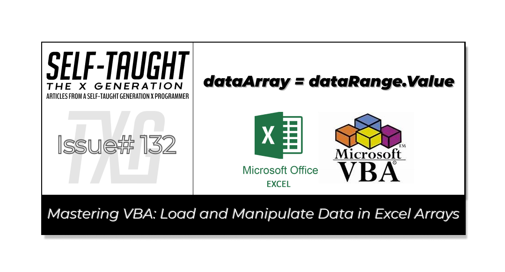

#### In this article, discover how to load data into an array using VBA in Excel. Master this skill to automate tasks, enhance data manipulation, and create efficient, custom applications for your projects!

---



---

### Why Load Data into an Array

When creating Excel sheets to work with data from another source, such as exported data from a proprietary work system, loading that data into an array provides you with complete control over its manipulation. Combining built-in functions in an Excel worksheet template with exported data from an array allows you to accomplish incredible feats, such as building custom-made applications to streamline workflow.

*One such application I created in this manner is a truck driver route sheet. In a custom-made template, I added sum functions to calculate the total number of stops, the total amount of each customer’s invoices, and the grand total invoice amount on the truck. Using exported data containing all of the day’s customer orders loaded in an array, like magic, the user clicks an update button, and then the entire worksheet is filled out for them. This saved a lot of time as the data on these sheets were previously entered manually.*

**By learning how to load and manage data in an array, you can create custom-made applications to streamline the workflow of companies you work for, making you an invaluable asset.**

---

### Loading Data into an Array

On an individual basis, you will need to learn how to export the required data into an Excel file from the proprietary work systems you use. If you're fortunate, someone might demonstrate it for you. In my case, I had to mostly figure it out on my own.

**For simplicity, let's use make-believe exported customer addresses from the Star Wars universe to load into an array:**

| CUSTOMER | CUSTOMER Name | ADDRESS | ZIP CODE |
| --- | --- | --- | --- |
| TAT01 | Tatooine Traders | 123 Sand Dune Lane, Tatooine | 12345 |
| HOTH02 | Hoth Ice Sculptures | 456 Ice Cave Blvd, Hoth | 67890 |
| END03 | Endor Ewok Emporium | 789 Forest Path, Endor | 11223 |
| COR04 | Coruscant Couture | 101 Sky City Ave, Coruscant | 33445 |
| NAB05 | Naboo Nifty Novelties | 202 Lake Retreat Rd, Naboo | 55678 |
| TAT06 | Tatooine Textiles | 321 Desert Way, Tatooine | 12345 |
| HOTH07 | Hoth Hot Drinks | 654 Snowflake St, Hoth | 67890 |
| END08 | Endor Exotic Exports | 987 Treehouse Ln, Endor | 11223 |
| COR09 | Coruscant Crafts | 202 Galactic Blvd, Coruscant | 33445 |
| NAB10 | Naboo Nature Goods | 303 Waterfall Way, Naboo | 55678 |

---

### Steps to Load Data into an Array

This section outlines how to load data from an Excel worksheet into an array using VBA, including setting up your environment, declaring variables, and executing the code.

*Setting Up the Environment: Enable the Developer tab in Excel to access the VBA editor and macro tools. For detailed steps, refer to my article "*[*What is Microsoft VBA and Why You Should Learn It*](https://selftaughttxg.com/2025/02-25/what-is-microsoft-vba-and-why-you-should-learn-it/)*."*

**Declaring Variables**:

* `wsData As Worksheet`: References the worksheet containing the data.
    
* `dataRange As Range`: Defines the range of cells to be loaded into the array.
    
* `lastRow As Long` and `lastCol As Long`: Determine the data boundaries.
    
* `dataArray As Variant`: Stores the data for manipulation.
    
* `i As Long`: Counter for iterating through the array.
    
* `message As String`: Holds text for display in a message box.
    

### Loading Data from Excel into an Array Using VBA

Below is a VBA subroutine demonstrating how to load data from an Excel worksheet into an array for efficient manipulation.

```basic
Sub LoadDataIntoArray()
    Dim wsData As Worksheet
    Dim dataRange As Range
    Dim lastRow As Long
    Dim lastCol As Long
    Dim dataArray As Variant
    Dim i As Long
    Dim message As String

    ' Set the data worksheet
    Set wsData = ThisWorkbook.Sheets("Sheet1") ' Change "Sheet1" to your data sheet name

    ' Find the last row and column with data
    lastRow = wsData.Cells(wsData.Rows.Count, 1).End(xlUp).Row
    lastCol = wsData.Cells(1, wsData.Columns.Count).End(xlToLeft).Column

    ' Define the range to load into the array (excluding headers)
    If lastRow > 1 Then ' Ensure there are rows to process
        Set dataRange = wsData.Range(wsData.Cells(2, 1), wsData.Cells(lastRow, lastCol))
    Else
        MsgBox "Not enough data to process."
        Exit Sub
    End If

    ' Load the data into the array
    dataArray = dataRange.Value

    ' Build the message string
    message = "Total Records: " & UBound(dataArray, 1) & vbCrLf & vbCrLf
    For i = 1 To UBound(dataArray, 1)
        message = message & "Record " & i & ": "
        For j = 1 To UBound(dataArray, 2)
            message = message & dataArray(i, j) & " "
        Next j
        message = message & vbCrLf
    Next i

    ' Display the message box with all data
    MsgBox message
End Sub
```

### Explanation of the Steps

* **Worksheet Setup**: `wsData` references the worksheet. Ensure the sheet name matches your data sheet.
    
* **Identify Data Boundaries**: `lastRow` and `lastCol` determine the data's extent.
    
* **Define Data Range**: `dataRange` includes all data cells, excluding headers.
    
* **Load Data into Array**: Data is loaded into `dataArray` for processing.
    
* **Error Handling**: Ensures sufficient data is available; otherwise, it alerts the user.
    

*After running the program, you will see a dialog box displaying the data loaded into the array. The message box will first indicate the total number of records processed. It will then list each record, showing the data from each row in the specified range of the Excel worksheet. If there is insufficient data to process, you will receive an alert indicating that more data is needed. This visual feedback verifies that the data has been correctly loaded and is ready for further manipulation or analysis.*

---

### My other related articles

* [What is Microsoft VBA and Why You Should Learn It](https://selftaughttxg.com/2025/02-25/what-is-microsoft-vba-and-why-you-should-learn-it/)
    
* [Beginner's Guide to Customizing VBA: Code Editor Colors and More](https://selftaughttxg.com/2025/03-25/beginner's-guide-to-customizing-vba:-code-editor-colors-and-more/)
    
* [Simplifying VBA Debugging: Real-Time Insights with Immediate and Locals Windows](https://selftaughttxg.com/2025/03-25/simplifying-vba-debugging-real-time-insights-with-immediate-and-locals-windows/)
    
* [From JavaScript to VBA: Navigating Variable Declaration and Management](https://selftaughttxg.com/2025/03-25/from-javascript-to-vba-navigating-variable-declaration-and-management/)
    
* [Mastering Excel: VLOOKUP and Custom VBA Functions for Key-Value Data Retrieval](https://selftaughttxg.com/2025/03-25/mastering-excel-vlookup-and-custom-vba-functions-for-key-value-data-retrieval/)
    
* [Mastering Excel's IFNA: Efficient Value Retrieval and VLOOKUP Integration](https://selftaughttxg.com/2025/03-25/mastering-excels-ifna-efficient-value-retrieval-and-vlookup-integration/)
    

---


### **Be sure to listen to the HTML All The Things Podcast!**

#### 📝 *I also write articles for the HTML All The Things Podcast, which you can read on their website:* [*https://www.htmlallthethings.com/*](https://www.htmlallthethings.com/)*.*

#### **Be sure to check out HTML All The Things on socials!**

* [Twitter](https://twitter.com/htmleverything)
    
* [LinkedIn](https://www.linkedin.com/company/html-all-the-things/)
    
* [TikTok](https://www.tiktok.com/@htmlallthethings)
    
* [Instagram](https://www.instagram.com/htmlallthethings/)
    

---

### Affiliate & Discount Links!


**With CodeMonkey, learning can be all fun and games!** CodeMonkey transforms education into an engaging experience, enabling children to evolve from tech consumers to creators. Use CodeMonkey's **FREE trial** to unlock the incredible potential of young tech creators!

*With a structured learning path tailored for various age groups, kids progress from block coding to more advanced topics like data science and artificial intelligence, using languages such as CoffeeScript and Python. The platform includes features for parents and teachers to track progress, making integrating coding into home and classroom settings easy.*

Through fun games, hands-on projects, and community interaction, CodeMonkey helps young learners build teamwork skills and receive recognition for their achievements. It fosters a love for coding and prepares children for future career opportunities in an ever-evolving tech landscape.

***To learn more about CodeMonkey, you can read my detailed*** [***review article***](https://selftaughttxg.com/2025/02-25/inspiring-young-coders-how-codemonkey-turns-kids-into-tech-creators/)***!***

**Affiliate Links:**

* [Sign Up for Parents](https://codemonkey.sjv.io/c/5987452/919057/12259)
    
* [Sign Up for Teachers](https://codemonkey.sjv.io/c/5987452/919060/12259)
    

---


### Advance your career with a 20% discount on Scrimba Pro using this [affiliate link](https://scrimba.com/?via=MichaelLarocca)!

Become a hireable developer with Scrimba Pro! Discover a world of coding knowledge with full access to all courses, hands-on projects, and a vibrant community. You can [read my article](https://selftaughttxg.com/2021/06-21/06-07-21/) to learn more about my exceptional experiences with Scrimba and how it helps many become confident, well-prepared web developers!

###### ***Important:*** *This discount is for new accounts only. If a higher discount is currently available, it will be applied automatically.*

**How to Claim Your Discount:**

1. Click [the link](https://scrimba.com/?via=MichaelLarocca) to explore the new Scrimba 2.0.
    
2. Create a new account.
    
3. Upgrade to Pro; the 20% discount will automatically apply.
    

##### ***Disclosure:*** *This article contains affiliate links. I will earn a commission from any purchases made through these links at no extra cost to you. Your support helps me continue creating valuable content. Thank you!*

---

### Conclusion

Learning to load data into an array using VBA is a valuable skill that opens up numerous data manipulation and analysis opportunities. By mastering this technique, you can efficiently manage large datasets, automate repetitive tasks, and enhance the functionality of your Excel applications.

Beyond the provided example, arrays can be applied in various scenarios, such as sorting and filtering data, performing complex calculations, and integrating with other data sources.

Whether you're developing custom reports, building dashboards, or creating data-driven applications, your ability to work with arrays empowers you to streamline processes and deliver robust solutions tailored to your needs.

Learning to create tailored data solutions can enhance your potential and make you a vital contributor in the workplace!

---

###### *Are you now confident in loading data into arrays using VBA? Do you have other tips for efficient data manipulation in Excel? Please share the article and comment!*

---
