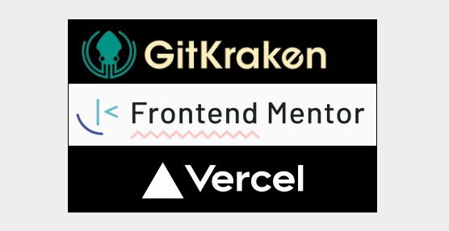

#### In this article, learn how to deconstruct interfaces into core components, creating unified, scalable systems using Brad Frost's Atomic Design methodology to enhance your web design skills effectively!

---

---

### **What is** Atomic Design?

**What never ceases to amaze me in tech is that when I discover something new, like a language, framework, or methodology, the people credited with its creation are still with us and working in the industry!**

Brad Frost is one such individual who has significantly impacted the design community with his concept of Atomic Design. This methodology revolutionizes how we approach web design by breaking down interfaces into their fundamental building blocks, or "atoms." Doing so allows designers and developers to create more cohesive and scalable design systems. Atomic Design simplifies the design process and ensures consistency across various platforms and devices. Brad's work continues to influence modern design practices, demonstrating the lasting impact of innovative thinkers in the tech industry.

---

### Atoms

Atoms are the most basic building blocks in Atomic Design. They are the smallest user interface elements, such as buttons, labels, input fields, and icons. Think of them as the fundamental pieces that you can combine to create more complex components.

In web design, atoms are like HTML tags—simple and standalone. Focusing on atoms ensures consistency and reusability across your design system. For example, a button atom can be styled once and used throughout your entire project, maintaining a uniform look and feel. Understanding atoms is crucial because they form the foundation for more complex components.

---

### Molecules

Molecules are groups of atoms bonded together, serving as the next step in building a user interface. They combine two or more atoms to form a more complex component that maintains a simple function. For example, a search form molecule might consist of an input field atom and a button atom.

By grouping atoms into molecules, you create more functional and interactive components. Molecules help organize your design system by providing reusable patterns that can be used across different project parts. They are essential for building consistent and efficient interfaces, allowing you to manage and update multiple atoms simultaneously.

**Above is an image of the header section of our Elfgorithm App, which consists of an SVG icon and a styled text element. This combination forms a molecule in the context of Atomic Design. The header is structured as follows:**

* The `<header>` element is styled with padding and flexbox properties to align its child elements (the icon and text) horizontally.
    
* The SVG icon, representing a gift, is styled with specific dimensions, colors, and rounded corners to visually stand out.
    
* The text element is styled with bold, italic, and specific color properties, with a portion of the text having a different color and weight for emphasis.
    

*This cohesive unit serves a specific function, demonstrating how molecules in Atomic Design combine multiple atoms to create more complex and functional components.*

---

### Organisms

Organisms are more complex components in Atomic Design. They are composed of groups of molecules and/or atoms working together to form a distinct section of an interface. Organisms represent a more substantial part of the UI, such as a navigation bar, a product listing, or a user profile section. Organisms are crucial for creating structured and functional layouts, combining various smaller components to serve a specific purpose.

Using organisms, you can build more dynamic and interactive parts of your application, ensuring that the design remains consistent and scalable. They also allow you to manage and update multiple molecules and atoms collectively, making it easier to maintain the overall design system.

**The image above illustrates an organism within the context of Atomic Design. This section, titled "How It Works," combines multiple molecules into a cohesive unit that serves a specific purpose. Each step in the process (Create a Group, AI Matches & Suggests, Enjoy the Exchange) is a molecule, consisting of a number icon, a heading, and a descriptive paragraph.**

*The entire section, with its heading and grid layout, forms a distinct part of the user interface, explaining the process in a structured and functional manner. This combination of multiple molecules into a larger, interactive layout is characteristic of an organism, representing a more substantial part of the UI.*

---

### Templates

Templates are a key part of Atomic Design. They represent page-level objects that place components into a layout and demonstrate the design's underlying content structure. They are essentially a combination of organisms, molecules, and atoms arranged to form a cohesive layout. Templates focus on the page's structure rather than the specific content, allowing you to see how different components fit together.

Using templates ensures that your design system is flexible and adaptable, accommodating various content types while maintaining a consistent layout. This helps visualize the final product's appearance and function, providing a blueprint for building actual pages.

---

### Pages

Pages are the final stage in Atomic Design, where templates are filled with real content to create a fully functional and complete user interface. They represent specific instances of templates, showcasing how the design system looks and behaves with actual data.

Pages are crucial for testing the effectiveness of your design system, as they allow you to see how all the components work together in a real-world scenario. By using pages, you can ensure that your design is both visually consistent and functional as well as user-friendly. They provide a comprehensive view of the final product, helping you identify any issues or improvements needed before deployment.

---

###### *“*[*Atomic Design*](https://youtu.be/W-h1FtNYim4)*” by Brad Frost—An Event Apart Austin 2015*

**Brad Frost introduces atomic design, a methodology that breaks down interfaces into their basic elements to create scalable and maintainable design systems.**

---

### **Real-World Use Case**

*AI: Work smarter, not harder! Effectively using AI as a tool rather than a substitute for your work is an excellent method to maximize efficiency without increasing effort!*

Our tech lead, Shashi Lo, understands the proper use of AI and allows us to use it while we build our project. However, it comes with a caveat: you must be able to understand and explain to him how the AI-generated code works! Fair enough.

I was tasked with creating a Google Doc that organizes our forty components and counting, labeling each individual component as an Atom, Molecule, or Organism.

**Since the main goal is to write documentation for each component, and we were waiting for this clarification before we began, I utilized AI to analyze each component and categorize them as Atoms, Molecules, or Organisms. This demonstrates the effectiveness of proper component naming conventions, as the AI successfully sorted them all accordingly.**

However, it was not enough just to have AI label each component; I needed to understand why each component was labeled as it was. So, I took the AI assistance further and asked it to write definitions for each component.

**Using AI as a tool in this manner saved our team time on the mundane task of manually labeling each component as Atoms, Molecules, or Organisms. With the Google Doc completed, with all the labeled components and their definitions, we can quickly approve or disapprove each labeled component and update if necessary, allowing us to finish this task and start the components documentation!**

---

### Brad Frost Links

🔗 [Website](https://bradfrost.com/)

🔗 [YouTube](https://www.youtube.com/@brad_frost)

🔗 [Bluesky](https://bsky.app/profile/bradfrost.com)

🔗 [LinkedIn](https://www.linkedin.com/in/bradfrost)

🔗 [GitHub](https://github.com/bradfrost)

---

### About Us

#### What is Gridiron Survivor?

[*Gridiron Survivor*](https://www.htmlallthethings.com/blog-posts/bridging-the-skills-gap-empowering-junior-developers-through-apprenticeship-programs) *is an apprenticeship program created by Shashi Lo, a Senior UX Engineer at Microsoft. It aims to provide developers entering the tech industry with vital work experience. The program focuses on practical training in project management, coding practices, and team collaboration, offering mentorship and skills essential for success in their initial tech roles.*

#### What is the Elfgorithm App?

[*Elfgorithm*](https://github.com/LetsGetTechnical/elecretanta) *is an AI-driven Secret Santa app set to launch in winter 2025. It streamlines gift exchanges by removing the guesswork from Secret Santa activities. The app manages gift-giving details and provides personalized gift suggestions, ensuring you find the perfect presents for everyone.*

### Gridiron Survivor Sponsors

**A very special thanks to our sponsors!**

* [GitKraken](https://www.gitkraken.com/): *A popular Git client that provides a graphical interface to manage Git repositories. It is known for its user-friendly design and features that simplify version control, making it easier for developers to collaborate and manage their code.*
    
* [Frontend Mentor](https://www.frontendmentor.io/): *An online platform that offers front-end coding challenges. It helps developers improve their skills by providing real-world projects to work on, along with a supportive community for feedback and learning.*
    
* [Vercel](https://vercel.com/): *A cloud platform for static sites and serverless functions. It is designed to optimize the workflow of developers by providing tools for building, deploying, and scaling modern web applications with ease. Vercel is known for its seamless integration with frameworks like Next.js.*
    

---

### My other related articles

* [Software Versioning: A Developer's Guide to Semantic and GitHub Releases](https://selftaughttxg.com/2025/05-25/software-versioning-a-developers-guide-to-semantic-and-github-releases/)
    
* [Gridiron Survivor's Elfgorithm: Introduction and Team Installation](https://selftaughttxg.com/2025/04-25/gridiron-survivor's-elfgorithm-introduction-and-team-installation/)
    
* [Bridging the Skills Gap: Empowering Junior Developers Through Apprenticeship Programs](https://www.htmlallthethings.com/blog-posts/bridging-the-skills-gap-empowering-junior-developers-through-apprenticeship-programs)
    
* [Shashi Lo: UI Design Fundamentals](https://selftaughttxg.com/2022/02-22/ShashiLo/)
    

---

### **Be sure to listen to the HTML All The Things Podcast!**

#### 📝 *I also write articles for the HTML All The Things Podcast, which you can read on their website:* [*https://www.htmlallthethings.com/*](https://www.htmlallthethings.com/)*.*

#### **Be sure to check out HTML All The Things on socials!**

* [Twitter](https://twitter.com/htmleverything)
    
* [LinkedIn](https://www.linkedin.com/company/html-all-the-things/)
    
* [TikTok](https://www.tiktok.com/@htmlallthethings)
    
* [Instagram](https://www.instagram.com/htmlallthethings/)
    

---

### Affiliate & Discount Links!

**With CodeMonkey, learning can be all fun and games!** CodeMonkey transforms education into an engaging experience, enabling children to evolve from tech consumers to creators. Use CodeMonkey's **FREE trial** to unlock the incredible potential of young tech creators!

*With a structured learning path tailored for various age groups, kids progress from block coding to more advanced topics like data science and artificial intelligence, using languages such as CoffeeScript and Python. The platform includes features for parents and teachers to track progress, making integrating coding into home and classroom settings easy.*

Through fun games, hands-on projects, and community interaction, CodeMonkey helps young learners build teamwork skills and receive recognition for their achievements. It fosters a love for coding and prepares children for future career opportunities in an ever-evolving tech landscape.

***To learn more about CodeMonkey, you can read my detailed*** [***review article***](https://selftaughttxg.com/2025/02-25/inspiring-young-coders-how-codemonkey-turns-kids-into-tech-creators/)***!***

**Affiliate Links:**

* [Sign Up for Parents](https://codemonkey.sjv.io/c/5987452/919057/12259)
    
* [Sign Up for Teachers](https://codemonkey.sjv.io/c/5987452/919060/12259)
    

---

### Advance your career with a 20% discount on Scrimba Pro using this [affiliate link](https://scrimba.com/?via=MichaelLarocca)!

Become a hireable developer with Scrimba Pro! Discover a world of coding knowledge with full access to all courses, hands-on projects, and a vibrant community. You can [read my article](https://selftaughttxg.com/2021/06-21/06-07-21/) to learn more about my exceptional experiences with Scrimba and how it helps many become confident, well-prepared web developers!

###### ***Important:*** *This discount is for new accounts only. If a higher discount is currently available, it will be applied automatically.*

**How to Claim Your Discount:**

1. Click [the link](https://scrimba.com/?via=MichaelLarocca) to explore the new Scrimba 2.0.
    
2. Create a new account.
    
3. Upgrade to Pro; the 20% discount will automatically apply.
    

##### ***Disclosure:*** *This article contains affiliate links. I will earn a commission from any purchases made through these links at no extra cost to you. Your support helps me continue creating valuable content. Thank you!*

---

### Conclusion

Brad Frost's atomic Design methodology offers a structured approach to building cohesive and scalable design systems. It starts with Atoms, the smallest building blocks, such as buttons and icons, which provide consistency and reusability across the design. Moving up, Molecules are formed by combining atoms to create more functional components, like a search form. Organisms take it further by grouping molecules and atoms into larger, functional interface sections, such as navigation bars.

Templates then arrange these components into page-level structures, focusing on layout rather than specific content. Finally, Pages brings templates to life by filling them with real content, resulting in a complete and testable user interface.

By following these principles, designers and developers can create efficient, consistent, and user-friendly interfaces that work seamlessly across various platforms!

---

###### *Do you now feel confident applying Atomic Design principles to your web projects? Have you created more cohesive and scalable design systems and have tips to share? Please share the article and comment*

---
