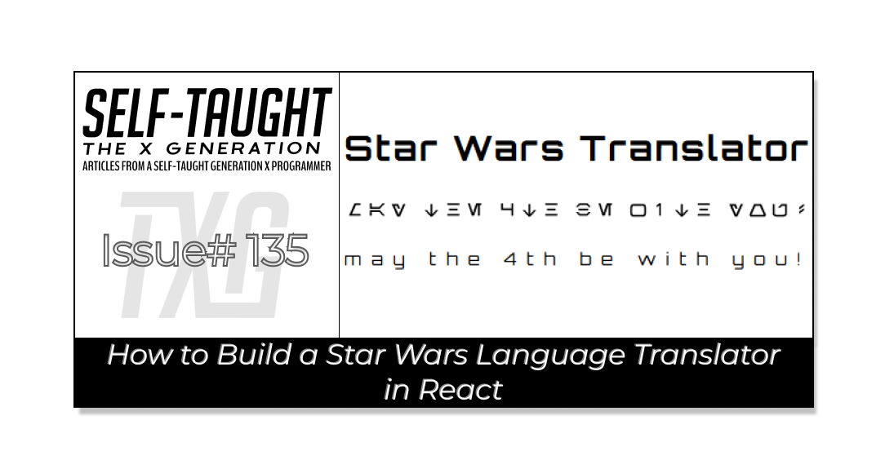

#### I created a Star Wars language translator React component, so YOU don't have to! This article includes a quick start guide, integration details, and links to the repo and deployed Aurebesh project!

---



---

### Aurebesh Translator App (TL;DR Summary and Integration Guide)

May the Force, and May the 4th, be with you! Feel free to clone or fork the project to explore how it works! You can use it as a foundation to start your own project, allowing you to experiment with the code, modify it to suit your needs, and learn more about the Aurebesh translation app's functionality. Enjoy the process of learning and making the project your own!

**Here are the links to the project:**

* [GitHub repo](https://github.com/MichaelLarocca/star-wars-aurebesh-translator-function)
    
* [Netlify deployed project](https://star-wars-aurebesh-translator-function.netlify.app/)
    


---

### Quick Start Guide

**For those who already have a project and wish to integrate the Aurebesh translation component, this guide provides a straightforward method. By following the outlined steps, you can seamlessly incorporate the component into your existing setup, enhancing your project with Star Wars-inspired functionality.**

*Each file plays a crucial role in providing the functionality and styling needed to translate English text into Aurebesh and display it with customizable options. Below is a brief overview of each file and its purpose within the app, ensuring you have all the components and utilities required to get started seamlessly.*

* **App.jsx**: The main application component that integrates all other components and manages the overall state of the app, including dark mode and text orientation.
    
* **AurebeshTranslatorComponent.jsx**: A component responsible for translating English text into Aurebesh and displaying it with customizable styles.
    
* **Navbar.jsx**: A component that provides a navigation bar with toggle buttons to switch between dark mode, Aurebesh translation, and vertical text layout. These are examples; you can implement your own methods for creating and passing props.
    
* **ToggleButton.jsx**: A reusable button component that toggles between active and inactive states, used within the Navbar. Feel free to customize the implementation to suit your needs.
    
* **aurebeshTranslator.jsx**: A utility module that contains the logic for mapping English characters to Aurebesh and rendering them with appropriate styles.
    
* **useDarkMode.js**: A custom React hook that manages the dark mode state, allowing the app to toggle between light and dark themes.
    
* **AurebeshTranslatorComponent.module.css**: A CSS module that defines styles for the Aurebesh characters and layout, ensuring proper display and spacing ***(to prevent style conflicts and enable scoped styling).***
    
* **App.css**: A global CSS file that sets the base styles for the app, including body styles, button margins, and theme-specific styles for dark and light modes.
    

#### Aurebesh Translator Component:

```javascript
      <AurebeshTranslatorComponent
        data={`may the 4th be with you!`} // Text to be translated
        isAurebesh={isAurebesh} // Toggle for Aurebesh translation
        scale={.5} // Scale of the text
        isWhite={isDarkMode} // Text color based on dark mode
        isVertical={isVertical} // Text orientation
        verticalLetterSpacing="-7px" // Letter spacing for vertical text
        horizontalLetterSpacing="10px" // Letter spacing for horizontal text
        fontSize={"16px"} // Font size of the text
      />
```

*By following the steps below, you can seamlessly integrate the Aurebesh translation app into your project and customize it to suit your needs.*

**To integrate the Aurebesh translation app into your project, follow these steps to ensure a smooth setup:**

1. **Create a New React Project**: If you haven't already, create a new React project (Check out my article for detailed steps: [Create a React Project, Push It to GitHub, and Deploy With Netlify, From the Command Line](https://selftaughttxg.com/2023/03-23/create-a-react-project-push-it-to-github-and-deploy-with-netlify-from-the-command-line/)).
    
2. **Copy the Files**: Copy each of the provided files into your project directory, maintaining the suggested folder structure. For example, place **AurebeshTranslatorComponent.jsx** and its corresponding CSS module in a **components/AurebeshTranslatorComponent** folder.
    
3. **Install Dependencies**: Ensure you have all necessary dependencies installed. If your project uses additional libraries (e.g., for CSS modules), install them using **npm** or **yarn**. For example, run **npm install** or **yarn install** to ensure all dependencies are up to date.
    
4. **Import Components and Utilities**: In your **App.jsx** file, import the components and utilities as shown in the code snippets. This includes importing **useDarkMode**, **AurebeshTranslatorComponent**, **Navbar**, and any CSS files.
    
5. **Run the Project**: Start your development server by running **npm start** or **yarn start**. This will launch your app in the browser, allowing you to see the Aurebesh translation functionality in action.
    

---

### Introduction

As an avid Star Wars fan, I was always intrigued by the Aurebesh language. Exactly what is the Aurebesh language? Fortunately, it is just English; a symbol represents each letter of the alphabet. For more information, please refer to the [Wikipedia page](https://en.wikipedia.org/wiki/Languages_in_Star_Wars).


---

💡 **Fun Facts:** *This language is used in Star Wars movies, shows, and even in theme parks!*

---

### How the Aurebesh Component Works

**It’s important to note that I used both Vite and CSS Modules when creating this project.**

* **Vite:** Vite is a modern build tool that provides a fast development environment for web projects. It offers instant server start, lightning-fast hot module replacement (HMR), and optimized builds, making it ideal for modern JavaScript frameworks like React.
    
* **CSS Modules:** CSS Modules are a way to scope CSS by automatically generating unique class names, preventing style conflicts. This approach allows you to write CSS that is local to the component, ensuring that styles do not leak into other parts of the application.
    

#### The Aurebesh Letters

With a sprite-style transparent PNG file, I previously mapped out each letter in CSS for a [Star Wars calendar project](https://github.com/MichaelLarocca/Star-Wars-Calendar-June-2020-). I utilized these CSS letter mappings for this project by using lowercase class letters as follows:

```css
  
  /* Styles for lowercase letters with additional styling */
  .a {
	min-width: 30px;
	min-height: 30px;
	background: url(/StarWars.png) -8px -145px;
  }
  .b {
	min-width: 30px;
	min-height: 30px;
	background: url(/StarWars.png) -62px -145px;
  }
  .c {
	min-width: 30px;
	min-height: 30px;
	background: url(/StarWars.png) -115px -145px;
  }
```

---

**I also mapped out the numbers and special characters from the following sprite sheet:**


⚠ **Note:** Use the lowercase class letters only, as they properly represent Aurebesh charters as seen in Star Wars media. Although I mapped out the uppercase letters, you will notice each Aurebesh charter is reversed (mirror-imaged).

---

## Props

---

### The Data Prop

The **data** prop is used to input the text that you want to translate from English to Aurebesh. For example, you can pass a string like "may the 4th be with you!" to the **data** prop. This text is then processed by the component to determine whether it should be translated into Aurebesh or displayed as the original English text.

```javascript
data={`may the 4th be with you!`} // Text to be translated
```

---

### The isAurebesh Prop

The translation is controlled by the **isAurebesh** boolean prop.

```javascript
isAurebesh = true, // Flag to determine if the text should be translated to Aurebesh
```

If **isAurebesh** is true, the **aurebeshTranslator** function is called with the **data**, along with the additional parameters **scale**, **isWhite**, and **isVertical**. This function handles the conversion of the English text into Aurebesh characters, applying any specified styles or orientations. If **isAurebesh** is false, the original English text is rendered instead. This setup allows for dynamic switching between the translated and original text based on the **isAurebesh** prop.

```javascript
 {isAurebesh ? aurebeshTranslator(data, scale, isWhite, isVertical) : data} {/* Render translated or original text */}
```

---

### The isWhite Prop

Since we are working with a transparent PNG file for the Aurebesh characters, to change the font color from black to white, we use the CSS filter to invert the color as follows:

```javascript
filter: isWhite ? "invert(100%)" : "invert(0%)", // Apply color inversion if needed
```

---

### Scale Prop

The **scale** prop is numerical, and is used to change the size of the Aurebesh PNG characters ( each character is initially 30px by 30px ).

The initial scale size is one, which is the actual size of the Aurebesh PNG characters. The best sizes to use are 1.5 for large text and 0.5 for small text. I designed the scaling feature to use a large scale for header titles and a small scale for regular text, which is 16px.

```javascript
 scale = 1, // Scale factor for the size of the translated text
```

---

### Font Size Prop

I created the **fontSize** prop to add flexibility when adjusting the **scale** prop. The default size is set to 16px.

```javascript
fontSize = "16px" // Font size of the text
```

When you change the default **scale** size, you'll notice that the plain text size stays the same when switching between Aurebesh and English. The **fontSize** prop lets you adjust the text size to align with the **scale** size.

**To achieve this, we use inline CSS to set the font size as follows:**

```javascript
fontSize: fontSize, // Set font size
```

---

### Letter Spacing Props

Since we are working with PNG characters, when you toggle between and Aurebesh and English, there are letter spacing issues. For example, passing in the data “may the 4th be with you“ will have a noticeable difference in letter spacing when toggled.

I created both **verticalLetterSpacing** and **horizontalLetterSpacing** spacing props to “fine-tune“ spacing. I set default values for both, which work well with the **scale** prop set to 1.

```javascript
verticalLetterSpacing = "-7px", // Letter spacing for vertical text
horizontalLetterSpacing = "10px", // Letter spacing for horizontal text
```

---

### The isVertical Prop

This is where the fun begins! To get the most out of the Aurebesh component, I designed it to display the input data both horizontally and vertically!

The **isVertical** prop uses a boolean true/false value. The default value is false.

```javascript
isVertical = false, // Flag to determine if the text should be displayed vertically
```

The **isVertical** prop determines the orientation of the text display. When **isVertical** is set to true, the display style is set to "block," which arranges the text vertically, stacking each character or word on top of the other. Conversely, when **isVertical** is false, the display style is set to "flex," allowing the text to be displayed horizontally in a row.

```javascript
 display: isVertical ? "block" : "flex", // Display style based on text orientation
```

---

### Aurebesh Translator Component Props

Having covered all the Aurebesh Translator Component props, here is a demonstration of the component with values passed to each prop.

```javascript
      <AurebeshTranslatorComponent
        data={`may the 4th be with you!`} // Text to be translated
        isAurebesh={isAurebesh} // Toggle for Aurebesh translation
        scale={.5} // Scale of the text
        isWhite={isDarkMode} // Text color based on dark mode
        isVertical={isVertical} // Text orientation
        verticalLetterSpacing="-7px" // Letter spacing for vertical text
        horizontalLetterSpacing="10px" // Letter spacing for horizontal text
        fontSize={"16px"} // Font size of the text
      />
```

---

## Functions

---

### Dark Mode

Before we take a deep dive into the Aurebesh function, let’s start with something easy; dark mode. I added a **useDarkMode** feature that toggles the Aurebesh font (transparent PNG) from black to white. This file is located in the **utils folder**, and is used in conjunction the **isWhite** prop.

*The* ***useDarkMode*** *is just a simple true/false boolean toggle, so you don’t necessarily need to use this code; you just need to pass a boolean variable to the* ***isWhite*** *prop.*

#### The UseDarkMode file:

```javascript
import { useState } from "react";

// Custom hook to manage the dark mode state
function useDarkMode(initialMode = true) {
  // Initialize state to track if dark mode is enabled, defaulting to initialMode
  const [isDarkMode, setIsDarkMode] = useState(initialMode);

  // Function to toggle the dark mode state
  const toggleDarkMode = () => setIsDarkMode((prevMode) => !prevMode);

  // Return the current dark mode state and the function to toggle it
  return [isDarkMode, toggleDarkMode];
}

export default useDarkMode;
```

---

### Calculate Margin Functions

When setting sizes with the **scale** prop, optimal sizing is between 0.5 and 1.5. There is an inherent margin issue because each Aurebesh letter is a boxed transparent PNG; the margin between the Aurebesh letters becomes too large and too small.

To address this issue, I created two helper functions, **calculateMargin** and **calculateVerticalMargin**, which automatically set optimal margins based on the **scale** size.

These helper functions are utilized in the **aurebeshTranslator** function to calculate the right, left, top, and bottom margins of the Aurebesh letters.

*The* ***calculateMargin*** *helper function is used to set optimal right and left margins when the Aurebesh letters are displayed horizontally.*

```javascript
marginRight: calculateMargin(scale, aurebeshClass === "space"), // Calculate right margin
marginLeft: calculateMargin(scale, aurebeshClass === "space"), // Calculate left margin
```

**Below is the code for the *calculateMargin* helper function:**

```javascript
// Function to calculate horizontal margin based on scale
// Adjusts margin size depending on the scale and whether the character is a space
export function calculateMargin(scale, isSpace) {
  if (scale <= 0.5) {
    // For small scales, use negative margins to reduce spacing
    return isSpace ? "-10px" : "-5px";
  } else if (scale <= 1) {
    // Gradually increase margin as scale approaches 1
    return isSpace
      ? `${-10 + ((scale - 0.5) / 0.5) * 5}px`
      : `${-5 + ((scale - 0.5) / 0.5) * 5}px`;
  } else if (scale <= 1.5) {
    // Adjust margins for medium scales
    return isSpace
      ? `${-5 + ((scale - 1) / 0.5) * 5}px`
      : `${0 + ((scale - 1) / 0.5) * 5}px`;
  } else if (scale <= 2) {
    // Further adjust margins for larger scales
    return isSpace
      ? `${0 + ((scale - 1.5) / 0.5) * 5}px`
      : `${5 + ((scale - 1.5) / 0.5) * 5}px`;
  } else {
    // Default margins for scales greater than 2
    return isSpace ? "5px" : "10px";
  }
}
```

The **calculateVerticalMargin** helper function is used to set optimal top and bottom margins when the Aurebesh letters are displayed vertically.

```javascript
marginTop: isVertical
            ? calculateVerticalMargin(scale, aurebeshClass === "space")
            : "0px", // Calculate top margin for vertical layout
marginBottom: isVertical
            ? calculateVerticalMargin(scale, aurebeshClass === "space")
            : "0px", // Calculate bottom margin for vertical layout
```

**Below is the code for the *calculateVerticalMargin* helper function:**

```javascript
// Function to calculate vertical margin based on scale
// Similar to calculateMargin but for vertical spacing
export function calculateVerticalMargin(scale, isSpace) {
  if (scale <= 0.5) {
    // For small scales, use larger negative margins to reduce spacing
    return isSpace ? "-20px" : "-15px";
  } else if (scale <= 1) {
    // Gradually increase vertical margin as scale approaches 1
    return isSpace
      ? `${-20 + ((scale - 0.5) / 0.5) * 15}px`
      : `${-15 + ((scale - 0.5) / 0.5) * 15}px`;
  } else if (scale <= 1.5) {
    // Adjust vertical margins for medium scales
    return isSpace
      ? `${-5 + ((scale - 1) / 0.5) * 15}px`
      : `${0 + ((scale - 1) / 0.5) * 15}px`;
  } else if (scale <= 2) {
    // Further adjust vertical margins for larger scales
    return isSpace
      ? `${0 + ((scale - 1.5) / 0.5) * 20}px` // Increased for scale 2
      : `${5 + ((scale - 1.5) / 0.5) * 20}px`; // Increased for scale 2
  } else {
    // Default vertical margins for scales greater than 2
    return isSpace ? "20px" : "25px"; // Further increased base values
  }
}
```

---

### The Aurebesh Translator Function

This is where it all comes together! The **aurebeshTranslator** function is designed to convert an input string into its Aurebesh representation, using a predefined mapping of English characters to Aurebesh CSS classes and background positions. This function takes several parameters: **data**, **scale**, **isWhite**, and **isVertical**.

1. **Data**: The input string to be translated is split into individual characters. Each character is mapped to its corresponding Aurebesh class and background position using the **aurebeshMap**.
    
2. **Scale**: This parameter adjusts the size of the translated text. The **transform** property is used to scale each character, allowing for flexible sizing.
    
3. **isWhite**: This boolean flag determines the text color. If set to true, the **filter** property inverts the color to white, otherwise, it remains black.
    
4. **isVertical**: This flag controls the text orientation. When true, characters are displayed in a vertical stack using the **display** property set to "block". Otherwise, they are displayed inline.
    

The function iterates over each character, applying the appropriate CSS class and styles. It uses helper functions **calculateMargin** and **calculateVerticalMargin** to set optimal margins based on the **scale** and character type, ensuring proper spacing. Characters not found in the **aurebeshMap** are logged as warnings and skipped in the output.

```javascript
import imageAurebesh from "../components/AurebeshTranslatorComponent/StarWars.png";
import cssFile from "../components/AurebeshTranslatorComponent/AurebeshTranslatorComponent.module.css";
import {
  calculateMargin,
  calculateVerticalMargin,
} from "../utils/marginCalculations";

// Mapping of English letters to Aurebesh CSS classes and background positions
const aurebeshMap = {
  A: { class: "A", position: "-10px -15px" },
  B: { class: "B", position: "-62px -15px" },
  C: { class: "C", position: "-115px -15px" },
  D: { class: "D", position: "-167px -15px" },
  E: { class: "E", position: "-218px -15px" },
  F: { class: "F", position: "-271px -15px" },
  G: { class: "G", position: "-323px -15px" },
  H: { class: "H", position: "-375px -15px" },
  I: { class: "I", position: "-425px -15px" },
  J: { class: "J", position: "-481px -15px" },
  K: { class: "K", position: "-533px -15px" },
  L: { class: "L", position: "-583px -15px" },
  M: { class: "M", position: "-637px -15px" },
  N: { class: "N", position: "-10px -70px" },
  O: { class: "O", position: "-62px -70px" },
  P: { class: "P", position: "-114px -70px" },
  Q: { class: "Q", position: "-167px -72px" },
  R: { class: "R", position: "-218px -70px" },
  S: { class: "S", position: "-270px -70px" },
  T: { class: "T", position: "-323px -70px" },
  U: { class: "U", position: "-375px -70px" },
  V: { class: "V", position: "-428px -70px" },
  W: { class: "W", position: "-480px -70px" },
  X: { class: "X", position: "-533px -70px" },
  Y: { class: "Y", position: "-585px -70px" },
  Z: { class: "Z", position: "-637px -70px" },
  a: { class: "a", position: "-8px -145px" },
  b: { class: "b", position: "-62px -145px" },
  c: { class: "c", position: "-115px -145px" },
  d: { class: "d", position: "-165px -145px" },
  e: { class: "e", position: "-219px -145px" },
  f: { class: "f", position: "-271px -145px" },
  g: { class: "g", position: "-322px -145px" },
  h: { class: "h", position: "-375px -145px" },
  i: { class: "i", position: "-430px -145px" },
  j: { class: "j", position: "-480px -145px" },
  k: { class: "k", position: "-533px -145px" },
  l: { class: "l", position: "-587px -145px" },
  m: { class: "m", position: "-638px -145px" },
  n: { class: "n", position: "-10px -200px" },
  o: { class: "o", position: "-62px -200px" },
  p: { class: "p", position: "-115px -200px" },
  q: { class: "q", position: "-165px -201px" },
  r: { class: "r", position: "-218px -200px" },
  s: { class: "s", position: "-271px -200px" },
  t: { class: "t", position: "-323px -200px" },
  u: { class: "u", position: "-375px -200px" },
  v: { class: "v", position: "-428px -200px" },
  w: { class: "w", position: "-480px -200px" },
  x: { class: "x", position: "-533px -200px" },
  y: { class: "y", position: "-585px -200px" },
  z: { class: "z", position: "-637px -200px" },
  0: { class: "zero", position: "-10px -275px" },
  1: { class: "one", position: "-60px -275px" },
  2: { class: "two", position: "-113px -275px" },
  3: { class: "three", position: "-165px -275px" },
  4: { class: "four", position: "-219px -275px" },
  5: { class: "five", position: "-270px -275px" },
  6: { class: "six", position: "-323px -275px" },
  7: { class: "seven", position: "-375px -275px" },
  8: { class: "eight", position: "-428px -275px" },
  9: { class: "nine", position: "-480px -275px" },
  ".": { class: "period", position: "-10px -350px" },
  ",": { class: "comma", position: "-62px -350px" },
  ";": { class: "semicolon", position: "-114px -350px" },
  ":": { class: "colon", position: "-165px -350px" },
  "@": { class: "at", position: "-218px -350px" },
  "#": { class: "pound", position: "-271px -350px" },
  "'": { class: "apostrophe", position: "-324px -348px" },
  "!": { class: "exclamation-point", position: "-375px -350px" },
  "": { class: "", position: "" },
  '"': { class: "double-quote", position: "-425px -350px" },
  "/": { class: "forward-slash", position: "-480px -350px" },
  "?": { class: "question-mark", position: "-532px -350px" },
  "<": { class: "less-than", position: "-585px -350px" },
  ">": { class: "greater-than", position: "-637px -350px" },
  "%": { class: "percent-sign", position: "-10px -405px" },
  "&": { class: "ampersand", position: "-62px -405px" },
  "*": { class: "asterisk", position: "-115px -405px" },
  "(": { class: "opening-parenthesis", position: "-165px -405px" },
  ")": { class: "closing-parenthesis", position: "-220px -405px" },
  "[": { class: "box", position: "-271px -405px" },
  "]": { class: "box", position: "-271px -405px" },
  $: { class: "credit", position: "-323px -405px" },
  " ": { class: "space", position: "-374px -405px" },
};

// Function to translate data to Aurebesh
export function aurebeshTranslator(
  data, // The input string to be translated
  scale = 1, // Scale factor for the size of the translated text
  isWhite = false, // Flag to determine if the text color should be white
  isVertical = false // Flag to determine if the text should be displayed vertically
) {
  return data.split("").map((char, index) => {
    // Retrieve the Aurebesh class and position for the current character
    const { class: aurebeshClass, position } = aurebeshMap[char] || {};
    if (!aurebeshClass) {
      console.warn(`Character "${char}" not found in aurebeshMap.`);
      return null; // Return null for characters not found in the map
    }
    return (
      <div
        key={index} // Unique key for each character
        className={cssFile[aurebeshClass]} // Apply the corresponding CSS class
        style={{
          width: "30px",
          height: "30px",
          transform: `scale(${scale})`, // Scale the character
          filter: isWhite ? "invert(100%)" : "invert(0%)", // Apply color inversion if needed
          display: isVertical ? "block" : "inline-block", // Set display style based on orientation
          backgroundImage: `url(${imageAurebesh})`, // Set the background image
          backgroundPosition: position, // Set the background position
          marginRight: calculateMargin(scale, aurebeshClass === "space"), // Calculate right margin
          marginLeft: calculateMargin(scale, aurebeshClass === "space"), // Calculate left margin
          marginTop: isVertical
            ? calculateVerticalMargin(scale, aurebeshClass === "space")
            : "0px", // Calculate top margin for vertical layout
          marginBottom: isVertical
            ? calculateVerticalMargin(scale, aurebeshClass === "space")
            : "0px", // Calculate bottom margin for vertical layout
        }}
      />
    );
  });
}
```

---

## Components

---

### Aurebesh Translator Component

Finally, we are now ready to use the Star Wars translator component in our project!

*To ensure the* ***AurebeshTranslatorComponent*** *functions correctly, it is essential to import the* ***aurebeshTranslator*** *function from the utilities file, which handles the conversion of English text to Aurebesh. Additionally, importing the* ***cssFile*** *is necessary to apply the appropriate styles and layout to the translated text, ensuring it is displayed as intended.*

The **AurebeshTranslatorComponent** is designed to translate English text into Aurebesh and display it with customizable styles. It accepts several props to control its behavior and appearance:

* **data**: The text to be translated.
    
* **isAurebesh**: A boolean flag that determines whether the text should be translated to Aurebesh. Defaults to true.
    
* **scale**: A factor that adjusts the size of the translated text. Defaults to 1.
    
* **isWhite**: A boolean flag that sets the text color to white if true. Defaults to false.
    
* **isVertical**: A boolean flag that controls the text orientation. If true, the text is displayed vertically. Defaults to false.
    
* **verticalLetterSpacing** and **horizontalLetterSpacing**: These define the letter spacing for vertical and horizontal text, respectively.
    
* **fontSize**: Sets the font size of the text. Defaults to "16px".
    

The component uses the **aurebeshTranslator** function to convert the text when **isAurebesh** is true. It applies styles based on the provided props, ensuring the text is displayed according to the specified orientation and appearance settings. The component is wrapped in a **&lt;div&gt;** with dynamic class names and styles to accommodate these customizations.

```javascript
import { useState } from "react";
import { aurebeshTranslator } from "../../utils/aurebeshTranslator.jsx";
import cssFile from "../AurebeshTranslatorComponent/AurebeshTranslatorComponent.module.css";

// AurebeshTranslatorComponent
// This component translates English text to Aurebesh and displays it with customizable styles.
function AurebeshTranslatorComponent({
  data, // The text to be translated
  isAurebesh = true, // Flag to determine if the text should be translated to Aurebesh
  scale = 1, // Scale factor for the size of the translated text
  isWhite = false, // Flag to determine if the text color should be white
  isVertical = false, // Flag to determine if the text should be displayed vertically
  verticalLetterSpacing = "-7px", // Letter spacing for vertical text
  horizontalLetterSpacing = "10px", // Letter spacing for horizontal text
  fontSize = "16px" // Font size of the text
}) {
  return (
    <div
      className={`${cssFile.aurebeshTranslator} ${isVertical && !isAurebesh ? cssFile.verticalText : ""}`}
      style={{ 
        display: isVertical ? "block" : "flex", // Display style based on text orientation
        alignItems: "center",
        letterSpacing: isVertical ? verticalLetterSpacing : horizontalLetterSpacing, // Apply appropriate letter spacing
        fontSize: fontSize, // Set font size
       }}
    >
      {isAurebesh ? aurebeshTranslator(data, scale, isWhite, isVertical) : data} {/* Render translated or original text */}
    </div>
  );
}

export default AurebeshTranslatorComponent;
```

---

### Aurebesh Translator Component Use Case

I quickly created a Star Wars restaurant menu to showcase the Aurebesh Translator Component in action within a React project! For the appetizer menu, I added an image with the famous quote, “This is where the fun begins!” Would you like to start your meal with some Obi-Wan Pierogis?

#### Appetizer Menu in Aurebesh


#### Appetizer Menu in English


---

### My other related articles

* [JavaScript: How to Use the Star Wars API for Beginners](https://selftaughttxg.com/2022/04-22/StarWarsAPI-01/)
    
* [Mastering JavaScript Fundamentals: Unleashing Your Framework Readiness](https://www.htmlallthethings.com/blog-posts/mastering-javascript-fundamentals-unleashing-your-framework-readiness)
    
* [React: How to Use the Star Wars API for Beginners](https://selftaughttxg.com/2023/05-23/react-how-to-use-the-star-wars-api-for-beginners/)
    
* [Han Solo - Creating a True/False Toggle in React with useState Hook for Beginners](https://selftaughttxg.com/2023/04-23/creating-a-true-false-toggle-in-react-with-usestate-hook-for-beginners/)
    
* [Learn Local Storage in React: Star Wars Light and Dark Theme Switcher Application](https://selftaughttxg.com/2023/05-23/learn-local-storage-in-react-create-a-light-and-dark-theme-switcher-application/)
    

---


### **Be sure to listen to the HTML All The Things Podcast!**

#### 📝 *I also write articles for the HTML All The Things Podcast, which you can read on their website:* [*https://www.htmlallthethings.com/*](https://www.htmlallthethings.com/)*.*

#### **Be sure to check out HTML All The Things on socials!**

* [Twitter](https://twitter.com/htmleverything)
    
* [LinkedIn](https://www.linkedin.com/company/html-all-the-things/)
    
* [TikTok](https://www.tiktok.com/@htmlallthethings)
    
* [Instagram](https://www.instagram.com/htmlallthethings/)
    

---

### Affiliate & Discount Links!


**With CodeMonkey, learning can be all fun and games!** CodeMonkey transforms education into an engaging experience, enabling children to evolve from tech consumers to creators. Use CodeMonkey's **FREE trial** to unlock the incredible potential of young tech creators!

*With a structured learning path tailored for various age groups, kids progress from block coding to more advanced topics like data science and artificial intelligence, using languages such as CoffeeScript and Python. The platform includes features for parents and teachers to track progress, making integrating coding into home and classroom settings easy.*

Through fun games, hands-on projects, and community interaction, CodeMonkey helps young learners build teamwork skills and receive recognition for their achievements. It fosters a love for coding and prepares children for future career opportunities in an ever-evolving tech landscape.

***To learn more about CodeMonkey, you can read my detailed*** [***review article***](https://selftaughttxg.com/2025/02-25/inspiring-young-coders-how-codemonkey-turns-kids-into-tech-creators/)***!***

**Affiliate Links:**

* [Sign Up for Parents](https://codemonkey.sjv.io/c/5987452/919057/12259)
    
* [Sign Up for Teachers](https://codemonkey.sjv.io/c/5987452/919060/12259)
    

---


### Advance your career with a 20% discount on Scrimba Pro using this [affiliate link](https://scrimba.com/?via=MichaelLarocca)!

Become a hireable developer with Scrimba Pro! Discover a world of coding knowledge with full access to all courses, hands-on projects, and a vibrant community. You can [read my article](https://selftaughttxg.com/2021/06-21/06-07-21/) to learn more about my exceptional experiences with Scrimba and how it helps many become confident, well-prepared web developers!

###### ***Important:*** *This discount is for new accounts only. If a higher discount is currently available, it will be applied automatically.*

**How to Claim Your Discount:**

1. Click [the link](https://scrimba.com/?via=MichaelLarocca) to explore the new Scrimba 2.0.
    
2. Create a new account.
    
3. Upgrade to Pro; the 20% discount will automatically apply.
    

##### ***Disclosure:*** *This article contains affiliate links. I will earn a commission from any purchases made through these links at no extra cost to you. Your support helps me continue creating valuable content. Thank you!*

---

### Conclusion

If you’re a huge Star Wars fan, as I am, you most likely know about the Aurebesh language. The Aurebesh language is the writing system used in the Star Wars universe, representing the Galactic Basic Standard, which is literally English. Each letter of the English alphabet corresponds to a unique Aurebesh symbol. The Aurebesh Star Wars language appears in movies, TV shows, comics, theme parks, and more throughout the Star Wars franchise!

I took on the creation of this Star Wars language translator React component as a passion project. As I’m sure many other aspiring React programmers are also Star Wars fans, I view this as an opportunity not only to share a complete component they can use right away but also to provide a fun learning experience in React, allowing others to take a deep dive and learn how it was built from the ground up.

So, whether you're a Star Wars enthusiast or a developer looking to expand your React knowledge, this project provides a solid foundation for creativity and technical growth! Enjoy the journey of bringing the language of a galaxy far, far away into your coding endeavors!

May the Force, and May the 4th, be with you!

---

###### *Are you now excited to integrate the Aurebesh translator into your React projects? Do you have any creative ideas for using this component in your own applications? Please share the article and comment*

---
