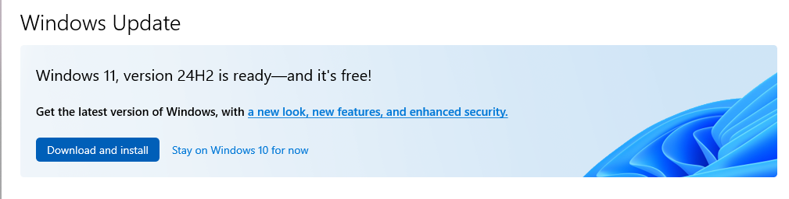
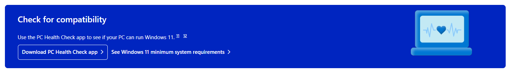
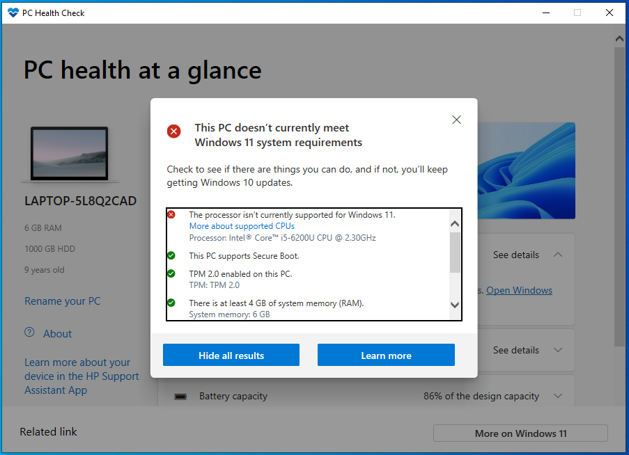

#### In this article, discover how to seamlessly upgrade to Windows 11, ensuring your PC stays secure and up-to-date. Learn the steps, check compatibility, and explore options if your device isn't eligible!

---

---

### Why Upgrading to Windows 11 Matters

As of October 14, 2025, Microsoft will no longer support Windows 10. If your computer uses the Windows 10 operating system, it will no longer be supported. This means that security updates, feature updates, technical support, and more will cease, leaving your PC vulnerable.

---

### FREE Windows 11 Upgrade

If your computer already has Windows 10 with a valid license and meets the minimum system requirements for Windows 11, you can upgrade for FREE!

The [official documentation](https://www.microsoft.com/en-us/windows/windows-11-specifications#table1) on Microsoft's website provides a comprehensive guide to checking whether your computer meets the system requirements.

---

### The Easiest Way to Upgrade to Windows 11

Using Windows Update on your computer is the easiest way to upgrade to Windows 11.

**To Access Windows Update, Click:**

* Start
    
* Settings
    
* Update & Security
    

In Update & Security, run **Windows Update**. Once your computer receives all the required updates, you should see a “Download and install“ button to upgrade to Windows 11, if it’s not already displayed.

*Be sure to read and follow all of Microsoft’s prompts and documentation to ensure a smooth upgrade from Windows 10 to 11.*

---

### If You Don’t See an Upgrade Option

After running **Windows Update**, if you still do not see an option to upgrade to Windows 11, you can use Microsoft's official [PC Health Check App](https://www.microsoft.com/en-us/windows/windows-11#pchealthcheck).

*Next to the “Download PC Health Check app“ button is a helpful link to Windows 11 system requirements.*

---

### If Your Computer Fails The Compatibility Test

Unfortunately, if your computer fails the compatibility test, you will not be able to upgrade it to Windows 11. If you want to ensure that your computer continually receives security updates, feature updates, technical support, and more, you will need to consider buying a new one with Windows 11 installed, or if you’re adventurous, you can alternatively build a PC and purchase a Windows 11 license.

*My main home laptop doesn't meet the requirements because of the processor. Luckily, I already own another laptop that came with Windows 11 preinstalled, which will now be my primary device as I retire my older one with Windows 10, since it will no longer be supported.*

---

### My other related articles

* [What is Microsoft VBA and Why You Should Learn It](https://selftaughttxg.com/2025/02-25/what-is-microsoft-vba-and-why-you-should-learn-it/)
    
* [From JavaScript to VBA: Navigating Variable Declaration and Management](https://selftaughttxg.com/2025/03-25/from-javascript-to-vba-navigating-variable-declaration-and-management/)
    
* [Mastering Excel: VLOOKUP and Custom VBA Functions for Key-Value Data Retrieval](https://selftaughttxg.com/2025/03-25/mastering-excel-vlookup-and-custom-vba-functions-for-key-value-data-retrieval/)
    
* [Mastering Excel's IFNA: Efficient Value Retrieval and VLOOKUP Integration](https://selftaughttxg.com/2025/03-25/mastering-excels-ifna-efficient-value-retrieval-and-vlookup-integration/)
    
* [Mastering VBA: Load and Manipulate Data in Excel Arrays](https://selftaughttxg.com/2025/04-25/mastering-vba-load-and-manipulate-data-in-excel-arrays/)
    

---

### **Be sure to listen to the HTML All The Things Podcast!**

#### 📝 *I also write articles for the HTML All The Things Podcast, which you can read on their website:* [*https://www.htmlallthethings.com/*](https://www.htmlallthethings.com/)*.*

#### **Be sure to check out HTML All The Things on socials!**

* [Twitter](https://twitter.com/htmleverything)
    
* [LinkedIn](https://www.linkedin.com/company/html-all-the-things/)
    
* [TikTok](https://www.tiktok.com/@htmlallthethings)
    
* [Instagram](https://www.instagram.com/htmlallthethings/)
    

---

### Affiliate & Discount Links!

**With CodeMonkey, learning can be all fun and games!** CodeMonkey transforms education into an engaging experience, enabling children to evolve from tech consumers to creators. Use CodeMonkey's **FREE trial** to unlock the incredible potential of young tech creators!

*With a structured learning path tailored for various age groups, kids progress from block coding to more advanced topics like data science and artificial intelligence, using languages such as CoffeeScript and Python. The platform includes features for parents and teachers to track progress, making integrating coding into home and classroom settings easy.*

Through fun games, hands-on projects, and community interaction, CodeMonkey helps young learners build teamwork skills and receive recognition for their achievements. It fosters a love for coding and prepares children for future career opportunities in an ever-evolving tech landscape.

***To learn more about CodeMonkey, you can read my detailed*** [***review article***](https://selftaughttxg.com/2025/02-25/inspiring-young-coders-how-codemonkey-turns-kids-into-tech-creators/)***!***

**Affiliate Links:**

* [Sign Up for Parents](https://codemonkey.sjv.io/c/5987452/919057/12259)
    
* [Sign Up for Teachers](https://codemonkey.sjv.io/c/5987452/919060/12259)
    

---

### Advance your career with a 20% discount on Scrimba Pro using this [affiliate link](https://scrimba.com/?via=MichaelLarocca)!

Become a hireable developer with Scrimba Pro! Discover a world of coding knowledge with full access to all courses, hands-on projects, and a vibrant community. You can [read my article](https://selftaughttxg.com/2021/06-21/06-07-21/) to learn more about my exceptional experiences with Scrimba and how it helps many become confident, well-prepared web developers!

###### ***Important:*** *This discount is for new accounts only. If a higher discount is currently available, it will be applied automatically.*

**How to Claim Your Discount:**

1. Click [the link](https://scrimba.com/?via=MichaelLarocca) to explore the new Scrimba 2.0.
    
2. Create a new account.
    
3. Upgrade to Pro; the 20% discount will automatically apply.
    

##### ***Disclosure:*** *This article contains affiliate links. I will earn a commission from any purchases made through these links at no extra cost to you. Your support helps me continue creating valuable content. Thank you!*

---

### Conclusion

Microsoft will end support for Windows 10 on October 14, 2025, making any PC running that version vulnerable. Upgrading to Windows 11 is FREE and easy via Windows Update, as long as your PC meets the system requirements.

If you don't see an option to download Windows 11 through Windows Update, you can use Microsoft's official [PC Health Check app](https://www.microsoft.com/en-us/windows/windows-11#pchealthcheck) to see if your PC meets the upgrade requirements. If it doesn't, upgrading isn't possible, and you'll need to consider buying a new computer or building one and purchasing an additional Windows 11 license.

---

**Let’s connect! I’m active on** [**LinkedIn**](https://www.linkedin.com/in/michaeljudelarocca/) **and** [**Twitter**](https://twitter.com/MikeJudeLarocca).

---

###### *Are you now confident in upgrading to Windows 11 and ensuring your PC's security? Do you have any other tips for a smooth upgrade process? Please share the article and comment!*
