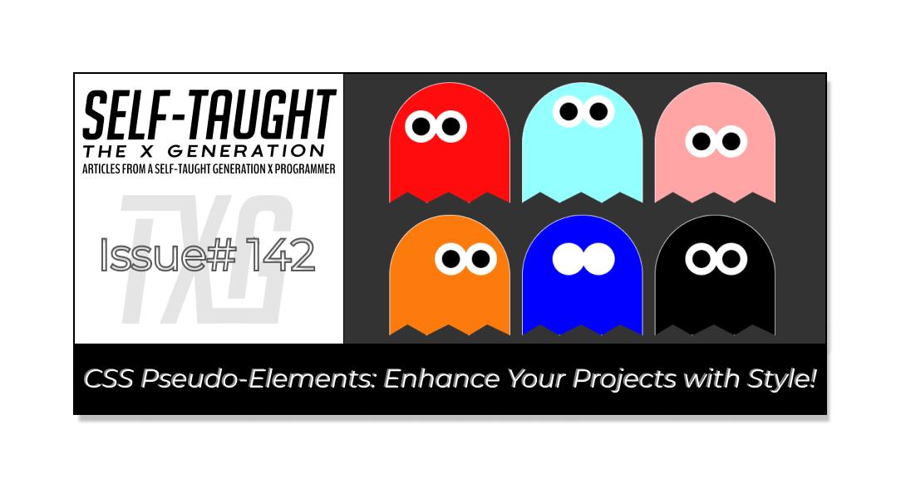
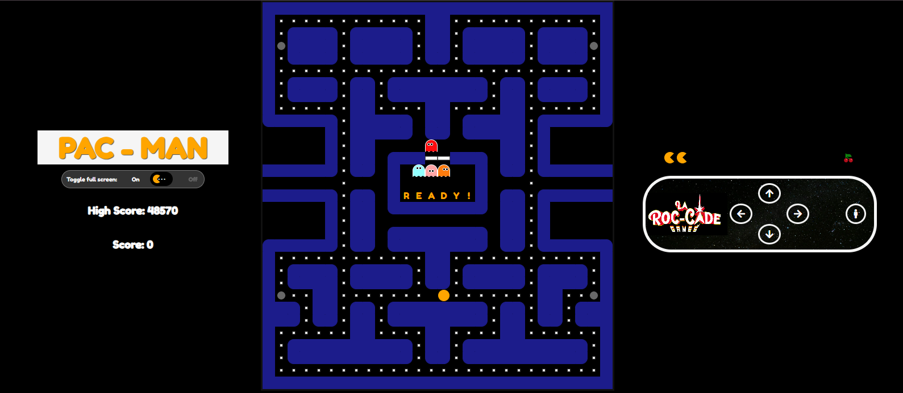
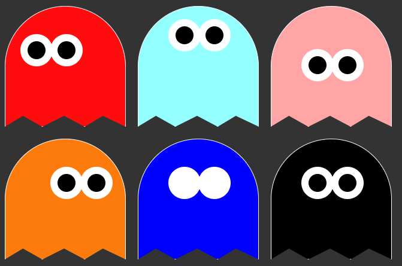

#### This article explores CSS pseudo-elements, which enable easy styling and content modification without additional HTML elements, and how I used them to create eyes for the ghosts in my JS Pac-Man game!

---



---

### CSS Before & After Pseudo-Elements

CSS pseudo-elements allow you to insert content before or after an element's actual content without adding extra HTML elements. The [::before](https://developer.mozilla.org/en-US/docs/Web/CSS/::before) and [::after](https://developer.mozilla.org/en-US/docs/Web/CSS/::after) pseudo-elements are popular and can help you style and modify content easily.

**Some of the other commonly used pseudo-elements include:**

1. `::first-line`: Applies styles to the first line of a block-level element.
    
2. `::first-letter`: Styles the first letter of a block-level element.
    
3. `::selection`: Styles the portion of an element that is selected by the user.
    
4. `::placeholder`: Styles the placeholder text in an input or textarea element.
    
5. `::marker`: Styles the marker box of a list item, such as bullets or numbers.
    

⚠ **Important:** *Pseudo-elements can't be targeted in JavaScript as they aren't part of the DOM. They serve decorative purposes, but you can indirectly manipulate their styles by altering their parent elements' styles or modifying CSS rules dynamically.*

---

### Why Is This a Valuable Coding Concept?

Understanding and utilizing CSS pseudo-elements is valuable because they enhance styling capabilities by allowing you to add decorative content and style specific parts of an element without altering the HTML structure. This leads to improved code maintainability, as it keeps HTML clean and semantic, reducing the need for additional markup.

---



### JS Pac-Man Project Links:

* 🔗 [Link to the deployed projec](https://pac-man-javascript-laroccade.netlify.app/)t
    
* 🔗 [Link to GitHub](https://github.com/MichaelLarocca/pac-man-javascript-laroccade)
    
* 🔗 [Link to the sprint board](https://github.com/users/MichaelLarocca/projects/1)
    

##### ***Note:*** *Since I’m following team development practices and pushing updates to the develop branch, some of the changes I describe in this article may not be live in the deployed version of the game yet.*

---

### Ghost’s Eye Direction

**This article explains how I used CSS pseudo-elements to add eyes to the ghosts in my JavaScript Pac-Man game and simulate their eye movements!**

For my JavaScript Pac-Man game, I created each ghost's eye using the before and after CSS pseudo-elements: the before pseudo-element for the left eye and the after pseudo-element for the right eye. Each eye is simply a boxed div with a 50% border radius, a black background, and a thick white border.

Taking creative liberty, I reposition the eyes to create the effect, differentiating it from the original arcade, where the pupils move. In my game, the left and right eyes remain grouped, and I slightly shift them in the direction they are moving. While in action, I believe it is pretty convincing!

🔗 [Link to the CodePen project](https://codepen.io/Michael_Larocca/pen/YzNqBWj?editors=1100)



**First, I created a main ghost class. Using a black background, I rounded out the ghost’s head with the top left and right border radius, and I used a clip-path to create the jagged bottom of the ghost.**

```css
.ghost {
  border: 1px solid white;
  background-color: black;
  position: relative;
  width: 200px;
  height: 200px;
  margin:10px;
  border-top-left-radius: 50%;
  border-top-right-radius: 50%;
  clip-path: polygon(50% 0%, 100% 0, 100% 100%, 81% 91%, 66% 100%, 49% 91%, 31% 100%, 15% 91%, 0 100%, 0 0);
}
```

Next, I create the ghost’s left eye using the `::before` CSS pseudo-element. I create a box and use a thick white border with a black background, rounding it out with a 50% border radius to complete the effect. The eye is positioned absolutely, sitting 100 pixels from the bottom and slightly shifted to the right with a margin, giving it the appearance of a floating eye on the ghost.

```css
.ghost::before {
  border: 12px solid white;
  border-radius: 50%;
  background-color: black;
  content: "";
  width: 30px;
  height: 30px;
  position: absolute;
  bottom: 100px;
  margin: 0 0 0 50px;
}
```

For the ghost's right eye, the `::after` CSS pseudo-element is used. It mirrors the left eye by creating another circular shape with a thick white border and a black background, using a 50% border radius for the round look. This eye is also positioned absolutely, 100 pixels from the bottom, but it's shifted further to the right with a margin, making it appear as the ghost's second floating eye.

```css
.ghost::after {
  border: 12px solid white;
  border-radius: 50%;
  background-color: black;
  content: "";
  width: 30px;
  height: 30px;
  position: absolute;
  bottom: 100px;
  margin: 0 0 0 100px;
}
```

---

### Ghosts’ Colors

I created a separate class for each ghost color so that I can easily use them in conjunction with the main ghost class.

```css
/* Ghost colors */
.ghost-red {
  background-color: rgb(255,12,14);
}
.ghost-pink {
  background-color: rgb(255,165,166);
}
.ghost-blue {
  background-color: rgb(147,255,255);
}
.ghost-orange {
  background-color: rgb(253,123,13);
}
```

---

### Scared Ghost Color

For a scared ghost, I changed the color of the ghost to blue and the eyes to white.

```css
/* Scared */
.scared {
 background-color: blue;
}

.scared::before,
.scared::after {
  background-color: white;
}
```

---

### Combining Ghost Classes

Now that there are classes for a main ghost, a ghost color, and a scared ghost, I can combine them to create a single ghost with the ability to change its eye direction!

```xml
<div class="flex">
  <div class="ghost ghost-red ghost-look-left"></div>
  <div class="ghost ghost-blue ghost-look-up"></div>
  <div class="ghost ghost-pink ghost-look-down"></div>
  <div class="ghost ghost-orange ghost-look-right"></div>
  <div class="ghost scared"></div>
  <div class="ghost"></div>
</div>
```

---

### JavaScript Ghost Eye Direction

In my [JavaScript Pac-Man game](https://github.com/MichaelLarocca/pac-man-javascript-laroccade), I created a Ghost class that includes an eyes property and other properties essential for the ghost's functionality.

Within the function that moves the ghosts, there is code to determine a valid direction—left, right, down, or up—and assign it. Once a direction is assigned, I update the CSS ghost's eye direction class by removing the current class and applying the new one.

```javascript
      // Eye direction
      if (direction === -1) {
        squares[ghost.currentIndex].classList.remove(ghost.eyes);
        ghost.eyes = `ghost-look-left-${eyeSize}`;
      } else if (direction === 1) {
        squares[ghost.currentIndex].classList.remove(ghost.eyes);
        ghost.eyes = `ghost-look-right-${eyeSize}`;
      } else if (direction === 28) {
        squares[ghost.currentIndex].classList.remove(ghost.eyes);
        ghost.eyes = `ghost-look-down-${eyeSize}`;
      } else if (direction === -28) {
        squares[ghost.currentIndex].classList.remove(ghost.eyes);
        ghost.eyes = `ghost-look-up-${eyeSize}`;
      }
```

*To make trial-and-error creation easier, I initially styled all the ghosts' eye directions on* [*CodePen*](https://codepen.io/Michael_Larocca/pen/YzNqBWj)*, using a ghost size of 200px for both width and height. In my game, the size of the ghost is either 20px or 10px in width and height, depending on full-screen or mobile view. With GitHub's CoPilot, I was able to easily resize the CSS values by letting the AI handle the calculations.*

---

### My other related articles

* [What Is “State” in JavaScript, and How to Use It in Your Projects](https://selftaughttxg.com/2025/09-25/what-is-state-in-javascript-and-how-to-use-it-in-your-projects/)
    
* [Ania Kubow: Building Tetris with JavaScript](https://selftaughttxg.com/2022/03-22/Ania_Kubow-Tetris/)
    
* [Mastering JavaScript Fundamentals: Unleashing Your Framework Readiness](https://www.htmlallthethings.com/blog-posts/mastering-javascript-fundamentals-unleashing-your-framework-readiness)
    
* [Mastering JavaScript: The Power of forEach and Ternary Operators](https://selftaughttxg.com/2025/08-25/mastering-javascript-the-power-of-foreach-and-ternary-operators/)
    
* [JavaScript: Understanding the Set and Clear Interval Methods](https://selftaughttxg.com/2025/06-25/javascript-understanding-the-set-and-clear-interval-methods/)
    

---


### **Be sure to listen to the HTML All The Things Podcast!**

#### 📝 *I also write articles for the HTML All The Things Podcast, which you can read on their website:* [*https://www.htmlallthethings.com/*](https://www.htmlallthethings.com/)*.*

#### **Be sure to check out HTML All The Things on socials!**

* [Twitter](https://twitter.com/htmleverything)
    
* [LinkedIn](https://www.linkedin.com/company/html-all-the-things/)
    
* [TikTok](https://www.tiktok.com/@htmlallthethings)
    
* [Instagram](https://www.instagram.com/htmlallthethings/)
    

---

### Affiliate & Discount Links!


**With CodeMonkey, learning can be all fun and games!** CodeMonkey transforms education into an engaging experience, enabling children to evolve from tech consumers to creators. Use CodeMonkey's **FREE trial** to unlock the incredible potential of young tech creators!

*With a structured learning path tailored for various age groups, kids progress from block coding to more advanced topics like data science and artificial intelligence, using languages such as CoffeeScript and Python. The platform includes features for parents and teachers to track progress, making integrating coding into home and classroom settings easy.*

Through fun games, hands-on projects, and community interaction, CodeMonkey helps young learners build teamwork skills and receive recognition for their achievements. It fosters a love for coding and prepares children for future career opportunities in an ever-evolving tech landscape.

***To learn more about CodeMonkey, you can read my detailed*** [***review article***](https://selftaughttxg.com/2025/02-25/inspiring-young-coders-how-codemonkey-turns-kids-into-tech-creators/)***!***

**Affiliate Links:**

* [Sign Up for Parents](https://codemonkey.sjv.io/c/5987452/919057/12259)
    
* [Sign Up for Teachers](https://codemonkey.sjv.io/c/5987452/919060/12259)
    

---


### Advance your career with a 20% discount on Scrimba Pro using this [affiliate link](https://scrimba.com/?via=MichaelLarocca)!

Become a hireable developer with Scrimba Pro! Discover a world of coding knowledge with full access to all courses, hands-on projects, and a vibrant community. You can [read my article](https://selftaughttxg.com/2021/06-21/06-07-21/) to learn more about my exceptional experiences with Scrimba and how it helps many become confident, well-prepared web developers!

###### ***Important:*** *This discount is for new accounts only. If a higher discount is currently available, it will be applied automatically.*

**How to Claim Your Discount:**

1. Click [the link](https://scrimba.com/?via=MichaelLarocca) to explore the new Scrimba 2.0.
    
2. Create a new account.
    
3. Upgrade to Pro; the 20% discount will automatically apply.
    

##### ***Disclosure:*** *This article contains affiliate links. I will earn a commission from any purchases made through these links at no extra cost to you. Your support helps me continue creating valuable content. Thank you!*

---

### Conclusion

CSS pseudo-elements are great for styling projects without the need for additional HTML. You can easily style a first letter or line with pseudo-elements, markers like bullets, placeholder text, entire sections, and more. I used the before and after pseudo-elements for enhanced styling in my project.

Additional benefits include improved code maintainability by keeping HTML clean and semantic, performance optimization as the browser efficiently renders them, the ability to create responsive designs that adapt to various screen sizes, and the potential for dynamic visual effects through CSS transitions and animations.

In my Pac-Man game, I stylistically designed pseudo-element classes to represent the eyes of the ghosts looking in the left, right, up, and down directions. Using JavaScript, I change the direction of the ghosts' eyes based on their movement, producing a realistic effect that makes it seem like their eyes are looking in the direction they are moving.

Can you think of other unique styling ideas for your projects that utilize pseudo-elements? Experiment with them to unleash your creativity and transform your designs into something remarkable!  

---

**Let’s connect! I’m active on** [**LinkedIn**](https://www.linkedin.com/in/michaeljudelarocca/) **and** [**Twitter**](https://twitter.com/MikeJudeLarocca).


---

###### *Do you now feel confident in using CSS pseudo-elements to enhance your projects? Have you tried creating unique styles with them in your own work? Please share the article and comment!*

---
