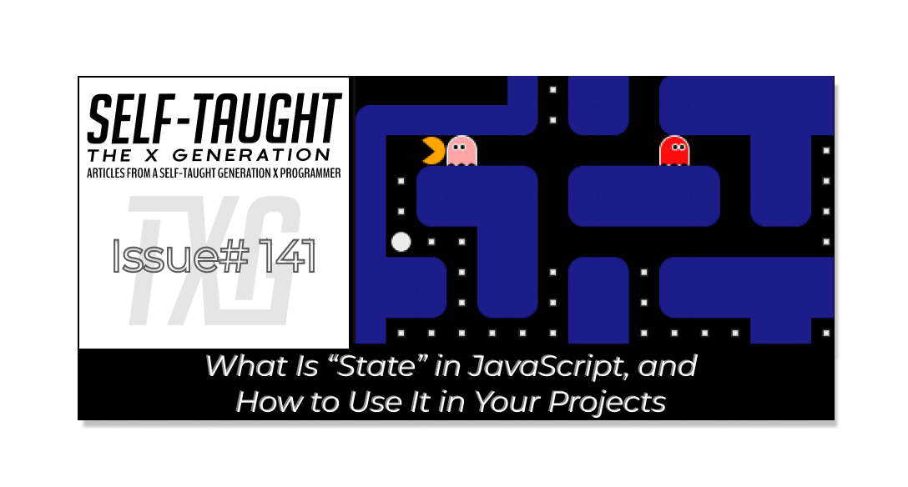

#### State in JavaScript refers to the underlying data that represents your application's current condition. This article covers how I implemented state in a real-world scenario, my Pac-Man game project!

---



---

### State in JavaScript

State in JavaScript refers to the underlying data that represents the current condition of your application or game. It tracks various aspects such as player position, scores, and elements on the board. In game development, maintaining a separate state array helps ensure that you always know the true status of the game board, regardless of what is visually displayed on the screen. This approach is advantageous when multiple elements can change a square simultaneously, as it provides a reliable way to manage game logic independently from the DOM.

---

### Why Is This a Valuable Coding Concept?

* **Separation of concerns:** Logic (state) is separate from presentation (DOM).
    
* **Predictability:** You always know the “truth” of your game.
    
* **Scalability:** This pattern works for more complex games and apps!
    

---


### JS Pac-Man Project Links:

* 🔗 [Link to the deployed projec](https://pac-man-javascript-laroccade.netlify.app/)t
    
* 🔗 [Link to GitHub](https://github.com/MichaelLarocca/pac-man-javascript-laroccade)
    
* 🔗 [Link to the sprint board](https://github.com/users/MichaelLarocca/projects/1)

###### *Disclaimer: Since I’m following team development practices and pushing updates to the develop branch, some of the changes I describe in this article may not be live in the deployed version of the game yet. If you try out the game and notice differences, it’s because new features and fixes are still being tested before release.*

---

### Managing Pellet Visibility and Ghost Interaction

**This article focuses on adding JavaScript state management for the pellets in my Pac-Man game project, for improved and more reliable gameplay.**

For my JavaScript Pac-Man game, CSS classes are used for the pellets. To create the visual effect of a pellet, I made the background of the 20×20px square white and transformed the scale to 0.2 the size of the square (it’s 10×10px on mobile view).

***Note:*** *Transform scale only affects how the content appears, not the div’s box size or position in the grid.*

```css
.pellet {
  background-color: whitesmoke;
  transform: scale(0.2);
}
```

When Pac-Man enters a div containing a pellet class, I remove it, and update the score and other logic accordingly, achieving the desired effect. However, using the transform scale to shrink the size of the pellet comes at a cost; it also shrinks anything else sharing the div to 0.2 of the original size! Since Pac-Man always eats the pellet, I avoid the shrinkage issue. But when the ghosts pass through the divs containing pellets, they shrink.

**My solution to the ghosts' shrinking due to using the CSS transform scale** **was to remove the pellet class when they entered the div and then return it when they left it. And it worked! Kind of. While playing the game, the ghosts were inconsistent in putting the pellet class back and added it to empty game cells where it did not belong.**

So, I devised a new approach: I would create a variable that held all of the information needed from the cell a ghost enters, and then use the variable’s information to put it back when the ghost exits it. I described my solution to GitHub CoPilot, expecting to be commended for my brilliant idea and then for CoPilot to assist me in implementing the code. Instead, CoPilot offered another solution and introduced me to state management in JavaScript, which is used for game development.

---

### State in My Project

I learned that “state” in JavaScript game development is used for tracking player position, scores, what’s on the board, and, in my case, pellets, among other things; previously, I thought state management was just for React and other frameworks.

**CoPilot explains that the DOM (your HTML elements and their classes) shows what’s on the screen, but it’s not always reliable for tracking game logic, especially in my case, when multiple things (like ghosts and Pac-Man) can change a square simultaneously. By maintaining a separate array (the “state array”) that contains what each square holds, we now always know the “truth” about the game board, regardless of what’s seen visually.**

---

### Implementing State Management

In my project, the `setGameBoard`function acts as an overlay to set up the Pac-Man game board. This blueprint for the game board contains numbers for different squares, like a wall, pellet, power pellet, empty space, or Pac-Man’s starting position. When setting up, the code iterates through each square, examines the overlay value, and adds the appropriate visual class.

I amended the `setGameBoard` function to include additional code that also updates the newly added `pelletState` array accordingly, when finding both pellets and power pellets.

**Inside the setGameBoard function, the code uses the pelletState array to track what each square on the board contains:**

* For each square, it checks the overlayArray to see if that square should have a power pellet (2), a regular pellet (3), or neither.
    
* If the square should have a power pellet, it sets pelletState\[i\] = 'powerPellet'.
    
* If the square should have a regular pellet, it sets pelletState\[i\] = 'pellet'.
    
* If the square should have neither, it sets pelletState\[i\] = null.
    

*Now, the pelletState array always holds the true state of every square—regardless of what’s currently visible on the screen.*

```javascript
export const pelletState = [];

export function setGameBoard() { 
  // ...additional setup code...

  for (let i = 0; i < squares.length; i++) {
    // ...remove classes, reset square...

    // Pellet state logic (only one of these will be true per square)
    if (overlayArray[i] === 2) {
      squares[i].classList.add('powerPellet');
      pelletState[i] = 'powerPellet'; // Track state
    } else if (overlayArray[i] === 3) {
      squares[i].classList.add('pellet');
      pelletState[i] = 'pellet'; // Track state
    } else {
      pelletState[i] = null; // Track state
    }

    // ...other board setup logic...
  }

  // ...ghost setup and other code...
}
```

---

### Updating Pellet State With Pac-Man

In the function that controls Pac-Man, I added code that updates the `pelletState` array right after the code that removes the pellet and power pellet classes when he eats them. Now, when Pac-Man eats a pellet or power pellet, the code not only removes the visual CSS class from the board, but also updates the `pelletState` array for that square. This ensures the game’s internal state always matches what’s actually on the board, making the logic more reliable.

```javascript
export function control(x) {
  // ...determine steps and movement logic...

  for (let i = 0; i < steps; i++) {
    // ...Pac-Man movement code...

    // Pellet state logic: update state when Pac-Man eats a pellet
    if (squares[pacmanCurrentIndex].classList.contains('pellet')) {
      playPacManEatingPelletsSound();
      squares[pacmanCurrentIndex].classList.remove('pellet');
      pelletState[pacmanCurrentIndex] = null; // Update state: pellet is now gone
      counterPelet += 1;
      score += 10;
    } else {
      stopPacManEatingPelletsSound();
    }

    // Pellet state logic: update state when Pac-Man eats a power pellet
    if (squares[pacmanCurrentIndex].classList.contains('powerPellet')) {
      squares[pacmanCurrentIndex].classList.remove('powerPellet');
      pelletState[pacmanCurrentIndex] = null; // Update state: power pellet is now gone
      score += 50;
      // ...power pellet effects...
    }

    // ...bonus fruit, score, and UI updates...
  }
}
```

---

### Updating Pellet State With Ghosts

When a ghost moves around the board, it passes over squares containing pellets and power pellets. The updated code checks the pellet state array every time a ghost moves to keep the game visuals and logic accurate. If the ghost is about to enter a square that should have a pellet or power pellet (according to the state array), it temporarily removes the visual pellet (CSS class) from that square so the ghost appears on top. But, since the ghosts never eat the pellets or power pellets, they always remain in the `pelletState` array.

Then, when the ghost leaves its previous square, the updated code checks the `pelletState` array again. If that square is supposed to have a pellet or power pellet, it restores the visual pellet (CSS class) so it reappears after the ghost has moved away. This way, the game always knows which squares actually have pellets, and the visuals stay in sync with the game’s internal state—even as ghosts move around the board, fixing the pellet misplacement caused by the ghosts’ glitch!

```javascript
export function moveGhost(ghost) {
  // ...setup and movement logic...

  ghost.timerId = setInterval(function() {
    // ...direction and movement checks...

    if (foundValid) {
      // ...eye direction logic...

      // Calculate next index
      const nextIndex = ghost.currentIndex + direction;

      // Pellet state logic: update pellet visuals based on state
      // Remove pellet/powerPellet class from the new square if needed
      if (pelletState[nextIndex] === 'pellet') {
        squares[nextIndex].classList.remove('pellet');
      }
      if (pelletState[nextIndex] === 'powerPellet') {
        squares[nextIndex].classList.remove('powerPellet');
      }

      // Restore pellet/powerPellet class to the previous square if needed
      squares[ghost.currentIndex].classList.remove('pellet', 'powerPellet');
      if (pelletState[ghost.currentIndex] === 'pellet') {
        squares[ghost.currentIndex].classList.add('pellet');
      }
      if (pelletState[ghost.currentIndex] === 'powerPellet') {
        squares[ghost.currentIndex].classList.add('powerPellet');
      }

      // ...move ghost, tunnel wrap, and add ghost to new square...
    }

    // ...scared state, collision, and other logic...
  }, ghost.speed);
}
```

---

### My other related articles

* [Ania Kubow: Building Tetris with JavaScript](https://selftaughttxg.com/2022/03-22/Ania_Kubow-Tetris/)
    
* [Mastering JavaScript Fundamentals: Unleashing Your Framework Readiness](https://www.htmlallthethings.com/blog-posts/mastering-javascript-fundamentals-unleashing-your-framework-readiness)
    
* [Mastering JavaScript: The Power of forEach and Ternary Operators](https://selftaughttxg.com/2025/08-25/mastering-javascript-the-power-of-foreach-and-ternary-operators/)
    
* [JavaScript: Understanding the Set and Clear Interval Methods](https://selftaughttxg.com/2025/06-25/javascript-understanding-the-set-and-clear-interval-methods/)
    

---


### **Be sure to listen to the HTML All The Things Podcast!**

#### 📝 *I also write articles for the HTML All The Things Podcast, which you can read on their website:* [*https://www.htmlallthethings.com/*](https://www.htmlallthethings.com/)*.*

#### **Be sure to check out HTML All The Things on socials!**

* [Twitter](https://twitter.com/htmleverything)
    
* [LinkedIn](https://www.linkedin.com/company/html-all-the-things/)
    
* [TikTok](https://www.tiktok.com/@htmlallthethings)
    
* [Instagram](https://www.instagram.com/htmlallthethings/)
    

---

### Affiliate & Discount Links!


**With CodeMonkey, learning can be all fun and games!** CodeMonkey transforms education into an engaging experience, enabling children to evolve from tech consumers to creators. Use CodeMonkey's **FREE trial** to unlock the incredible potential of young tech creators!

*With a structured learning path tailored for various age groups, kids progress from block coding to more advanced topics like data science and artificial intelligence, using languages such as CoffeeScript and Python. The platform includes features for parents and teachers to track progress, making integrating coding into home and classroom settings easy.*

Through fun games, hands-on projects, and community interaction, CodeMonkey helps young learners build teamwork skills and receive recognition for their achievements. It fosters a love for coding and prepares children for future career opportunities in an ever-evolving tech landscape.

***To learn more about CodeMonkey, you can read my detailed*** [***review article***](https://selftaughttxg.com/2025/02-25/inspiring-young-coders-how-codemonkey-turns-kids-into-tech-creators/)***!***

**Affiliate Links:**

* [Sign Up for Parents](https://codemonkey.sjv.io/c/5987452/919057/12259)
    
* [Sign Up for Teachers](https://codemonkey.sjv.io/c/5987452/919060/12259)

---


### Advance your career with a 20% discount on Scrimba Pro using this [affiliate link](https://scrimba.com/?via=MichaelLarocca)!

Become a hireable developer with Scrimba Pro! Discover a world of coding knowledge with full access to all courses, hands-on projects, and a vibrant community. You can [read my article](https://selftaughttxg.com/2021/06-21/06-07-21/) to learn more about my exceptional experiences with Scrimba and how it helps many become confident, well-prepared web developers!

###### ***Important:*** *This discount is for new accounts only. If a higher discount is currently available, it will be applied automatically.*

**How to Claim Your Discount:**

1. Click [the link](https://scrimba.com/?via=MichaelLarocca) to explore the new Scrimba 2.0.
    
2. Create a new account.
    
3. Upgrade to Pro; the 20% discount will automatically apply.
    

##### ***Disclosure:*** *This article contains affiliate links. I will earn a commission from any purchases made through these links at no extra cost to you. Your support helps me continue creating valuable content. Thank you!*

---

### Conclusion

State in JavaScript is data that represents the current condition of your program. In games like the Pac-Man game I am working on, state is often used to track player position, scores, and what’s on the board, among other things. Unlike React, where state is managed with hooks or class properties, in plain JavaScript, state is used in variables, arrays, or objects.

Before implementing state in my project, I relied on the DOM for my game logic, which proved unstable. Specifically, when Pac-Man and the ghosts enter a div containing a pellet, I use JavaScript’s contains() method to check if it has a pellet class and then handle the logic. Since changing my approach to handling the logic using state, my game has become much more stable, and I intend to continue refactoring my code to use state throughout the project.

The state management approach provides your project and games with a single source of truth. While the DOM merely displays what's happening on the screen, the actual data resides in your state. By using state management for your logic instead of relying on the visual DOM, you can significantly enhance the stability and performance of your games!

---

**Let’s connect! I’m active on** [**LinkedIn**](https://www.linkedin.com/in/michaeljudelarocca/) **and** [**Twitter**](https://twitter.com/MikeJudeLarocca).


---

###### *Have you gained a better understanding of state management in JavaScript games? Are you ready to implement these techniques in your own projects? Please share the article and comment!*

---
