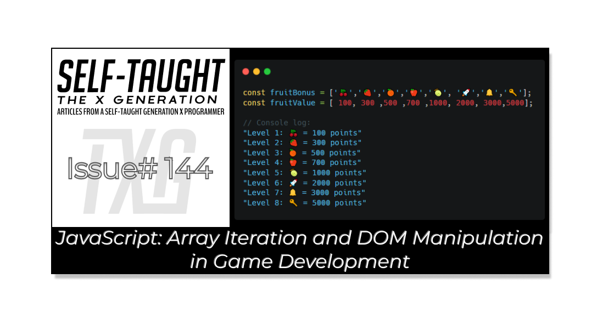

#### This article explores JavaScript array iteration and DOM manipulation, including practical game development examples. You will also learn a game-state sync technique to enhance your own projects!

---



---

### Array Iteration

What is array iteration? Array iteration is the process of sequentially accessing each element in an array to perform operations or calculations. This technique is essential in JavaScript for efficiently managing and manipulating data stored in arrays, such as updating game states or displaying information.

**In my JavaScript Pac-Man game, I store information in arrays and iterate through them for my game logic to carry out various tasks. For example, the fruit bonus that appears twice per level utilizes an emoji and a matching point value based on the level.**

*For a simple demonstration, the code block below shows an iteration over the* ***fruitBonus*** *array: The console logs the corresponding emoji along with the point value stored in the* ***fruitBonusValue*** *array.*

```javascript
// Arrays store fruit icons and their bonus values for each level
export const fruitBonus = ['🍒','🍓','🍊','🍊','🍎','🍎','🍈','🍈','🚀','🔔','🔑'];
export const fruitBonusValue = [100,300,500,500,700,700,1000,1000,2000,3000,5000];

// Example: Display all fruit bonuses and their values
for (let i = 0; i < fruitBonus.length; i++) {
  console.log(`Level ${i + 1}: ${fruitBonus[i]} = ${fruitBonusValue[i]} points`);
}

// Console log:
"Level 1: 🍒 = 100 points"
"Level 2: 🍓 = 300 points"
"Level 3: 🍊 = 500 points"
"Level 4: 🍊 = 500 points"
"Level 5: 🍎 = 700 points"
"Level 6: 🍎 = 700 points"
"Level 7: 🍈 = 1000 points"
"Level 8: 🍈 = 1000 points"
"Level 9: 🚀 = 2000 points"
"Level 10: 🔔 = 3000 points"
"Level 11: 🔑 = 5000 points"
```

**(The actual game logic is more complex but follows the same iterative approach.)**

---

### Array Iteration and DOM Manipulation

The Document Object Model (DOM) is a programming interface for web documents, representing the page structure as a tree of objects. With JavaScript, you can manipulate the DOM to dynamically alter a webpage's content, structure, and style, enabling you to build interactive and responsive user experiences.

The main functionality of game level completion in my project is for Pac-Man to eat all the pellets on the game board. I initially handled this by checking if Pac-Man’s current index also had a CSS pellet class, using the JavaScript [includes method](https://developer.mozilla.org/en-US/docs/Web/JavaScript/Reference/Global_Objects/Array/includes). However, this approach proved unreliable for tracking game progress. To solve this, I created a dedicated [pelletState](https://selftaughttxg.com/2025/09-25/what-is-state-in-javascript-and-how-to-use-it-in-your-projects/) array to track the state of each pellet throughout the game.

Now with the **pelletState** array, I can properly track the status of every pellet and power pellet on the board, regardless of visual glitches or overlapping game elements. This ensures that Pac-Man’s progress, level completion, and scoring are always accurate, and the game logic remains in sync with what the player sees.

However, a new glitch emerged: ghosts occasionally removed CSS pellet classes while traversing through the gameboard, preventing level completion because the corresponding pellets remained in the **pelletState** array. It was a pretty funny glitch because the ghosts would eventually return the pellets when they passed by the divs they took them from, as if they were cheating me out of finishing the level! 👻

*As part of my pelletState array solution, the CSS pellet classes are temporarily removed from a square when a ghost enters and restored when the ghost leaves. The pellet’s state, however, is always tracked in the array, ensuring consistent game logic regardless of visual changes. This approach is necessary due to CSS scaling; ghosts visually shrink to the size of the pellet when sharing a square, so managing the classes separately prevents display issues.*

---

### Syncing Game State and DOM with Array Iteration

I created a `syncPelletClasses` function to keep the **pelletState** array and pellet CSS classes in sync, running it every time the board state changes. This function, syncPelletClasses(), iterates through the pelletState array and updates the DOM for each square: if a pellet or power pellet is present in the array and no ghost is on that square, the corresponding CSS class is added; if a ghost is present, the class is removed. This keeps the visuals accurate without affecting the underlying game logic.

*By separating the visual state (CSS classes) from the game state (the array), I ensured that pellets are never “lost” due to ghost movement or display quirks. Pac-Man’s progress and level completion are now reliably tracked, and the game remains arcade-authentic—even when ghosts and pellets overlap.*

```javascript
export function syncPelletClasses() {
  for (let i = 0; i < pelletState.length; i++) {
    // Only add pellet class if no ghost is present
    if (pelletState[i] === 'pellet' && !squares[i].classList.contains('ghost')) {
      squares[i].classList.add('pellet');
    } else {
      squares[i].classList.remove('pellet');
    }
    if (pelletState[i] === 'powerPellet' && !squares[i].classList.contains('ghost')) {
      squares[i].classList.add('powerPellet');
    } else {
      squares[i].classList.remove('powerPellet');
    }
  }
}
```

💡 **Tip:** *By utilizing this game-state sync technique, you can build more reliable, visually accurate games and interactive apps. Try applying array-driven state management in your own projects for smoother, bug-free experiences!*

---

### JS Pac-Man Project Links:

🔗 [Link to the deployed project](https://pac-man-javascript-laroccade.netlify.app/)

🔗 [Link to GitHub](https://github.com/MichaelLarocca/pac-man-javascript-laroccade)

🔗 [Link to the sprint board](https://github.com/users/MichaelLarocca/projects/1)

##### ***Note:*** *Since I’m following team development practices and pushing updates to the develop branch, some of the changes I describe in this article may not be live in the deployed version of the game yet.*


---

### My other related articles

* [JavaScript Game Timing: How Independent Intervals Can Cause Missed Collisions](https://selftaughttxg.com/2025/10-25/javascript-game-timing-how-independent-intervals-can-cause-missed-collisions/)
    
* [CSS Pseudo-Elements: Enhance Your Projects with Style!](https://selftaughttxg.com/2025/09-25/css-pseudo-elements-enhance-your-projects-with-style/)
    
* [What Is “State” in JavaScript, and How to Use It in Your Projects](https://selftaughttxg.com/2025/09-25/what-is-state-in-javascript-and-how-to-use-it-in-your-projects/)
    
* [Ania Kubow: Building Tetris with JavaScript](https://selftaughttxg.com/2022/03-22/Ania_Kubow-Tetris/)
    
* [Mastering JavaScript: The Power of forEach and Ternary Operators](https://selftaughttxg.com/2025/08-25/mastering-javascript-the-power-of-foreach-and-ternary-operators/)
    
* [JavaScript: Understanding the Set and Clear Interval Methods](https://selftaughttxg.com/2025/06-25/javascript-understanding-the-set-and-clear-interval-methods/)
    

---


### **Be sure to listen to the HTML All The Things Podcast!**

#### 📝 *I also write articles for the HTML All The Things Podcast, which you can read on their website:* [*https://www.htmlallthethings.com/*](https://www.htmlallthethings.com/)*.*

#### **Be sure to check out HTML All The Things on socials!**

* [Twitter](https://twitter.com/htmleverything)
    
* [LinkedIn](https://www.linkedin.com/company/html-all-the-things/)
    
* [TikTok](https://www.tiktok.com/@htmlallthethings)
    
* [Instagram](https://www.instagram.com/htmlallthethings/)
    

---

### Affiliate & Discount Links!


**With CodeMonkey, learning can be all fun and games!** CodeMonkey transforms education into an engaging experience, enabling children to evolve from tech consumers to creators. Use CodeMonkey's **FREE trial** to unlock the incredible potential of young tech creators!

*With a structured learning path tailored for various age groups, kids progress from block coding to more advanced topics like data science and artificial intelligence, using languages such as CoffeeScript and Python. The platform includes features for parents and teachers to track progress, making integrating coding into home and classroom settings easy.*

Through fun games, hands-on projects, and community interaction, CodeMonkey helps young learners build teamwork skills and receive recognition for their achievements. It fosters a love for coding and prepares children for future career opportunities in an ever-evolving tech landscape.

***To learn more about CodeMonkey, you can read my detailed*** [***review article***](https://selftaughttxg.com/2025/02-25/inspiring-young-coders-how-codemonkey-turns-kids-into-tech-creators/)***!***

**Affiliate Links:**

* [Sign Up for Parents](https://codemonkey.sjv.io/c/5987452/919057/12259)
    
* [Sign Up for Teachers](https://codemonkey.sjv.io/c/5987452/919060/12259)
    

---


### Advance your career with a 20% discount on Scrimba Pro using this [affiliate link](https://scrimba.com/?via=MichaelLarocca)!

Become a hireable developer with Scrimba Pro! Discover a world of coding knowledge with full access to all courses, hands-on projects, and a vibrant community. You can [read my article](https://selftaughttxg.com/2021/06-21/06-07-21/) to learn more about my exceptional experiences with Scrimba and how it helps many become confident, well-prepared web developers!

###### ***Important:*** *This discount is for new accounts only. If a higher discount is currently available, it will be applied automatically.*

**How to Claim Your Discount:**

1. Click [the link](https://scrimba.com/?via=MichaelLarocca) to explore the new Scrimba 2.0.
    
2. Create a new account.
    
3. Upgrade to Pro; the 20% discount will automatically apply.
    

##### ***Disclosure:*** *This article contains affiliate links. I will earn a commission from any purchases made through these links at no extra cost to you. Your support helps me continue creating valuable content. Thank you!*

---

### Conclusion

Array iteration lets you efficiently access and update each element in a collection, making it a foundation for managing dynamic data in JavaScript. The Document Object Model (DOM) is a programming interface representing a webpage's structure as a tree of objects, which, in JavaScript, allows for dynamic modification of content, structure, and style for interactive experiences.

Using array iteration for DOM manipulation, I solved glitches in my game using array-driven state management: I used a syncPelletClasses function to align the pelletState array with the DOM, updating visuals based on game state changes. This solution ensured that the game logic always matched what players saw on screen and what was accessible to the code.

If you’re building interactive apps or games, try leveraging array-driven state management and DOM syncing techniques to help create smoother, more reliable user experiences!

---

**Let’s connect! I’m active on** [**LinkedIn**](https://www.linkedin.com/in/michaeljudelarocca/) **and** [**Twitter**](https://twitter.com/MikeJudeLarocca).


---

###### *Do you now have a better understanding of JavaScript array iteration and DOM manipulation? Are you ready to use these techniques to improve your own projects? Please share the article and comment!*

---
