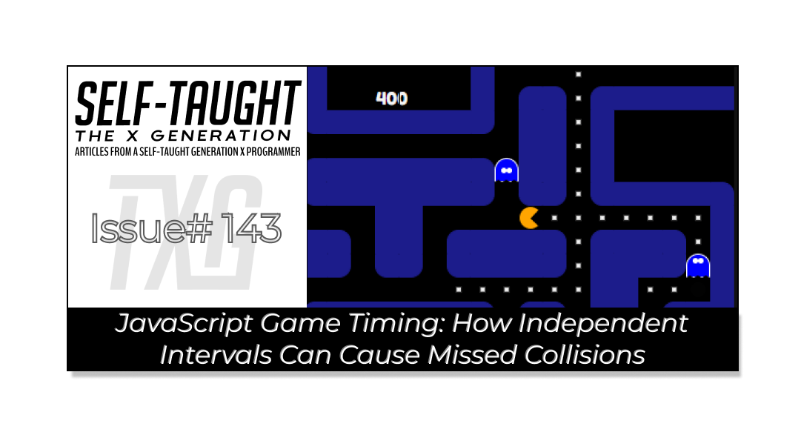

#### This article covers crossed-path collision detection, a common issue caused by independent timing intervals in grid-based games, and how I implemented a new solution for my JavaScript Pac-Man project!

---



---

### Using setInterval in JavaScript Games

The JavaScript [setInterval](https://developer.mozilla.org/en-US/docs/Web/API/Window/setInterval) method is a useful tool for executing actions repeatedly at specific time intervals. It’s commonly used in games to animate movement, update game logic, and create a sense of real-time action.

For example, in my Pac-Man project, I use setInterval to move Pac-Man and each ghost independently. By calling the movement functions at regular intervals, the game simulates continuous motion and enables dynamic interactions between characters.

```javascript
// Move Pac-Man every pacManSpeed milliseconds
let speedStartPacMan = setInterval(control, pacManSpeed);

// Move each ghost at its own speed
ghosts.forEach(ghost => moveGhost(ghost));
```

This approach makes it easy to control how fast each character moves and to update the game state in real time. However, using separate intervals for different entities can also introduce timing challenges, especially when detecting collisions.

---

### Collisions Detection Problems

My JavaScript game project originally used DOM classes to detect collisions between Pac-Man and the ghosts; when a single div contained a Pac-Man class and a ghost class, there was a collision. However, this programming approach proved to be unreliable.

I improved the game’s collision detection by alternatively using state management: comparing Pac-Man's current index to the ghost’s current index. But there were still missed collisions.

**The underlying missed collision issue was due to separate timing intervals for Pac-Man and the individual ghosts. Although the state management approach worked, Pac-Man and the ghosts would enter and exit the same div, resulting in missed collisions due to timing. The solution was adding an extra collision check: tracking previous positions and checking for crossed-path collisions.**

**Pac-Man and the ghosts run with separate intervals:**

```javascript
function setPacManSpeed() {
  let speedStartPacMan = setInterval(control, pacManSpeed);  
}

export function moveGhost(ghost) {
// ...existing code...
    ghost.timerId = setInterval(function() {
// ...existing code...
}, ghost.speed);
```

---

### Crossed Paths Collision Detection

What I learned: In grid-based games like Pac-Man, entities often move on separate timers, which can lead to subtle collision detection problems. One such issue is the **crossed-paths collision**.

**What is a crossed-paths collision?**  
*This occurs when two entities move into each other’s previous positions in the same tick, effectively “passing through” each other. Without tracking previous positions, this collision can be missed.*

To solve this, I enhanced my collision detection by introducing new variables to track Pac-Man's and each ghost's previous positions. By comparing both current and previous index values, I can now reliably detect crossed-path collisions.

**Pac-Man and the ghosts' previous index are now also compared for crossed-path collision detection:**

---

```javascript
export function checkForGhostCatchesPacMan() {
  ghosts.forEach(ghost => {
    // Direct collision
    if (ghost.currentIndex === pacmanCurrentIndex) {
      // Handle collision...
    }
    // Crossed-paths collision
    else if (
      ghost.currentIndex === pacmanPreviousIndex &&
      ghost.previousIndex === pacmanCurrentIndex
    ) {
      // Handle collision...
    }
  });
}
```

---

### Game Engines

Game engines, such as Phaser, MelonJS, or Babylon.js, are another option for JavaScript game development. These engines provide built-in collision detection systems and many other features that make game development faster and more reliable. Soon, I plan to learn [Phaser](https://phaser.io/) to explore how professional engines handle movement, collisions, and game logic!

---

### Final Thoughts

For anyone developing games in JavaScript, using state management—particularly by comparing both current and previous positions of your game entities—is a reliable method for robust collision detection. Tracking these variables allows you to accurately identify not only direct collisions but also cases where entities cross paths within the same tick, which is a common challenge when using separate intervals for movement. This approach helps ensure your collision logic functions smoothly, even in fast-paced or grid-based games!

---

### JS Pac-Man Project Links:

🔗 [Link to the deployed project](https://pac-man-javascript-laroccade.netlify.app/)

🔗 [Link to GitHub](https://github.com/MichaelLarocca/pac-man-javascript-laroccade)

🔗 [Link to the sprint board](https://github.com/users/MichaelLarocca/projects/1)

##### ***Note:*** *Since I’m following team development practices and pushing updates to the develop branch, some of the changes I describe in this article may not be live in the deployed version of the game yet.*


---

### My other related articles

* [CSS Pseudo-Elements: Enhance Your Projects with Style!](https://selftaughttxg.com/2025/09-25/css-pseudo-elements-enhance-your-projects-with-style/)
    
* [What Is “State” in JavaScript, and How to Use It in Your Projects](https://selftaughttxg.com/2025/09-25/what-is-state-in-javascript-and-how-to-use-it-in-your-projects/)
    
* [Ania Kubow: Building Tetris with JavaScript](https://selftaughttxg.com/2022/03-22/Ania_Kubow-Tetris/)
    
* [Mastering JavaScript: The Power of forEach and Ternary Operators](https://selftaughttxg.com/2025/08-25/mastering-javascript-the-power-of-foreach-and-ternary-operators/)
    
* [JavaScript: Understanding the Set and Clear Interval Methods](https://selftaughttxg.com/2025/06-25/javascript-understanding-the-set-and-clear-interval-methods/)
    

---


### **Be sure to listen to the HTML All The Things Podcast!**

#### 📝 *I also write articles for the HTML All The Things Podcast, which you can read on their website:* [*https://www.htmlallthethings.com/*](https://www.htmlallthethings.com/)*.*

#### **Be sure to check out HTML All The Things on socials!**

* [Twitter](https://twitter.com/htmleverything)
    
* [LinkedIn](https://www.linkedin.com/company/html-all-the-things/)
    
* [TikTok](https://www.tiktok.com/@htmlallthethings)
    
* [Instagram](https://www.instagram.com/htmlallthethings/)
    

---

### Affiliate & Discount Links!


**With CodeMonkey, learning can be all fun and games!** CodeMonkey transforms education into an engaging experience, enabling children to evolve from tech consumers to creators. Use CodeMonkey's **FREE trial** to unlock the incredible potential of young tech creators!

*With a structured learning path tailored for various age groups, kids progress from block coding to more advanced topics like data science and artificial intelligence, using languages such as CoffeeScript and Python. The platform includes features for parents and teachers to track progress, making integrating coding into home and classroom settings easy.*

Through fun games, hands-on projects, and community interaction, CodeMonkey helps young learners build teamwork skills and receive recognition for their achievements. It fosters a love for coding and prepares children for future career opportunities in an ever-evolving tech landscape.

***To learn more about CodeMonkey, you can read my detailed*** [***review article***](https://selftaughttxg.com/2025/02-25/inspiring-young-coders-how-codemonkey-turns-kids-into-tech-creators/)***!***

**Affiliate Links:**

* [Sign Up for Parents](https://codemonkey.sjv.io/c/5987452/919057/12259)
    
* [Sign Up for Teachers](https://codemonkey.sjv.io/c/5987452/919060/12259)
    

---


### Advance your career with a 20% discount on Scrimba Pro using this [affiliate link](https://scrimba.com/?via=MichaelLarocca)!

Become a hireable developer with Scrimba Pro! Discover a world of coding knowledge with full access to all courses, hands-on projects, and a vibrant community. You can [read my article](https://selftaughttxg.com/2021/06-21/06-07-21/) to learn more about my exceptional experiences with Scrimba and how it helps many become confident, well-prepared web developers!

###### ***Important:*** *This discount is for new accounts only. If a higher discount is currently available, it will be applied automatically.*

**How to Claim Your Discount:**

1. Click [the link](https://scrimba.com/?via=MichaelLarocca) to explore the new Scrimba 2.0.
    
2. Create a new account.
    
3. Upgrade to Pro; the 20% discount will automatically apply.
    

##### ***Disclosure:*** *This article contains affiliate links. I will earn a commission from any purchases made through these links at no extra cost to you. Your support helps me continue creating valuable content. Thank you!*

---

### Conclusion

Solid collision detection is crucial when developing JavaScript games, and admittedly, quite tricky to accomplish. My first attempt was using the DOM (CSS classes) to detect collisions, but it proved to be too unreliable. Next, I refactored my code to detect collisions using state management (comparing indexes), which worked better but still missed collisions. It turns out the issue I was having was due to the individual game character timings (Pac-Man and the ghosts), a common problem known as crossed-path collisions.

Crossed-path collisions occur when entities move into each other's previous positions during the same update, often missed when using separate movement intervals. I was able to finally detect crossed-path collisions by adding an additional check: tracking Pac-Man's and each ghost's previous positions.

For JavaScript game developers, using state management to compare both current and previous positions of game entities is a dependable way to detect collisions. This approach reliably identifies direct hits and cases where entities cross paths in the same tick, ensuring accurate collision detection even in fast-paced or grid-based games!

---

**Let’s connect! I’m active on** [**LinkedIn**](https://www.linkedin.com/in/michaeljudelarocca/) **and** [**Twitter**](https://twitter.com/MikeJudeLarocca).


---

###### *Are you now confident in implementing robust collision detection in JavaScript games? Have you encountered other timing or state management challenges in your own projects? Please share the article and comment!*

---
