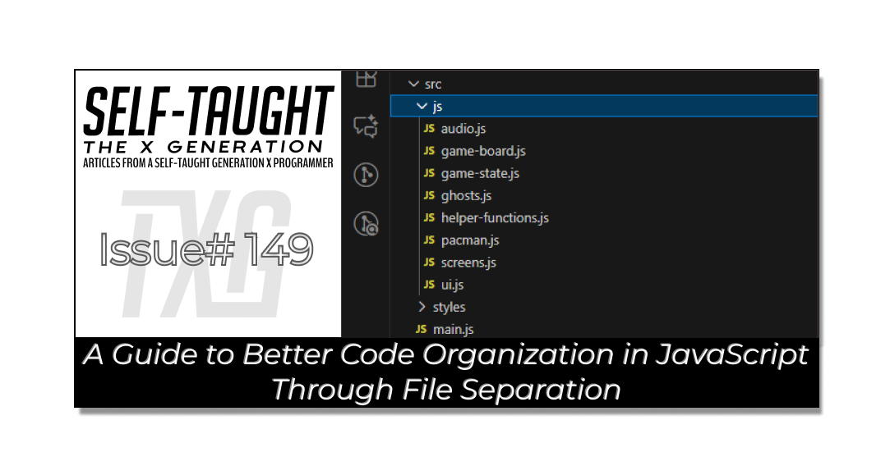
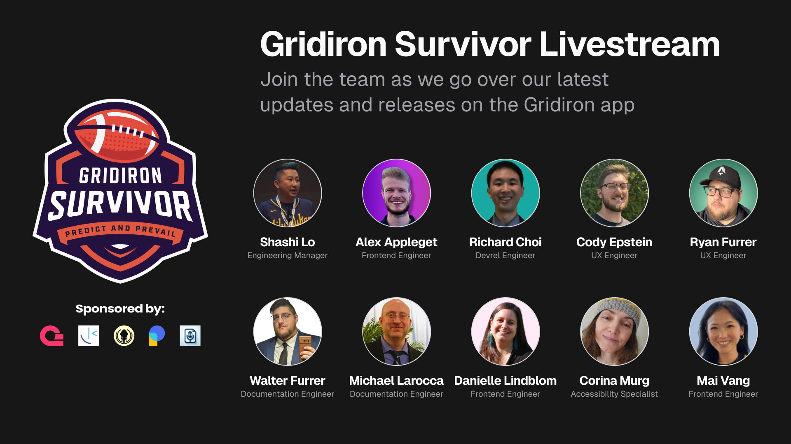

#### This article explores the fundamental concept of file separation in JavaScript projects, emphasizing how organizing code into separate files enhances structure, readability, and maintainability!

---

---

### Code Organization Through File Separation

When learning to code, if you’re like me, your primary focus is getting the code to work. This will likely result in a single, huge JavaScript file by the time you are finished. Once your project works, you may be tempted to leave it as is; why fix it if it’s not broken, right?

**When you are ready to take your coding skills to a hireable level, it’s best to learn how to code like a pro! One aspect of professional web development is file separation. File separation involves organizing your code into multiple smaller files, each responsible for a specific part of your project, making it easier to manage, understand, and maintain.**

But how exactly do you break down your project into separate files? Let me share with you how I am doing it with my JavaScript Pac-Man game project, with the help of AI!

---

### GitHub Copilot in VS Code

If you're using Visual Studio Code as your code editor, you can enhance it with an AI tool called GitHub Copilot by installing it as an extension. This tool helps you write code more quickly by suggesting lines or blocks of code as you type, enhancing efficiency and reducing errors. The Pro version includes a chat feature, allowing for interactive assistance and real-time explanations.

**I frequently use the GitHub Copilot chat feature while coding. It not only assists with code review but also acts as a tireless senior developer you can consult for questions! I’ve benefited from asking Copilot how to reorganize my project like the pros do, and I believe YOU will gain the same benefits while building your projects with the help of AI, too!**

---

### GitHub Copilot in VS Code

If you're using Visual Studio Code as your code editor, you can enhance it with an AI tool called GitHub Copilot by installing it as an extension. This tool helps you write code more quickly by suggesting lines or blocks of code as you type, enhancing efficiency and reducing errors.

GitHub Copilot also offers an interactive chat feature, [GitHub Copilot Chat](https://docs.github.com/en/copilot/how-tos/chat-with-copilot), which is available to Copilot subscribers. This chat allows you to ask questions, receive real-time explanations, and get help with code review, refactoring, and debugging, all right inside VS Code.

**I frequently use GitHub Copilot Chat while coding. It not only assists with code review but also acts as a tireless senior developer you can consult for questions! I’ve benefited from asking Copilot how to reorganize my project like the pros do, and I believe YOU will gain the same benefits while building your projects with the help of AI, too!**

---

### Refactoring The Main JS File

As I mentioned earlier, since I was focused on getting my Pac-Man game to work, I ended up with a large main JavaScript file. I successfully separated this large main file into individual files for audio and helper functions; however, most of the game control code still mistakenly resided in my helper file.

I asked GitHub Copilot to review my project and explain how a professional developer would reorganize JavaScript files in a game like mine. I was told that the main JS file should stay in the root of the src folder, and the rest can be split into separate JavaScript files inside a js folder.

**In my particular project, I was able to refactor my JavaScript files as follows:**

* **audio.js:** Handles all sound and music logic for the game, including loading, playing, stopping, and switching between audio tracks and effects.
    
* **game-board.js:** Manages the setup, rendering, and state of the game board/grid, including board-specific arrays and functions for creating or resetting the board.
    
* **game-state.js:** Centralizes the overall game state, such as score, lives, level, and other global variables or functions that track the current status of the game.
    
* **ghosts.js:** Contains all logic related to ghost characters, including their movement, AI behavior, state management, and collision detection with Pac-Man.
    
* **helper-functions.js:** Stores pure, stateless utility functions that can be reused throughout the project and are not tied to any specific game feature or module.
    
* **pacman.js:** Handles all logic specific to Pac-Man, such as movement, state, collision detection, and interactions with other game elements.
    
* **screens.js:** Manages the display and logic for various game screens, such as the title screen, score screen, and attract mode overlays, as well as related UI effects.
    
* **ui.js:** Contains general UI logic and DOM queries, including updating on-screen elements, handling theme toggles, and managing non-gameplay user interface interactions.
    

---

### JS Refactoring Process

**I wish I could say that refactoring your main JavaScript file into several separate files is easy, but it can be a challenging task. It is best to approach it by first refactoring the least amount of code, starting with the smallest files. After completing each file refactor, thoroughly test it and make a git commit. This approach allows you to refactor incrementally, providing a save point to revert to if necessary.**

*Problems I encountered were related to my CSS layouts breaking when I combined UI logic and DOM queries into a single file. Apparently, I mistakenly declared the same variables in different files, which caused duplicate declarations in my new, consolidated UI file. I’m really surprised the code worked as expected before I attempted to separate it! However, my first attempt at fixing my duplicated variables ended up breaking my game's CSS layout. I then used git restore and took my time during the second attempt, testing as I went, to make sure I correctly refactored my code into the new UI JavaScript file.*

---

### Benefits of File Separation

Separating files in JavaScript projects offers several key advantages, especially for newer, junior developers. One benefit is that it improves the structure and clarity of your code, making it easier to navigate and understand. This approach also enhances maintainability by allowing you to update or fix specific parts without affecting the entire project. Additionally, it simplifies teamwork because members can work on different files simultaneously, which reduces merge conflicts. Moreover, dividing code into files encourages reuse (DRY: "do not repeat yourself") across your project. Overall, it helps you write cleaner, more organized code and prepares you for larger, professional projects.

---

### Other Ways to Learn about File Separation

So, where else can you learn how to separate your project’s JavaScript files? GitHub Copilot and other AI alternatives include exploring open-source projects, engaging with developer communities, and seeking code reviews from peers or mentors. These practices can offer valuable feedback on file organization and best practices, helping new coders refine their skills and adopt industry standards.

*Alongside using AI as a senior engineer coach, I am gaining valuable real-world team experience as part of Microsoft Senior UX Engineer Shashi Lo’s* [*Gridiron Survivor apprenticeship program*](https://www.htmlallthethings.com/blog-posts/bridging-the-skills-gap-empowering-junior-developers-through-apprenticeship-programs)*! This program provides hands-on experience and mentorship, enabling developers to acquire practical skills. It effectively bridges the gap between theory and practice, ensuring developers become proficient in teamwork, Agile practices, version control, code reviews, testing, and client communication, ultimately making it easier for them to secure their first job. As team members of this program are “hired off the team,“ positions open up for new members. Be sure to follow our journey and reach out to Shashi Lo via DM on* [*LinkedIn*](https://linkedin.com/in/shashilo) *or* [*X*](https://twitter.com/shashiwhocodes) *to inquire about joining!*

---

### JS Pac-Man Project Links:

🔗 [Link to the deployed project](https://pac-man-javascript-laroccade.netlify.app/)

🔗 [Link to GitHub](https://github.com/MichaelLarocca/pac-man-javascript-laroccade)

🔗 [Link to the sprint board](https://github.com/users/MichaelLarocca/projects/1)

##### ***Note:*** *Since I’m following team development practices and pushing updates to the develop branch, some of the changes I describe in this article may not be live in the deployed version of the game yet.*

---

### My other related articles

* [A Guide to Better Code Organization in React through File Separation](https://selftaughttxg.com/2024/01-24/a-guide-to-better-code-organization-in-react-through-file-separation/)
    
* [JavaScript: Array Iteration and DOM Manipulation in Game Development](https://selftaughttxg.com/2025/10-25/javascript-array-iteration-and-dom-manipulation-in-game-development/)
    
* [JavaScript Game Timing: How Independent Intervals Can Cause Missed Collisions](https://selftaughttxg.com/2025/10-25/javascript-game-timing-how-independent-intervals-can-cause-missed-collisions/)
    
* [What Is “State” in JavaScript, and How to Use It in Your Projects](https://selftaughttxg.com/2025/09-25/what-is-state-in-javascript-and-how-to-use-it-in-your-projects/)
    
* [Mastering JavaScript: The Power of forEach and Ternary Operators](https://selftaughttxg.com/2025/08-25/mastering-javascript-the-power-of-foreach-and-ternary-operators/)
    
* [JavaScript: Understanding the Set and Clear Interval Methods](https://selftaughttxg.com/2025/06-25/javascript-understanding-the-set-and-clear-interval-methods/)
    
* [Bridging the Skills Gap: Empowering Junior Developers Through Apprenticeship Programs](https://www.htmlallthethings.com/blog-posts/bridging-the-skills-gap-empowering-junior-developers-through-apprenticeship-programs)
    

---

### **Be sure to listen to the HTML All The Things Podcast!**

#### 📝 *I also write articles for the HTML All The Things Podcast, which you can read on their website:* [*https://www.htmlallthethings.com/*](https://www.htmlallthethings.com/)*.*

#### **Be sure to check out HTML All The Things on socials!**

* [Twitter](https://twitter.com/htmleverything)
    
* [LinkedIn](https://www.linkedin.com/company/html-all-the-things/)
    
* [TikTok](https://www.tiktok.com/@htmlallthethings)
    
* [Instagram](https://www.instagram.com/htmlallthethings/)
    

---

### Affiliate & Discount Links!

**With CodeMonkey, learning can be all fun and games!** CodeMonkey transforms education into an engaging experience, enabling children to evolve from tech consumers to creators. Use CodeMonkey's **FREE trial** to unlock the incredible potential of young tech creators!

*With a structured learning path tailored for various age groups, kids progress from block coding to more advanced topics like data science and artificial intelligence, using languages such as CoffeeScript and Python. The platform includes features for parents and teachers to track progress, making integrating coding into home and classroom settings easy.*

Through fun games, hands-on projects, and community interaction, CodeMonkey helps young learners build teamwork skills and receive recognition for their achievements. It fosters a love for coding and prepares children for future career opportunities in an ever-evolving tech landscape.

***To learn more about CodeMonkey, you can read my detailed*** [***review article***](https://selftaughttxg.com/2025/02-25/inspiring-young-coders-how-codemonkey-turns-kids-into-tech-creators/)***!***

**Affiliate Links:**

* [Sign Up for Parents](https://codemonkey.sjv.io/c/5987452/919057/12259)
    
* [Sign Up for Teachers](https://codemonkey.sjv.io/c/5987452/919060/12259)
    

---

### Advance your career with a 20% discount on Scrimba Pro using this [affiliate link](https://scrimba.com/?via=MichaelLarocca)!

Become a hireable developer with Scrimba Pro! Discover a world of coding knowledge with full access to all courses, hands-on projects, and a vibrant community. You can [read my article](https://selftaughttxg.com/2021/06-21/06-07-21/) to learn more about my exceptional experiences with Scrimba and how it helps many become confident, well-prepared web developers!

###### ***Important:*** *This discount is for new accounts only. If a higher discount is currently available, it will be applied automatically.*

**How to Claim Your Discount:**

1. Click [the link](https://scrimba.com/?via=MichaelLarocca) to explore the new Scrimba 2.0.
    
2. Create a new account.
    
3. Upgrade to Pro; the 20% discount will automatically apply.
    

##### ***Disclosure:*** *This article contains affiliate links. I will earn a commission from any purchases made through these links at no extra cost to you. Your support helps me continue creating valuable content. Thank you!*

---

### Conclusion

Organizing JavaScript code into separate files improves your project's structure, readability, and maintainability. Mastering this skill is essential for becoming a hireable developer, as it guarantees clean, efficient codebases in professional environments. It also conforms to industry standards, allowing teams to work on different files simultaneously, reducing merge conflicts, and boosting collaboration.

Refactoring a single JavaScript file into separate files can be a challenging task. It is best to start with small refactorings, such as creating separate files for DOM queries and audio files, as I did in my Pac-Man game project. Also, be sure to test and commit your work frequently, so you have points to revert to if problematic issues arise.

A good start for learning how to refactor a main JavaScript file into separate files is with AI assistance. GitHub Copilot Chat, a VS Code extension, can help you analyze your project and provide feedback on how to refactor like a pro! Additionally, you can explore open-source projects, participate in developer communities, and ask for code reviews from peers or mentors to gain valuable insights and feedback on best practices for file organization and refactoring. So don’t hesitate or be shy, give refactoring a try!

---

**Let’s connect! I’m active on** [**LinkedIn**](https://www.linkedin.com/in/michaeljudelarocca/) **and** [**Twitter**](https://twitter.com/MikeJudeLarocca).

---

###### *Do you now feel more confident in organizing your JavaScript code through file separation? Have you started implementing these techniques in your own projects? Please share the article and comment*

---
