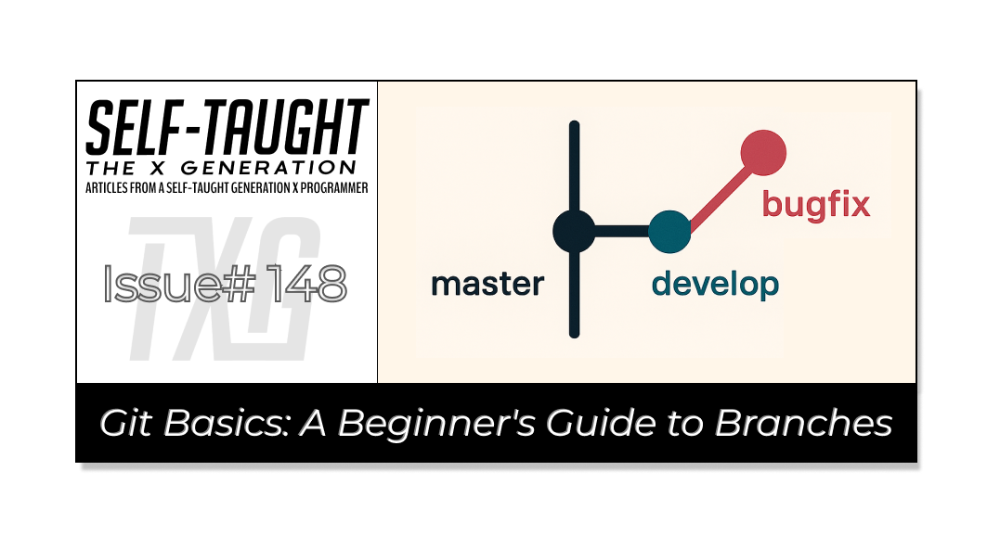

#### This article explores Git branches and their role in version control. You'll learn about team practices of creating, merging, and managing branches, gaining essential skills for collaborative projects!

---

---

### What is Version Control?

Version control is a system that helps track changes to files over time. It allows multiple people to collaborate on a project, keeping a history of modifications, so you can revert to previous versions if needed. This is especially useful in software development, where teams collaborate on code, ensuring everyone is on the same page and changes are managed efficiently.

---

### What are Git Branches?

In the context of version control, Git branches are like separate workspaces within a project. They allow you to work on different features or fixes without affecting the main codebase. Each branch can be developed independently, and once the work is complete, it can be merged back into the main branch. This system enables teams to collaborate efficiently, allowing multiple people to work on different tasks simultaneously without interfering with each other's work.

---

### Merge Develop into the Master Branch

When working alone, you'll likely build your projects directly on the default master (main) branch. Even when you start to create individual branches, they will be made from the master branch and be merged back into it. However, when working on a team project, there is usually a development (develop) branch in addition to the master branch, and it is vital to understand how to work with them.

*In my recent experience, when implementing a professional Agile workflow in my personal project, I finally understood the concept of having both a develop and master branch. Now that I was creating individual branches for each of my issues, each time I pushed to the default master branch, a deployment was triggered (though Netlify). So I initially thought, “Why am I bothering to make new branches, since I am not working in isolation?” Then I realized that is precisely what the develop branch is for. The purpose of the develop branch is to serve as an integration branch for features before they are ready for production.*

**In a team-based environment, once you have finished working on your individual issue branch, push and merge it into the develop branch (not the master branch). When all the individual issue branches are merged into the develop branch, yours and presumably those of fellow team members, it is the “develop branch” that gets merged into the “master branch,” which will then trigger a deployment if configured to do so. The master branch is typically the production-ready branch, which is why merging into it triggers deployment.**

By following this workflow, you and other team members can confidently work on your own individual branches, contributing to the project simultaneously. Then, when all of the branches are accepted and merged into the develop branch, the team’s work will be deployed to the project once the develop branch is merged into the master branch.

**💡 Note:** *When working on issue branches, it is essential to follow a team-based Agile workflow, which includes testing and code review to ensure quality before merging them into the develop branch.*

---

### Make Your Issue Branch from Develop

As I am sure you know, it's crucial to pull all changes from the remote branches first to ensure all files are updated with the latest versions. If you've been working alone for a long time, it might take some time to get used to pulling changes first.

When working on a team project, you'll need to create branches to address individual issues. Generally, these issue branches are created from the develop branch rather than the master branch. So, be sure that you clarify with your team which branch to use as the base for your issue branches.

**💡 Note:** *To maintain consistency and avoid conflicts, it's essential to pull changes from both the master and develop branches regularly. This practice ensures that your branch is synchronized with the latest updates from the main codebase and the develop branch. By doing so, you minimize the risk of merge conflicts and ensure a smoother integration process when your work is ready to be merged back into the main branches.*

---

### Agile Development

Having covered the overall concept of working with branches, it's important to note that there are specific conventions and workflows for creating them. These conventions are often guided by Agile development principles, which emphasize flexibility, collaboration, and iterative progress in software projects —principles that my team follows.

*Members of the* [*Gridiron Survivor apprenticeship program*](https://www.htmlallthethings.com/blog-posts/bridging-the-skills-gap-empowering-junior-developers-through-apprenticeship-programs)*, of which I am a part, work on individual issue branches of our current project,* [*Elfgorithm*](https://github.com/LetsGetTechnical/elecretanta)*, a* [*Secret Santa-style gift exchange app*](https://elfgorithm.vercel.app/)*. We use naming conventions for the branches and organize our work into Sprints, which are time-boxed periods during which specific tasks or features are developed. Each individual issue branch undergoes review and testing to ensure quality and functionality.*

The naming conventions we use for branches include the programmer’s name, issue number, type (the kind of work), and a short description of the branch’s purpose:

**\[YourName\]/\[IssueNumber\]-\[type\]-\[IssueDescription\]**

Using naming conventions for branches enhances project organization and efficiency, allowing branches to be quickly identified and facilitating collaboration.

These conventions also improve Git automation. Scripts can recognize branch patterns to trigger actions, such as tests or notifications, resulting in reduced manual effort and ensuring consistency. Linking Sprint ticket numbers to issue branches connects the code to project management tools, simplifying progress tracking and aligning work with tasks.

Overall, structured naming conventions improve organization, communication, and workflow efficiency in software development.

---

### Deleting with an Individual Issue Branch

Once your individual issue branch is accepted and merged into the develop, it is then safe to delete it. GitHub provides a “Delete Branch“ button for easy removal on the remote repository. You will also need to delete your issue branch in your local repository.

Once your issue branch is deleted from both the remote and local repositories, remember to pull the changes from the master and the newly merged develop branch. This ensures your local repository is up-to-date with the latest changes. Afterward, you can use `git fetch --prune` to clean up your local repository by removing any remote-tracking references that no longer exist on the remote.

---

### Merge Conflicts

Dealing with merge conflicts deserves its own article, but it’s important to understand, so I will provide a brief overview.

A merge conflict occurs when Git is unable to resolve differences in code between two branches automatically. This typically happens when two team members make changes to the same part of a file. For example, imagine two team members both update the README file and change the same line. Git doesn't know which change to keep, so it flags this as a conflict.

**To fix a merge conflict, you'll need to manually review the conflicting changes and decide which version to keep. Here's a simple way to handle it:**

1. **Identify the Conflict**: When you try to merge, Git will notify you of the conflict and mark the conflicting areas in the file. You'll see markers like `<<<<<<<`, `=======`, and `>>>>>>>` indicating the different changes.
    
2. **Resolve the Conflict**: Open the file in a text editor and look for these markers. Decide which changes to keep or if you need to combine them. Remove the markers and ensure the file appears as you want it to.
    
3. **Mark as Resolved**: Once you've resolved the conflict, save the file and use `git add <file>` to mark it as resolved.
    
4. **Complete the Merge**: Finally, commit the changes with `git commit` to complete the merge process.
    

By understanding and resolving merge conflicts, you ensure that your team's work is integrated smoothly and accurately!

---

### About Us

#### What is Gridiron Survivor?

[*Gridiron Survivor*](https://www.htmlallthethings.com/blog-posts/bridging-the-skills-gap-empowering-junior-developers-through-apprenticeship-programs) *is an apprenticeship program created by Shashi Lo, a Senior UX Engineer at Microsoft. It aims to provide developers entering the tech industry with vital work experience. The program focuses on practical training in project management, coding practices, and team collaboration, offering mentorship and skills essential for success in their initial tech roles.*

#### What is the Elfgorithm App?

[*Elfgorithm*](https://github.com/LetsGetTechnical/elecretanta) *is an AI-driven Secret Santa app set to launch in winter 2025. It streamlines gift exchanges by removing the guesswork from Secret Santa activities. The app manages gift-giving details and provides personalized gift suggestions, ensuring you find the perfect presents for everyone.*

### Gridiron Survivor Sponsors

**A very special thanks to our sponsors!**

* [GitKraken](https://www.gitkraken.com/): *A popular Git client that provides a graphical interface to manage Git repositories. It is known for its user-friendly design and features that simplify version control, making it easier for developers to collaborate and manage their code.*
    
* [Frontend Mentor](https://www.frontendmentor.io/): *An online platform that offers front-end coding challenges. It helps developers improve their skills by providing real-world projects to work on, along with a supportive community for feedback and learning.*
    
* [Vercel](https://vercel.com/): *A cloud platform for static sites and serverless functions. It is designed to optimize the workflow of developers by providing tools for building, deploying, and scaling modern web applications with ease. Vercel is known for its seamless integration with frameworks like Next.js.*
    

---

### My other related articles

* [Git Basics: A Beginner's Guide to Naming Conventions](https://selftaughttxg.com/2025/11-25/git-basics-a-beginners-guide-to-naming-conventions/)
    
* [Sprint Workflow: A Beginner's Guide to Agile Development](https://selftaughttxg.com/2025/10-25/sprint-workflow-a-beginners-guide-to-agile-development/)
    
* [Bridging the Skills Gap: Empowering Junior Developers Through Apprenticeship Programs](https://www.htmlallthethings.com/blog-posts/bridging-the-skills-gap-empowering-junior-developers-through-apprenticeship-programs)
    
* [Gridiron Survivor's Elfgorithm: Introduction and Team Installation](https://selftaughttxg.com/2025/04-25/gridiron-survivor's-elfgorithm-introduction-and-team-installation/)
    
* [Software Versioning: A Developer's Guide to Semantic and GitHub Releases](https://selftaughttxg.com/2025/05-25/software-versioning-a-developers-guide-to-semantic-and-github-releases/)
    
* [Creating Cohesive Design Systems with Atomic Design Principles](https://selftaughttxg.com/2025/05-25/creating-cohesive-design-systems-with-atomic-design-principles/)
    

---

### **Be sure to listen to the HTML All The Things Podcast!**

#### 📝 *I also write articles for the HTML All The Things Podcast, which you can read on their website:* [*https://www.htmlallthethings.com/*](https://www.htmlallthethings.com/)*.*

#### **Be sure to check out HTML All The Things on socials!**

* [Twitter](https://twitter.com/htmleverything)
    
* [LinkedIn](https://www.linkedin.com/company/html-all-the-things/)
    
* [TikTok](https://www.tiktok.com/@htmlallthethings)
    
* [Instagram](https://www.instagram.com/htmlallthethings/)
    

---

### Affiliate & Discount Links!

**With CodeMonkey, learning can be all fun and games!** CodeMonkey transforms education into an engaging experience, enabling children to evolve from tech consumers to creators. Use CodeMonkey's **FREE trial** to unlock the incredible potential of young tech creators!

*With a structured learning path tailored for various age groups, kids progress from block coding to more advanced topics like data science and artificial intelligence, using languages such as CoffeeScript and Python. The platform includes features for parents and teachers to track progress, making integrating coding into home and classroom settings easy.*

Through fun games, hands-on projects, and community interaction, CodeMonkey helps young learners build teamwork skills and receive recognition for their achievements. It fosters a love for coding and prepares children for future career opportunities in an ever-evolving tech landscape.

***To learn more about CodeMonkey, you can read my detailed*** [***review article***](https://selftaughttxg.com/2025/02-25/inspiring-young-coders-how-codemonkey-turns-kids-into-tech-creators/)***!***

**Affiliate Links:**

* [Sign Up for Parents](https://codemonkey.sjv.io/c/5987452/919057/12259)
    
* [Sign Up for Teachers](https://codemonkey.sjv.io/c/5987452/919060/12259)
    

---

### Advance your career with a 20% discount on Scrimba Pro using this [affiliate link](https://scrimba.com/?via=MichaelLarocca)!

Become a hireable developer with Scrimba Pro! Discover a world of coding knowledge with full access to all courses, hands-on projects, and a vibrant community. You can [read my article](https://selftaughttxg.com/2021/06-21/06-07-21/) to learn more about my exceptional experiences with Scrimba and how it helps many become confident, well-prepared web developers!

###### ***Important:*** *This discount is for new accounts only. If a higher discount is currently available, it will be applied automatically.*

**How to Claim Your Discount:**

1. Click [the link](https://scrimba.com/?via=MichaelLarocca) to explore the new Scrimba 2.0.
    
2. Create a new account.
    
3. Upgrade to Pro; the 20% discount will automatically apply.
    

##### ***Disclosure:*** *This article contains affiliate links. I will earn a commission from any purchases made through these links at no extra cost to you. Your support helps me continue creating valuable content. Thank you!*

---

### Conclusion

Version control is a system that tracks changes to files over time, enabling multiple people to collaborate on a project and revert to previous versions if necessary. In development, branches provide separate workspaces within a project, enabling the independent development of features or fixes without affecting the main codebase. In a team project, there are typically both a development branch and a master branch. The team works on the development branch, which is eventually merged into the master branch.

Individual issue branches are created from the development branch. Once a team member completes an issue branch, it undergoes review and testing as part of Agile development practices before being merged back into the development branch. These issue branches are deleted from both the remote and local repositories after they are merged to maintain a clean codebase.

When working with a team, merge conflicts happen when multiple developers change the same part of a file in different branches. You need to manually resolve these conflicts by reviewing the changes, deciding which ones to keep, and removing the conflict markers. Handling merge conflicts effectively is crucial for maintaining a smooth workflow and ensuring the accurate integration of team members' work.

Practicing is the best way to learn! Even if you're working solo, you can apply Agile workflows to your personal projects by creating, merging, and managing branches. This approach will help you develop marketable skills as you learn and implement Agile workflows!

---

**Let’s connect! I’m active on** [**LinkedIn**](https://www.linkedin.com/in/michaeljudelarocca/) **and** [**Twitter**](https://twitter.com/MikeJudeLarocca).

---

###### *Are you now confident in managing Git branches for collaborative projects? Do you have other tips for handling merge conflicts effectively? Please share the article and comment*

---
