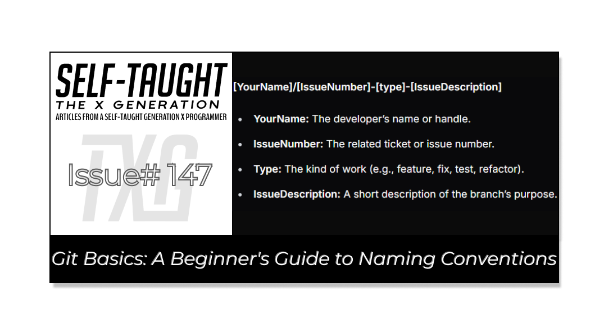
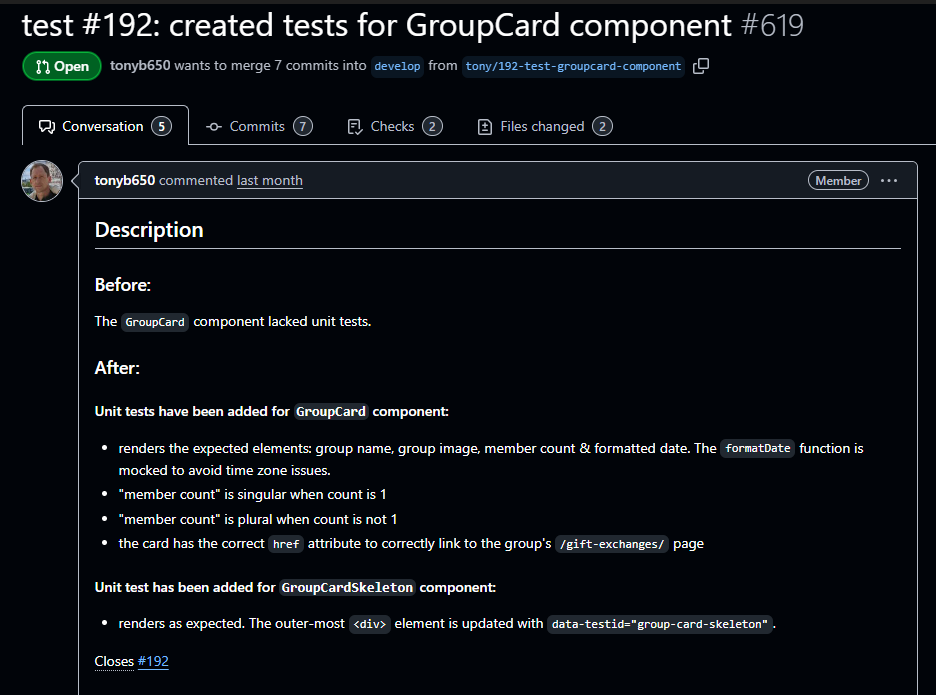
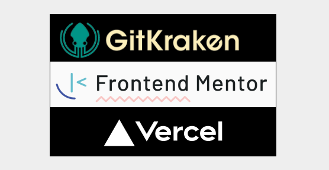
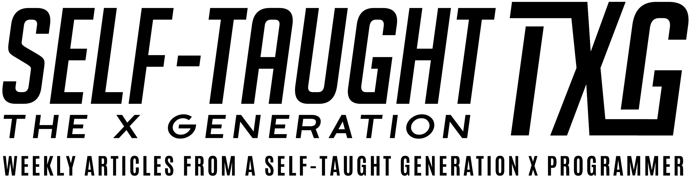

#### This article discusses Git branch naming conventions, their importance, and how to create clear, organized branches that enhance teamwork and streamline automation in your team's development workflow!

---

---

### What Are Conventional Branches?

First, let’s clarify what Git is. Git is a version control system that helps developers track changes, collaborate, and manage different versions of their code.

A branch in Git is a separate line of development that allows you to work on new features or fixes without affecting the main codebase.

A conventional branch is a branch naming pattern that follows a specific format, such as `feature/login-page` or `fix/bug-123`. Using naming conventions is important, especially for team projects, because it helps everyone understand the purpose of each branch at a glance.

**Benefits of Conventional Branches:**

* **Consistency:** Ensures all branches follow the same structure, making the project easier to navigate.
    
* **Ticket Automation:** Allows integration with issue trackers, so branches can be linked to specific tickets automatically.
    
* **Changelog Generation:** Helps tools generate changelogs by identifying the type of work (feature, fix, etc.) from branch names.
    
* **Auto Version Notes:** Enables automated release notes by categorizing changes based on branch naming patterns.
    
* **Improved Collaboration:** Makes it easier for team members to understand the purpose of each branch and coordinate work.
    
* **Simplified Code Reviews:** Reviewers can quickly identify the context and scope of changes based on branch names.
    
* **Reduced Merge Conflicts:** Clear branch organization helps prevent overlapping work and reduces the risk of merge conflicts.
    

---

### Our Team’s Naming Convention

When working with different teams, each will have its own naming conventions, so make sure to learn and follow them. Our team uses a conventional branch name format that includes *your name*, the *issue number*, the *type*, and a brief *issue description*:

**\[YourName\]/\[IssueNumber\]-\[type\]-\[IssueDescription\]**

* **YourName:** The developer’s name or handle.
    
* **IssueNumber:** The related ticket or issue number.
    
* **Type:** The kind of work (e.g., feature, fix, test, refactor).
    
* **IssueDescription:** A short description of the branch’s purpose.
    

**Example:**  
Here is a branch created by team member Tony to write tests for a “Group Card” component for issue #192:

`tony/192-test-groupcard-component`

---

###### ***Note:*** *In the screenshot, the extra number (#619) at the end of the commit message indicates the pull request (PR) or merge request number linked to the branch or commit, aiding teams in tracking both the original issue and the PR that fixed it.*

---

### **Common Type Prefixes**

**Here are common Git branch prefixes in a bullet point list, along with their meanings:**

* **feat** or **feature**: Used when developing new features or adding new functionality to the project.
    
* **bugfix** or **fix**: Used for fixing bugs or resolving issues in the codebase.
    
* **hotfix**: Reserved for urgent, critical bug fixes that need to be deployed to production immediately.
    
* **release**: Used when preparing a new production release, allowing for final testing, packaging, and last-minute fixes.
    
* **chore**: For routine maintenance tasks that don’t affect the source code or tests, such as updating dependencies, build scripts, or configuration files.
    
* **docs**: For changes to documentation, including updates to README files, wikis, or inline code comments.
    
* **refactor**: Used when restructuring or cleaning up code without changing its external behavior or adding new features.
    
* **test**: For adding, updating, or improving tests to ensure code quality and reliability.
    
* **style**: For changes related to code formatting, whitespace, or style guidelines, without affecting functionality.
    
* **perf**: Used for changes that improve the performance or efficiency of the codebase.
    

---

### Version Updates With Conventional Branches

Using conventional branch names makes version updates more organized and transparent. When you follow a naming pattern, tools like GitHub can automatically generate changelogs and release notes based on your merged branches. This helps your team track what was added, fixed, or changed in each version.

Conventional branches also make it easier to link commits to specific issues, ensuring that every update is documented and easy to review during releases!

💡 **Pro Tip:** *Conventional branch naming can also support CI/CD pipelines. For example, automated tests or deployments can be triggered based on branch names, allowing teams to streamline workflows and maintain quality throughout the development process.*

---

### About Us

#### What is Gridiron Survivor?

[*Gridiron Survivor*](https://www.htmlallthethings.com/blog-posts/bridging-the-skills-gap-empowering-junior-developers-through-apprenticeship-programs) *is an apprenticeship program created by Shashi Lo, a Senior UX Engineer at Microsoft. It aims to provide developers entering the tech industry with vital work experience. The program focuses on practical training in project management, coding practices, and team collaboration, offering mentorship and skills essential for success in their initial tech roles.*

#### What is the Elfgorithm App?

[*Elfgorithm*](https://github.com/LetsGetTechnical/elecretanta) *is an AI-driven Secret Santa app set to launch in winter 2025. It streamlines gift exchanges by removing the guesswork from Secret Santa activities. The app manages gift-giving details and provides personalized gift suggestions, ensuring you find the perfect presents for everyone.*

### Gridiron Survivor Sponsors

**A very special thanks to our sponsors!**

* [GitKraken](https://www.gitkraken.com/): *A popular Git client that provides a graphical interface to manage Git repositories. It is known for its user-friendly design and features that simplify version control, making it easier for developers to collaborate and manage their code.*
    
* [Frontend Mentor](https://www.frontendmentor.io/): *An online platform that offers front-end coding challenges. It helps developers improve their skills by providing real-world projects to work on, along with a supportive community for feedback and learning.*
    
* [Vercel](https://vercel.com/): *A cloud platform for static sites and serverless functions. It is designed to optimize the workflow of developers by providing tools for building, deploying, and scaling modern web applications with ease. Vercel is known for its seamless integration with frameworks like Next.js.*
    

---

### My other related articles

* [Sprint Workflow: A Beginner's Guide to Agile Development](https://selftaughttxg.com/2025/10-25/sprint-workflow-a-beginners-guide-to-agile-development/)
    
* [Bridging the Skills Gap: Empowering Junior Developers Through Apprenticeship Programs](https://www.htmlallthethings.com/blog-posts/bridging-the-skills-gap-empowering-junior-developers-through-apprenticeship-programs)
    
* [Gridiron Survivor's Elfgorithm: Introduction and Team Installation](https://selftaughttxg.com/2025/04-25/gridiron-survivor's-elfgorithm-introduction-and-team-installation/)
    
* [Software Versioning: A Developer's Guide to Semantic and GitHub Releases](https://selftaughttxg.com/2025/05-25/software-versioning-a-developers-guide-to-semantic-and-github-releases/)
    
* [Creating Cohesive Design Systems with Atomic Design Principles](https://selftaughttxg.com/2025/05-25/creating-cohesive-design-systems-with-atomic-design-principles/)
    

---

### **Be sure to listen to the HTML All The Things Podcast!**

#### 📝 *I also write articles for the HTML All The Things Podcast, which you can read on their website:* [*https://www.htmlallthethings.com/*](https://www.htmlallthethings.com/)*.*

#### **Be sure to check out HTML All The Things on socials!**

* [Twitter](https://twitter.com/htmleverything)
    
* [LinkedIn](https://www.linkedin.com/company/html-all-the-things/)
    
* [TikTok](https://www.tiktok.com/@htmlallthethings)
    
* [Instagram](https://www.instagram.com/htmlallthethings/)
    

---

### Affiliate & Discount Links!

**With CodeMonkey, learning can be all fun and games!** CodeMonkey transforms education into an engaging experience, enabling children to evolve from tech consumers to creators. Use CodeMonkey's **FREE trial** to unlock the incredible potential of young tech creators!

*With a structured learning path tailored for various age groups, kids progress from block coding to more advanced topics like data science and artificial intelligence, using languages such as CoffeeScript and Python. The platform includes features for parents and teachers to track progress, making integrating coding into home and classroom settings easy.*

Through fun games, hands-on projects, and community interaction, CodeMonkey helps young learners build teamwork skills and receive recognition for their achievements. It fosters a love for coding and prepares children for future career opportunities in an ever-evolving tech landscape.

***To learn more about CodeMonkey, you can read my detailed*** [***review article***](https://selftaughttxg.com/2025/02-25/inspiring-young-coders-how-codemonkey-turns-kids-into-tech-creators/)***!***

**Affiliate Links:**

* [Sign Up for Parents](https://codemonkey.sjv.io/c/5987452/919057/12259)
    
* [Sign Up for Teachers](https://codemonkey.sjv.io/c/5987452/919060/12259)
    

---

### Advance your career with a 20% discount on Scrimba Pro using this [affiliate link](https://scrimba.com/?via=MichaelLarocca)!

Become a hireable developer with Scrimba Pro! Discover a world of coding knowledge with full access to all courses, hands-on projects, and a vibrant community. You can [read my article](https://selftaughttxg.com/2021/06-21/06-07-21/) to learn more about my exceptional experiences with Scrimba and how it helps many become confident, well-prepared web developers!

###### ***Important:*** *This discount is for new accounts only. If a higher discount is currently available, it will be applied automatically.*

**How to Claim Your Discount:**

1. Click [the link](https://scrimba.com/?via=MichaelLarocca) to explore the new Scrimba 2.0.
    
2. Create a new account.
    
3. Upgrade to Pro; the 20% discount will automatically apply.
    

##### ***Disclosure:*** *This article contains affiliate links. I will earn a commission from any purchases made through these links at no extra cost to you. Your support helps me continue creating valuable content. Thank you!*

---

### Conclusion

Git is a version control system used by teams to track changes and manage code versions. A branch is a separate development line that each team member creates to add features or fixes without affecting the main code. Following a conventional branch naming pattern is essential when making branches for several reasons.

The benefits of using conventional branches include ensuring consistency across the project, facilitating ticket automation by linking branches to specific issues, and aiding in changelog generation by identifying the type of work from branch names. Additionally, it enables automated release notes, improves collaboration by clarifying the purpose of each branch, simplifies code reviews by providing context, and reduces merge conflicts by organizing branches clearly to prevent overlapping work.

When working with different teams, each will likely have its own naming conventions, so be sure to learn and follow them and help your fellow team members understand them as well. Doing so will establish you as a valuable team player!

---

**Let’s connect! I’m active on** [**LinkedIn**](https://www.linkedin.com/in/michaeljudelarocca/) **and** [**Twitter**](https://twitter.com/MikeJudeLarocca).

---

###### *Do you now feel confident in using conventional branch naming patterns in Git? Have you already enhanced your team's workflow with these practices? Please share the article and comment*
