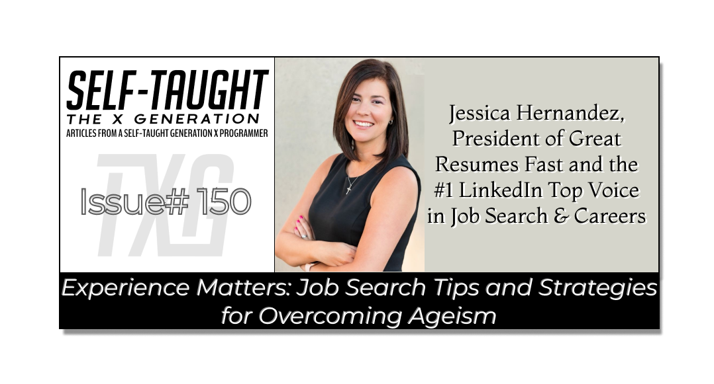

#### Struggling with age bias in your job hunt? Jessica Hernandez shares resume and job-search optimization tips to help experienced professionals stand out, get more callbacks, and land more interviews!

---

---

### Discovering Strategies to Overcome Ageism

I recently had the pleasure of attending an insightful LinkedIn Live event hosted by career coach Jessica Hernandez that addressed the important issue of avoiding ageism in a job search.

Jessica shared practical resume strategies and actionable job search guidance tailored for older professionals in the [replayable session](https://www.youtube.com/watch?v=mWjghb9T-QY).

Since I just entered my 50s and am interested in a career change into the tech industry, this event piqued my interest, and I must say, in a short 30-minute presentation, there was a lot of valuable optimization advice and tips that can really give older job seekers a competitive advantage, further assisting in securing a new job. After the presentation, Jessica took extra time to answer questions and offer further support to attendees, so it's worth watching.

**If you’re an older job seeker, applying these resume and job search strategies can help you shift the focus to your true strengths, while eliminating age-related red flags. Applying these strategies can result in a noticeable increase in callbacks and job opportunities!**

---

### What is Ageism

I’ll be bold enough to call it the way I personally see it: ageism is discrimination. The more socially acceptable definition is “treating someone unfairly because of their age.” Define it as you will, ageism often leads to missed opportunities, biased hiring decisions, and unjust assumptions about a person’s abilities.

To underscore the impact of ageism in the job market, Jessica notes that researchers sent out thousands of identical resumes with the same skills, experience, and qualifications. The only difference: half of the resumes included dates signalling the candidates were older, while the other half suggested younger applicants. The results were striking. Applicants aged 40–49 had a 38% lower callback rate, and those aged 50+ had a 62% lower rate. In other words, even highly qualified older job seekers received fewer callbacks simply because of age-related signals on their resumes.

*Jessica points out that ageism remains one of the most widely accepted and least legally protected forms of discrimination in the workplace. While statistics may fluctuate over time, age bias is here to stay, continually affecting older job seekers. That’s why the strategies and tips provided here will continue to be relevant.*

---

### Making Your Resume and Job Search Work for You

The goal isn’t to hide your age, but to showcase the impact, value, and experience you offer, while removing unnecessary “age-related signals.” With a few simple updates to your resume and job search strategy (which we’ll cover next), you can unlock more opportunities!

---

### Resume Tips

**Before you start applying, it’s important to make sure your resume is truly working for you. The tips in the following section will help you refresh your resume, avoid common age-related signals, and present your experience in the best possible light, increasing your chances of landing interviews.**

### Trim your timeline

When listing your job experience, focus on the most recent 10 to 15 years, since these roles are typically the most relevant to your current job search. If you want to highlight/showcase earlier positions, you can create a separate 'Earlier Career Experience' section; just be sure to skip the dates and emphasize achievements rather than job titles alone. Summarize your impact in each role, and remember to omit specific years (like 1990 to 1995).

### Lead with Your Value

Don’t start your resume summary with the number of years you’ve worked (e.g., “25 years of experience”), as this can draw attention to your age. Instead, lead with your value: focus on who you are and what you deliver right now. For example: “Operations Director who cuts costs by x% and increases delivery speed by x%.” This simple shift changes the narrative from your age to your strengths, accomplishments, and results.

### Modernize Your Education

Remove specific dates from your education section; just list your degree and school (e.g., Bachelor of Arts in English, George Washington University). The exception is if you’ve recently earned a credential that’s directly relevant to your current job search; in that case, you can include the date, as it can work in your favor.

### Remove Outdated Technology

If you’ve been working at a company for a long time using outdated technology, remove it from your resume.

*I can personally relate to this, as I’ve been extensively utilizing Microsoft VBA (Visual Basic for Applications) at my current company for over 20 years. Although the custom software I created remains in active use today, VBA is increasingly viewed as a legacy technology.*

Once you’ve removed outdated technology from your resume, be sure to add current tools and skills you use. Jessica notes that including AI skills can increase your callback and interview rates by over 30%, since AI is highly sought after by employers.

### Update Resume Fonts

Refrain from using fonts that have been around for an exceptionally long time, such as Times New Roman and Garamond. These fonts can make your resume look dated and may give the impression that your skills or experience are outdated as well. Instead, choose a modern, easy-to-read font like Calibri, Arial, or Helvetica to help your resume stand out and look current and professional.

### Remove Outdated Email Addresses

Another helpful tip is to update any outdated email addresses, like AOL or Hotmail, since these can send age signals to employers. Switching to a newer address, such as Gmail or Outlook, helps your resume look more current. Plus, creating a separate email just for your job search can make it easier to keep track of applications and responses.

***Additional tip:*** *Remove the parentheses from your phone number, which were introduced with early area codes and can be a subtle age giveaway. Just use dashes and drop the one as follows: 555-123-4567.*

---

<iframe width="990" height="557" src="https://www.youtube.com/embed/mWjghb9T-QY"></iframe>

---

### Job Search Strategies

Once you’ve revised your resume to remove unnecessary age-related signal flags, the next step is to approach your job search strategically. The tips in the following section will help you identify companies that value your experience, make the most of your broader network, and confidently address any age-related concerns, increasing your chances of finding the right fit and landing your next role.

### Target Companies That Value Your Experience

Jessica advises seeking employment with companies that value your years of experience as an asset, rather than those that see them as a liability.

In the current job market, Fortune 500 companies, including FAANG (Facebook, Apple, Amazon, Netflix, Google), are downsizing, leading to mass layoffs. However, small companies (1,000 employees or fewer) are increasing their hiring. So, targeting smaller companies, such as tech startups, can increase your chances of being hired.

**Jessica also notes that small companies often value older, experienced employees because they can get up to speed quickly, provide valuable insights, and help train younger staff, all in a cost-efficient manner.**

*Another tip is to research companies to see if they have a diverse staff, including older workers in leadership positions. This can be a good sign that the company values experience and could be a great fit for you.*

### Use Your Non-Professional Network

In addition to your professional network, use your non-professional network (personal friends/contacts) when job-seeking. Jessica refers to these people as “natural connectors,“ preferably on the extrovert spectrum, who can help spread the word about your search and connect you with people who can help you get hired. These people can include outgoing friends, church acquaintances, fellow parents from school clubs, or even local workers at places you frequent, like coffee shops.

*The goal is to have people mention your name in rooms where you aren’t present, which can organically increase your job opportunities. Jessica recalls a personal win with this tactic when her husband acted as a natural connector, securing her a job offer and bypassing the entire interview process. It’s a great example of how natural connectors can help speed up the hiring process!*

### Ageism Myth Busters

Jessica advises you to address any potential objections employers might have before they even arise, whether in your cover letter or during an interview. By doing this proactively, you increase your chances of moving forward in the hiring process.

**Potential age-related objections may include:**

* You’re overqualified.
    
* We are looking for someone more junior.
    
* We’re not sure you would be a good culture fit
    
* We’re worried you would be bored in this role.
    
* Older workers are incapable or unwilling to learn new technologies
    

**You can combat age-related objections by preparing a counterargument for each potential concern and tailoring your responses to your personal situation, since these will vary for each job seeker. Make sure your answers are authentic and reflect your true experiences.**

Jessica provides the following possible counterarguments for demonstration. For “you’re overqualified,” you might detail that you’re at a stage in your life where your work/life balance and contributing to a stable company matter more than career advancement. You want to use your expertise to help the company achieve its goals while mentoring the next generation. You can also offer somthing like “I know you might be wondering if someone with my experience would be satisfied here. Let me share why this role is exactly what I’m looking for.” Then, list several reasons why that role is what you are looking for.

Further tips Jessica provides: If you are making a downshift in you carreer, be ready to articulate why. If you are close to retirement age, you can talk about your 5 to 10-year vision, which shows you plan to continue working. You can share specific job role aspects that excite you, talk about how you will contribute without overstepping, your commitment to the role ( you don’t view the role as a stepping stone ), and you look forward to staying there, as opposed to working somewhere else.

**Finally, it’s time to challenge the outdated belief that older workers can’t or won’t learn new technologies. Jessica suggests highlighting specific ways you’ve embraced and adapted to new technologies, such as:**

* **Recent certifications:** List any up-to-date certifications or courses you’ve completed to show your commitment to ongoing learning.
    
* **Tools you’ve mastered:** Mention new software, platforms, or technical tools you’ve become proficient with, demonstrating your ability to adapt.
    
* **How you implemented new systems:** Share examples of times you introduced or helped your team adopt new technologies, processes, or systems at work.
    

---

*I’ll conclude by sharing my advice as a self-taught web developer transitioning into tech: don’t be stubborn!*

*Although past technologies may have served you well, new technologies will continue to emerge in the future. To stay relevant, you must have a growth mindset and continually adapt.*

*Continue to build and share projects in public that utilize new technologies you are learning and using, as this showcases your skills, provides examples of your work, and is proof of your passion and your willingness to learn, all qualities that hiring managers highly value!*

---

### About Jessica Hernandez

Jessica Hernandez is the founder and CEO of Great Resumes Fast, an executive resume writing service she launched in 2008 after more than a decade directing hiring practices at Fortune 500 companies. As an 8X-certified career coach and executive resume writer, Jessica is recognized globally as a resume expert and was named a LinkedIn Top Voice in 2020. Her insights have been featured in major outlets, including Forbes, Fast Company, and Fortune, and her personal approach helps hundreds of clients each year stand out in the job market.

**Links**

🔗 [Website](https://greatresumesfast.com/)

🔗 [LinkedIn](https://www.linkedin.com/in/jessicaholbrook)

🔗 [Instagram](https://www.instagram.com/greatresumesfast/)

🔗 [X (Twitter)](https://twitter.com/greatresume)

🔗 [Pinterest](https://www.pinterest.com/gresumesfast/)

🔗 [Facebook](https://www.facebook.com/GreatResumesFastLLC/)

---

***Ready to take your job search to the next level? Explore Jessica Hernandez’s website,*** [***Great Resumes Fast***](https://greatresumesfast.com/)***, for personalized services, including resume rewrites, full personal brand makeovers, executive alignment packages, expert resume reviews, and FREE downloadable PDFs to support your career journey. Check out all services and resources today!***

---

### My other related articles

* [LinkedIn Profile Optimization – A Web Developer's Guide to Attract Opportunity](https://www.freecodecamp.org/news/linkedin-profile-optimization/)
    
* [How Learning in Public and Networking Can Advance Your Career](https://selftaughttxg.com/2024/10-24/how-learning-in-public-and-networking-can-advance-your-career/)
    
* [Navigating Your Tech Career: Proven Strategies for Success](https://www.htmlallthethings.com/blog-posts/navigating-your-tech-career-proven-strategies-for-success)
    
* [Thriving in Tech: Securing Your First Job, Leveraging Side Hustles, and Overcoming Layoffs](https://www.htmlallthethings.com/blog-posts/thriving-in-tech-securing-your-first-job-leveraging-side-hustles-and-overcoming-layoffs)
    
* [Developing Executive Presence: How to Become a Sought-After Developer](https://selftaughttxg.com/2023/08-23/developing-executive-presence-how-to-become-a-sought-after-developer/)
    

---

### **Be sure to listen to the HTML All The Things Podcast!**

#### **📝 *I also write articles for the HTML All The Things Podcast, which you can read on their website:*** [**https://www.htmlallthethings.com/**](https://www.htmlallthethings.com/)***.***

#### **Be sure to check out HTML All The Things on socials!**

* [Twitter](https://twitter.com/htmleverything)
    
* [LinkedIn](https://www.linkedin.com/company/html-all-the-things/)
    
* [TikTok](https://www.tiktok.com/@htmlallthethings)
    
* [Instagram](https://www.instagram.com/htmlallthethings/)
    

---

### Affiliate & Discount Links!

**With CodeMonkey, learning can be all fun and games!** CodeMonkey transforms education into an engaging experience, enabling children to evolve from tech consumers to creators. Use CodeMonkey's **FREE trial** to unlock the incredible potential of young tech creators!

*With a structured learning path tailored for various age groups, kids progress from block coding to more advanced topics like data science and artificial intelligence, using languages such as CoffeeScript and Python. The platform includes features for parents and teachers to track progress, making integrating coding into home and classroom settings easy.*

Through fun games, hands-on projects, and community interaction, CodeMonkey helps young learners build teamwork skills and receive recognition for their achievements. It fosters a love for coding and prepares children for future career opportunities in an ever-evolving tech landscape.

***To learn more about CodeMonkey, you can read my detailed*** [review article](https://selftaughttxg.com/2025/02-25/inspiring-young-coders-how-codemonkey-turns-kids-into-tech-creators/)***!***

**Affiliate Links:**

* [Sign Up for Parents](https://codemonkey.sjv.io/c/5987452/919057/12259)
    
* [Sign Up for Teachers](https://codemonkey.sjv.io/c/5987452/919060/12259)
    

---

### Advance your career with a 20% discount on Scrimba Pro using this [affiliate link](https://scrimba.com/?via=MichaelLarocca)!

Become a hireable developer with Scrimba Pro! Discover a world of coding knowledge with full access to all courses, hands-on projects, and a vibrant community. You can [read my article](https://selftaughttxg.com/2021/06-21/06-07-21/) to learn more about my exceptional experiences with Scrimba and how it helps many become confident, well-prepared web developers!

###### ***Important:* *This discount is for new accounts only. If a higher discount is currently available, it will be applied automatically.***

**How to Claim Your Discount:**

1. Click [the link](https://scrimba.com/?via=MichaelLarocca) to explore the new Scrimba 2.0.
    
2. Create a new account.
    
3. Upgrade to Pro; the 20% discount will automatically apply.
    

###### ***Disclosure:* *This article contains affiliate links. I will earn a commission from any purchases made through these links at no extra cost to you. Your support helps me continue creating valuable content. Thank you!***

---

### Conclusion

Ageism is discrimination against older workers, and it can present unexpected challenges for job seekers. These challenges often include unintentionally leaving age-related signals on your resume, which can reveal your age and lead to fewer callbacks and interviews, even when you’re just as qualified as younger candidates. Without a strategy to overcome ageism, you may encounter even more obstacles along the way.

There’s nothing wrong with being an older job seeker; you should be proud of your expertise and achievements! The goal isn’t to hide your age, but to focus on your strengths and highlight the impact and value your experience brings.

You can draw attention away from your age on your resume by removing unnecessary age signals. This includes listing only your most recent 10 to 15 years of job experience, leaving out graduation dates from earlier than that timeframe, and omitting outdated technologies. Use a modern, streamlined format and emphasize current skills, certifications, and accomplishments that demonstrate your ongoing growth and adaptability.

When searching for your next role, target companies that value experience, such as smaller organizations or those with diverse leadership. Don’t limit yourself to your professional network; tap into personal connections as well, such as friends, community members, and acquaintances who can serve as powerful connectors. Proactively address potential age-related concerns in your applications and interviews with thoughtful, authentic responses. Show your adaptability by highlighting recent certifications, new tools you’ve mastered, and public projects that reflect your commitment to learning and growth. Consistently building and sharing your work publicly not only highlights your skills but also proves your passion and adaptability to employers.

Remember, there’s more to a successful job search than just combating ageism with resume tweaks and strategies. If you’re ready to take the next step, explore Jessica Hernandez’s website, [Great Resumes Fast](https://greatresumesfast.com/), for personalized support. Whether you need a resume rewrite, a full personal brand makeover, executive alignment packages, expert resume reviews, or FREE downloadable resources, you’ll find everything you need to advance your career. Check out all the services and tools available to help you land your next role with confidence!

---

**Let’s connect! I’m active on** [LinkedIn](https://www.linkedin.com/in/michaeljudelarocca/) **and** [Twitter](https://twitter.com/MikeJudeLarocca).

---

###### *Are you now confident in overcoming ageism in your job search? Do you have additional strategies to share for experienced professionals? Please share the article and comment*

---
