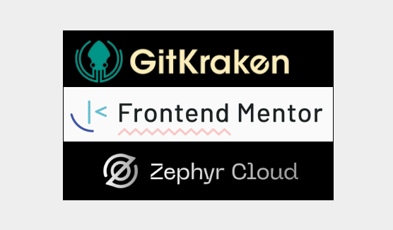
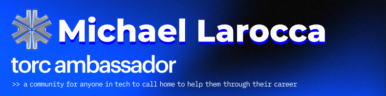

#### In this week's article, we dive into a sponsored hackathon where we build an AI-powered travel agent app—competing, collaborating, livestreaming, and more! Follow along to learn real-world dev skills!

---

---

### Hackathon AI Agent Challenge

To kick off 2026 and continue my self-taught developer journey, I’m once again joining Shashi Lo’s Gridiron Survivor team—an apprenticeship program that gives devs hands-on, pro-level experience. This time, we're taking on a hackathon challenge to build an AI agent!

The hackathon features two rival teams competing to develop an AI-powered travel agent app, sponsored by GitKraken, Frontend Mentor, and Zephyr Cloud. Up for grabs: a $1000 cash prize, one-year free memberships, and plenty of swag! This hackathon is underway now and will continue into February (and may extend if additional time is needed).  

While it’s a contest, the real win for everyone is the shared learning experience, the sense of team camaraderie, and—my favorite—the chance to keep building an online presence.

*On a personal note, I’m especially excited for this hackathon because my nephew* [*David Terzano*](https://www.linkedin.com/in/david-terzano-b15657329?utm_source=share&utm_campaign=share_via&utm_content=profile&utm_medium=ios_app)*—fresh out of college with a degree in computer science and a passion for game development—is joining my team! This event gives* [*David*](https://www.linkedin.com/in/david-terzano-b15657329?utm_source=share&utm_campaign=share_via&utm_content=profile&utm_medium=ios_app) *and all participants real-world team experience to help close the gap that new devs face when seeking their first roles. I can’t wait to see him jump in, learn with us, and bring fresh ideas to the project!*

---

### AI Agent, Travel Agent

The challenge is to build a travel agent app powered by a specialized AI agent that serves as the core of our hackathon project. A successful AI travel agent should efficiently integrate with multiple APIs to provide accurate travel information, automatically suggest itineraries, and personalize travel plans based on user preferences. Our desired outcome includes robust handling of user queries and consistent performance under various use-case scenarios.

* **Speed:** Each team chooses its own tech stack, which enables efficient development and performance optimization to meet specific project demands.
    
* **Flexibility**: Micro front-end architecture enables modular development, making it easier to update sections of the app independently.
    
* **Integration:** API integrations are key to the app pulling real-time travel data and resources, ensuring accurate, timely information.
    
* **Intelligence:** Custom AI models are used to analyze user data and preferences, providing personalized travel suggestions and enhancing the user’s experience.
    

*These features and more highlight the complexity and potential of our AI travel agent app!*

---

<iframe width="1090" height="613" src="https://www.youtube.com/embed/2EaYzossu7s"></iframe>

---

### Livestream Presentations

To truly level up like the pros, team members will be hosting live presentations. Taking the floor to present, demo, and field questions is a valuable skill in itself, especially when navigating inevitable technical difficulties.

As a first step to engage with our journey, subscribe to the [Coding with Shashi](https://www.youtube.com/@codingwithshashi) YouTube channel and turn on notifications to stay updated on all events. This ensures you won't miss any opportunities to follow along, ask questions, and provide feedback live.

---

### Sharing Our Learnings

In upcoming articles, I’ll take you behind the scenes of this hackathon, sharing our process, challenges, and key takeaways. You’ll be able to follow our journey step by step—from the initial setup and development to our results and lessons learned. Beyond building an AI agent, there’s a lot happening under the hood, and I can’t wait to cover it all!

---

### **Gridiron Survivor Sponsors**

**A very special thanks to our sponsors!**

* [GitKraken](https://www.gitkraken.com/): *A popular Git client that provides a graphical interface to manage Git repositories. It is known for its user-friendly design and features that simplify version control, making it easier for developers to collaborate and manage their code.*
    
* [Frontend Mentor](https://www.frontendmentor.io/): *An online platform that offers front-end coding challenges. It helps developers improve their skills by providing real-world projects to work on and a supportive community for feedback and learning.*
    
* [Zephyr Cloud](https://zephyr-cloud.io/): *A Module Federation platform that accelerates micro-frontend development by providing instant deployment, intelligent dependency resolution, and seamless version management—all while remaining cloud agnostic, framework agnostic, and bundler agnostic.*
    

---

### My Other Related Articles

* [Bridging the Skills Gap: Empowering Junior Developers Through Apprenticeship Programs](https://www.htmlallthethings.com/blog-posts/bridging-the-skills-gap-empowering-junior-developers-through-apprenticeship-programs)
    
* [Gridiron Survivor's Elfgorithm: Introduction and Team Installation](https://selftaughttxg.com/2025/04-25/gridiron-survivor's-elfgorithm-introduction-and-team-installation/)
    
* [Software Versioning: A Developer's Guide to Semantic and GitHub Releases](https://selftaughttxg.com/2025/05-25/software-versioning-a-developers-guide-to-semantic-and-github-releases/)
    
* [Creating Cohesive Design Systems with Atomic Design Principles](https://selftaughttxg.com/2025/05-25/creating-cohesive-design-systems-with-atomic-design-principles/)
    
* [Sprint Workflow: A Beginner's Guide to Agile Development](https://selftaughttxg.com/2025/10-25/sprint-workflow-a-beginners-guide-to-agile-development/)
    

---

### **Be sure to listen to the HTML All The Things Podcast!**

#### **📝 *I also write articles for the HTML All The Things Podcast, which you can read on their website:*** [**https://www.htmlallthethings.com/**](https://www.htmlallthethings.com/)***.***

#### **Be sure to check out HTML All The Things on socials!**

* [Twitter](https://twitter.com/htmleverything)
    
* [LinkedIn](https://www.linkedin.com/company/html-all-the-things/)
    
* [TikTok](https://www.tiktok.com/@htmlallthethings)
    
* [Instagram](https://www.instagram.com/htmlallthethings/)
    

---

**I’m excited to announce that I’m now a Torc Ambassador! As part of this global community, I’ll be sharing valuable insights from Torc’s virtual events, lessons from my own tech journey, and real-world perspectives on how teams are hiring and working today. I’ll be active in the Torc community through posts, events, Q&A sessions, and more—so stay tuned for updates and opportunities to connect. Whether you’re looking to advance your tech career or simply stay informed, I hope the insights I share will support and inspire you on your journey!**

*Torc is an AI-powered platform and vibrant global network that connects skilled professionals with top opportunities and forward-thinking companies. If you’re interested in joining, you can create a free profile using my referral link*: [https://platform.torc.dev/#/r/b5QZ7k5h/cp](https://platform.torc.dev/#/r/b5QZ7k5h/cp)

---

### Affiliate & Discount Links!

**With CodeMonkey, learning can be all fun and games!** CodeMonkey transforms education into an engaging experience, enabling children to evolve from tech consumers to creators. Use CodeMonkey's **FREE trial** to unlock the incredible potential of young tech creators!

*With a structured learning path tailored for various age groups, kids progress from block coding to more advanced topics like data science and artificial intelligence, using languages such as CoffeeScript and Python. The platform includes features for parents and teachers to track progress, making integrating coding into home and classroom settings easy.*

Through fun games, hands-on projects, and community interaction, CodeMonkey helps young learners build teamwork skills and receive recognition for their achievements. It fosters a love for coding and prepares children for future career opportunities in an ever-evolving tech landscape.

***To learn more about CodeMonkey, you can read my detailed*** [review article](https://selftaughttxg.com/2025/02-25/inspiring-young-coders-how-codemonkey-turns-kids-into-tech-creators/)***!***

**Affiliate Links:**

* [Sign Up for Parents](https://codemonkey.sjv.io/c/5987452/919057/12259)
    
* [Sign Up for Teachers](https://codemonkey.sjv.io/c/5987452/919060/12259)
    

---

### Advance your career with a 20% discount on Scrimba Pro using this [affiliate link](https://scrimba.com/?via=MichaelLarocca)!

Become a hireable developer with Scrimba Pro! Discover a world of coding knowledge with full access to all courses, hands-on projects, and a vibrant community. You can [read my article](https://selftaughttxg.com/2021/06-21/06-07-21/) to learn more about my exceptional experiences with Scrimba and how it helps many become confident, well-prepared web developers!

###### ***Important:* *This discount is for new accounts only. If a higher discount is currently available, it will be applied automatically.***

**How to Claim Your Discount:**

1. Click [the link](https://scrimba.com/?via=MichaelLarocca) to explore the new Scrimba 2.0.
    
2. Create a new account.
    
3. Upgrade to Pro; the 20% discount will automatically apply.
    

###### ***Disclosure:* *This article contains affiliate links. I will earn a commission from any purchases made through these links at no extra cost to you. Your support helps me continue creating valuable content. Thank you!***

---

### Conclusion

A hackathon is a fantastic way to learn web development and build real team experience. This challenge lets us work with cutting-edge technologies and showcase how an AI agent is built from the ground up. Whether you’re a participant or following along, you’ll see how competition, collaboration, and livestreaming all come together—plus pick up valuable, in-demand skills!

We’ll take you behind the scenes as we choose our tech stack, tackle real-world problems, and share the tools and approaches we use. Watch our livestreams to see the action unfold, and join the conversation to connect, ask questions, and get involved. You’ll find inspiration, insights, and practical tips for your own projects.

Curious how it all comes together in real time? Follow our journey for updates, lessons learned, and strategies you can put to use in your own projects—so you gain real value as we build and learn together!

---

**Let’s connect! I’m active on** [LinkedIn](https://www.linkedin.com/in/michaeljudelarocca/) **and** [Twitter](https://twitter.com/MikeJudeLarocca).

---

###### *Are you excited to follow our hackathon journey and learn how to build an AI agent? Do you have your own tips or stories from hackathons? Please share the article and comment*

---
